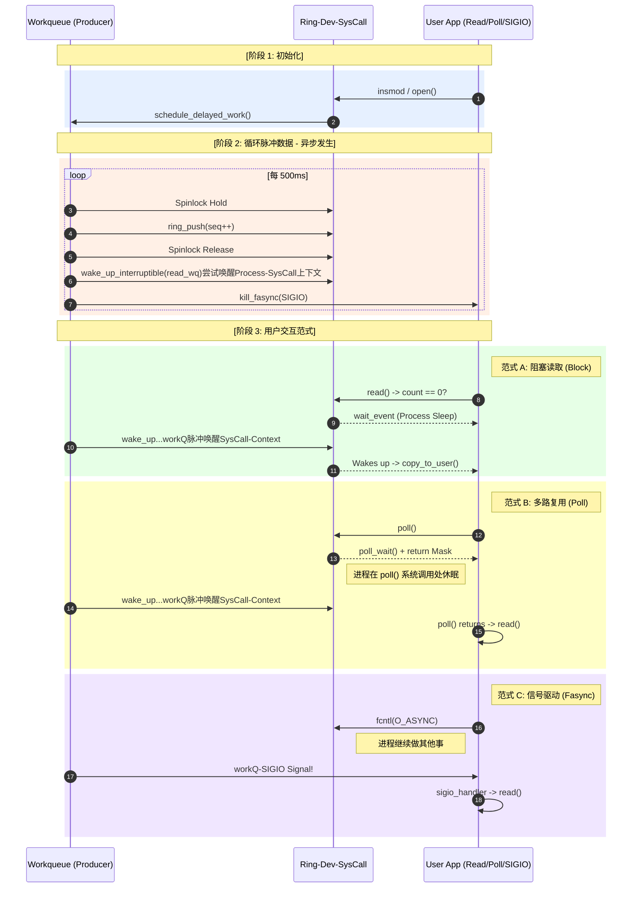

# Advanced IO 驱动全景时序与源码解析

> [!note]
> **Ref:** [adv_io_main.c](./src/adv_io_main.c), [adv_io_fops.c](./src/adv_io_fops.c), [adv_io_dev.c](./src/adv_io_dev.c)

## 1. 静态结构：数据的“锚点”

一切逻辑都围绕 `struct adv_io_dev` 展开。它是驱动的**状态中心**，将硬件模拟、同步原语和 VFS 接口绑定在一起。

| 源码组件 | 核心职责 | 关键符号 |
| :--- | :--- | :--- |
| **`adv_io_dev.h`** | 定义设备“户口本”与共享蓝图 | `struct adv_io_dev`, `RING_SIZE` |
| **`adv_io_main.c`** | 生命周期管理：注册、分配内存、启动生产 | `adv_io_init`, `adv_io_exit` |
| **`adv_io_dev.c`** | 模拟“硬件”层：Ring Buffer 算法、Workqueue 脉搏 | `ring_push`, `adv_io_producer` |
| **`adv_io_fops.c`** | VFS 接口层：实现五大 IO 模型的具体跳转 | `adv_io_fops`, `adv_io_do_read` |

---

## 2. 动态全景：驱动的时序生命周期

这个驱动的复杂性在于**三个上下文**的并发交织：
1. **Init 上下文**：模块加载时的初始化。
2. **Workqueue 上下文**：独立于进程的周期性数据生产脉搏。
3. **User Process 上下文**：系统调用进入内核后的执行路径。

### 2.1 时序交互全景图 (Sequence Diagram)



---

## 3. 核心机制深度拆解

### 3.1 生产者的“心脏”：`adv_io_producer`
```c
void adv_io_producer(struct work_struct *work) {
    // 1. 通过 container_of 从 work_struct 找回 dev 结构体 (关键技巧)
    struct adv_io_dev *d = container_of(dw, struct adv_io_dev, producer_work);
    
    // 2. 原子保护下入队
    spin_lock_irqsave(&d->ring_lock, flags);
    bool was_empty = ring_empty(d);
    ring_push(d, &byte, 1);
    spin_unlock_irqrestore(&d->ring_lock, flags);

    // 3. 状态翻转触发通知
    if (was_empty) {
        wake_up_interruptible(&d->read_wq);    // 唤醒阻塞者
        kill_fasync(&d->fasync_q, SIGIO, POLL_IN); // 投递信号
    }
}
```
**时序要点**：生产过程是**非进程上下文**的。它不依赖于任何用户的 `read` 动作，而是像硬件中断一样主动改变系统状态。

### 3.2 消费者的“安全闸门”：`adv_io_do_read`
```c
static ssize_t adv_io_do_read(...) {
    for (;;) {
        spin_lock_irqsave(&d->ring_lock, flags);
        got = ring_pop(d, tmp, len); // 尝试拿数据
        spin_unlock_irqrestore(&d->ring_lock, flags);

        if (got) break; // 拿到数据，退出循环去拷贝给用户

        if (file->f_flags & O_NONBLOCK) return -EAGAIN; // 非阻塞路径

        // 阻塞路径：在此放弃 CPU，进入阻塞队列
        ret = wait_event_interruptible(d->read_wq, READ_ONCE(d->count) > 0);
    }
    copy_to_user(ubuf, tmp, got); // 锁外拷贝，防止死锁或长时间禁中断
}
```
**时序要点**：
- **重入检查**：`wait_event_interruptible` 内部会在挂起前和唤醒后重新检查条件，防止“惊群”或虚假唤醒。
- **锁粒度**：`copy_to_user` 严禁在 `spinlock` 内运行，因为它可能导致 `Page Fault` 从而引发休眠，而在自旋锁内休眠是内核的大忌。

### 3.3 现代 AIO 通路：`.read_iter`
驱动中实现的 `adv_io_read_iter` 是现代 Linux 内核对 AIO 的核心支撑：
- 它不再处理单一缓冲区指针，而是处理 `struct iov_iter`。
- **时序优势**：它允许内核直接将数据推送到用户态的向量缓冲区（Vector IO），在 `io_submit` 场景下，配合内核线程可实现真正的非阻塞异步吞吐。

---

## 4. 并发与同步全图 (Safety Policy)

驱动中存在两种锁，其时序职责明确：

1.  **Spinlock (`ring_lock`)**：
    - **职责**：极短时间的原子保护。
    - **覆盖范围**：仅覆盖环形缓冲区的 `head/tail/count` 修改及 `memcpy`（内核到内核）。
    - **上下文**：允许在 Workqueue（原子/中断安全上下文）中使用。

2.  **Mutex (`open_mtx`)**：
    - **职责**：保护涉及休眠的元数据（如 `open_cnt`）。
    - **覆盖范围**：`open` / `release` 过程。
    - **上下文**：仅限进程上下文。

## 5. 总结

该驱动的设计之妙在于：**用一个统一的 Ring Buffer 状态机，驱动了五种截然不同的时序逻辑。** 
- **阻塞/非阻塞** 改变了调用的**等待时机**。
- **Poll** 改变了调用的**监控方式**。
- **Fasync** 改变了调用的**触发主体**（从主动 Read 变为被动通知）。
- **AIO** 改变了数据的**传输颗粒度**。
