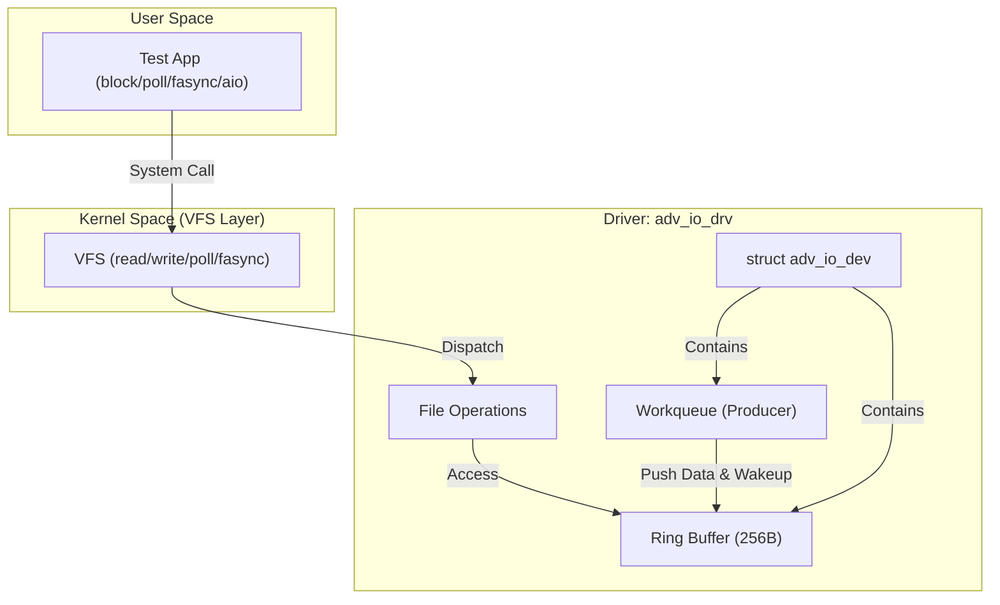

# Linux 高级 IO 范式驱动设计全景

> [!note]
> **Ref:** [adv_io_dev.c](./src/adv_io_dev.c), [adv_io_fops.c](./src/adv_io_fops.c)

## 1. 驱动架构概览

该驱动通过一个虚拟的环形缓冲区（Ring Buffer）和周期性工作队列（Workqueue），在单一字符设备中完整展示了 Linux 内核支持的所有主流 IO 模型。



---

## 2. 核心数据结构：`struct adv_io_dev`

这是驱动的“灵魂”，封装了设备的所有状态、同步原语和通信逻辑。

| 成员 | 类型 | 描述 |
| :--- | :--- | :--- |
| `ring` | `u8[256]` | 存储数据的环形缓冲区。 |
| `head / tail` | `unsigned int` | 生产（入队）和消费（出队）的索引。 |
| `count` | `unsigned int` | 缓冲区中当前的有效字节数。 |
| `ring_lock` | `spinlock_t` | **关键同步：** 保护 Ring Buffer 状态，可在原子/中断上下文使用。 |
| `open_mtx` | `struct mutex` | 保护 `open_cnt` 等涉及休眠的元数据操作。 |
| `read_wq / write_wq` | `wait_queue_head_t` | **读写等待队列：** 实现阻塞 IO 的核心。 |
| `fasync_q` | `struct fasync_struct *` | 订阅 SIGIO 信号的进程异步链表。 |
| `producer_work` | `struct delayed_work` | 模拟硬件产生数据的周期性任务。 |

---

## 3. 模拟硬件生产逻辑 (Data Producer)

驱动使用 `delayed_work` 模拟了一个每 500ms 产生一个字节的“硬件设备”。

### 3.1 核心流程 (adv_io_producer)
1. **数据生成**：自增计数器生成一个 `seq` 字节。
2. **入队保护**：持有 `ring_lock` 自旋锁，调用 `ring_push`。
3. **状态检查**：如果缓冲区从**空变为非空**，标记 `became_readable = true`。
4. **唤醒机制**：
   - `wake_up_interruptible(&d->read_wq)`：唤醒因 `read()` 阻塞的进程。
   - `kill_fasync(&d->fasync_q, SIGIO, POLL_IN)`：向所有 `O_ASYNC` 订阅者发送信号。
5. **重装载**：`schedule_delayed_work` 安排下一次生产。

---

## 4. 五大 IO 范式实现解析

### 4.1 阻塞与非阻塞 (Blocking vs Non-blocking)
在 `adv_io_do_read` 中，通过 `for(;;)` 循环实现：
- **阻塞**：如果缓冲区为空且未设置 `O_NONBLOCK`，调用 `wait_event_interruptible` 进入休眠，直到 `count > 0`。
- **非阻塞**：如果设置了 `O_NONBLOCK`，直接返回 `-EAGAIN`。

### 4.2 IO 多路复用 (Multiplexing - .poll)
驱动实现 `.poll` 回调，这是 `select/poll/epoll` 能工作的前提。
```c
static unsigned int adv_io_poll(struct file *file, poll_table *wait) {
    poll_wait(file, &d->read_wq,  wait); // 注册读唤醒
    poll_wait(file, &d->write_wq, wait); // 注册写唤醒
    // 返回当前状态掩码
    if (d->count > 0) mask |= POLLIN | POLLRDNORM;
    if (d->count < RING_SIZE) mask |= POLLOUT | POLLWRNORM;
    return mask;
}
```

### 4.3 信号驱动 IO (Signal-driven - .fasync)
通过 `fasync_helper` 管理进程链表。当数据到达时，通过 `kill_fasync` 发送 `SIGIO`。这允许用户程序在不阻塞的情况下，通过信号处理函数感知数据。

### 4.4 异步 IO (AIO / Iterative - .read_iter)
这是 Linux 现代内核（4.9+）推荐的接口，支持 `io_submit` 和更高效的用户态内存访问。
- 使用 `iov_iter` 抽象用户空间缓冲区。
- 内部通过 `copy_to_iter` 安全地将数据拷贝到 `iovec` 定义的多个片段中。

---

## 5. 关键同步策略

- **Spinlock (`ring_lock`)**：保护 Ring Buffer 的计数和指针。由于工作队列（Producer）在 SoftIRQ 类似上下文中执行，不能使用互斥锁（Mutex），必须使用自旋锁。
- **Wait Queues**：读写队列分离。读进程在 `read_wq` 等待数据，写进程在 `write_wq` 等待空间，避免了“惊群效应”。
- **原子性保证**：在 `read/write` 过程中，数据先拷贝到内核临时缓冲区 `tmp[]`，在持有锁时仅执行极快的内存搬运和索引更新，随后在释放锁后执行耗时且可能引发缺页中断的 `copy_to_user`。

---

## 总结

该驱动展示了 Linux 字符设备开发的**最佳实践**：
1. **层次分明**：将同步逻辑、数据生产、文件操作完全解耦。
2. **健壮性**：严格区分原子上下文（Spinlock）与可休眠上下文（Mutex/WaitQueue）。
3. **全面性**：为各种应用场景（实时、高并发、异步）提供了完整的内核支撑。
