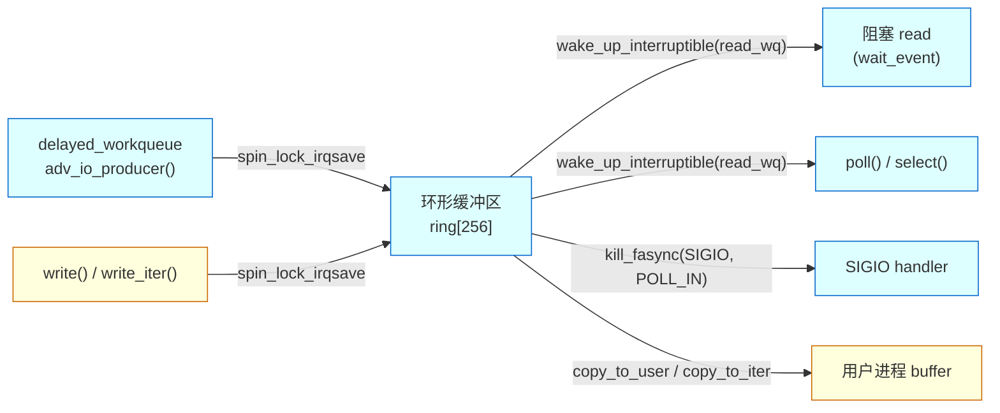
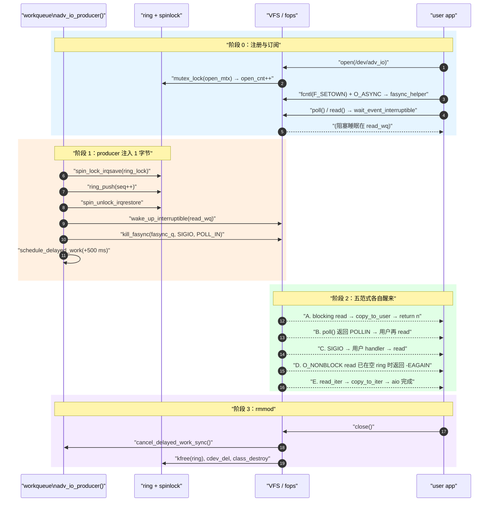

# 03-Advanced-IO 进阶字符设备 IO 范式综合演示

> [!note]
> **Ref:**
> - [`note/SysCall/IO/04-IO范式总览.md`](/home/pi/imx/note/SysCall/IO/04-IO范式总览.md)
> - [`note/SysCall/IO/05-进阶fops实现：poll与fasync.md`](/home/pi/imx/note/SysCall/IO/05-进阶fops实现：poll与fasync.md)
> - [`note/SysCall/IO/03-poll机制详解.md`](/home/pi/imx/note/SysCall/IO/03-poll机制详解.md)
> - [`note/kernel/defer/03-workqueue.md`](/home/pi/imx/note/kernel/defer/03-workqueue.md)
> - [`note/kernel/sync/01-spinlock.md`](/home/pi/imx/note/kernel/sync/01-spinlock.md)
>
> **Design docs (本项目):**
> - [`Design-Drv.md`](./Design-Drv.md) — 驱动分层与 fops 实现选型
> - [`Design-Drv-TimeSeq.md`](./Design-Drv-TimeSeq.md) — producer/consumer 时序与唤醒路径
> - [`Design-app-c.md`](./Design-app-c.md) — 四个用户态测试程序的设计要点

## 目标

用一个 `cdev` 字符设备 `/dev/adv_io`，把 `note/SysCall/IO/04-IO范式总览.md` 里讲的五种 IO 范式**全部跑通**：

1. **Blocking IO** —— `wait_event_interruptible` + `wake_up_interruptible`
2. **Non-blocking IO** —— `O_NONBLOCK` 时立刻返回 `-EAGAIN`
3. **IO Multiplexing** —— `.poll` + `poll_wait`，支持 `select(2)/poll(2)/epoll`
4. **Signal-driven IO (SIGIO)** —— `.fasync` + `kill_fasync`
5. **AIO / iter** —— 4.9 era 的 `.read_iter` / `.write_iter`（同步实现，对 glibc POSIX AIO 透明）

附带演示：
- **workqueue** 作为"模拟硬件 producer"，每 500 ms 向 ring 投递一字节
- **spinlock vs mutex** 的选型：ring buffer 用 spinlock（workqueue 软中断式上下文不能睡眠），open/release 计数用 mutex（只在进程上下文）

## 设备模型



## 交互时序

三上下文并发：**workqueue producer**（每 500 ms 入队一字节）、**user syscall**（`read/poll/fasync`）、**init/exit**。下面的时序图只聚焦"一次 producer 脉冲如何触达 5 种 IO 范式"。完整源码走读见 [`Design-Drv-TimeSeq.md`](./Design-Drv-TimeSeq.md)。



**关键同步点：**

| 步骤 | 同步机制 | 为什么 |
|------|----------|--------|
| `ring_push` / `ring_pop` | `spin_lock_irqsave(ring_lock)` | producer 在 workqueue（BH 风格）上下文，不能睡眠；且需防 ISR 式并发 |
| `copy_to_user` | **锁外**执行 | 可能缺页睡眠，严禁持 spinlock |
| `open/release` 计数 | `mutex_lock(open_mtx)` | 仅进程上下文，路径可能含 debug print / kmalloc |
| `fasync_q` 链表 | `fasync_helper` / `kill_fasync` 内部锁 | 驱动不应在自持锁时再调 `kill_fasync`，避免锁序反转 |

### 同步原语选型

| 资源 | 锁 | 原因 |
|------|----|----|
| `ring[]` / `head` / `tail` / `count` | `spinlock_t ring_lock` | workqueue handler 在 BH 风格上下文里调用，**不能睡眠**；read/write 持锁路径短，且 `copy_to_user` 已经放到锁外执行 |
| `open_cnt` 等打开计数 | `struct mutex open_mtx` | 仅在 `open()/release()` 进程上下文使用，路径可能睡眠（debug print 等）；用 mutex 避免无谓自旋 |
| `fasync_q` 链表 | 由 `fasync_helper` / `kill_fasync` 内部锁保护 | 驱动**不要**在自己持锁时调用 `kill_fasync` |

## 编译运行

### 编译

```bash
cd /home/pi/imx/prj/03-Advanced-IO
make            # driver + 4 个测试程序
ls output/      # adv_io_drv.ko test_block test_poll test_fasync test_aio
```

依赖：

- `KERN_DIR = /home/pi/imx/sdk/100ask_imx6ull-sdk/Linux-4.9.88`
- `CROSS_COMPILE = arm-buildroot-linux-gnueabihf-`

### 部署到板子

```bash
# host
cp -r $PRJ mount/$PRJ

# target
insmod adv_io_drv.ko
ls -l /dev/adv_io     # c 字符设备应已自动 mknod
dmesg | tail
```

### Test Bash

板子上项目根目录执行：

```sh
sh test/run_all.sh                  # 全部 6 个用例
sh test/run_all.sh block poll       # 只跑指定用例
```

脚本职责：自动 `insmod` → 等待 `/dev/adv_io` 建节点 → 串行跑 `block / nonblock / poll / fasync / aio / wr` 六个用例并打色彩 PASS/FAIL → `rmmod` → 汇总。退出码 0 表示全绿。适合每次改动后一条命令快速回归。

**busybox 适配要点：**
- 没有独立 `timeout` 命令 → 脚本用 `run_to` 包装：后台进程 + `sleep N` + `kill -TERM`
- `dd` 不支持 `iflag=nonblock` → 改用 `test/test_nonblock.c` 专用小程序打开 `O_NONBLOCK` 读一次验证 `EAGAIN`
- `grep -c … || echo 0` 在 POSIX sh 下会拼接出 `"0\n0"` → 用 `n=${n:-0}` 取默认值

## [Note]上版验证

| 用例 | 验证点 | 驱动侧关键路径 | 上板观测 |
|------|--------|----------------|----------|
| `insmod` | 模块加载 + `cdev_add` + `device_create` | `adv_io_init` | `adv_io: loaded, /dev/adv_io major=245` |
| blocking read | `wait_event_interruptible` → `wake_up_interruptible` | `adv_io_do_read` | producer 500 ms/字节节奏，序号 `00→04` |
| non-blocking | `O_NONBLOCK` → `-EAGAIN` | `adv_io_do_read` 快检查 | `nonblock: got EAGAIN as expected` |
| poll / POLLIN | `.poll` + `poll_wait(read_wq)` | `adv_io_poll` | 10 次 `POLLIN` 唤醒，序号 `05→09` |
| SIGIO / fasync | `.fasync` + `kill_fasync(POLL_IN)` | `adv_io_fasync` + producer | 5 次 `SIGIO` 送达，序号 `0a→0e` |
| POSIX AIO | `.read_iter` + `copy_to_iter` | `adv_io_read_iter` | `aio_read` 异步完成，返回 1 byte |
| write→read 回环 | `.write` 入 ring + 阻塞 `read` 出 ring | `adv_io_do_write` / `adv_io_do_read` | `wrote=Z486 read=Z486` ✓ |
| `rmmod` | `cancel_delayed_work_sync` + 资源释放 | `adv_io_exit` | `adv_io: unloaded` |

## 五种 IO 范式逐个验证

### 1. 阻塞 IO

```sh
./test_block
```

期望：进程阻塞在 `read()`，每隔 ~500 ms 收到 1 字节，序号递增。

### 2. 非阻塞 IO

```sh
# 直接观察 -EAGAIN
dd if=/dev/adv_io iflag=nonblock bs=16 count=1
```

或者改 `test_block.c` 把 `open` flags 加 `O_NONBLOCK` 后立即 `read`：第一次会返回 `-1 / EAGAIN`，等几百毫秒后再读才有数据。

### 3. IO 多路复用

```sh
./test_poll
```

期望：每个循环 `poll()` 在 `<500 ms` 内返回 `POLLIN`，随后 `read()` 拿到字节。

### 4. 信号驱动 (SIGIO)

```sh
./test_fasync
```

期望：进程主体在 `pause()` 中睡眠，每次 producer 把 ring 从空变非空，handler 被打断、打印一行 `[SIGIO] got ...`。

### 5. AIO

```sh
./test_aio
```

期望：`aio_read` 立即返回，主程序进入"做其他事"循环，几次循环后 `aio_error()` 变 `0`，`aio_return()` 给出实际字节数。glibc POSIX AIO 在用户态用线程池模拟，最终调用我们的 `.read` / `.read_iter`。

## [Note] 与 `note/SysCall/IO/04-IO范式总览.md` 的对应表

| `04-IO范式总览.md` 章节 | 范式 | 驱动侧关键代码 | 测试程序 |
|---|---|---|---|
| §2 阻塞 IO | Blocking | `wait_event_interruptible(d->read_wq, ...)` in `adv_io_do_read` | `test_block.c` |
| §3 非阻塞 IO | Non-blocking | `if (file->f_flags & O_NONBLOCK) return -EAGAIN;` | `test_block.c`(改 flag) / `dd iflag=nonblock` |
| §4 IO 多路复用 | poll/select | `adv_io_poll` 中 `poll_wait` + 状态位掩码 | `test_poll.c` |
| §5 信号驱动 IO | SIGIO | `adv_io_fasync` + producer 中 `kill_fasync(POLL_IN)` | `test_fasync.c` |
| §6 异步 IO | AIO / iter | `.read_iter` = `adv_io_read_iter`，`copy_to_iter` 协议 | `test_aio.c` |
| §8 驱动最小化支持矩阵 | 全部勾选 | 同上五项 | 全部 |

## 文件清单

| 文件 | 作用 |
|---|---|
| `adv_io_drv.c` | 驱动主体，单文件实现以上 5 种范式 + workqueue producer + spinlock/mutex 协作 |
| `Kbuild` | `obj-m += adv_io_drv.o`，被外层 Makefile 拷进 build/ 后改名为 `Makefile` |
| `Makefile` | 树外编译入口，`make driver` 调内核 Kbuild、`make app` 交叉编译四个测试程序 |
| `test/test_block.c`  | 阻塞 read 演示 |
| `test/test_poll.c`   | `poll(2)` 多路复用演示 |
| `test/test_fasync.c` | `SIGIO + F_SETOWN + O_ASYNC` 信号驱动演示 |
| `test/test_aio.c`    | POSIX AIO `aio_read` 演示（`-lrt`） |
| `test/run_all.sh`    | 上板一键回归脚本，自动 insmod/测试/rmmod + 结果汇总 |
| `Design-Drv.md`      | 驱动分层、fops 表、同步原语选型 |
| `Design-Drv-TimeSeq.md` | producer → ring → wake 全路径时序图 |
| `Design-app-c.md`    | 四个用户态测试程序的设计笔记 |
