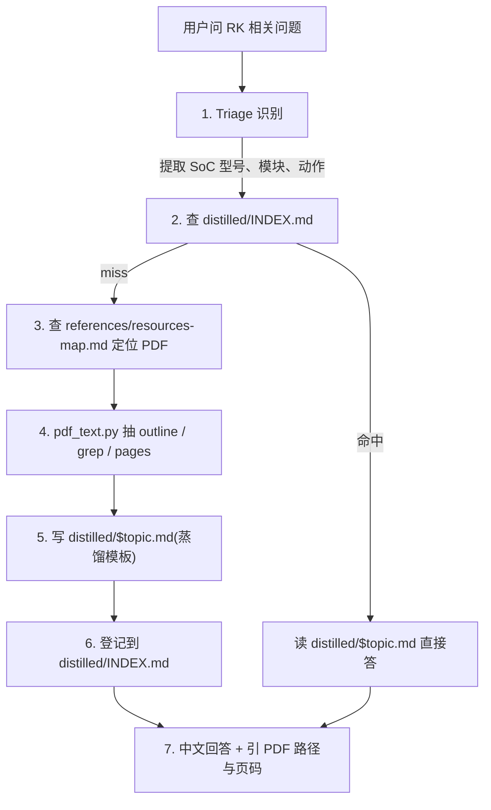

# /rk — Rockchip SDK / SoC 知识助理

## 一、为什么需要这个 skill

仓库下 `sdk/tspi-rk3566-sdk/docs/` 有 330 份 RK 官方 PDF(中英双份,~665MB),覆盖所有在售 RK 芯片的模块开发指南、Datasheet、硬件设计、AVL 选型表。直接读 PDF 太重,放任 LLM 凭训练数据回答容易编造。本 skill 的作用是把这套文档库变成一个**渐进式可检索的知识源**:

- 用一份**结构化的 Resources Map** 让 agent 秒级定位"该读哪个 PDF"。
- 用 `scripts/pdf_text.py` 按 outline / keyword 抽取 PDF 片段,避免整篇灌入 context。
- 把抽出来的核心结论沉淀到 `references/distilled/`,**下次同一主题不再开 PDF**——这是 skill 的复利。


## 二、工作流总览




## 三、各步骤的具体动作

### Step 1: Triage —— 从问题里抽 3 个事实

读用户问题,先在脑内确定:

- **SoC 型号**: RK3566 / RK3568 / RK3588 / RK3576 / ... 若用户只说"我的板子"或"TSPI",默认 **RK3566**(本仓库主板)。多颗芯片型号通用的内容(如 pinctrl 框架)无须强行收窄。
- **模块**: pinctrl / GMAC / MIPI-DSI / USB-Gadget / RKNN / 休眠 ... 映射到 [[resources-map]] 的章节标题。
- **意图**: 概念解释 / DTS 配置 / 调试排查 / 选型 / 性能数据。意图决定该读 PDF 的哪一节。

如果三者都识别不出来,先问用户,**不要瞎查**——查错 PDF 比不查更糟。

### Step 2: 查蒸馏缓存

打开 `references/distilled/INDEX.md`,grep 模块 + 关键词。命中就直接读对应的 `distilled/$topic.md`。

蒸馏文件命中的判据:**主题、芯片、意图至少两项匹配**。差太远的就当 miss,走 Step 3。

### Step 3: 定位源 PDF

读 `references/resources-map.md`,按"二、Common 模块文档"以下的表查路径。表里覆盖不到的、或要确认表的描述时,fall back 到 `sdk/tspi-rk3566-sdk/docs/cn/readme_cn.md` 原文。

**优先中文版**(`cn/`)。英文版结构镜像一致,文件名把 `_CN.pdf` 换 `_EN.pdf`,只在用户明确要英文时用。

简单型号能力问题(如"RK3566 编码最高多少")直接查 [[chip-matrix]],不用开 PDF。

### Step 4: 用 pdf_text.py 抽片段

千万**别 `cat`/`Read` 整个 PDF**——一份模块指南 30~200 页,extract_text 后是上万行,扔进 context 等于自杀。

正确姿势按场景分:

| 场景 | 推荐命令 |
|------|----------|
| 不熟悉这份 PDF 的结构 | `pdf_text.py <pdf> --outline`(列书签) |
| outline 不存在 | `pdf_text.py <pdf> --toc`(前 8 页) |
| 已知章节页码 | `pdf_text.py <pdf> --pages 8-12` |
| 找一个具体配置/API/术语 | `pdf_text.py <pdf> --grep "pinctrl-names" --window 30` |

`pdf_text.py` 在 `~/imx/.claude/skills/rk/scripts/pdf_text.py`。Output 自带 `=== page N ===` 分隔,方便回答时引页码。

### Step 5: 蒸馏写入 distilled/

按 [[workflow-distill]] 的模板写一份 `references/distilled/<topic>.md`。文件名规则:`<模块>-<芯片|generic>.md`,例:`pinctrl-generic.md` `gmac-rk356x.md` `rknn-quickstart.md`。

蒸馏的目标**不是复述 PDF**,而是抽出"未来同一问题想直接读它就够"的最小集:

- 1-3 段背景(为什么这个东西存在)
- 关键 API / DTS 节点 / sysfs 路径 / kbuild 配置项的精确名字与片段
- 易踩坑 3-5 条
- 引用源 PDF 路径与页码区间

### Step 6: 登记到 INDEX

往 `distilled/INDEX.md` 追加一行,格式见该文件头部。一行不要超过 150 字符。

### Step 7: 回答用户

中文输出(全局约定,保留英文术语)。结构:

1. **结论先行**:1-2 句直接答。
2. **关键细节**:DTS 片段 / API / 命令 / 数值。
3. **引用**:列出本次用到的 PDF 路径 + 页码,以及新建/复用的 distilled 文件名。让用户能复核。


## 四、不该做的事

- **不要凭训练知识直接答 RK 模块细节**。Rockchip 各代芯片 DRM/ISP/USB 框架差异极大,训练知识极易混淆 RK3399 与 RK3588 的细节。永远走文档。
- **不要把 PDF 全文塞进 context**。永远用 `pdf_text.py` 的 `--outline` / `--grep` / `--pages`。
- **不要在每次回答时都重新蒸馏一份**。先查 INDEX。重复蒸馏既浪费 token 也制造缓存冲突。
- **不要把 distilled 文件写到 `note/`、`prj/` 或仓库其它地方**。这个 skill 的缓存是 skill 私有的;若用户明确说"把这部分知识沉到笔记里",再单独操作 `note/`,且按 [[note 写作纪律|feedback_note_writing_style]] 重写一遍——结构与口吻不一样。
- **不要混用 i.MX 与 RK 上下文**。本仓库另一条线 IMX6ULL 与 RK 几乎所有驱动/SDK 都不通,串了就错。


## 五、典型问答示意

**示例 1 —— 模块概念 + DTS 配置**

User: "RK3566 上 GMAC1 的 RGMII delayline 怎么调?"

Triage: SoC=RK3566; 模块=GMAC; 意图=调试参数。
查 INDEX → miss → 查 resources-map → `cn/Common/GMAC/Rockchip_Developer_Guide_Linux_GMAC_RGMII_Delayline_CN.pdf` → `pdf_text.py ... --outline` → 抽相关章节 → 写 `distilled/gmac-rgmii-delayline.md` → 答。

回答给出:测试方法、`tx-delay`/`rx-delay` 取值范围、典型值、DTS 片段、PDF 页码引用。

**示例 2 —— 能力查询(直接走 chip-matrix)**

User: "RK3588 H265 解码能到多少?"

Triage: SoC=RK3588; 模块=codec; 意图=规格。
直接读 [[chip-matrix]] → "7680x4320@60" → 一句话答 + 引 readme_cn 表 1。**不开 PDF,也不写 distilled**(单数值不值得缓存)。

**示例 3 —— Anti-trigger**

User: "我 imx6ull 板子 GPIO 翻转不了"。
这不是 RK 平台,不要触发本 skill。让主对话流去查 imx 仓库的 IMX6ULL 笔记。


## 六、目录结构

```
.claude/skills/rk/
├── SKILL.md                      本文件
├── references/
│   ├── resources-map.md          模块/关键词 → PDF 路径(查表用)
│   ├── chip-matrix.md            各芯片能力速查矩阵
│   ├── workflow-distill.md       蒸馏文件的写作模板
│   └── distilled/
│       ├── INDEX.md              已蒸馏主题登记
│       └── *.md                  按主题
├── scripts/
│   └── pdf_text.py               pypdf 包装,--outline / --grep / --pages
└── evals/
    └── evals.json                测试用例
```
