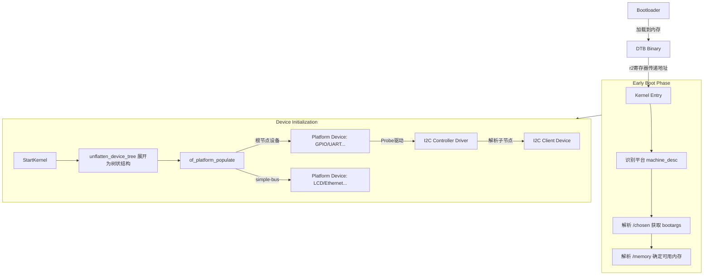

# Device Tree 使用模型 (Usage Model)

设备树 (Device Tree, DT) 是一种用于描述硬件的数据结构，旨在将硬件配置信息从内核源码中解耦，使得同一份内核镜像 (zImage/Image) 能够支持多种硬件平台。

## 1. 核心概念

### 1.1 FDT (Flattened Device Tree)
Linux 内核并不直接读取文本格式的 `.dts` 文件，而是读取编译后的二进制 `.dtb` 文件，称为 **FDT**。
- **Bootloader (U-Boot)**: 将 `.dtb` 加载到内存，并通过寄存器（如 ARM 的 r2 寄存器）将内存地址传递给内核。
- **Kernel**: 在启动早期解析 FDT，获取内存大小、命令行参数等关键信息。

### 1.2 Bindings (绑定)
DT 中的节点和属性必须遵循特定的约定，称为 **Bindings**。
- 只有遵循 Binding，驱动程序才能正确解析数据。
- 常见属性：`compatible`, `reg`, `interrupts`。

## 2. 内核三大用途

根据 `Documentation/devicetree/usage-model.txt`，内核使用 DT 主要完成三件事：

### 2.1 平台识别 (Platform Identification)
内核如何知道自己运行在哪个板子上？
- **机制**: 检查根节点 `/` 的 `compatible` 属性。
- **匹配流程**: 
  1. 读取 `/` 节点的 `compatible` 字符串列表（例如 `["100ask,imx6ull-14x14-ebf", "fsl,imx6ull"]`）。
  2. 遍历内核中定义的所有 `machine_desc` 结构。
  3. 找到最匹配的 `machine_desc` 来初始化特定平台的代码。

### 2.2 运行时配置 (Runtime Configuration)
Bootloader 如何向内核传递启动参数？
- **`/chosen` 节点**: 这是一个虚拟节点，不代表真实硬件。
- **关键属性**:
    - `bootargs`: 内核启动参数 (e.g., `console=ttymxc0,115200 root=/dev/mmcblk0p2...`)。
    - `initrd-start` / `initrd-end`: 指定 initrd 在内存中的位置。

### 2.3 设备生成 (Device Population)
内核如何根据 DT 生成 `struct device`？
- **根节点与 simple-bus**:
    - 内核启动后调用 `of_platform_populate(NULL, ...)`。
    - 根节点下的子节点（如果 `compatible` 匹配）会被注册为 `platform_device`。
    - 标记为 `simple-bus` 的节点，其子节点也会被递归注册为 `platform_device`。
- **总线设备 (I2C/SPI)**:
    - I2C 控制器驱动（platform driver）加载后，会解析其 DT 节点下的子节点。
    - 为每个子节点注册 `i2c_client` 或 `spi_device`，而不是 `platform_device`。

## 3. 解析流程图解 (Mermaid)

## 4. 总结
- **DTS 是硬件的描述**，不是配置脚本。
- **根节点决定平台** (`compatible`)。
- **`/chosen` 决定启动参数** (`bootargs`)。
- **`of_platform_populate` 决定设备生成**。
