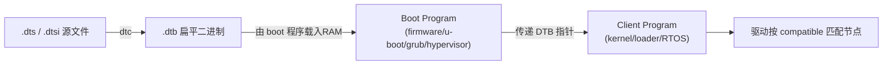
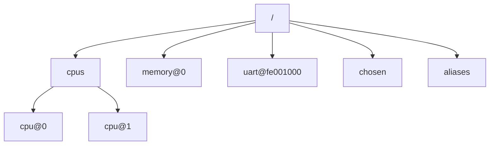
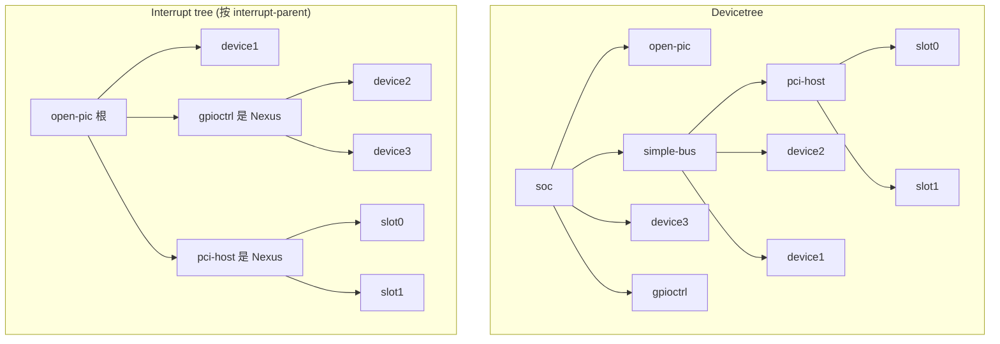
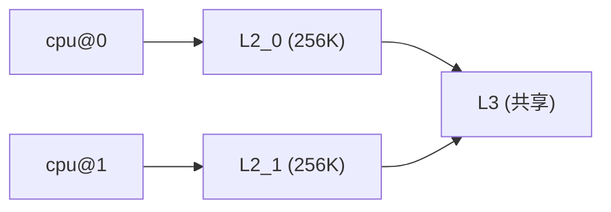
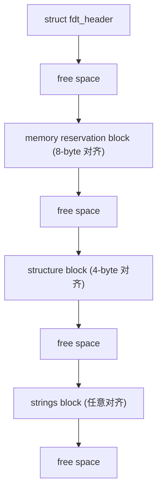

# Devicetree Specification v0.4 中文笔记

> [!note]
> **Ref:** [`devicetree-specification-v0.4.pdf`](./devicetree-specification-v0.4.pdf) — devicetree.org, 28 June 2023
> 适用范围：所有遵循 DTSpec 的 boot program → client program 接口（v17 DTB；DTS v1）。

---

## 0 全景速览



- **DTS（Devicetree Source）** — 人类可读的硬件描述文本，`.dts` 主文件 / `.dtsi` 包含文件。
- **DTC（Devicetree Compiler）** — 将 DTS 编译为 DTB。
- **DTB（Devicetree Blob）** — 单段线性、无指针的二进制结构，含 header + memory reservation block + structure block + strings block。
- **boot program → client program** — 启动程序在 RAM 中放置 DTB 并把指针作为参数交给客户程序（一般是 OS 内核）。

> [!tip] 
>
> 术语速记
> `cell`= 32-bit ；`phandle` = 节点的全局唯一 u32 引用 ；`unit-address` = 节点在父总线地址空间的地址 ；`interrupt specifier` = 描述一条中断的属性值。

---

## 1 Introduction（第 1 章）

### 1.1 目标

DTSpec 定义 **boot program → client program** 之间的接口，用于嵌入式系统硬件描述。强调以下嵌入式特征：固定 I/O、板级最小化、有限 UI、资源/实时约束、多种 OS。

### 1.2 与 IEEE 1275 / ePAPR 的关系

- 继承自 IEEE 1275 Open Firmware 的 **devicetree 概念**，但去掉了 plug-in 驱动、FCode、Forth UI 等通用机器特性。
- 部分取代 ePAPR（保留通用部分，移除 Power ISA 专有绑定到附录）。

### 1.3 32/64-bit 支持

同一规范同时兼容 32-bit 与 64-bit CPU；在涉及地址宽度处分别说明。

### 1.4 关键术语

| 术语 | 中文释义 |
|---|---|
| AMP | 非对称多处理：CPU 分组运行不同 OS 镜像 |
| SMP | 对称多处理：多 CPU 共享内存/IO，同一 OS |
| SoC | 单芯片集成 CPU 与外设 |
| boot CPU | boot program 首先引导到 client entry 的 CPU |
| secondary CPU | 除 boot CPU 外的 CPU |
| quiescent CPU | 静默状态 CPU：不能干扰他人也不被影响 |
| DMA | 直接内存访问 |
| DTB / DTC / DTS | 二进制 / 编译器 / 源文件 |
| effective address | 处理器指令算出的地址（可为虚拟） |
| physical address | 处理器实际发往内存控制器的地址 |
| interrupt specifier | 一组描述某条中断的属性值 |
| unit address | 节点名 `@` 后的部分，描述其在父地址空间的地址 |

> shall = 必须；should = 建议；may = 允许。

---

## 2 Devicetree 概念与标准属性（第 2 章）

### 2.1 概念

devicetree 是一棵 **节点 + 属性键值对** 的树。每节点除根外都有唯一父节点。节点不一定一一对应实体硬件，但应是 OS/项目无关的描述。



### 2.2 结构与命名约定

#### 2.2.1 节点名 `node-name@unit-address`

- `node-name`：1–31 字符，集合 `0-9 a-z A-Z , . _ + -`，首字符为字母。
- `unit-address`：必须等于该节点 `reg` 的首地址；若节点无 `reg`，省略 `@unit-address`。
- 根节点无名，用 `/` 标识。
- 无 `@unit-address` 时，节点名在同层不能与属性名相同。

#### 2.2.2 推荐的通用节点名（节选）

`adc / cpu / cpus / gpio / i2c / i2c-mux / interrupt-controller / iommu / memory / memory-controller / mmc / pci / pcie / phy / pinctrl / pmic / pmu / regulator / rtc / serial / spi / timer / usb / watchdog / ethernet / flash / dma-controller / clock-controller / reset-controller …`

**原则**：名字反映**功能类别**而非具体型号。

#### 2.2.3 路径

`/cpus/cpu@1`；省略 `@unit-address` 仅当不歧义；歧义时行为未定义。

#### 2.2.4 属性

- 属性名 1–31 字符，集合多一个 `?` `#`。
- 厂商自定义属性应加唯一前缀，如 `fsl,channel-fifo-len`、`ibm,ppc-interrupt-server#s`。

属性值的基本类型：

| 类型 | 说明 |
|---|---|
| `<empty>` | 仅靠 "存在与否" 表达布尔语义 |
| `<u32>` | 32-bit 大端整数 |
| `<u64>` | 两个 u32 拼接（高位在前） |
| `<string>` | NULL 结尾可打印字符串 |
| `<prop-encoded-array>` | 属性专属编码 |
| `<phandle>` | 一个 u32，用于引用另一节点 |
| `<stringlist>` | 多个 NULL 结尾字符串拼接 |

> **大端永远是大端**：DTB 内所有整型字段（含 header、cells）均为 big-endian。

### 2.3 标准属性

> 所有示例都用 DTS 语法。

| 属性 | 类型 | 摘要 |
|---|---|---|
| `compatible` | stringlist | 最具体 → 最通用 排列；驱动据此匹配。推荐 `"manufacturer,model"`，例：`compatible = "fsl,mpc8641","ns16550";` |
| `model` | string | 板/设备型号，推荐 `"manufacturer,model-number"` |
| `phandle` | u32 | 节点全局唯一引用号，DTC 编译时自动注入（旧名 `linux,phandle`） |
| `status` | string | `okay / disabled / reserved / fail / fail-sss`；缺省视为 `okay` |
| `#address-cells` | u32 | 描述子节点 `reg` 地址字段所用的 cell 数 |
| `#size-cells` | u32 | 描述子节点 `reg` 大小字段所用的 cell 数 |
| `reg` | (addr,len) 序列 | 设备在父总线地址空间的资源；当 `#size-cells=0` 时 `len` 字段被省略 |
| `virtual-reg` | u32/u64 | 把 `reg` 首个物理地址映射到的有效地址（boot 已建立的虚→物映射） |
| `ranges` | (子, 父, 长度) 三元组 | 父子地址空间映射；`<empty>` 表示恒等映射；缺失表示无映射 |
| `dma-ranges` | (子, 父, 长度) 三元组 | DMA 地址转换 |
| `dma-coherent` | empty | 默认非一致架构上声明设备支持一致 DMA |
| `dma-noncoherent` | empty | 默认一致架构上声明设备不支持一致 DMA |
| `name` | string | **已弃用** — 由节点名 node-name 决定 |
| `device_type` | string | **已弃用** — 仅 `cpu`/`memory` 节点为兼容 IEEE 1275 保留 |

> [!important] `#address-cells` / `#size-cells` **不会被继承**，所有"有子节点"的节点都必须显式定义。Boot 程序必须提供；缺省值（client 兜底）= address-cells 2、size-cells 1。

#### `ranges` 地址翻译示例

```dts
soc {
    compatible = "simple-bus";
    #address-cells = <1>;
    #size-cells = <1>;
    ranges = <0x0 0xe0000000 0x00100000>;   // 子 0x0 → 父 0xe0000000，长 1MB

    serial@4600 {
        compatible = "ns16550";
        reg = <0x4600 0x100>;               // 实际 CPU 物理地址 = 0xe0004600
    };
};
```

### 2.4 中断与中断映射

devicetree 内同时存在两棵图：
- **devicetree**（按总线物理层级）
- **interrupt tree**（按中断路由，DAG）



#### 2.4.1 中断产生设备属性

| 属性 | 说明 |
|---|---|
| `interrupts` | 一组 interrupt specifier，格式由域根的绑定决定 |
| `interrupt-parent` | phandle，覆盖默认 devicetree 父子关系 |
| `interrupts-extended` | `<&ctrlA specA>,<&ctrlB specB>…` 多控制器场景；与 `interrupts` 互斥，优先级更高 |

#### 2.4.2 中断控制器属性

| 属性 | 说明 |
|---|---|
| `#interrupt-cells` | 一条 interrupt specifier 占多少 cell |
| `interrupt-controller` | 空属性，**存在即标识"我是中断控制器节点"** |

#### 2.4.3 中断 Nexus（桥接两个中断域）

`interrupt-map` 表的每一行：

```
<child-unit-addr> <child-int-spec> <&parent-ctrl> <parent-unit-addr> <parent-int-spec>
```

- 查找前用 `interrupt-map-mask` 与 child 部分按位与；
- 子节点和 parent-ctrl 都必须显式定义 `#address-cells` 和 `#interrupt-cells`（不需要地址时把 `#address-cells` 设为 0）。

#### 2.4.4 PCI ↔ Open-PIC 映射示例（精简）

```dts
pci {
    #interrupt-cells = <1>;
    #size-cells = <2>;
    #address-cells = <3>;
    interrupt-map-mask = <0xf800 0 0 7>;
    interrupt-map = <
        /* IDSEL 0x11 - slot 1 */
        0x8800 0 0 1 &open-pic 2 1   /* INTA */
        0x8800 0 0 2 &open-pic 3 1   /* INTB */
        0x8800 0 0 3 &open-pic 4 1   /* INTC */
        0x8800 0 0 4 &open-pic 1 1   /* INTD */
    >;
};
```

PCI 三 cell 地址 = `bus<<16 | dev<<11 | func<<8`。

### 2.5 Nexus 节点与通用 Specifier 映射（≠ 中断）

DTSpec 把 nexus 概念泛化到任何 `#<specifier>-cells` 域（gpio、clock、reset…），通用属性：

| 属性 | 作用 |
|---|---|
| `<specifier>-map` | 表：`<child-spec> <&parent> <parent-spec>` |
| `<specifier>-map-mask` | 查找前对 child-spec 做 AND（默认全 1） |
| `<specifier>-map-pass-thru` | 子→父透传位掩码（默认全 0） |
| `#<specifier>-cells` | 一条 specifier 占多少 cell |

#### gpio-map 例

```dts
connector: connector {
    #gpio-cells = <2>;
    gpio-map = <0 0 &soc_gpio1 1 0>,
               <1 0 &soc_gpio2 4 0>,
               <2 0 &soc_gpio1 3 0>,
               <3 0 &soc_gpio2 2 0>;
    gpio-map-mask     = <0xf 0x0>;
    gpio-map-pass-thru = <0x0 0x1>;   // flags 字段从子直通到父
};

expansion_device {
    reset-gpios = <&connector 2 GPIO_ACTIVE_LOW>;
    // 解析后等价于 <&soc_gpio1 3 GPIO_ACTIVE_LOW>
};
```

---

## 3 Device Node Requirements（第 3 章 必备节点）

任何 DTSpec 合规 devicetree **必须**包含：

- 根 `/` 节点
- 一个 `/cpus` 节点
- 至少一个 `/memory` 节点

### 3.2 根节点（`/`）

| 属性 | Usage | 含义 |
|---|---|---|
| `#address-cells` | R | 子节点 reg 地址 cell 数 |
| `#size-cells` | R | 子节点 reg size cell 数 |
| `model` | R | `"manufacturer,model-number"` |
| `compatible` | R | 平台架构列表 |
| `serial-number` | O | 序列号 |
| `chassis-type` | OR | `desktop / laptop / convertible / server / tablet / handset / watch / embedded` |

> Usage 图例：**R**=Required, **O**=Optional, **OR**=Optional but Recommended, **SD**=See Definition

### 3.3 `/aliases`

为 devicetree 节点路径起短名，方便 client 引用。
- 别名字符集仅 `0-9 a-z -`，1–31 字符。
- 值是完整路径字符串。

```dts
aliases {
    serial0  = "/simple-bus@fe000000/serial@llc500";
    ethernet0 = "/simple-bus@fe000000/ethernet@31c000";
};
```

### 3.4 `/memory`

`device_type = "memory"`（出于历史兼容，本节点保留 device_type）。`reg` 给出物理内存范围；可有多个 memory 节点。
- 必须可在不刷 cache 的前提下以 `WIMG=0b001x` 安全访问；
- 当 boot via [UEFI]，OS 必须**忽略** /memory 节点，改用 `GetMemoryMap()`。

#### 例

```dts
/* #address-cells=2, #size-cells=2 */
memory@0 {
    device_type = "memory";
    reg = <0x0 0x0          0x0 0x80000000      /* 2 GB */
           0x1 0x0          0x1 0x0>;           /* 4 GB at 4 GB */
};
```

### 3.5 `/reserved-memory`

预留内存区，OS 必须从普通分配中排除。

#### 父节点

- `#address-cells / #size-cells` 与根节点保持一致；
- `ranges`（必需，通常为空 = 恒等映射）。

#### 子节点

- 用 `reg` 表示**静态预留**；或用 `size`（可配 `alignment`、`alloc-ranges`）请求**动态分配**。
- `compatible` 可选 `"shared-dma-pool"` 或厂商私有 `<vendor>,[<device>-]<usage>`。
- `no-map`（OS 不得建立虚拟映射、不得推测访问）与 `reusable`（OS 可临时使用但驱动须能回收）**互斥**。
- Linux 扩展：`linux,cma-default` / `linux,dma-default`。

#### 引用预留区

设备节点使用 `memory-region = <&handle>;` 与 `memory-region-names`。

#### UEFI 行为

- 静态预留 + `no-map` → `EfiReservedMemoryType`
- 其他静态预留 → `EfiBootServicesData`
- 动态预留 → **不**列入 UEFI memory map（OS 离开 firmware boot service 后再分配）

#### 完整示例

```dts
/ {
    #address-cells = <1>;
    #size-cells = <1>;

    memory { reg = <0x40000000 0x40000000>; };

    reserved-memory {
        #address-cells = <1>;
        #size-cells = <1>;
        ranges;

        linux,cma {                          /* 全局 CMA 池 */
            compatible = "shared-dma-pool";
            reusable;
            size = <0x4000000>;              /* 64 MiB */
            alignment = <0x2000>;
            linux,cma-default;
        };

        display_reserved: framebuffer@78000000 {
            reg = <0x78000000 0x800000>;     /* 8 MiB */
        };

        multimedia_reserved: multimedia@77000000 {
            compatible = "acme,multimedia-memory";
            reg = <0x77000000 0x4000000>;    /* 64 MiB */
        };
    };

    fb0:     video@12300000  { memory-region = <&display_reserved>;     };
    scaler:  scaler@12500000 { memory-region = <&multimedia_reserved>;  };
    codec:   codec@12600000  { memory-region = <&multimedia_reserved>;  };
};
```

### 3.6 `/chosen`

非真实设备，传 firmware 选择的参数给 client：

| 属性 | 说明 |
|---|---|
| `bootargs` | 启动命令行字符串 |
| `stdout-path` | 启动控制台输出节点路径（可含 `:` 终止后跟选项；可用别名） |
| `stdin-path` | 启动控制台输入节点路径；未指定时 `stdout-path` 兼作输入 |

> 旧名 `linux,stdout-path` 仅出于兼容支持。

### 3.7 `/cpus`

- `#address-cells = <N>`（必需）
- `#size-cells = <0>`（必需）
- 容器节点；公共属性可上提到此处由 client 兜底查找。

### 3.8 `/cpus/cpu*`

> 节点名应为 `cpu`。共享 MMU 的硬件线程通常合到一个 cpu 节点内。

#### 通用属性

| 属性 | Usage | 说明 |
|---|---|---|
| `device_type` | R | 必须为 `"cpu"` |
| `reg` | R | CPU/线程唯一 id（必须与中断控制器编号一致或对应可寻址） |
| `clock-frequency` | O | u32 或 u64，Hz |
| `timebase-frequency` | O | u32 或 u64，Hz |
| `status` | SD | SMP 中必须给：`okay / disabled / fail` |
| `enable-method` | SD | `status="disabled"` 时必须给：`"spin-table"` 或 `"vendor,method"` |
| `cpu-release-addr` | SD | u64；当 `enable-method="spin-table"` 时给出 spin-table 入口物理地址 |

> 旧的 `bus-frequency` 已不推荐；总线频率应在总线节点上用 `clock-frequency` 表示。

#### Power ISA 扩展属性（节选）

`power-isa-version`、`power-isa-*`、`cache-op-block-size`、`reservation-granule-size`、`mmu-type`（`mpc8xx / ppc40x / ppc440 / ppc476 / power-embedded / powerpc-classic / power-server-stab / power-server-slb / none`）。

#### TLB 属性

`tlb-split / tlb-size / tlb-sets`（unified） 或 `d-tlb-size / d-tlb-sets / i-tlb-size / i-tlb-sets`（split）。

#### L1 Cache 属性

unified：`cache-unified / cache-size / cache-sets / cache-block-size / cache-line-size`
split：把上面前缀替换为 `i-` 与 `d-`
多级： `next-level-cache = <&phandle>;`（旧名 `l2-cache`）

#### 单 CPU 示例

```dts
cpus {
    #address-cells = <1>;
    #size-cells = <0>;
    cpu@0 {
        device_type = "cpu";
        reg = <0>;
        d-cache-block-size = <32>;
        i-cache-block-size = <32>;
        d-cache-size = <0x8000>;       /* 32K */
        i-cache-size = <0x8000>;       /* 32K */
        timebase-frequency = <82500000>;
        clock-frequency    = <825000000>;
    };
};
```

### 3.9 多级 / 共享 Cache（`/cpus/cpu*/l?-cache`）

- `compatible` 必须含 `"cache"`；
- `cache-level = <N>`（2 = L2，3 = L3 …）；
- L1 用 cpu 节点自身属性表达；L2/L3 单独成 cache 节点，由 `next-level-cache` 串成链。
- 共享 cache 由多 CPU 通过同一 phandle 引用。



---

## 4 Device Bindings（第 4 章）

绑定 = 某类设备 / 某具体设备**必须遵循的属性集**。`compatible` 列出符合的绑定，从最具体到最通用。

### 4.1 编写绑定的建议

1. 定义 `"vendor,model"` 形式的 `compatible`；
2. 尽量复用 §2.3 / §2.4 的标准属性（至少含 `reg` 与 `interrupts`）；
3. 若属于已有设备类（§4），使用其约定；
4. 自定义属性命名 `"<company>,<property-name>"`。

### 4.2 Serial 串行设备

- 通用：`clock-frequency`（u32, 波特率发生器输入时钟）、`current-speed`（u32, bps）。
- **NS 16450/16550 兼容 UART**：

| 属性 | 说明 |
|---|---|
| `compatible` | 必须含 `"ns16550"` |
| `clock-frequency` | R |
| `current-speed` | OR |
| `reg` | R |
| `interrupts` | OR |
| `reg-shift` | O | 寄存器跨距：实际地址 = `reg_addr << reg-shift`（默认 0） |
| `virtual-reg` | SD | 若该节点是 system console 则必需 |

> I²C、SPI 设备**不**算 serial。

### 4.3 Network 网络设备

通用：

| 属性 | 类型 | 含义 |
|---|---|---|
| `address-bits` | u32 | MAC 位宽（默认 48） |
| `local-mac-address` | byte array | 分配给设备的 MAC |
| `mac-address` | byte array | boot 程序最后使用的 MAC（仅当与 `local-mac-address` 不同时使用） |
| `max-frame-size` | u32 | 物理可收发最大包字节数 |

#### Ethernet 专属

| 属性 | 说明 |
|---|---|
| `max-speed` | Mbps |
| `phy-connection-type` | 见下表 |
| `phy-handle` | phandle，指向 PHY 节点（接 PHY 时必需） |

`phy-connection-type` 取值：`mii / rmii / gmii / rgmii / rgmii-id / rgmii-txid / rgmii-rxid / tbi / rtbi / smii / sgmii / rev-mii / xgmii / moca / qsgmii / trgmii`。

### 4.4 Power ISA Open PIC 中断控制器

`#interrupt-cells = <2>` — 第一 cell 中断号，第二 cell sense/level：

| 值 | 触发方式 |
|---|---|
| 0 | low→high 边沿 |
| 1 | active-low 电平 |
| 2 | active-high 电平 |
| 3 | high→low 边沿 |

Open PIC 节点必有：`compatible` 含 `"open-pic"`、`reg`、`interrupt-controller`、`#interrupt-cells = <2>`、`#address-cells = <0>`。

### 4.5 `simple-bus`

SoC 内部不可探测、可直接访问的 I/O 总线表达成 `compatible = "simple-bus"`：

| 属性 | 说明 |
|---|---|
| `compatible` | 必须含 `"simple-bus"` |
| `ranges` | 父子地址映射，必需 |
| `nonposted-mmio` | 子节点 MMIO 走 non-posted 模式 |

---

## 5 Flattened Devicetree（DTB）二进制格式（第 5 章）

### 5.0 整体结构



- DTB 整体 8-byte 对齐；boot 必须把整个 blob 加载到 8-byte 对齐地址；client 若搬移也只能搬到 8-byte 对齐地址。

### 5.1 版本号

- 本文档定义版本 **17**。
- Boot 必须提供 v17 及向后兼容 v16 的 DTB；client 接收一切向后兼容 v17 的版本。
- 版本针对**二进制结构**而非内容。

### 5.2 Header

```c
struct fdt_header {
    uint32_t magic;             /* = 0xd00dfeed */
    uint32_t totalsize;         /* DTB 总字节数 */
    uint32_t off_dt_struct;     /* structure block 偏移 */
    uint32_t off_dt_strings;    /* strings block 偏移 */
    uint32_t off_mem_rsvmap;    /* memory reservation block 偏移 */
    uint32_t version;           /* 本规范 = 17 */
    uint32_t last_comp_version; /* = 16，向后兼容到 v16 */
    uint32_t boot_cpuid_phys;   /* boot CPU 的 reg id */
    uint32_t size_dt_strings;
    uint32_t size_dt_struct;
};
```

> 全部字段 big-endian u32。`boot_cpuid_phys` 必须等于该 CPU 节点的 `reg` 物理 id。

### 5.3 Memory Reservation Block

用途：告诉 client **不可分配** 的物理内存（保护 TCE 表、RTAS、boot 自身代码/数据等）。

```c
struct fdt_reserve_entry {
    uint64_t address;
    uint64_t size;
};
```

- 8-byte 对齐；末尾以 `{address=0,size=0}` 终止；
- 各 region **不得重叠**；
- 32-bit CPU 上忽略高 32 位；
- DTB blob 本体可不强制列入，但 client 须自行不覆盖；
- 任何被 boot 后续访问的内存都必须列入；
- 访问语义 `WIMG = 0bx01x`，Book III-S 必须 `0b001x`，支持 VLE 时 `VLE=0`。

#### UEFI 行为

memory reservation block 内每项必须列入 UEFI `GetMemoryMap()`，类型 `EfiReservedMemoryType`。

### 5.4 Structure Block

由 token 流构成，全部 32-bit 对齐：

| Token | 值 | 后续数据 |
|---|---|---|
| `FDT_BEGIN_NODE` | `0x00000001` | NULL 结尾节点名（含 unit-address），padding 到 4-byte |
| `FDT_END_NODE`   | `0x00000002` | 无 |
| `FDT_PROP`       | `0x00000003` | `{u32 len; u32 nameoff;}` + len 字节属性值 + padding |
| `FDT_NOP`        | `0x00000004` | 无（任何 parser 必须忽略；可用于"原地删除"） |
| `FDT_END`        | `0x00000009` | 无（唯一且最末） |

每节点表示：

```
[FDT_NOP*] FDT_BEGIN_NODE <name>\0 [pad]
    [FDT_NOP* FDT_PROP <len><nameoff> <value> [pad]]*
    [子节点表示]*
[FDT_NOP*] FDT_END_NODE
```

> 同一节点的**所有属性必须出现在任何子节点之前**（为简化扁平 parser 实现）。

### 5.5 Strings Block

所有出现过的属性名 NULL 结尾字符串拼接；`FDT_PROP` 的 `nameoff` 是相对本块起始的偏移。本块无对齐要求。

### 5.6 对齐总结

- DTB 整体：8-byte
- memory reservation block：8-byte
- structure block：4-byte
- strings block：无要求

---

## 6 DTS 源语法 v1（第 6 章）

### 6.1 编译指令

```dts
/include/ "FILE"        // 推荐被包含文件用 .dtsi
```

文件必须以 `/dts-v1/;` 开头，否则被 DTC 视为 v0（整型格式不同）。支持 C 风格 `/* */` 和 C++ 风格 `//` 注释。

### 6.2 Labels

- 字符集 `0-9 a-z A-Z _`，长度 1–31，不能数字开头；
- 仅存在于源码，不进 DTB；
- 定义：`labelname:` 附在节点 / 属性值前；引用：`&labelname`；
- 支持完整路径引用 `&{/soc/interrupt-controller@40000}`。

### 6.3 节点 & 属性定义

```dts
[label:] node-name[@unit-address] {
    [属性定义]      // 必须先于子节点
    [子节点定义]
};
```

删除：

```dts
/delete-node/ node-name;
/delete-node/ &label;
/delete-property/ property-name;
```

属性形式：

```dts
[label:] property-name = value;   // 普通
[label:] property-name;           // 空值（true/false 标记）
```

### 值的表达

| 形式 | 例 |
|---|---|
| cell 数组 | `interrupts = <17 0xc>;` |
| 算术 / 位 / 逻辑 / 关系 / 三元运算（括号内） | `<( (1 << 4) - 1 )>` |
| 64-bit 拆两 cell | `clock-frequency = <0x1 0x0>;` |
| 字符串 | `compatible = "simple-bus";` |
| 字节串 | `local-mac-address = [00 00 12 34 56 78];` |
| 拼接 | `compatible = "ns16550","ns8250";` |
| label 引用（cell 数组内） → phandle | `interrupt-parent = <&mpic>;` |
| label 引用（cell 数组外） → 完整路径字符串 | `ethernet0 = &EMAC0;` |
| 在值任意位置加 label | `reg = reglabel: <0 sizelabel: 0x1000000>;` |

支持的运算符：

```
算术: + - * / %
位:   & | ^ ~ << >>
逻辑: && || !
关系: < > <= >= == !=
三元: ?:
```

### 6.4 文件整体布局

```dts
/dts-v1/;
/memreserve/ 0x10000000 0x4000;   // 可选，可多条
/ {
    [属性]
    [子节点]
};
```

---

## 附录 A：常见问题速查

### A.1 `#address-cells / #size-cells` 不被继承

每个有子节点的节点必须显式声明；缺省时 client 假定 `2 / 1`。

### A.2 `compatible` 解析顺序

OS 先匹配最具体（左边）字符串，找不到再向右；典型："vendor,具体型号","厂商,系列名","通用类别"。

### A.3 `interrupts` vs `interrupts-extended`

只用其一；连接到多控制器场景必须用 `interrupts-extended`；两者并存时 extended 胜出。

### A.4 phandle 与 label 关系

- `label` 仅源码层；`phandle` 是 DTB 层 u32 id；
- DTC 在编译时为被引用节点自动生成 `phandle = <N>;`；
- 旧名 `linux,phandle` 仅做兼容支持。

### A.5 路径优先 vs 别名优先

`/aliases` 让 client 可用短名（如 `serial0`）替代完整路径；当 client 把一个字符串当作设备路径解析时，必须先尝试别名匹配。

### A.6 UEFI 启动时的特殊规则

| 场景 | OS 应当 |
|---|---|
| `/memory` 节点 | **忽略**，改用 `GetMemoryMap()` |
| 静态 `/reserved-memory` | 必须同时出现在 UEFI memory map（`EfiBootServicesData`，或 `EfiReservedMemoryType` if `no-map`） |
| 动态 `/reserved-memory` | 不得列入 UEFI memory map |
| 5.3 memory reservation block | 必须列为 `EfiReservedMemoryType` |

### A.7 DTB 关键魔数与版本

- magic = `0xd00dfeed`
- current version = `17`，向后兼容到 `16`

### A.8 boot → client 交接最小集

```
1. boot 把 DTB 放在 8-byte 对齐物理地址
2. 设置 boot_cpuid_phys = boot CPU 的 reg id
3. 把 DTB 物理地址作为参数传给 client
4. /cpus、/memory、根属性齐全；secondary CPU 状态正确
```

---

## 附录 B：参考文献（来自原规范 Bibliography）

- **[IEEE1275]** Boot (Initialization Configuration) Firmware: Core Requirements and Practices, 1994.
- **[b7]** Open Firmware Recommended Practice: Interrupt Mapping v0.9, 1996.
- **[CHRP]** PowerPC Microprocessor Common Hardware Reference Platform Binding v1.8, 1998.
- **[PAPR]** Power.org Standard for Power Architecture Platform Requirements, power.org.
- **[b18]** The Open Programmable Interrupt Controller (PIC) Register Interface Specification Rev 1.2, AMD/Cyrix, 1995.
- **[EPAPR]** Power.org Standard for Embedded Power Architecture Platform Requirements v1.1, 2011.
- **[UEFI]** Unified Extensible Firmware Interface Specification v2.8 Errata A, UEFI Forum, 2020.

---

## 附录 C：修订历史（节选自原规范）

| 版本 | 日期 | 主要变更 |
|---|---|---|
| 0.1 | 2016-05-24 | 由 ePAPR 导入并转 reST；移除 Power ISA 专有内容 |
| 0.2 | 2017-12-20 | 新增推荐通用节点名；新增 `interrupts-extended`；补充 PHY 类型；丰富源语言章 |
| 0.3 | 2020-02-13 | 更多推荐通用节点名；通用 nexus 绑定文档化；codespell 修正 |
| 0.4 | 2023-06-28 | 当前版本 |
