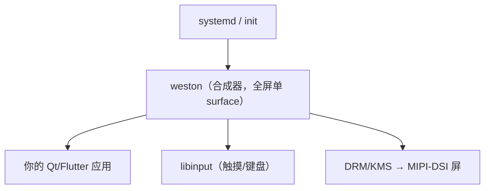
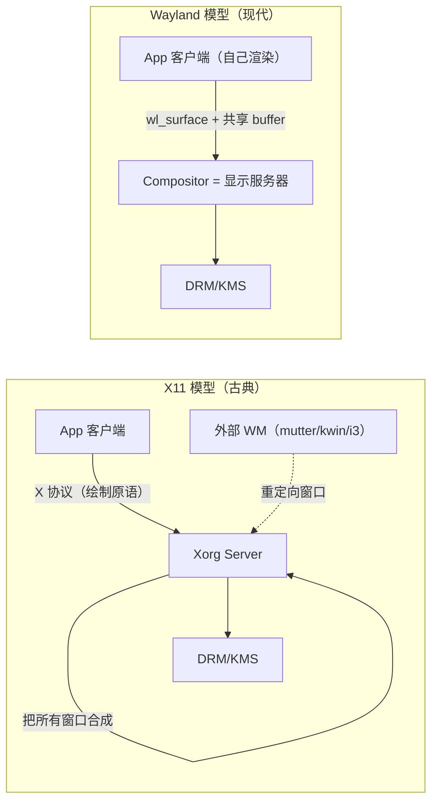
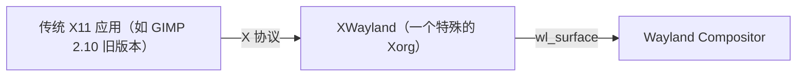
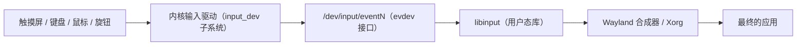
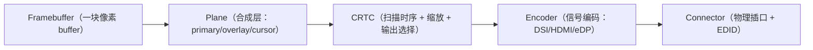
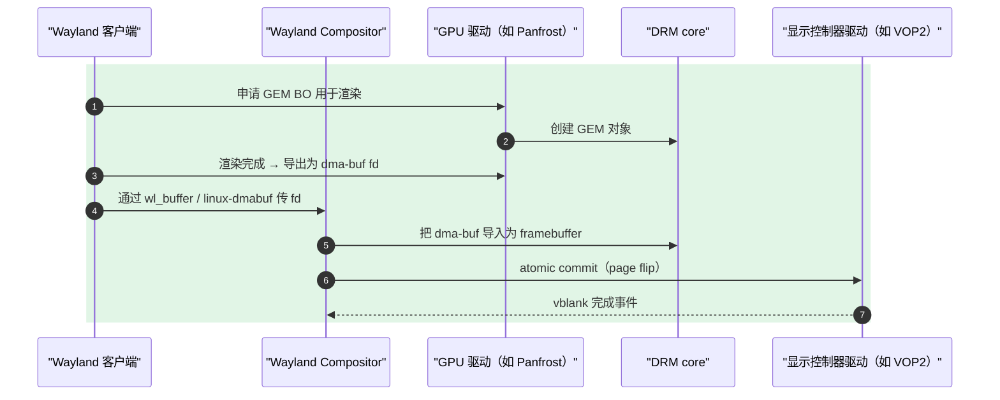
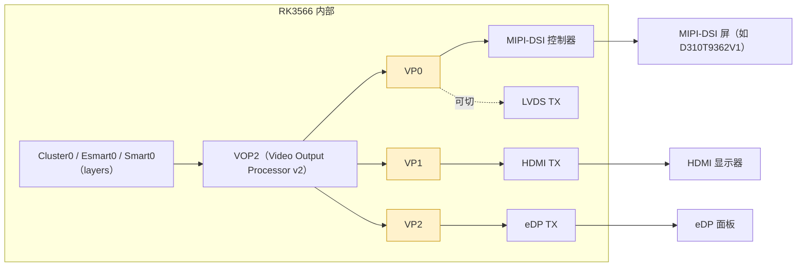
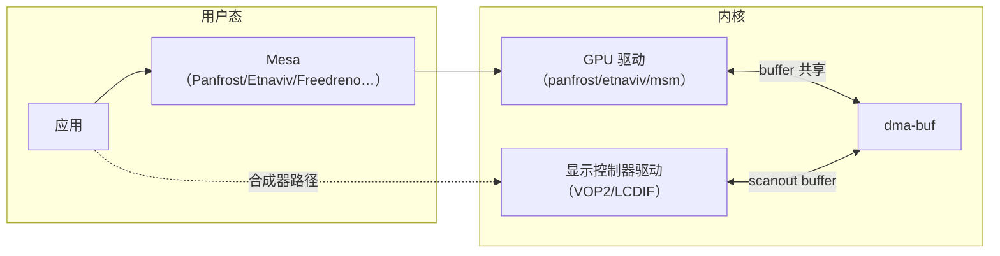
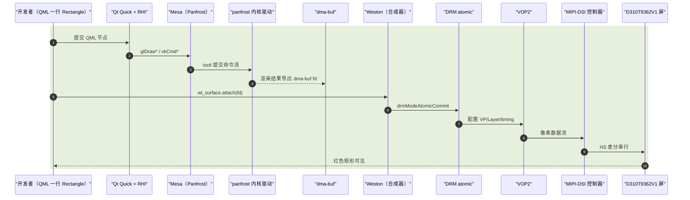
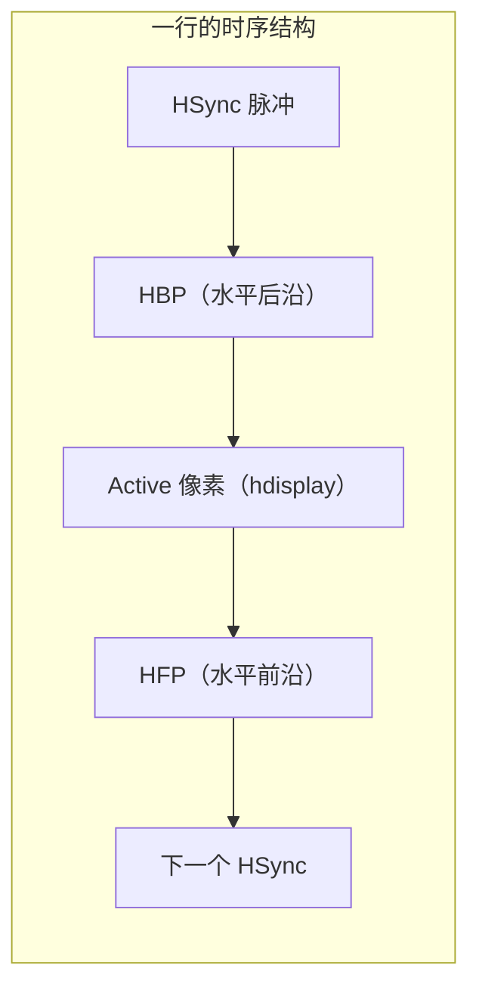

# Linux 图形栈自顶向下总览（从 QML 到 MIPI 像素）

> [!note]
> **Ref:**
> - [Wayland 官方文档](https://wayland.freedesktop.org/docs/html/)
> - [Wayland Book (jan.bouwhuis 翻译)](https://wayland-book.com/)
> - [DRM/KMS LWN 系列 (Daniel Vetter)](https://lwn.net/Articles/653071/)
> - [kernel.org gpu/drm 子系统文档](https://www.kernel.org/doc/html/latest/gpu/index.html)
> - [Mesa 3D 项目](https://www.mesa3d.org/)
> - [libinput 文档](https://wayland.freedesktop.org/libinput/doc/latest/)

本笔记的目标是用一份"地图式"文档把 Linux 图形栈的每一层都摆到对的位置。

```text
┌─────────────────────────────────────────────────────────────────┐
│                         客户端进程                               │
│  ┌───────────┐    ┌─────────────────────────────────────────┐  │
│  │ 调用图形库  │───▶│              EGL 内部                   │  │
│  │ 渲染API    │    │  ┌───────────────────────────────────┐ │  │
│  └───────────┘    │  │       平台接口层 (Platform)        │ │  │
│                   │  │  • 适配 Wayland/X11/GBM            │ │  │
│                   │  │  • 接收 wl_display, wl_surface     │ │  │
│                   │  │  • 管理 wl_egl_window              │ │  │
│                   │  └───────────────┬───────────────────┘ │  │
│                   │                  │                      │  │
│                   │                  ▼                      │  │
│                   │  ┌───────────────────────────────────┐ │  │
│                   │  │        驱动核心层 (Driver)         │ │  │
│                   │  │  • 加载 Mesa 用户态驱动 (如 i915)  │ │  │
│                   │  │  • 管理 GPU 上下文, 编译 shader    │ │  │
│                   │  │  • 分配 dma-buf (通过 GBM/dmabuf)  │ │  │
│                   │  └───────────────┬───────────────────┘ │  │
│                   │                  │                      │  │
│                   │                  ▼                      │  │
│                   │  ┌───────────────────────────────────┐ │  │
│   |-----------|    │  │        GPU 硬件驱动 (DRI)          │ │  │
│   |返回 client |<---│  │  • 生成命令缓冲区                  │ │  │
│   |surface 对象|    │  │  • 调用 ioctl 与内核通信           │ │  │
│   |-----------|    │  └───────────────┬───────────────────┘ │  │
│                   └─────────────────┼─────────────────────┘  │
│                                     │                         │
│                                     │ ioctl (DRM) 
│                                     | 提交GPU渲染命令
│                                     ▼                         │
│                           ┌─────────────────┐                 │
│                           │  内核 DRM/KMS    │                 │
│                           │ • 命令提交       │                 │
│                           │ • 显存管理       │                 │
│                           └─────────────────┘                 │
│                                     │                         │
│                                     │ 硬件执行                 │
│                                     ▼                         │
│                           ┌─────────────────┐                 │
│                           │      GPU         │                 │
│                           │  (渲染到 dma-buf) │                 │
│                           └────────┬────────┘                 │
│                                    │                          │
│                                    │ dma-buf fd (已渲染)       │
│                                    │ 通过 Wayland 协议传递     │
└────────────────────────────────────┼──────────────────────────┘
                                     │
                                     │ SCM_RIGHTS + socket
                                     ▼
┌─────────────────────────────────────────────────────────────────┐
│                        Wayland 合成器                            │
│  ┌──────────────────────────────────────────────────────────┐  │
│  │  接收 wl_surface.commit → 获取 dma-buf                    │  │
│  └──────────────────────────┬───────────────────────────────┘  │
│                             │  提交一帧画面                      │
│                             ▼                                   │
│  ┌──────────────────────────────────────────────────────────┐  │
│  │  合成器内部 EGL/DRM (合成输出)                              │  │
│  │  • 读取各客户端 dma-buf                                   │  │
│  │  • 合成最终画面                                           │  │
│  │  • 提交到内核 DRM/KMS                                     │  │
│  └──────────────────────────────────────────────────────────┘  │
└─────────────────────────────────────────────────────────────────┘
```

---


## 1. GUI框架层（L1）

这是开发者**写代码**的地方。所有"按钮、动画、文字渲染"都在这一层被描述，
最终都被转换成 OpenGL ES / Vulkan / 2D 位图的绘制指令交给下游。

> [!note]
>
> **在GUI框架层的工作，会对接到L4 渲染/图形库 (客户端渲染) 和 L3 窗口管理**  

### 1.1 代表框架对比

| 框架 | 渲染方式 | 典型场景 | 嵌入式适配度 | 备注 |
|------|---------|---------|------------|------|
| Qt Widgets | 软件光栅 + QPainter | 传统桌面工控 HMI | 高（占用可控） | cpu软渲染，性能差 |
| Qt Quick / QML | Scene Graph + OpenGL ES / Vulkan / RHI | 现代车机/HMI | 高（主流选择） | 声明式 UI，硬件加速 |
| GTK 4 | GSK + OpenGL / Vulkan | GNOME 桌面应用 | 中 | 依赖较多 |
| LVGL | 纯软件 2D，可选 GPU 加速 | MCU / 低端 Linux | 极高 | 可在裸机/RTOS 跑 |
| Flutter Embedded | Skia + GLES/Vulkan/Impeller | 跨端 UI | 中 | 谷歌嵌入式分发版 |
| Tauri | 系统 WebView（WebKitGTK）渲染 HTML/CSS | 桌面工具 | 低 | 体积小但依赖 WebView |
| Electron | 内嵌完整 Chromium | 桌面应用 | 极低 | 一个空窗口 ~150 MB |

- **重客户端渲染派（Qt/GTK/LVGL/Flutter）**：自己用 GLES 直接画，控件即绘
  制指令；启动快、内存小、不依赖整套浏览器。
- **浏览器栈派（Electron/Tauri）**：HTML/CSS 经 Chromium 或 WebKitGTK 渲
  染，开发体验好但下层链路（V8、Blink、Skia、GLES、合成器……）层层叠加，
  内存/启动时间在嵌入式上经常不可接受。

> 注：这里 RHI（Rendering Hardware Interface）是 Qt 6 引入的统一抽象层，
> 屏蔽了 GL / Vulkan / Metal / D3D 的差异。Qt 5 时代是直接用 GLES。

---


## 2. 桌面环境 DE 与窗口管理器 WM（L2）

**桌面环境（Desktop Environment, DE）** 不是单一软件，而是"窗口管理器 +
合成器 + 面板 + 文件管理器 + 设置中心 + 主题 + 默认应用 + ……"的一揽子
组合。理解嵌入式的关键是：**DE 是桌面的概念，嵌入式产品基本不需要它**。

### 2.1 主流 DE 拆解

| DE | 合成器 / WM | Shell（任务栏/菜单） | 协议主轴 | 备注 |
|----|------------|--------------------|---------|------|
| GNOME | Mutter | GNOME Shell | Wayland 优先 | 现代默认 |
| KDE Plasma | KWin | Plasma Shell | X11 / Wayland 双栈 | 可定制极强 |
| XFCE | xfwm4 | xfce4-panel | X11（Wayland 实验中） | 轻量 |
| LXQt | Openbox / KWin | lxqt-panel | X11 为主 | 老旧硬件友好 |
| MATE / Cinnamon | Marco / Muffin | … | X11 | GNOME 2 / GNOME 3 衍生 |

DE 真正"必须有"的组件其实只有：

1. **合成器 / 窗口管理器**：决定窗口怎么排布、怎么合成最终帧。
2. **会话管理器**：systemd-logind / elogind，处理多用户、seat。
3. **配置/策略服务**：dconf / kconfig、xdg-portal、polkit。

嵌入式产品大多只保留第 1 项（合成器），其余 systemd 直接拉起一个全屏应用
就完事——这就是 **Kiosk 模式**。

> [!note]
>
> Kiosk : 资讯亭，设备开机后直接进入一个全屏应用，屏蔽桌面、窗口管理器和系统交互，让用户只能操作这一个应用。
>
> 常见于Weston.kiosk-shell

### 2.2 嵌入式 Kiosk 模式：无 DE 的单合成器



- 没有任务栏、没有桌面图标、没有窗口装饰；
- 合成器只服务一个客户端，常常配置成"开机直接全屏"；
- 在 RK3566 这类 SoC 上，常见组合是 **Weston + Qt** 或 **Cage + Qt**
  （Cage 是为 kiosk 专门设计的极简 Wayland 合成器）。

---


## 3. 显示协议 / 显示服务器（L3）

这一层定义了 **"客户端应用如何把画好的帧交给屏幕"** 的协议。两大阵营：
**X11** 和 **Wayland**。

### 3.1 X11 与 Wayland 的根本差异



| 维度 | X11 | Wayland |
|------|-----|---------|
| 架构 | Server + 外置 WM + 外置 Compositor（可选） | **Compositor 即 Server**，三合一 |
| 渲染 | 客户端可以让 Xorg 帮它画（古），现在多客户端自渲染 | 客户端**必须**自渲染，提交完成的 buffer |
| 协议传输 | TCP 可远程；性能/安全代价大 | 本机 Unix socket；扩展用 wl_registry |
| 输入安全 | 任何 X client 都能监听全局键盘 → keylogger 天堂 | 输入按 surface 焦点路由 |
| 多屏 / HiDPI | 后补丁；缩放是"假" | 协议原生支持 fractional scaling |
| 嵌入式适用 | 不推荐（庞大 + 安全差） | 推荐（Weston/Cage 都是 Wayland） |
| 旧应用兼容 | 原生 | 通过 **XWayland** 跑一个嵌入的 Xorg |

> **为什么 Wayland 把合成器和显示服务器合二为一？**
> X11 时代，"画"和"合成"是两件事：Xorg 负责画，外部 compositor 负责把多
> 个窗口合成成一帧。结果是双向 IPC 和重复 buffer，撕裂、卡顿无处不在。
> Wayland 直接把这两件事合并：合成器**就是**显示服务器，客户端通过
> dma-buf 把 GPU 渲染好的帧零拷贝交过来，由合成器一次合成、一次 page-flip
> 提交给 KMS。

### 3.2 主流 Wayland 合成器一览

| 合成器 | 上游项目 | 用途 | 嵌入式相关度 |
|--------|---------|------|------------|
| Weston | freedesktop.org 参考实现 | 嵌入式 / 演示 | 极高 |
| Mutter | GNOME | 桌面 | 低 |
| KWin | KDE | 桌面 | 低 |
| Sway | wlroots 系 | 平铺式 WM | 中（开发机） |
| Cage | wlroots 系 | **专为 kiosk** | 高 |
| Hyprland | wlroots 系 | 动效平铺 | 低（玩家向） |

**wlroots** 是一个被广泛使用的 Wayland 合成器实现库，Sway/Cage/Hyprland
都基于它。嵌入式自研合成器通常也会以 wlroots 为底座，省下大量协议样板。

### 3.3 XWayland：兼容性的桥



XWayland 看起来是 Xorg，但它**自己不直接管屏幕**，而是把每个 X 窗口作为
一个 wl_surface 交给 Wayland 合成器。这样 Inkscape、老版 Steam、各种
古旧工具都能跑在纯 Wayland 桌面上。

---

## 4. 渲染 / 图形库（L4）

### 4.1 Arch

| 名字 | 是什么 | 典型用法 |
|------|-------|---------|
| **OpenGL** | 桌面 3D API 规范 | Linux 桌面 / 工作站 |
| **OpenGL ES** | 嵌入式精简版 GL | Android / 所有 SoC GPU |
| **Vulkan** | 显式、低开销的新一代 API | 游戏 / 高性能 HMI |
| **EGL** | 图形API 到 原生窗口系统的平台绑定层 | mali.so |
| **GBM** (Generic Buffer Management) | 用户态库，Buffer管理器，解决"EGL/合成器想在 DRM 设备上分配一块**既能给 GPU 渲染、又能给 KMS scanout** 的 buffer"这个具体需求。 |  |
| **Mesa** | 开源用户态图形栈，囊括上述所有 API 的实现 | 大多数 Linux 发行版默认 |

### 4.2 嵌入式 SoC GPU 用户态驱动一览

| SoC 平台 | GPU IP | 开源驱动 | 闭源 blob |
|----------|--------|---------|----------|
| Rockchip RK3566/RK3588 | Mali-G52/G610 | **Panfrost / Panthor**（Mesa 内） | ARM 官方 blob 也可用 |
| 树莓派 4/5 | VideoCore VI/VII | **V3D**（Mesa 内） | 已无须 blob |
| i.MX8M Plus | Vivante GC7000 | **Etnaviv**（Mesa 内） | NXP blob 也可用 |
| Allwinner H6 | Mali-T720 | Panfrost | – |
| 高通 SoC | Adreno | **Freedreno**（Mesa 内） | – |
| **i.MX6ULL** | **无 GPU** | llvmpipe（软件） | – |

> 这也是为什么在 **i.MX6ULL** 上做 UI 几乎只能选 **LVGL** 或 **Qt Widgets
> 软渲染**：跑 QML 也行但帧率会很惨，因为 Cortex-A7 单核 528MHz 推 800x480
> 已经吃力。

---


## 5. 输入子系统（L5，旁路）

输入和像素不在同一条数据流里，但它和合成器（L3）紧耦合。



- **evdev** 是内核暴露的统一事件接口：`struct input_event { time, type,
  code, value }`，无论触摸/键盘/陀螺仪都长一个样。
- **libinput** 在用户态做手势识别、惯性滚动、坐标校准、调色板设备分类，
  把"原始事件"变成"语义事件"。
- 合成器再把语义事件路由给"鼠标进入的那个 wl_surface"——这是 Wayland 输
  入安全的关键：客户端**只能**收到自己被聚焦时的输入。

i.MX6ULL 上常见的输入设备是 GT911 / FT5X06 这类 I2C 触摸控制器，驱动通过
`input_register_device()` 注册，自动出现在 `/dev/input/eventN`，
libinput 零配置接管。

---


## 6. 内核图形子系统（L6）

这里是用户态和硬件的分界线。**所有像素最终都要经过 DRM。**

### 6.1 fbdev（legacy）vs DRM/KMS

| 维度 | fbdev (`/dev/fb0`;framebuffer) | DRM/KMS (`/dev/dri/cardN`) |
|------|---------------------|----------------------------|
| 提交方式 | mmap 整块线性内存，CPU 写入 | dma-buf + page-flip ioctl |
| 多 plane / overlay | 几乎不支持 | 原生 plane 模型（primary/overlay/cursor） |
| 模式设置 | `FBIOPUT_VSCREENINFO`，简陋 | KMS 完整描述 CRTC/Encoder/Connector |
| Vsync / 撕裂 | 难以避免 | atomic commit 保证一致 |
| GPU 协作 | 几乎没有 | GEM/PRIME 与 GPU 驱动共享 buffer |
| 当前定位 | **deprecated**，仅嵌入式遗留 | 现代标准 |

i.MX6ULL 在 4.9 内核里既有 mxsfb (fbdev) 也有 mxsfb-drm；新项目应直接用
DRM/KMS。LVGL 在两种接口上都能跑。

### 6.2 KMS 五大对象



| 对象 | 物理含义 | RK3566 上的实例 |
|------|---------|----------------|
| Framebuffer | 一块像素 buffer（基于 GEM BO （buffer object）） | 任意 dma-buf 导入 |
| Plane | 硬件合成层 | VOP2 的 Cluster / Esmart / Smart layer |
| CRTC | 时序发生器 | VOP2 的 Video Port (VP0/VP1/VP2) |
| Encoder | 协议编码器 | DSI、HDMI、eDP、LVDS encoder |
| Connector | 物理输出 | HDMI 口、DSI 排针、eDP 接插件 |

### 6.3 GEM / dma-buf / PRIME：buffer 是怎么共享的？



要点：

- **GEM (Graphics Execution Manager)**：DRM 中"buffer object"的内核态抽象。
- **PRIME**：在不同 DRM 设备之间共享 GEM 对象的机制；技术核心是把 BO
  转换为 dma-buf fd。
- **dma-buf**：内核通用 buffer 共享框架，跨子系统（V4L2、DRM、媒体编解码）
  都用它，**这是零拷贝 pipeline 的基石**。
- **render node `/dev/dri/renderD128`**：只暴露渲染能力（不能 scanout、
  不能改 mode），所以可以无需 root 给普通用户用——Mesa 默认走这条。

---


## 7. SoC 显示控制器与 GPU 驱动（L7）

到这一层，我们离开"通用 Linux"进入"具体 SoC"。本节以本仓库正在做的
**Rockchip RK3566（TSPI 板）** 为例。

### 7.1 RK3566 显示子系统：VOP2 全景



- **VOP2** 是一个"多输入多输出"的合成器硬件。
- **Video Port (VP)** 对应 DRM 里的一个 **CRTC**。RK3566 有 3 个 VP，
  可以独立扫不同分辨率/不同时序。
- **Layer**（Cluster/Esmart/Smart）对应 DRM 里的 **plane**，支持硬件缩
  放、AFBC 压缩、alpha 混合。
- 输出侧的 DSI/HDMI/eDP/LVDS 各有独立 IP，挂在 VP 后面，对应 DRM 的
  **encoder + connector**。

> 本仓库 `prj/dts_tspi/tspi-rk3566-dsi-v10.dtsi` 里的 `&dsi0`、`&dsi0_in_vp1`
> 节点正是在描述"DSI 控制器从 VP1 拿数据"的硬件关系。

### 7.2 SoC 显示控制器在不同平台上的名字

| 厂商 | 模块名 | 典型 SoC |
|------|-------|---------|
| Rockchip | **VOP / VOP2 / VOP3** | RK3399、RK3566、RK3588 |
| NXP i.MX6 系列 | **LCDIF** | i.MX6UL/ULL（单 layer） |
| NXP i.MX8M | **DPU / DCSS** | i.MX8M Plus |
| Allwinner | DE2/DE3 | H3/H6/H616 |
| TI | LCDC / DSS | AM335x / AM62x |
| Broadcom（树莓派） | HVS / pixelvalve | BCM2711/2712 |

> 共性：**它们都向上注册为 DRM driver**，对用户态呈现统一的 KMS 接口；
> 各家差异（layer 数、AFBC、scaler、HDR）通过 plane property 暴露。

### 7.3 GPU 驱动 vs 显示驱动：两条独立链路

这一点经常被混淆：



- **GPU 驱动**：管"画"（command stream、shader、MMU）。
- **显示驱动**：管"扫出来"（CRTC、plane、timing、连接器）。
- 两者通过 **dma-buf** 共享同一块物理内存，实现零拷贝。
- 在 i.MX6ULL 上没有 GPU 驱动，因为没有 GPU；图形栈纯软件 + LCDIF。

---


## 8. 物理输出接口（L8）

最后一公里：信号怎么从 SoC 走到玻璃上。

### 8.1 接口对比

| 接口 | 物理形态 | 典型分辨率 | 嵌入式常见度 | 备注 |
|------|---------|-----------|------------|------|
| MIPI-DSI | 差分对（1–4 lane） | 720p–4K | 极高 | 手机/平板/HMI 标配；本仓库屏 D310T9362V1 走 DSI |
| HDMI | TMDS 差分 | 1080p/4K | 高（评估板） | 含 CEC/EDID |
| eDP | 嵌入式 DisplayPort | 高刷新高分辨率 | 中（笔电/高端 HMI） | – |
| LVDS | 4–8 对差分 | 720p 左右 | 中（工业屏） | 老牌但仍量产 |
| Parallel RGB / BT.1120 | 24 条数据 + HS/VS/DE | 800x480/1024x600 | 中（低端） | i.MX6ULL LCDIF 主用 |
| DPI (Display Pixel Interface) | 与 Parallel RGB 同义（MIPI 联盟规范） | – | – | 注意别与 dots-per-inch 混淆 |

### 8.2 几个不可忽视的小术语

- **EDID (Extended Display Identification Data)**：插上 HDMI/eDP 后，屏
  幕会通过 DDC（一条 I2C 总线）把自己的支持时序回传给主机；DRM 把它解析
  成 `drm_display_mode` 列表。**MIPI-DSI 没有 EDID**，时序必须在 DTS
  里写死（见 `panel-simple` 或厂商 panel 驱动）。
- **DPMS (Display Power Management Signaling)**：On / Standby / Suspend
  / Off 四态电源管理；通过 connector 的 `DPMS` property 控制。
- **vblank / page-flip**：屏幕在垂直消隐期"换底片"，KMS 的 atomic commit
  会在 vblank 时原子地把新 framebuffer 推到 plane 上，避免撕裂。
- **MIPI-DSI 的两种工作模式**：
  - **Command mode**：屏自带 RAM，主机只在画面变化时推；省电。
  - **Video mode**：主机持续输出像素流，行为类似 RGB 并口；通常 HMI 用
    这种。本仓库 D310T9362V1 就是 video mode burst。

### 8.3 一条完整链路再回顾

把整本笔记串成一句话：

> 当你在 QML 里写 `Rectangle { color: "red" }`，Qt Scene Graph 通过 RHI 调
> 用 GLES，Mesa 把它编译成 Mali GPU 的命令流，经 panfrost 内核驱动写入命令
> 缓冲；GPU 渲完后产出一块 dma-buf；Wayland 客户端通过 linux-dmabuf 协议把
> fd 交给 Weston；Weston 调用 DRM atomic commit，把这块 buffer 绑到 VOP2
> 的某个 plane 上，配置 VP1 的时序，VP1 把像素送入 DSI 控制器，DSI 用 4 lane
> 把 LP/HS 比特流串到屏幕上，TSPI 那块 D310T9362V1 把信号还原成 1080×1920
> 的 RGB 像素。——这一条链路，每一段都对应本文的一个章节。



---


### 8.4 时序参数：HS/VS/HBP/HFP/VBP/VFP

不管走 Parallel RGB、LVDS 还是 MIPI-DSI video mode，**像素流的本质是一
样的**：在每一帧 / 每一行中夹一些"消隐"时间给屏幕做扫描复位。理解这组
参数能让你看懂任何 panel datasheet 的 timing 段。



- **pixel clock**（像素时钟）= `htotal * vtotal * fps`，决定 DSI 比特率。
- **hdisplay / vdisplay**：可见像素数。
- **HBP/HFP/VBP/VFP**：消隐区，由屏幕厂商规定，写在 panel 驱动里。
- DTS 中的 `display-timings { native-mode … }` 节点正是把这些数字喂给
  DRM 的 `drm_display_mode`。

错配后果速记：

| 现象 | 多半是哪儿不对 |
|------|--------------|
| 全屏花屏 | pixel clock 或 lane 速率不匹配 |
| 画面整体偏移 | HBP/VBP 错误 |
| 顶部/底部黑边 | VFP/VBP 与屏宽不符 |
| 偶尔横向撕裂 | HFP 太小 / 时序裕量不够 |
| 颜色翻转 | RGB888 / BGR888 / pixel polarity 配错 |

---


## 9. 嵌入式选型 cheat-sheet

最后给一张"我手头这块板子该用什么栈"的速查表。

### 9.1 i.MX6ULL（Cortex-A7，无 GPU，LCDIF）

| 层 | 推荐 |
|----|------|
| UI 框架 | **LVGL**（首选）/ Qt Widgets 软渲染 |
| DE/WM | 无 / 单进程直接绘制 fbdev 或 DRM |
| 渲染 | pixman / Skia CPU / llvmpipe（慎用，太重） |
| 显示协议 | 不用（无合成器） |
| 内核接口 | fbdev 或 mxsfb-drm |
| 输出 | Parallel RGB |

### 9.2 RK3566（Cortex-A55 + Mali-G52，VOP2）

| 层 | 推荐 |
|----|------|
| UI 框架 | **Qt Quick / QML**、Flutter Embedded、LVGL |
| DE/WM | Kiosk = Weston 或 Cage |
| 渲染 | Mesa + Panfrost（开源）/ Mali blob |
| 显示协议 | Wayland |
| 内核接口 | DRM/KMS（rockchip drm + VOP2 + dw-mipi-dsi） |
| 输出 | MIPI-DSI / HDMI / eDP / LVDS |

### 9.3 桌面 Linux（x86_64 + iGPU/dGPU）

| 层 | 推荐 |
|----|------|
| UI 框架 | 任选（含 Electron） |
| DE/WM | GNOME / KDE / XFCE |
| 渲染 | Mesa（iris / radeonsi / nouveau / nvk）+ Vulkan |
| 显示协议 | Wayland（推）/ X11（兼容） |
| 内核接口 | DRM/KMS（amdgpu / i915 / xe / nouveau） |
| 输出 | HDMI / DP / eDP |

---


## 10. 与本仓库其它笔记的衔接

本笔记是"地图"，后续按子目录展开细节：

- **MIPI-DSI 协议与时序** → 计划放到 `note/Subsystem/Graph-Stack/` 后续编号。
- **DRM/KMS atomic 模型源码走读** → 同目录续编。
- **Rockchip VOP2 driver 拆解** → 配合 `prj/dts_tspi/tspi-rk3566-dsi-v10.dtsi`。
- **TSPI D310T9362V1 移植实操** →
  `note/BSP-Dev/LCD-Touch/TSPI-D310T9362V1/Port-log/`。
- **i.MX6ULL LCDIF + Parallel RGB** → 计划下一篇。

记忆口诀（自顶向下 8 层）：

> **应用 → 桌面 → 协议 → 渲染 → 输入 → 内核 → SoC → 物理。**
> "**App → DE → Wayland → Mesa →（libinput）→ DRM → VOP → DSI**"——
> 把这串名字背下来，再看任何 Linux 图形 bug，都能快速定位到层。
