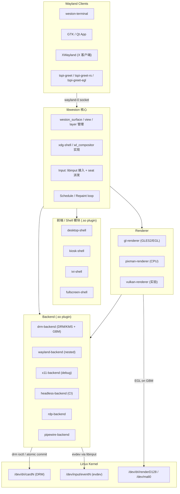
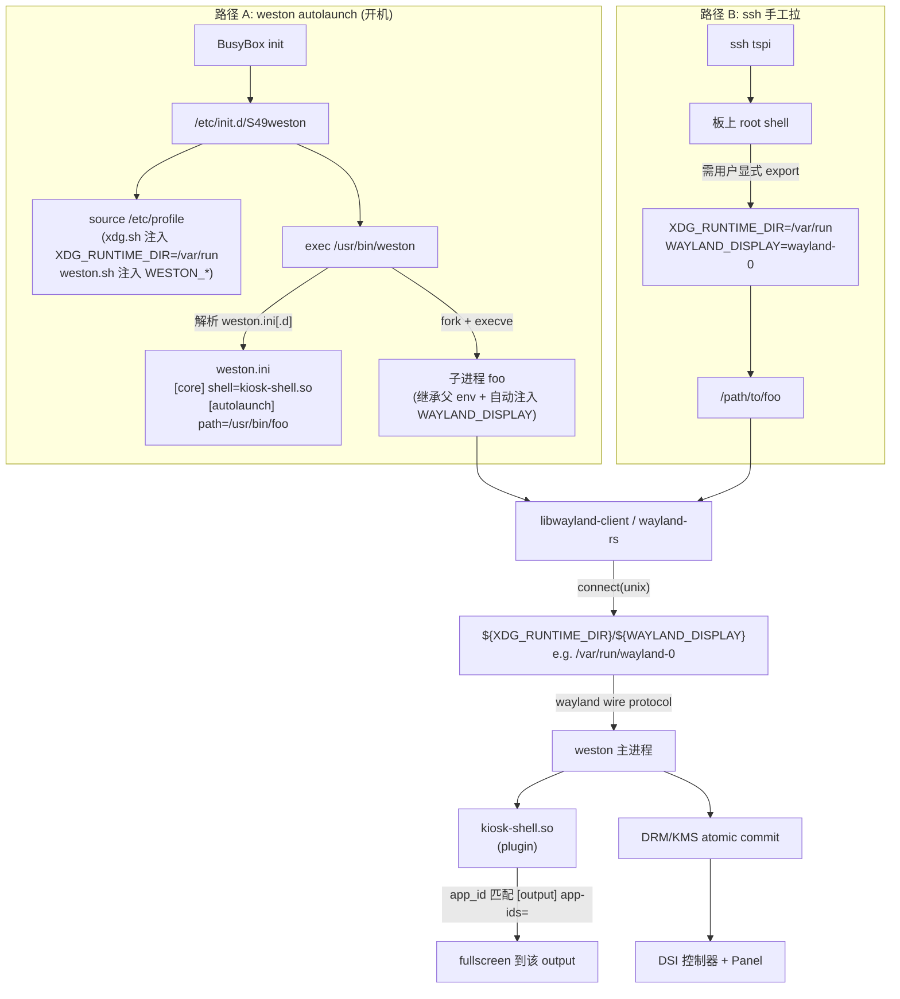
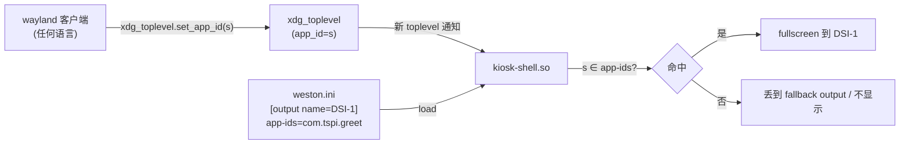
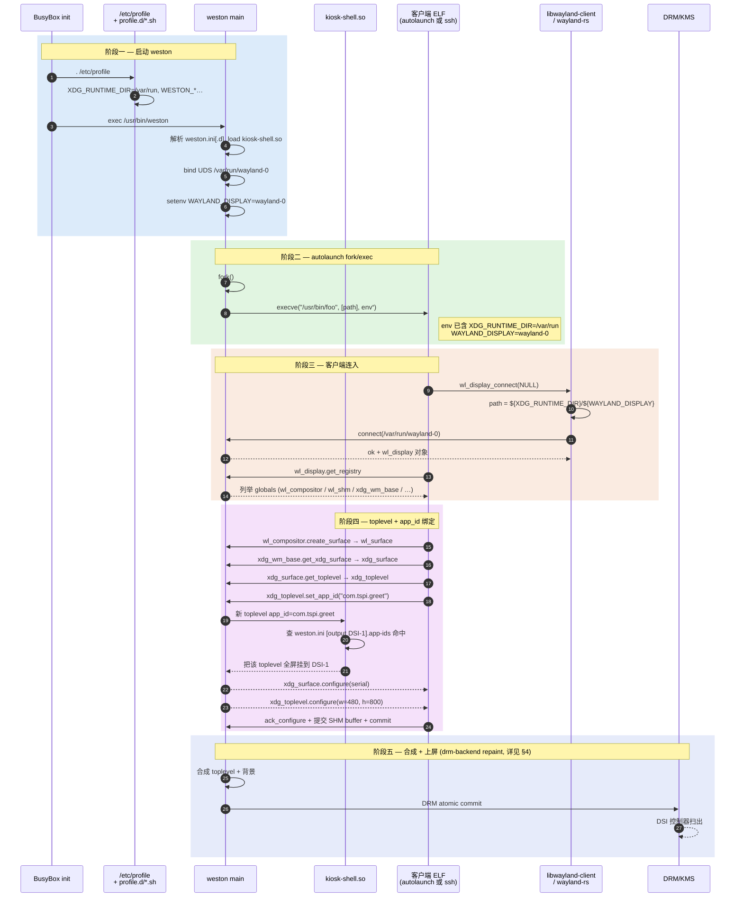

# Weston 合成器：libweston 分层 + 配置 + drm-backend + 客户端 launch

> [!note]
> **Ref:**
> - 客户端协议侧（配对笔记）：[[03-wayland]]
> - 实践靶标：[`prj/05-GraphStack/tspi-greet/etc/00-kiosk.ini`](../../../prj/05-GraphStack/tspi-greet/etc/00-kiosk.ini) ; [`tspi-greet-rs/etc/00-kiosk.ini`](../../../prj/05-GraphStack/tspi-greet-rs/etc/00-kiosk.ini) ; [`tspi-greet-egl/etc/00-kiosk-egl.ini`](../../../prj/05-GraphStack/tspi-greet-egl/etc/00-kiosk-egl.ini)
> - 板上来源：`/etc/init.d/S49weston` · `/etc/profile.d/xdg.sh` · `/etc/profile.d/weston.sh` · `/etc/xdg/weston/weston.ini[.d]`
> - 上游：[Weston GitLab](https://gitlab.freedesktop.org/wayland/weston) ; [`weston.ini(5)`](https://man.archlinux.org/man/weston.ini.5)
> - 相关知识链：[[04-kernel-fb-drm-kms]] ; [[05-tspi-buildroot-weston-de]] ; [[06-EGL]]
>
> **TL;DR**：
> 1. Weston ≈ "libweston 核心 + 三类 plugin (shell / renderer / backend)" 的拼装。新协议先在它落地，是参考实现。
> 2. `weston.ini` 把"选哪些 plugin + 输出怎么配 + 启动什么应用"全部声明式表达。
> 3. drm-backend 的 repaint 循环 (timer → renderer → atomic commit → page-flip) 是嵌入式 jank 诊断的主回路。
> 4. 客户端能不能上屏，落点只在两件事：`socket = $XDG_RUNTIME_DIR/$WAYLAND_DISPLAY` 接对、`xdg_toplevel.set_app_id` 与 `[output] app-ids=` 命中。


## 1. Weston 在生态里的位置

Weston 不是唯一的 Wayland compositor，但它有特殊地位：**libweston 是协议的参考实现**，新协议通常先在 Weston 落地再被其他 compositor 抄。

### 1.1 主流 Wayland Compositor 对比

| Compositor             | 基础设施           | 典型用途                | kiosk 友好         | 备注                                    |
| ---------------------- | ------------------ | ----------------------- | ------------------ | --------------------------------------- |
| **Weston**             | libweston          | 参考实现/嵌入式/车机    | ✅ (kiosk-shell)   | 协议落地最早；可裁剪                    |
| Mutter                 | Clutter (历史)     | GNOME 桌面              | ❌                 | 与 GNOME 紧耦合                         |
| KWin                   | KDE Frameworks     | KDE 桌面                | ❌                 | 也支持 X11 模式                         |
| sway                   | wlroots            | i3 风格平铺桌面         | ⚠ 一般             | wlroots 是 wayland-protocols 风向标     |
| Hyprland               | wlroots fork       | 美化平铺桌面            | ❌                 | 动画/特效丰富                           |
| Cage                   | wlroots            | kiosk / 单全屏应用      | ✅✅                | 极简 kiosk compositor                   |
| QtWayland Compositor   | Qt                 | 嵌入式 Qt + 内嵌合成     | ✅                 | 用 QML 写合成器                         |
| labwc                  | wlroots            | Openbox 风格            | ⚠ 一般             | 轻量浮动 WM                             |

### 1.2 为什么嵌入式偏爱 Weston

- **依赖少**：可不依赖 GTK/Qt/GNOME，纯 EGL+GLES2；
- **后端可选**：drm-backend 直接对接 KMS，无须 X；
- **shell 可换**：desktop-shell / kiosk-shell / ivi-shell / fullscreen-shell 通过 `weston.ini` 切换，无需重编；
- **小**：编译后核心二进制几 MB；
- **license 友好**：MIT；
- **生态对齐**：常见嵌入式 SDK（RK / TI / NXP / iMX）默认就装它。

板上实测：[[05-tspi-buildroot-weston-de]] §3 显示 RK3566 SDK 装的就是 Weston 14.0.2 + `desktop-shell.so` + `kiosk-shell.so` + `ivi-shell.so`，由 BusyBox `init` 通过 `/etc/init.d/S49weston` 拉起（无 systemd）。


## 2. libweston 内部分层

### 2.1 三类 plugin + 核心库

```text
weston (可执行)
  ├── 加载 [core] shell      → libexec_weston/desktop-shell.so / kiosk-shell.so / ivi-shell.so / fullscreen-shell.so
  ├── 加载 [core] backend    → libweston-14/drm-backend.so / wayland-backend.so / x11-backend.so / headless-backend.so ...
  ├── 加载 [core] renderer   → 内置 gl / pixman / vulkan (并非 .so,编进 libweston)
  └── 链接 libweston.so      → 协议状态机 + surface/view/layer 数据结构 + 调度
            └── 链接 libwayland-server.so   → 协议帧的 marshaling / unmarshaling
```

**三类 plugin 都是运行时 `dlopen`** —— 这是 weston 与其他基于 wlroots 的 compositor 最大的架构差异。换 shell / 换 backend 不需要重编 weston 主程序，改 `weston.ini` 即可。

### 2.2 总览架构图



数据流：`client → core → renderer → backend → kernel`；反向控制流：`backend vblank → core repaint cycle`。

### 2.3 前端 Shell 一览

| Shell                | 适用场景                              | 行为关键                            |
| -------------------- | ------------------------------------- | ----------------------------------- |
| `desktop-shell`      | 类桌面体验，面板 + 启动器 + 多窗口    | 读 `[shell] panel-*`；忽略 app-ids   |
| `kiosk-shell`        | 单应用全屏占据 output                 | 读 `[output] app-ids=`；强制全屏     |
| `ivi-shell`          | 汽车 IVI / HMI，按 surface ID 分层    | 读 `[ivi-surface]`                  |
| `fullscreen-shell`   | 一个 client 一个 output，演示/远程    | 不读 app-ids；接收谁就显示谁         |

本仓库三个 demo 都跑在 **`kiosk-shell`** 下：
- [`tspi-greet/etc/00-kiosk.ini`](../../../prj/05-GraphStack/tspi-greet/etc/00-kiosk.ini)
- [`tspi-greet-rs/etc/00-kiosk.ini`](../../../prj/05-GraphStack/tspi-greet-rs/etc/00-kiosk.ini)
- [`tspi-greet-egl/etc/00-kiosk-egl.ini`](../../../prj/05-GraphStack/tspi-greet-egl/etc/00-kiosk-egl.ini)

三份 ini 完全同构，差别只在 `[autolaunch] path=` 指向不同的可执行（见 §3.3 + §5.5）。

### 2.4 libweston 核心数据结构

```text
weston_compositor
 ├── weston_backend           (唯一,如 drm-backend)
 ├── weston_renderer          (唯一,如 gl-renderer)
 ├── weston_seat[]            (输入设备组)
 ├── weston_output[]          (物理 / 虚拟显示器,与 DRM connector 对应)
 ├── weston_layer[]           (叠加层,决定 z 顺序)
 │     └── weston_view[]      (surface 在某个 output 上的呈现实例)
 │           └── weston_surface (协议对象 wl_surface 的核心结构)
 │                 ├── pending_state  (未 commit 的状态)
 │                 ├── current_state  (已 commit 的状态)
 │                 └── role / role_data (xdg_toplevel / xdg_popup / ...)
 └── repaint loop (按 weston_output 的 vblank 驱动)
```

**关键概念分离**：

| 协议层      | 核心层          | 多重性                                |
| ----------- | --------------- | ------------------------------------- |
| `wl_surface`| `weston_surface`| 1:1                                   |
| —           | `weston_view`   | 1 个 surface 可有多个 view (镜像到多屏) |
| —           | `weston_layer`  | 决定 z 顺序的容器                     |
| `wl_output` | `weston_output` | 1:1，与 DRM connector 关联             |

`pending_state` / `current_state` 双缓冲是 [[03-wayland#2.5]] 协议层"原子 commit"在合成器侧的具体落地——commit 时 pending → current 整体拷贝，合成器永远只看见已 commit 的 current。

### 2.5 Renderer 三选一

| Renderer            | 输入                            | 输出                                | 性能       | 适用                            |
| ------------------- | ------------------------------- | ----------------------------------- | ---------- | ------------------------------- |
| `gl-renderer`       | dma-buf / SHM → EGLImage / tex  | EGLSurface → GBM BO → KMS FB        | 硬件加速   | 任何有 GLES2 + EGL 的平台       |
| `pixman-renderer`   | SHM 像素                        | 软件合成到 framebuffer              | CPU only   | 无 GPU 或调试 GPU 问题          |
| `vulkan-renderer`   | dma-buf → VkImage               | VkImage → DRM                       | 硬件加速   | 实验性 (Weston 12+)             |

RK3566 板上：weston 自己用 `gl-renderer`（即便客户端是 SHM 版，**weston 内部合成时仍然要用 libmali 把 SHM 像素上传成 GL 纹理再合成**——这是 SHM 客户端在板上仍然能跑、但 weston 本身离不开 GPU 的原因）。

### 2.6 Backend 一览

| Backend                | 何时用                                           | 关键依赖                                    |
| ---------------------- | ------------------------------------------------ | ------------------------------------------- |
| `drm-backend`          | 嵌入式 / 无 X 桌面 / 主流生产环境                | `libdrm`、`libgbm`、`libinput`、`logind`    |
| `wayland-backend`      | 嵌入到另一个 Wayland compositor 跑 (开发)        | 父 compositor                               |
| `x11-backend`          | 嵌入到 X server 跑 (调试)                        | Xlib / xcb                                  |
| `headless-backend`     | CI、自动化测试、无显示器渲染                     | 无                                          |
| `rdp-backend`          | 远程桌面                                         | `freerdp`                                   |
| `pipewire-backend`     | 把 output 推给 PipeWire                          | `libpipewire`                               |

RK3566 / i.MX6ULL 等嵌入式板子几乎一律 **`drm-backend + gl-renderer`**。


## 3. weston.ini 配置语义

### 3.1 配置文件位置与加载顺序

```text
搜索顺序 (weston 自启动时):
  1. $XDG_CONFIG_HOME/weston.ini
  2. /etc/xdg/weston/weston.ini
  3. /etc/xdg/weston/weston.ini.d/*.ini    (按文件名字典序合并)
```

**`weston.ini.d/` 是关键**：buildroot 包系统、各种 overlay 都往这里塞片段。RK3566 板上典型布局：

```sh
$ ssh tspi 'ls /etc/xdg/weston/'
weston.ini             # 基线，由 weston 包提供
weston.ini.d/
  00-kiosk.ini         # buildroot rockchip overlay 塞的 kiosk 配置
  10-output-dsi.ini    # 输出配置 (可能也来自 overlay)
```

`weston.ini.d/*.ini` 按字典序加载，同一 section 后者覆盖前者 —— **所以前缀编号 (`00-`、`10-`) 决定生效顺序**。

> [!tip]
> xdg = X Desktop Group，跨桌面组，由 [freedesktop.org](https://freedesktop.org/) 制定的一系列规范（[XDG Base Directory Specification](https://specifications.freedesktop.org/basedir-spec/)、[Desktop Entry Specification](https://specifications.freedesktop.org/desktop-entry-spec/) 等都属此家族）。

### 3.2 关键 section 语义

```ini
[core]
shell=kiosk-shell.so          # 选前端 shell plugin
backend=drm-backend.so        # 选 backend plugin
renderer=gl                   # 选 renderer (gl / pixman / vulkan)
require-input=false           # 启动时不强制要求有输入设备 (kiosk 必填,否则无键盘时退出)
require-outputs=none          # 启动时不强制要求有 output 已就绪 (DSI panel 延迟探测时需要)
idle-time=0                   # 0 = 永不进入 idle / dpms off
xwayland=false                # 不启动 XWayland (嵌入式默认关闭节省内存)

[shell]
background-color=0xff002b36   # ARGB,desktop-shell 用;kiosk-shell 忽略
panel-position=none           # desktop-shell 用;kiosk-shell 忽略
locking=false                 # 关闭屏保锁屏
startup-animation=none        # 关闭启动动画 (kiosk 通常关闭)

[output]
name=DSI-1                    # 必须与 DRM connector 名一致 (用 weston-info 或 drm_info 查)
mode=preferred                # 用 EDID/panel 偏好的模式;或写 1280x800@60
transform=normal              # rotate0;其他: 90/180/270/flipped
scale=1                       # HiDPI 缩放
app-ids=com.tspi.greet        # kiosk-shell 专用:命中此 app_id 的 toplevel 全屏到本 output

[keyboard]
keymap_layout=us
repeat-rate=25
repeat-delay=600

[autolaunch]
path=/usr/bin/tspi-greet      # 必须绝对路径;不接受 PATH 搜索
watch=false                   # 见 §5.4 的语义陷阱
```

| Section          | 关键字段                                                                            |
| ---------------- | ----------------------------------------------------------------------------------- |
| `[core]`         | `shell`, `backend`, `renderer`, `idle-time`, `require-input`, `require-outputs`, `xwayland` |
| `[shell]`        | `background-image/color`, `panel-position`, `locking`, `startup-animation`          |
| `[output]`       | `name`, `mode`, `transform`, `scale`, `seat`, **`app-ids` (kiosk-shell 必填)**       |
| `[keyboard]`     | `keymap_layout`, `repeat-rate`, `repeat-delay`                                      |
| `[input-method]` | `path` (虚拟键盘可执行)                                                              |
| `[autolaunch]`   | `path`, `watch` (kiosk-shell 配合; 见 §5.4)                                          |

### 3.3 本仓库三个 demo 的 kiosk ini 对照

三份 ini 完全同构，仅 `[autolaunch] path=` 不同 —— 这就是同一份 weston/同一份 kiosk-shell 在不同客户端实现间切换的全部代价。

```ini
# tspi-greet/etc/00-kiosk.ini (C/SHM)
[core]
shell=kiosk-shell.so
require-input=false
require-outputs=none
idle-time=0

[shell]
locking=false
startup-animation=none

[output]
name=DSI-1
app-ids=com.tspi.greet

[autolaunch]
path=/usr/bin/tspi-greet
# watch=true 在 weston 14 的语义是"子进程死则 weston 也死",非自动重拉,
# init.d 链路下没有恢复效果 —— 故不写 (默认 false)
```

```diff
# tspi-greet-rs/etc/00-kiosk.ini (Rust/SHM) diff:
- path=/usr/bin/tspi-greet
+ path=/usr/bin/tspi-greet-rs

# tspi-greet-egl/etc/00-kiosk-egl.ini (C/EGL) diff:
- path=/usr/bin/tspi-greet
+ path=/usr/bin/tspi-greet-egl
```

> [!important]
> 三份 ini 的 `[output] app-ids=` 全部是 `com.tspi.greet` —— 即所有三个 demo 客户端的 `xdg_toplevel.set_app_id("com.tspi.greet")` 都写成同一串字符串。这是有意为之：**切换 demo 只需替换 autolaunch path + 重启 weston**，无需改 client 代码。详见 §5.5。


## 4. drm-backend 调用链

drm-backend 是嵌入式生产环境**唯一**实际用的 backend。理解它的 repaint 循环 = 理解嵌入式 weston jank / 掉帧的诊断起点。

### 4.1 repaint 循环架构

```text
事件源 (timer / page-flip)
       │
       ▼
libweston 调度器  ──→  output->repaint(weston_output*)
       │
       ├─→ renderer->repaint_output()
       │     │
       │     └─→ gl-renderer:
       │           ├─ 绑定 EGLSurface (基于 gbm_surface)
       │           ├─ 遍历 weston_view[],按 z 顺序画到 EGLSurface
       │           └─ eglSwapBuffers ─→ 内部 GBM lock front buffer 出 BO
       │
       └─→ drm-backend:
             ├─ 把 GBM BO 转 DRM framebuffer:
             │    drmModeAddFB2WithModifiers(fd, w, h, format, handles[], pitches[], offsets[], mods[], &fb_id, 0)
             ├─ 配 plane state:
             │    drmModeAtomicAddProperty(req, plane, "FB_ID",   fb_id)
             │    drmModeAtomicAddProperty(req, plane, "CRTC_ID", crtc_id)
             │    drmModeAtomicAddProperty(req, plane, "SRC_*",   src_rect)
             │    drmModeAtomicAddProperty(req, plane, "CRTC_*",  dst_rect)
             └─ drmModeAtomicCommit(fd, req, DRM_MODE_PAGE_FLIP_EVENT, user_data)
                       │
                       ▼
                 内核 KMS: 配 VOP plane,等下一次 vblank
                       │
                       ▼ (vblank 来了)
                 DRM 给 fd 上推 page_flip 事件
                       │
                       ▼
                 weston 主循环 epoll(drm_fd) 取出事件
                       │
                       ▼
                 page_flip_handler() ─→ output->repaint_complete()
                       │
                       ├─ 释放上一帧 GBM BO (gbm_surface_release_buffer)
                       └─ 安排下一次 repaint (timer)
```

### 4.2 关键调用清单

按出现顺序、附 libdrm 函数：

| # | 调用                                  | 用途                                            |
| - | ------------------------------------- | ----------------------------------------------- |
| 1 | `eglSwapBuffers(egl_dpy, egl_surf)`   | gl-renderer 把合成结果交给 GBM                  |
| 2 | `gbm_surface_lock_front_buffer(gbm)`  | 拿当前帧的 `gbm_bo*`                            |
| 3 | `gbm_bo_get_fd(bo)`                   | 拿到 dma-buf fd                                 |
| 4 | `drmModeAddFB2WithModifiers(...)`     | 把 dma-buf 注册为 DRM framebuffer 拿 `fb_id`    |
| 5 | `drmModeAtomicAddProperty(req, ...)`  | 配 plane 各字段 (FB_ID / CRTC_ID / SRC_W ...)   |
| 6 | `drmModeAtomicCommit(fd, req, flags)` | 原子提交;flags 含 `DRM_MODE_PAGE_FLIP_EVENT`    |
| 7 | `drmHandleEvent(fd, &ctx)`            | weston epoll 到 drm_fd 可读时调,分发 page_flip   |
| 8 | `page_flip_handler(crtc, frame, sec, usec, user_data)` | 用户态回调,在这里安排下一帧        |
| 9 | `gbm_surface_release_buffer(gbm, bo)` | 释放上一帧 BO,让 EGL 拿来画下一帧                |

**调试嵌入式 weston 掉帧/卡顿时，这条回路任何一环延迟都会变成 jank。**

### 4.3 可观测点（jank 诊断）

| 现象              | 怀疑环节                            | 排查手段                                                                |
| ----------------- | ----------------------------------- | ----------------------------------------------------------------------- |
| eglSwapBuffers 慢 | GPU 渲染 (gl-renderer)              | `WAYLAND_DEBUG=server weston` + perf trace gl-renderer 路径             |
| AtomicCommit -EBUSY | KMS 仍在 scan 上一帧             | weston-debug drm-backend / 看 page-flip 频率                            |
| page_flip 不来    | 内核 DRM driver 没发 vblank event   | `cat /sys/kernel/debug/dri/0/state` ; dmesg 看 rockchip-drm 报错        |
| repaint 调度晚    | libweston 调度器被其他 task block   | `weston-debug scene-graph` ; perf top 看 libweston 占用                 |

### 4.4 GBM、EGL、DRM 的角色分工

| 库          | 角色                                                                 |
| ----------- | -------------------------------------------------------------------- |
| **GBM**     | 跨 mesa/驱动的 buffer object 分配器；产出可 scanout 的 dma-buf       |
| **EGL**     | 把 dma-buf 包成 `EGLImage`（`EGL_LINUX_DMA_BUF_EXT`），可绑到 GL tex |
| **DRM/KMS** | 拿 dma-buf 作为 framebuffer 进行 scanout（`drmModeAddFB2WithModifiers`）|

详细的 dma-buf 跨子系统流转见 [[04-kernel-fb-drm-kms]] §"DRM Atomic 模型"。


## 5. 客户端启动到第一帧上屏全链

### 5.1 目的：可观测的因果链

把"板上一个 ELF 怎么把像素送上 DSI 屏"拆成因果链：

```text
shell / init / weston ─→ env vars (XDG_RUNTIME_DIR / WAYLAND_DISPLAY)
   ─→ libwayland-client (或 wayland-rs) 打开 unix socket
   ─→ 与 weston 进程对讲 wayland wire protocol
   ─→ kiosk-shell.so 按 app-id 把新 toplevel 绑到 output
   ─→ weston 合成 → DRM/KMS atomic commit → DSI 控制器 → 屏幕
```

特别要回答三件容易踩坑的事：

1. 两个环境变量是如何"指向同一只 unix socket"的；缺谁、错谁后看到什么报错（§5.3）；
2. weston `[autolaunch] path=…` 启动子进程时，**env 是从哪儿继承的**，与从 ssh / 命令行启的有何差别（§5.4）；
3. kiosk-shell 凭什么把某个 client 全屏到某个 output —— `set_app_id` 与 `weston.ini [output] app-ids=` 的契约（§5.5）。

### 5.2 两条启动路径



两条路径**汇聚到同一只 unix socket** —— 这是整个机制的核心：weston 创建 socket，所有 client（无论是 weston fork 出来的还是 ssh 手跑的）只要 env 指向那只 socket 就能连上。

### 5.3 两个环境变量 —— socket 地址的拼接规则

#### 拼接公式

libwayland-client 在 `wl_display_connect(name)` 里做的实际事：

```c
// 简化伪代码,源出 libwayland-client
const char *runtime = getenv("XDG_RUNTIME_DIR");
const char *display = name ? name : getenv("WAYLAND_DISPLAY");
if (!display) display = "wayland-0";              // libwayland 兜底默认
snprintf(path, "%s/%s", runtime, display);
fd = socket(AF_UNIX, ...);
connect(fd, path);
```

wayland-rs 0.31 的 `Connection::connect_to_env()` 内部走完全等价的逻辑。

**socket 地址 = `${XDG_RUNTIME_DIR}/${WAYLAND_DISPLAY}`**。两个变量缺一不可。

#### 解析顺序与板上实际值

| 变量 | 取值来源（优先级从高到低） | tspi 板上实际值 |
|------|---------------------------|----------------|
| `XDG_RUNTIME_DIR` | 用户 export → `/etc/profile.d/xdg.sh` → libwayland **无兜底**,缺则直接 NoCompositor | **`/var/run`** (buildroot `RK_ROOTFS_FORCE_RAMTMP=y` 把它做成 tmpfs；`/run` 是 `/var/run` 的符号链接) |
| `WAYLAND_DISPLAY` | 用户 export → weston 启动 socket 时**自动 setenv 给所有子进程** → libwayland 兜底 `wayland-0` | weston 启动后创建 `$XDG_RUNTIME_DIR/wayland-0`,导出 `WAYLAND_DISPLAY=wayland-0` |

> [!note]
> kiosk-shell autolaunch 可以"无感"启动应用；用户从 ssh 命令行起则需手动 export，通常：
>
> ```sh
> export XDG_RUNTIME_DIR=/run
> export WAYLAND_DISPLAY=$(basename $(ls /run/wayland-* | head -1))
> ```

#### 缺一个的报错画像

| 现象 | 根因 |
|------|------|
| `panicked at … NoCompositor` (wayland-rs) / `wl_display_connect: No such file or directory` (libwayland) | `XDG_RUNTIME_DIR` 空 → 拼出来路径 `/wayland-0`,无此 socket |
| 同上,但能看到 `/var/run/wayland-0` 存在 | 你的 shell 里 `XDG_RUNTIME_DIR=/run/user/$UID` (XDG 标准默认),与 weston 实际监听位置 `/var/run` 不一致 |
| `Connection refused` | 路径对但 weston 没在跑 |
| 能 connect 上但 registry 为空 | 连到了另一个 compositor (同时跑了多个 weston,display 编号错) |

### 5.4 autolaunch 的 fork/exec 细节

#### weston.ini 里的 `[autolaunch]` 段

参考 weston-14 源码 `libweston/desktop/autolaunch.c`（kiosk-shell.so 也用同一段配置）：

```ini
[autolaunch]
path=/usr/bin/foo            # 绝对路径;不接受 PATH 搜索
watch=true|false             # 见下面 §"watch 语义陷阱",默认 false
```

加载顺序：

1. weston 启动末尾、main loop 起来之前；
2. weston `fork()`；
3. 子进程 `execve(path, [path], inherited_envp)`；
4. **父进程不等子退出**（即使 watch=true 也只是注册 SIGCHLD 回调）。

#### 子进程拿到的 env

子进程**完整继承 weston 的 process env**，且 weston 在创建 wayland socket 后**显式 setenv** 两个最重要的变量：

| 变量 | 设法 |
|------|-----|
| `WAYLAND_DISPLAY` | weston 创建好 listening socket 后调 `setenv("WAYLAND_DISPLAY", "wayland-0", 1)` |
| `WAYLAND_SOCKET` | 用于 "fd 直传" 模式 (通常不启用) |
| `XDG_RUNTIME_DIR` | 从 weston 的 env 继承 —— 即 S49weston 注入的 `/var/run` |
| `WESTON_*` | 从 weston.sh 注入的所有 WESTON_* hack |
| `LD_LIBRARY_PATH` / `PATH` | 继承自 S49weston 的 `. /etc/profile` 链 |

**结论**：autolaunch 出来的子进程**根本不需要自己 export 任何变量**。这也是为什么写 weston 客户端开发者最初常以为"我不用管 env" —— 一旦切换到 ssh 手工拉，立即翻车。

#### `watch` 的语义陷阱

| `watch=` | 行为 (weston 14) |
|---------|------------------|
| 未设 / `false` | autolaunched 子进程死了 → weston 不动，**不会重启子进程** |
| `true` | **子进程死则 weston 一起死** —— init.d / systemd 看到 weston 退出会重启 weston，weston 再次起来又会 autolaunch → 间接达到"重拉"效果 |

容易误以为 `watch=true` 是"周期性看护并重拉子进程" —— 不是。它的"重拉"是借 init 系统的服务重启实现的。**如果板上的 weston 不是 service 而是手动起的，`watch=true` 就是单向自杀**。

#### 与"普通 daemon"不同的点

autolaunched 子进程并不**属于** weston 这个 service（init 角度），它只是从 weston fork 出来的进程，但**没有被 init 接管**。所以：

- `systemctl restart weston`（或 `/etc/init.d/S49weston restart`）会重启 weston，weston 再次拉子；
- `killall my-app` 杀子，**默认情况 weston 不会自动重拉**；
- `killall weston` 杀父，**子进程不会被 SIGTERM 联动**（要看 prctl/PR_SET_PDEATHSIG 是否设；weston 14 没设）→ 留下孤儿进程。

### 5.5 kiosk-shell 与 `set_app_id` 的契约

#### 三方约定



#### 客户端侧 —— 一行代码

任何 wayland 客户端在 toplevel 创建后调用对应 binding：

| 语言 | 调用 |
|------|------|
| C (libwayland) | `xdg_toplevel_set_app_id(top, "com.tspi.greet");` |
| Rust (wayland-rs 0.31) | `top.set_app_id("com.tspi.greet".into());` |
| Qt | `QGuiApplication::setDesktopFileName("com.tspi.greet")` (Qt 6 Wayland 自动转 set_app_id) |
| GTK4 | `gtk_application_new("com.tspi.greet", …)` 自动设 |

本仓库三个 demo 的实际位置（与 [[03-wayland#3.9]] 字段对应）：

- C/SHM: [`tspi-greet/src/main.c:267`](../../../prj/05-GraphStack/tspi-greet/src/main.c:267)
- Rust/SHM: [`tspi-greet-rs/src/main.rs:296`](../../../prj/05-GraphStack/tspi-greet-rs/src/main.rs:296)（约）
- C/EGL: [`tspi-greet-egl/src/main.c:273`](../../../prj/05-GraphStack/tspi-greet-egl/src/main.c:273)

> [!important]
> **协议本身不强制 compositor 拿 app_id 做任何事** —— 它是个 hint。
> 但 kiosk-shell 把它当**唯一的 output 绑定钥匙**，所以对 kiosk 场景就是硬要求。
>
> **相反地，desktop-shell 基本不读 set_app_id** —— 应用照样以浮动窗口模式出现，不影响显示位置/output 绑定/任何 layout 决策。这正是 kiosk-shell 的反面。

#### weston 侧 —— `[output] app-ids=`

[weston.ini(5)](https://man.archlinux.org/man/weston.ini.5) 中 kiosk-shell 相关字段：

| 字段 | 例子 | 作用 |
|------|------|------|
| `[output] name=` | `DSI-1` | 标识哪个 DRM 输出 |
| `[output] app-ids=` | `com.tspi.greet,com.foo.bar` | 逗号分隔；命中其中之一的 toplevel 全屏到本 output |
| `[shell]` 段 | —— | kiosk-shell 不读，留着兼容 desktop-shell 配置 |

#### 反向证伪

最直接的实验：把任一 demo 里 `set_app_id("com.tspi.greet")` 改成 `set_app_id("foo.bar")` 后重跑：

- 进程能起、能 bind globals、能进 main loop —— wayland 协议层没毛病；
- 屏上**看不到画面** —— kiosk-shell 找不到匹配的 output 规则；
- weston 日志里出现 `kiosk-shell: surface app_id "foo.bar" did not match any output` 之类。

把 app_id 再改回来 → 重新上屏。**这是验证 §5.5 整个机制最干净的实验**。

#### kiosk-shell vs desktop-shell 行为差异

| 维度 | desktop-shell | kiosk-shell |
|------|--------------|------------|
| 是否读 `[output] app-ids=` | ❌ 不读 | ✅ 唯一绑定钥匙 |
| 是否允许 floating window | ✅ | ❌ 全部强制 fullscreen |
| `[shell] panel-*` | 用 | 忽略 |
| 多 client 同 app_id | 各自有窗口 | 第一个命中的占该 output；后续同 app_id 的覆盖前者 |

### 5.6 完整启动时序



### 5.7 实操：命令行替换 autolaunch 出来的应用

最常见场景：weston 已按 weston.ini 启动并自动拉了 **应用 A**（如 C 版 tspi-greet），开发者想换跑 **应用 B**（如 Rust 版 tspi-greet-rs），**不想改 weston.ini**。

#### 标准三步法

```sh
ssh -o ConnectTimeout=30 tspi

# 1) 干掉 autolaunched 的应用
killall tspi-greet                            # 注意:若 watch=true 会顺带杀 weston

# 2) 拿到 weston 当前 socket 的环境变量
export XDG_RUNTIME_DIR=/var/run               # 与 /etc/profile.d/xdg.sh 同
export WAYLAND_DISPLAY=$(basename /var/run/wayland-*)   # 通常是 wayland-0

# 3) 用相同的 app_id 启动你的应用 → kiosk-shell 自动接管全屏
/mnt/nfs/tspi-greet-rs/tspi-greet-rs
```

关键：**应用 B 的 `set_app_id` 必须与 weston.ini 里 `[output] app-ids=` 命中的字符串相同** —— 否则它能跑、能进 main loop，但屏幕没画面（见 §5.5"反向证伪"）。

#### watch=true 的绕开

若板上 weston.ini 写了 `watch=true`，上面第 1 步会顺带杀掉 weston。绕开：

**方案 A**（临时挪开 ini 文件 → 重启 weston → 无 autolaunch → 手工拉）：

```sh
mv /etc/xdg/weston/weston.ini.d/*kiosk*.ini /tmp/
/etc/init.d/S49weston restart
# … step 2 + 3
mv /tmp/*kiosk*.ini /etc/xdg/weston/weston.ini.d/      # 用完恢复
```

**方案 B**（不重启 weston，直接 SIGSTOP 让被 autolaunch 的应用挂起而不退）：

```sh
pkill -STOP tspi-greet                         # 暂停而非杀 → weston 不触发 SIGCHLD
# … step 2 + 3
pkill -CONT tspi-greet                         # 恢复
```

`SIGSTOP` 不可被忽略，进程"冻住"占资源但不耗 CPU。kiosk-shell 视角上这个 client 还活着但不再产生新帧。

#### 完全脱离 autolaunch 调试

开发期想用 ssh 反复试错应用，最干净的姿势：

```sh
# 让 weston 启起来但不 autolaunch 任何 app
mv /etc/xdg/weston/weston.ini.d/*kiosk*.ini /tmp/
/etc/init.d/S49weston restart

# 之后所有迭代都靠手工拉
export XDG_RUNTIME_DIR=/var/run
export WAYLAND_DISPLAY=wayland-0
/mnt/nfs/foo/foo            # 改一次 → scp → 跑一次 → Ctrl-C → 改 → 再跑
```

调试完恢复：

```sh
mv /tmp/*kiosk*.ini /etc/xdg/weston/weston.ini.d/
/etc/init.d/S49weston restart
```


## 6. 调试技巧与排查

### 6.1 协议层调试

**`WAYLAND_DEBUG=1`**：客户端打印每条 request/event：

```sh
ssh tspi 'WAYLAND_DEBUG=1 /mnt/nfs/tspi-greet-egl/tspi-greet-egl 2>&1 | head -50'
```

输出形如：

```text
[3242343.123]  -> wl_display@1.get_registry(new id wl_registry@2)
[3242343.130] wl_registry@2.global(1, "wl_compositor", 6)
[3242343.131] wl_registry@2.global(2, "wl_shm", 1)
...
```

合成器端也支持：`WAYLAND_DEBUG=server weston`。

**`wayland-info` / `weston-info`**：打印当前合成器暴露的所有 global，**排查"客户端找不到接口"几乎一定先跑这个**。

### 6.2 Weston 内部调试

`weston-debug` 协议（需要启用 debug，见下）：

```sh
weston-debug --list
weston-debug drm-backend > drm.log
weston-debug scene-graph
weston-debug shell
```

stream 包括：`drm-backend`、`scene-graph`、`gl-shader-generator`、`xwm`、`shell` 等。

> [!warning]
> 默认 weston.ini **不开** debug 协议 —— [`tspi-greet-egl`](../../../prj/05-GraphStack/tspi-greet-egl/) demo 试图用 `weston-screenshooter` 截屏时遇到 "Output capture error: unauthorized" 就是这个原因（详见 [`Conclude.md §3.7`](../../../prj/05-GraphStack/tspi-greet-egl/Conclude.md)）。开启方式：weston 启动加 `--debug` 或 weston.ini 加 `[core] debug=true`，重启即可。

### 6.3 环境变量速查

| 变量                  | 作用                                                       |
| --------------------- | ---------------------------------------------------------- |
| `WAYLAND_DISPLAY`     | 客户端用的 socket 名 (默认 `wayland-0`)                    |
| `XDG_RUNTIME_DIR`     | socket 所在目录                                            |
| `WAYLAND_DEBUG`       | `1`/`client` = 客户端,`server` = 合成器                    |
| `MESA_LOADER_DRIVER_OVERRIDE` | 强制选 mesa 驱动                                   |
| `LIBGL_DEBUG`         | mesa GL 调试                                               |
| `EGL_LOG_LEVEL`       | mesa EGL 调试 (`fatal`/`warning`/`info`/`debug`)           |
| `GBM_BACKEND`         | 选 GBM 后端实现                                            |
| `LIBINPUT_LOG_PRIORITY` | libinput 日志 (`debug`/`info`/`error`)                   |

### 6.4 排查快表

| 现象 | 第一动作 | 常见根因 |
|------|---------|---------|
| 应用 panic `NoCompositor` / `wl_display_connect: ENOENT` | `echo $XDG_RUNTIME_DIR $WAYLAND_DISPLAY; ls /var/run/wayland-*` | env 没 export；weston 没跑 |
| 应用 panic `Connection refused` | `pgrep -x weston` | weston 进程死了 |
| 应用能起、进 main loop、屏上无画面 | `cat /etc/xdg/weston/weston.ini.d/*kiosk*.ini` | `set_app_id` 与 `[output] app-ids=` 不匹配 (§5.5) |
| `killall my-app` 顺带杀 weston | `grep watch /etc/xdg/weston/weston.ini.d/*.ini` | `watch=true` 触发联动 (§5.4) |
| ssh 过去手工跑能上屏，autolaunch 上屏不行 | `cat /etc/init.d/S49weston` | autolaunch 路径 / app_id 不对 |
| weston 起来但 DSI 屏黑 | `ls /sys/class/drm/`; `cat /var/log/weston.log` | DRM 后端 / panel 配置问题，见 [[04-kernel-fb-drm-kms]] / [[05-tspi-buildroot-weston-de]] |
| 客户端只能 SHM 不能 dmabuf | `wayland-info` 看是否有 `zwp_linux_dmabuf_v1` | 客户端 EGL 不支持 `EGL_EXT_image_dma_buf_import` |
| 触摸坐标错位 | udev rule / `LIBINPUT_CALIBRATION_MATRIX` | `libinput list-devices` 是否识别 |
| 卡顿/掉帧 | `weston-debug drm-backend` 看 page-flip 周期 | §4.3 jank 诊断表 |
| EGL 客户端 `eglInitialize` 返回 NULL | 板上 libEGL 找不到 GPU driver | 检 `/dev/mali0` 权限；EGL 抽象边界见 [[06-EGL]] §5 |


## 7. 与本仓笔记的衔接

| 想读哪个角度 | 看这里 |
|-------------|-------|
| Wayland 协议本身 (客户端视角) | [[03-wayland]] —— 配对笔记 |
| tspi 板上 weston 是怎么编进来的 (buildroot 视角) | [[05-tspi-buildroot-weston-de]] §3-§5 |
| kiosk-shell vs desktop-shell 切换 | [[05-tspi-buildroot-weston-de]] §9.1 |
| 怎么从 Rust 端写一个 kiosk client (含交叉编译) | [`prj/05-GraphStack/tspi-greet-rs/`](../../../prj/05-GraphStack/tspi-greet-rs/) |
| DRM/KMS atomic commit 那一段 | [[04-kernel-fb-drm-kms]] |
| 用 Qt eglfs / 直吃 DRM 绕开 weston | [[05-tspi-buildroot-weston-de]] §9.2 |
| EGL 抽象层概念 (三层解耦) | [[06-EGL]] |
| 板上 EGL 闭源栈实测 | [`prj/05-GraphStack/tspi-greet-egl/Conclude.md`](../../../prj/05-GraphStack/tspi-greet-egl/Conclude.md) |
