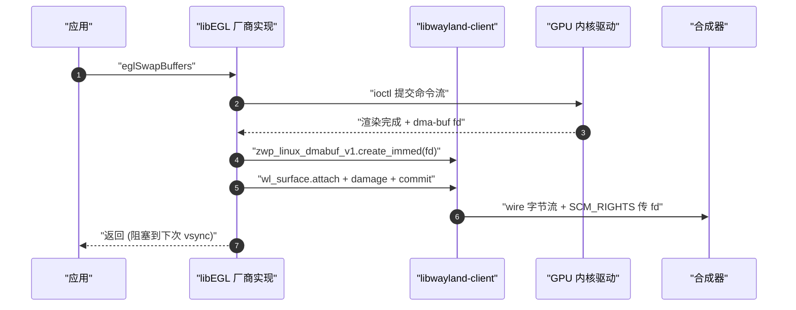

# EGL

> [!note]
> **Ref:**
> - 规范: [EGL 1.5 spec](https://registry.khronos.org/EGL/specs/eglspec.1.5.pdf) ; 头文件 `<EGL/egl.h>` / `<EGL/eglplatform.h>` / `<EGL/eglext.h>`
> - 实践基准: [`prj/05-GraphStack/tspi-greet-egl/src/main.c`](../../../prj/05-GraphStack/tspi-greet-egl/src/main.c) ; 工程级走读 [`Design-EGL-Path.md`](../../../prj/05-GraphStack/tspi-greet-egl/Design-EGL-Path.md) / [`Design-LinkChain.md`](../../../prj/05-GraphStack/tspi-greet-egl/Design-LinkChain.md)
> - 关联: [[01-ui-stack-overview]] / [[03-wayland]] / [[03-1-compositor-weston]]


## 1. 定义

EGL 是 Khronos 制定的一套 C ABI,在应用代码与"(客户端渲染 API 实现 + 原生窗口协议栈)"之间架一层抽象,让应用以同一份源码:

- 拿到渲染上下文 (`EGLContext`)
- 把原生窗口对象 (`wl_egl_window` / X11 `Window` / `ANativeWindow` / `gbm_surface`) 升格为可渲染表面 (`EGLSurface`)
- 用 `eglSwapBuffers` 把渲染结果交给窗口系统

EGL 不做的事:

| 不属于 EGL | 谁来做 |
|---|---|
| 渲染像素 | OpenGL ES / OpenVG / OpenCL (独立的 Khronos API) |
| 创建/销毁/管理窗口 | 原生窗口系统 (Wayland xdg-shell / X11 / Android) |
| 窗口元数据 / 输入 / 焦点 | 原生窗口系统 |
| 显示上屏 | 合成器或 KMS |
| GPU 命令编码 | GPU 厂商驱动 (libmali / Mesa) |

`libEGL.so` 只是 dispatch 层,真正干活在背后的厂商实现 (`libmali.so` / `iris_dri.so` / `libnvidia-eglcore.so`)。


## 2. 三层解耦

EGL 同时解耦三个互相正交的维度。换其中任何一个,应用源码不动。

| 维度 | 解耦的两端 | 关键 API | 替换粒度 |
|---|---|---|---|
| A | 应用 ↔ 客户端渲染 API | `eglBindAPI` / `EGLContext` | GLES ↔ VG ↔ CL |
| B | 应用 ↔ 原生窗口系统 | `EGLNativeDisplayType` / `EGLNativeWindowType` | Wayland ↔ X11 ↔ Android ↔ GBM |
| C | 应用 ↔ GPU 厂商 | `libEGL.so` SONAME | Mali ↔ Mesa ↔ NVIDIA |

### 2.1 A · 客户端渲染 API

OpenGL ES、OpenVG、OpenCL/GL interop 都需要"上下文 + 绑线程 + 绑 surface"这套生命周期。EGL 把它统一:

```c
eglBindAPI(EGL_OPENGL_ES_API);
ctx = eglCreateContext(dpy, cfg, EGL_NO_CONTEXT, attrs);
eglMakeCurrent(dpy, surf, surf, ctx);
```

EGL 标准化的是上下文管理,不是绘图本身。`glDrawArrays` 等绘图调用通过单独的 `libGLESv2.so` 暴露,与 EGL 平行。

### 2.2 B · 原生窗口系统

"窗口"在不同平台是完全不同的对象。EGL 用两个不透明类型抹掉差异:

```c
/* EGL/eglplatform.h */
typedef NativeDisplayType  EGLNativeDisplayType;
typedef NativeWindowType   EGLNativeWindowType;
```

在 Wayland 平台编译时解析为:

```c
typedef struct wl_display    *EGLNativeDisplayType;
typedef struct wl_egl_window *EGLNativeWindowType;
```

应用 cast 是合法的,但 `libEGL.so` 导出符号永远是 `void *`:

```c
// src/main.c:131
a->egl_dpy  = eglGetDisplay((EGLNativeDisplayType)a->dpy);
a->egl_surf = eglCreateWindowSurface(a->egl_dpy, cfg,
                                     (EGLNativeWindowType)a->egl_win, NULL);
```

换 X11 只需把 `wl_display_connect` 换成 `XOpenDisplay`,EGL 调用一行不动。

EGL 1.5 新增 `eglGetPlatformDisplay(EGL_PLATFORM_WAYLAND_KHR, ...)` 把"我是哪个平台"从隐式 typedef 升格为显式 enum。语义等价,只是更确定。

### 2.3 C · GPU 厂商

应用只 `-lEGL`,运行时 `ld.so` 顺着 SONAME 找到具体实现:

```text
ELF.NEEDED:   libEGL.so.1                          (所有厂商共用 SONAME)
板上软链:     libEGL.so.1 → libmali.so.1.9.0       (Mali)
或:           libEGL.so.1 → libGLX_mesa.so.0       (Mesa)
```

同一二进制在 Mali 板与 Intel 桌面上跑,源码与编译产物完全不变。详见 `Design-LinkChain.md`。


## 3. 三个核心对象

```text
            EGLDisplay        ← 与原生窗口系统的连接
                │
        ┌───────┴────────┐
        ▼                ▼
   EGLContext       EGLSurface
   (GL 状态机)      (渲染目标)
        │                │
        └────────┬───────┘
                 ▼
            eglMakeCurrent
            (绑到当前线程)
                 │
                 ▼
            此后 gl* 调用才有效
```

- `EGLDisplay`: `eglGetDisplay(native_dpy)` 取得,进程级单例。`eglQueryString` 查 vendor / version / extensions。
- `EGLContext`: 持有 program、binding、state 等 GL 状态机。创建时不绑 surface,可在多个 surface 之间切换。
- `EGLSurface`: 渲染目标。Window surface 最常用 (由 native window 创建);此外有 pbuffer (离屏) 与 pixmap (X11 专用)。
- `eglMakeCurrent`: 把 (当前线程, ctx, draw_surf, read_surf) 绑成四元组。同一 ctx 不能同时 current 到两个线程。


## 4. eglSwapBuffers 内部

一行调用同时做两件事 (这是 EGL 把"厂商实现"解耦干净的具体位置):



两条线并存:

- **GPU 提交线**: flush 命令缓冲 → `ioctl` 进内核 → 等渲染完成
- **协议交付线**: dma-buf 包成 `wl_buffer` → `wl_surface.attach + commit` → 等 `wl_buffer.release`

EGL 路径下应用层不写 `wl_surface.attach / damage / commit`,因为厂商实现内部已经做了。对比 SHM 路径的 `tspi-greet/src/main.c` 那三件套,这是两条路径最直观的差异。

EGL 实现用 wayland-client 的私有事件队列 (`wl_proxy_set_queue`) 与合成器通信,与应用主队列隔离。这就是为什么应用的 `wl_registry` 回调里看不到 `zwp_linux_dmabuf_v1`,但 wire 上确实在用它。


## 5. EGL 与 Wayland 代码的边界

EGL 抽象的是"GPU 渲染如何对接窗口系统",不是"窗口本身"。一个 EGL/Wayland 应用源码里同时跑三套并列的 API:

| 来源 | 在 `main.c` 里负责 | 能被 EGL 取代吗 |
|---|---|---|
| `wayland-client` | 连接合成器、创建/管理窗口、生命周期事件 | 不能 |
| `OpenGL ES 2` | 画像素 | 不能 (另一份独立 API) |
| `EGL` | 把渲染结果送进窗口 | (它本身) |

`tspi-greet-egl/src/main.c` 里的 Wayland 代码归类:

```text
wl_display_connect / registry / bind globals            ← 建立会话
wl_compositor_create_surface                            ← 拿到 wl_surface
xdg_wm_base_get_xdg_surface / get_toplevel              ← 赋予"窗口"角色
xdg_toplevel_set_app_id / set_title                     ← 元数据 (kiosk 路由)
xsurf_configure / top_configure / top_close 回调         ← 生命周期事件
xdg_wm_base_pong                                        ← 存活心跳
wl_display_prepare_read / read_events / dispatch_pending ← 事件循环
```

这些事**不该**被 EGL 抽象,因为它们的语义在每个平台都不同:

- "窗口角色" (toplevel/popup) 在 Wayland 是显式协议对象,在 X11 是 WM hints,在 Android 是 Activity,在 GBM 不存在
- `app_id` 是合成器做任务栏路由 / 输出绑定用的,EGL 不知道也不该知道
- configure / close / 输入是合成器到客户端的协议事件,通道是 `wl_display` 的 socket,与 EGL 无关

应用的 Wayland 代码**生产**出一个 native window (经 `wl_egl_window_create`),EGL 从那一行接手渲染。主循环里两边并存:wayland-client 维持窗口活性,EGL 出帧。EGL 替你消除的是 buffer 交付那段 (对照 SHM 路径里的 `wl_shm_pool` + `wl_buffer` + `attach + damage + commit`),不是窗口管理那段。
