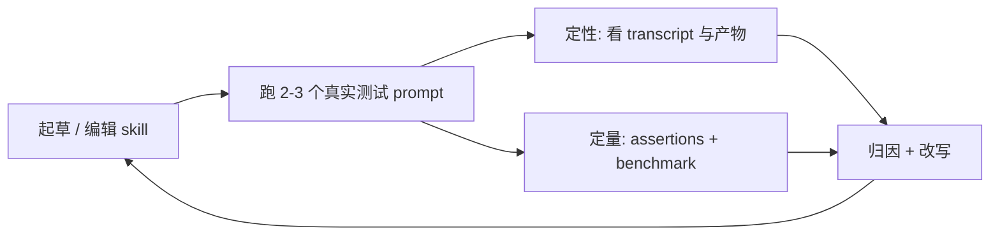

# Skill 编写 SOP

> [!note]
> **Ref:** [anthropics/skills · skill-creator/SKILL.md](https://github.com/anthropics/skills/tree/main/skills/skill-creator)
>
> 本文是对官方 skill-creator 的方法论提炼，不是翻译。目的：未来在本仓库写 skill 时直接按这份 SOP 走，不再依赖 skill-creator 本体。


## 一、Skill 的三层加载模型

Skill 是按需加载的，理解这三层决定了你怎么切分内容：

| 层级 | 内容 | 何时加载 | 体量约束 |
|------|------|----------|----------|
| 1. Metadata | `name` + `description` | 永驻 context | ~100 词 |
| 2. SKILL.md body | 主指令 | 命中触发时 | <500 行 |
| 3. Bundled resources | `references/` `scripts/` `assets/` | 主体明确指引时按需读取 | 不限 |

**推论**：

- SKILL.md 主体超过 500 行就必须拆层级，向下指引到 `references/`。
- 多 domain/framework 变体（如 aws/gcp/azure）按文件切，主体只负责选路。
- 大于 300 行的 reference 文件需自带目录。

目录骨架：

```
skill-name/
├── SKILL.md              必需
├── scripts/              确定性/重复性任务的可执行代码
├── references/           按需加载的文档
└── assets/               输出物用到的模板、字体、图标
```


## 二、Description 的触发学（命门）

`description` 是 Claude 决定是否调用此 skill 的唯一依据，必须同时回答两件事：**做什么** 与 **何时触发**。所有"何时使用"的信息只能放在 description，不能放在正文。

### 关键约束

- **要"推一把"**：Claude 当前倾向 *undertrigger*。description 要带轻微的强制语气，覆盖用户不一定显式说出的场景。
- **同义/邻近覆盖**：列出近义说法、不同表述、典型上下文。
- **Anti-trigger**：写明哪些近邻场景**不**该触发——这是质量分水岭。

### 反例 vs 正例

反例：

```
How to build a simple fast dashboard to display internal Anthropic data.
```

正例：

```
How to build a simple fast dashboard to display internal Anthropic data.
Make sure to use this skill whenever the user mentions dashboards, data
visualization, internal metrics, or wants to display any kind of company
data, even if they don't explicitly ask for a 'dashboard.'
```

### 触发机制的副作用

简单一步任务（如"读这个 PDF"）即使 description 完美匹配也可能不触发——因为 Claude 觉得自己能直接处理。所以**写 eval query 时不要用过于简单的请求**，否则测的不是 description 质量。


## 三、正文写作风格

### 核心原则：解释 Why，少用 MUST

LLM 有 theory of mind。把"为什么这条规则重要"讲清楚，比写一堆全大写 ALWAYS/NEVER 更有效——后者反而会让模型机械跟随、丢失判断力。

发现自己在堆 ALWAYS/NEVER 就是黄灯：停下，改成 reasoning。

### 体裁约束

- 用 **imperative**（祈使句）写指令。
- 输出格式用模板块固定下来：

  ```markdown
  ## Report structure
  ALWAYS use this exact template:
  # [Title]
  ## Executive summary
  ## Key findings
  ## Recommendations
  ```

- 举例用 Input/Output 对照：

  ```markdown
  **Example 1:**
  Input: Added user authentication with JWT tokens
  Output: feat(auth): implement JWT-based authentication
  ```

- 不要把 skill 写得过分贴合具体例子。skill 要被调用百万次，过拟合等于报废。

### 安全底线

不写恶意代码，不写"描述与实际行为不符"的 skill。Roleplay 类可以。


## 四、迭代闭环（高质量 skill 的来源）

写完一稿不是终点，闭环才是。完整循环：



### 测试 prompt 的标准

像真实用户那样说话。包含具体细节：文件路径、列名、公司名、口语化语气、错别字、小写、缩写。**避免抽象请求**——抽象 prompt 测不出任何东西。

### 改进时的四条心法

1. **从反馈中泛化**：用户只能验证你给他看的少数样例，但 skill 要服务无数 prompt。遇到顽固问题，与其加更死的 MUST，不如换 metaphor、换工作模式。
2. **保持 prompt 精简**：读 transcript，不只看产物。如果 skill 让模型走了无用弯路，那段指令就该删。
3. **解释 Why**：见三-1。
4. **抓重复劳动**：如果多个测试里子 agent 都独立写了类似的 `create_docx.py`，把它打包到 `scripts/`，未来调用直接复用。


## 五、Description Optimization（自动化阶段）

skill 主体稳定后再做这一步，否则白调。流程：

1. **生成 20 条 eval query**：8-10 条 should-trigger + 8-10 条 should-NOT-trigger。
2. **should-NOT 必须是近邻陷阱**：与 skill 共享关键词但意图不同。把"写个 Fibonacci"作为 PDF skill 的反例毫无意义。
3. **跑 `scripts/run_loop.py`**：60/40 切 train/test，每条 query 跑 3 次取触发率，迭代 ≤5 轮，按 **test 分数**（非 train）选最佳，避免过拟合。
4. 把 `best_description` 写回 SKILL.md frontmatter。

无 subagent 环境（Claude.ai）跳过此步。


## 六、本仓库的落地约束

把官方 SOP 与本仓库 [[note 写作纪律|feedback_note_writing_style]] 对齐：

| 维度 | 官方默认 | 本仓库覆盖 |
|------|----------|------------|
| 语言 | 英文 | description 可中英混合，正文中文 + 英文术语 |
| 标题 | 自由 | YAML `title:` 用名词不放论点；H1 与 title 一致 |
| 论点 | 自由 | 一个论点说一次，不换姿势重述 |
| 强调 | 用 MUST | 改成 reasoning；保留少量加粗与破折号（≤10 / ≤5） |
| 触发语 | 全英文 pushy 风格 | 同样 pushy，但若 skill 服务中文用户，触发关键词应中英都覆盖 |

### 安装位置

- 全局 skill：`~/.claude/skills/<name>/SKILL.md`
- 项目 skill：`<repo>/.claude/skills/<name>/SKILL.md`

### 自评 checklist

在 PR/提交前对照走一遍：

- [ ] YAML frontmatter 首行无空行
- [ ] description 同时说清"做什么"与"何时触发"
- [ ] description 含至少一组同义触发词
- [ ] description 给出 anti-trigger 场景
- [ ] SKILL.md 主体 < 500 行
- [ ] 关键规则带 Why，不堆 ALWAYS/NEVER
- [ ] 重复脚本已沉到 `scripts/`
- [ ] 大 reference（>300 行）有目录
- [ ] 至少跑过 2-3 个真实测试 prompt（含一条 anti-trigger 验证）


## 七、何时**不**该写 skill

不是所有重复任务都该变成 skill：

- 一次性 workflow → 写到对话即可。
- 高度项目相关、不可复用 → 写到 `CLAUDE.md`。
- 自动化触发（"每次发生 X 就……"）→ 用 hooks（`settings.json`），不是 skill。
- 简单单步操作（"读这个 PDF"）→ Claude 直接处理更快，skill 反而不触发。

判据：能复用、有多步骤、有领域知识沉淀 → skill。否则别造。
