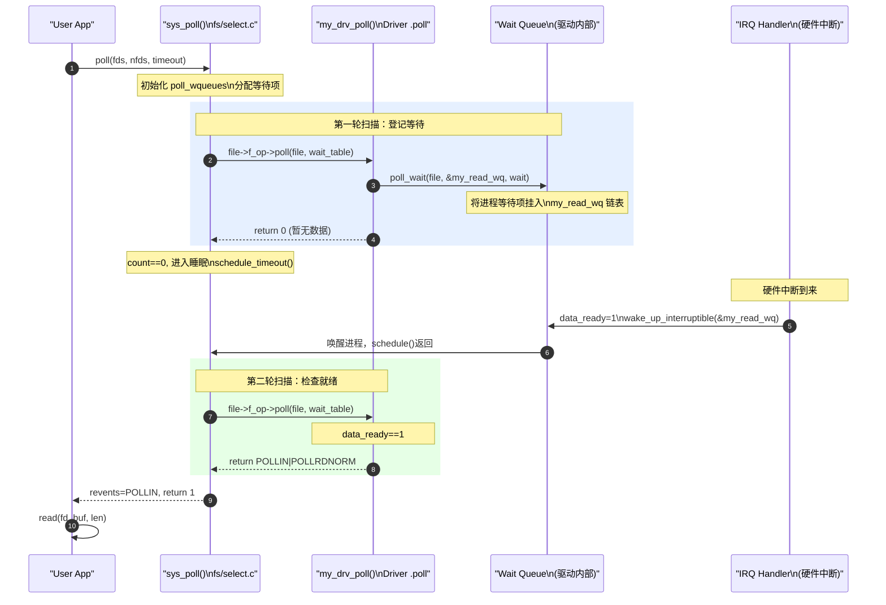
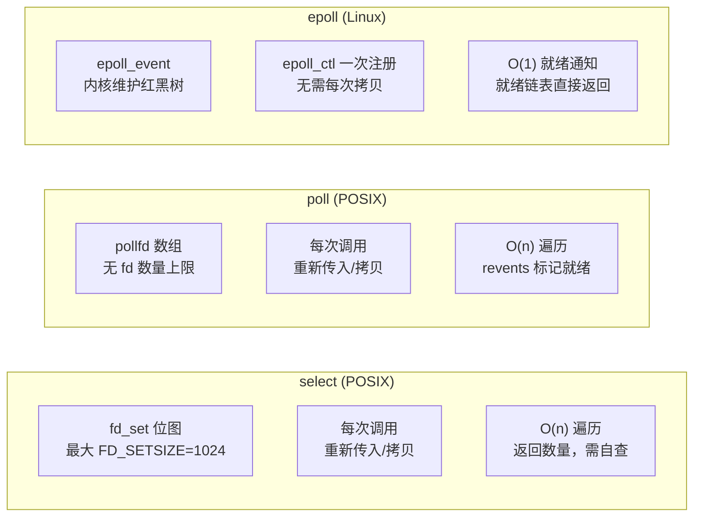

# poll 机制详解：等待队列、驱动实现与内核调度

> [!note]
> **Ref:** [`sdk/Linux-4.9.88/fs/select.c`](/home/pi/imx/sdk/Linux-4.9.88/fs/select.c), [`sdk/Linux-4.9.88/include/linux/poll.h`](/home/pi/imx/sdk/Linux-4.9.88/include/linux/poll.h), [`sdk/Linux-4.9.88/include/linux/wait.h`](/home/pi/imx/sdk/Linux-4.9.88/include/linux/wait.h)

## 1. 问题背景：为什么需要 poll

```c
// 朴素的阻塞读——只能等一个 fd
read(fd_keyboard, buf, 1);   // 阻塞：等待键盘输入
// 此时无法同时监听网络、串口……
```

多路复用的核心需求：**一个线程同时监听多个 fd，任意一个就绪就处理**。

```
select / poll / epoll
       │
       ▼
    哪些 fd 就绪了？  ──→ 处理就绪的 fd
       ▲
       │
    没有就绪  ──→  睡眠，等待唤醒
```

## 2. 内核基础：等待队列（wait queue）

poll 机制的底层是**等待队列**，这是内核进程睡眠/唤醒的通用机制。

### 2.1 数据结构

```c
// include/linux/wait.h

// 等待队列头（驱动持有，代表一个"事件源"）
struct wait_queue_head_t {
    spinlock_t      lock;
    struct list_head task_list;  // 等待该事件的进程链表
};

// 等待队列项（内核 poll 机制动态创建，代表一个等待者）
struct wait_queue_t {
    unsigned int    flags;
    void           *private;     // 指向 task_struct
    wait_queue_func_t func;      // 唤醒回调
    struct list_head task_list;
};
```

### 2.2 驱动中的典型用法

```c
// 驱动全局：定义等待队列头
static DECLARE_WAIT_QUEUE_HEAD(my_read_wq);   // 读等待队列
static DECLARE_WAIT_QUEUE_HEAD(my_write_wq);  // 写等待队列
static int data_ready = 0;   // 条件标志

// 中断处理函数（硬件数据到来）
static irqreturn_t my_irq_handler(int irq, void *dev_id)
{
    data_ready = 1;
    wake_up_interruptible(&my_read_wq);  // 唤醒所有等待读的进程
    return IRQ_HANDLED;
}
```

## 3. 驱动侧 .poll 钩子实现

### 3.1 函数签名

```c
unsigned int my_drv_poll(struct file *file,
                          struct poll_table_struct *wait);
```

### 3.2 标准实现范式

```c
static unsigned int my_drv_poll(struct file *file,
                                 struct poll_table_struct *wait)
{
    unsigned int mask = 0;

    // 步骤 1：登记等待队列（不睡眠！仅注册回调）
    poll_wait(file, &my_read_wq,  wait);
    poll_wait(file, &my_write_wq, wait);

    // 步骤 2：检查当前状态，返回就绪位掩码
    if (data_ready)
        mask |= POLLIN | POLLRDNORM;    // 可读

    if (write_space_available())
        mask |= POLLOUT | POLLWRNORM;   // 可写

    return mask;
}

const struct file_operations my_fops = {
    .poll = my_drv_poll,
    // ...
};
```

**关键认知**：`poll_wait` **不会睡眠**。它只是把当前进程的等待项挂到驱动的等待队列头上。真正的睡眠发生在 `do_poll()` 内核函数里。

### 3.3 返回值位掩码

| 宏 | 值 | 语义 |
|----|-----|------|
| `POLLIN`     | 0x0001 | 有数据可读 |
| `POLLRDNORM` | 0x0040 | 普通数据可读（等同 POLLIN） |
| `POLLOUT`    | 0x0004 | 可以写入 |
| `POLLWRNORM` | 0x0100 | 普通数据可写（等同 POLLOUT） |
| `POLLERR`    | 0x0008 | 发生错误（无法被屏蔽） |
| `POLLHUP`    | 0x0010 | 挂断（对端关闭） |
| `POLLPRI`    | 0x0002 | 高优先级数据（带外数据） |

## 4. 内核 poll 调用全景

### 4.1 do_poll 核心逻辑（简化）

```c
// fs/select.c (简化示意)
static int do_poll(unsigned int nfds, struct poll_list *list,
                   struct poll_wqueues *wait, struct timespec *end_time)
{
    int count = 0;

    for (;;) {
        struct poll_list *walk;

        // 第一轮：遍历所有 fd，调用驱动 .poll，登记等待队列
        for (walk = list; walk != NULL; walk = walk->next) {
            int i;
            for (i = 0; i < walk->len; i++) {
                struct pollfd *pfd = &walk->entries[i];
                // 调用驱动 .poll，同时完成等待队列登记
                unsigned int mask = do_pollfd(pfd, wait);
                if (mask) count++;
            }
        }

        if (count || !*timeout || signal_pending(current))
            break;

        // 没有就绪：挂起当前进程，等待唤醒
        count = wait->error;
        if (wait->triggered)  // 被唤醒
            break;

        schedule_timeout(timeout);  // 睡眠，超时或唤醒后继续
    }
    return count;
}
```

### 4.2 完整调用时序



## 5. select / poll / epoll 对比



| 特性 | select | poll | epoll |
|------|--------|------|-------|
| fd 数量限制 | 1024 (FD_SETSIZE) | 无 | 无 |
| 内核遍历复杂度 | O(n) | O(n) | O(1) |
| 用户→内核数据拷贝 | 每次调用 | 每次调用 | 注册一次 |
| 就绪事件获取 | 用户遍历 fd_set | 用户遍历 revents | 内核直接返回就绪列表 |
| 适用场景 | 少量 fd，可移植 | 少量 fd，无 fd 上限需求 | 大量 fd，高并发服务器 |

## 6. 驱动 .poll 与 .read 的协作

```c
// 阻塞读的等价实现（驱动视角）
static ssize_t my_drv_read(struct file *file,
                            char __user *buf,
                            size_t len, loff_t *off)
{
    // 等价于 poll 机制中的"睡眠"部分
    if (!(file->f_flags & O_NONBLOCK)) {
        // 阻塞模式：条件不满足则睡眠
        wait_event_interruptible(my_read_wq, data_ready != 0);
    } else {
        // 非阻塞模式：立即返回 -EAGAIN
        if (!data_ready)
            return -EAGAIN;
    }

    // 读取数据
    copy_to_user(buf, kernel_buf, len);
    data_ready = 0;   // 清除标志
    return len;
}
```

**联系**：`wait_event_interruptible` 内部也使用等待队列。poll 机制是将这个"等待"逻辑从 read 中**抽象分离**出来，使一个进程可以同时等待多个设备。

## 7. epoll 驱动视角

epoll 对驱动侧**无额外要求**——只要实现了 `.poll` 钩子，epoll 就能工作。epoll 的魔法全部在内核 `eventpoll.c` 里：

```
epoll_ctl(epfd, EPOLL_CTL_ADD, fd, &event)
  │
  ▼
ep_insert()
  │  调用 file->f_op->poll() 登记 ep_ptable 到驱动等待队列
  ▼
驱动等待队列 → 唤醒回调 → ep_poll_callback()
  │
  ▼
将就绪 fd 放入 epoll 就绪链表 → 唤醒 epoll_wait()
```

**核心**：epoll 用自定义的回调函数 `ep_poll_callback` 替换了 poll 的通用等待项，实现 O(1) 的就绪通知。
