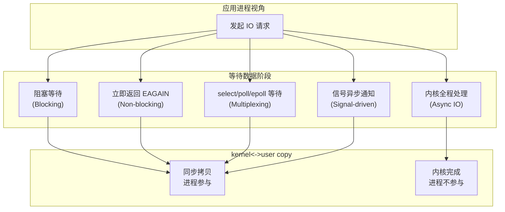
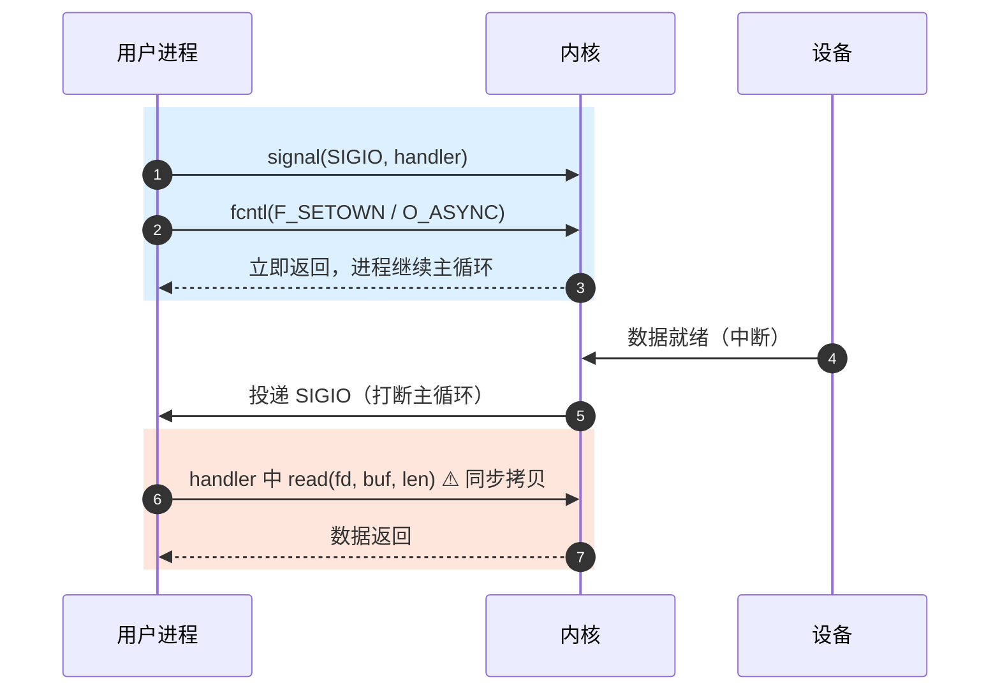
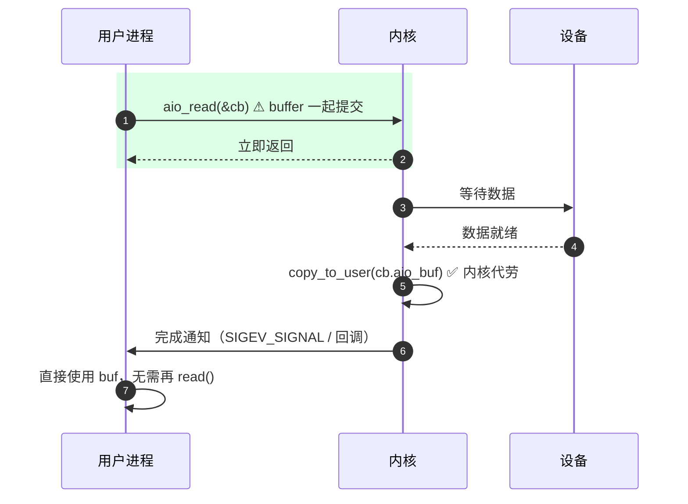
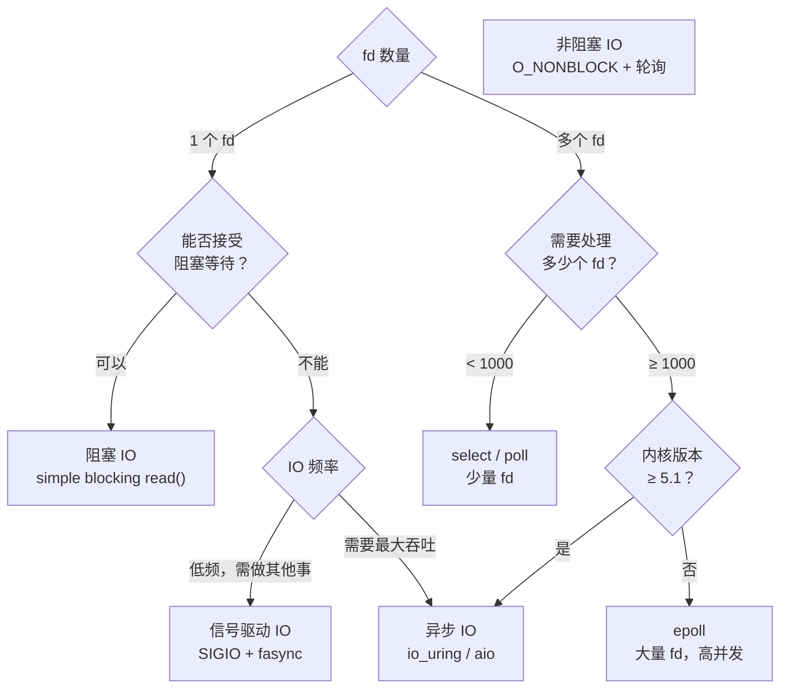

# IO 范式总览：阻塞、非阻塞、多路复用、信号驱动、异步IO

> [!note]
> **Ref:** [`note/SysCall/IO/03-poll机制详解.md`](./03-poll机制详解.md), [`sdk/Linux-4.9.88/fs/select.c`](/home/pi/imx/sdk/Linux-4.9.88/fs/select.c), APUE 第 14 章, UNP 第 6 章

## 1. 五种范式全景对比



| 范式 | 等待数据 | 拷贝数据 | 同步/异步 | 阻塞/非阻塞 |
|------|---------|---------|---------|------------|
| 阻塞 IO | 进程挂起 | 进程参与 | 同步 | 阻塞 |
| 非阻塞 IO | 轮询返回 | 进程参与 | 同步 | 非阻塞 |
| IO 多路复用 | select 挂起 | 进程参与 | 同步 | 阻塞（在 select） |
| 信号驱动 IO | 信号异步通知 | 进程参与 | 同步（拷贝时）| 非阻塞 |
| 异步 IO (AIO) | 内核全程处理 | 内核完成 | 异步 | 非阻塞 |

## 2. 阻塞 IO（Blocking IO）

### 原理

进程调用 `read()`，若数据未就绪，**进程状态变为 `TASK_INTERRUPTIBLE`**，从运行队列移出，直到数据就绪后被唤醒。

```
App                        Kernel                   Device
 │                            │                        │
 ├─── read(fd) ──────────────►│                        │
 │                            ├──── 等待数据 ──────────►│
 │         (进程睡眠)          │                        │
 │                            │◄──── 数据就绪 ──────────┤
 │                            ├──── copy_to_user ──────►│
 │◄─── 返回数据 ───────────────┤                        │
```

### 驱动实现

```c
static ssize_t my_drv_read(struct file *file,
                            char __user *buf,
                            size_t len, loff_t *off)
{
    // wait_event_interruptible：原子地检查条件 + 可被信号中断的睡眠
    if (wait_event_interruptible(my_read_wq, data_ready != 0))
        return -ERESTARTSYS;  // 被信号中断，glibc 会重启 syscall

    copy_to_user(buf, kernel_buf, len);
    data_ready = 0;
    return len;
}
```

### 优缺点

| 优点 | 缺点 |
|------|------|
| 编程模型简单 | 一个线程只能等一个 fd |
| CPU 不空转（进程睡眠） | 多 fd 需要多线程，开销大 |

---

## 3. 非阻塞 IO（Non-blocking IO）

### 原理

通过 `O_NONBLOCK` 标志，告知驱动：**无数据时立即返回 `-EAGAIN`**，不挂起进程。

```
App: 循环轮询
 │
 ├─ read(fd) ──► EAGAIN  (无数据)
 ├─ read(fd) ──► EAGAIN
 ├─ read(fd) ──► EAGAIN
 ├─ read(fd) ──► 返回数据  (数据就绪)
```

### 用法

```c
// 设置非阻塞
int fd = open("/dev/my_drv", O_RDWR | O_NONBLOCK);
// 或运行时修改
int flags = fcntl(fd, F_GETFL);
fcntl(fd, F_SETFL, flags | O_NONBLOCK);

// 轮询
while (1) {
    ssize_t n = read(fd, buf, sizeof(buf));
    if (n > 0) {
        process(buf, n);
        break;
    }
    if (n < 0 && errno == EAGAIN) {
        // 数据未就绪，可以做其他事情
        do_other_work();
        continue;
    }
    // 其他错误
    perror("read");
    break;
}
```

### 驱动实现

```c
static ssize_t my_drv_read(struct file *file,
                            char __user *buf,
                            size_t len, loff_t *off)
{
    if (!data_ready) {
        if (file->f_flags & O_NONBLOCK)
            return -EAGAIN;          // 非阻塞：立即返回
        // 阻塞模式：睡眠等待
        wait_event_interruptible(my_read_wq, data_ready != 0);
    }
    copy_to_user(buf, kernel_buf, len);
    data_ready = 0;
    return len;
}
```

### 优缺点

| 优点 | 缺点 |
|------|------|
| 单线程可处理多任务 | CPU 空转（忙等），浪费资源 |
| 无线程切换开销 | 实时性差（轮询间隔） |

---

## 4. IO 多路复用（IO Multiplexing）

### 原理

用 `select`/`poll`/`epoll` 同时监听多个 fd，任意一个就绪后，进程才醒来并 read。

**本质**：将"等待"从 read 里剥离出来，交给专门的等待机制。

### select 用法

```c
fd_set rfds;
struct timeval tv = { .tv_sec = 5, .tv_usec = 0 };

FD_ZERO(&rfds);
FD_SET(fd1, &rfds);
FD_SET(fd2, &rfds);

int ret = select(max(fd1, fd2) + 1, &rfds, NULL, NULL, &tv);
if (ret > 0) {
    if (FD_ISSET(fd1, &rfds)) read(fd1, buf, sizeof(buf));
    if (FD_ISSET(fd2, &rfds)) read(fd2, buf, sizeof(buf));
}
```

### poll 用法

```c
struct pollfd fds[2] = {
    { .fd = fd1, .events = POLLIN },
    { .fd = fd2, .events = POLLIN | POLLOUT },
};

int ret = poll(fds, 2, 5000 /* ms */);
if (ret > 0) {
    if (fds[0].revents & POLLIN)  read(fd1, buf, sizeof(buf));
    if (fds[1].revents & POLLOUT) write(fd2, data, sizeof(data));
}
```

### epoll 用法（高并发推荐）

```c
int epfd = epoll_create1(0);

struct epoll_event ev = { .events = EPOLLIN, .data.fd = fd1 };
epoll_ctl(epfd, EPOLL_CTL_ADD, fd1, &ev);

ev.data.fd = fd2;
epoll_ctl(epfd, EPOLL_CTL_ADD, fd2, &ev);

struct epoll_event events[10];
int n = epoll_wait(epfd, events, 10, 5000);
for (int i = 0; i < n; i++) {
    if (events[i].events & EPOLLIN)
        read(events[i].data.fd, buf, sizeof(buf));
}
```

### 驱动配合

多路复用**需要驱动实现 `.poll` 钩子**（参见 `03-poll机制详解.md`）：

```c
const struct file_operations my_fops = {
    .read = my_drv_read,
    .poll = my_drv_poll,   // ← 必须实现
    // ...
};
```

---

## 5. 信号驱动 IO（Signal-driven IO / SIGIO）

> [!important] 一句话定位
> **只把"等待"异步化，"拷贝"仍由进程自己做。**
> 内核充当"门铃"——数据到了按一下铃（SIGIO），进程被打断后**自己再调用 `read()`** 把数据搬回用户空间。
>
> 对照下一节的 AIO：AIO 是"快递上门"，连搬运都由内核完成。

### 原理

进程预先订阅 `SIGIO`，然后立即返回主循环干别的事；当 fd 就绪时，**内核主动发送 `SIGIO`** 打断进程，进程在信号处理函数中调用 `read()` 取数据。



> 注意 step 7：`read()` 仍是**进程自己**发起的同步系统调用，`copy_to_user` 发生在进程上下文里。这正是它和 AIO 的分水岭。

### 用法

```c
#include <signal.h>
#include <fcntl.h>

static int sigio_fd;

void sigio_handler(int signum)
{
    char buf[128];
    ssize_t n = read(sigio_fd, buf, sizeof(buf));
    if (n > 0)
        printf("got data: %.*s\n", (int)n, buf);
}

int main(void)
{
    sigio_fd = open("/dev/my_drv", O_RDWR);

    // 1. 注册信号处理函数
    signal(SIGIO, sigio_handler);

    // 2. 将 fd 的属主设为当前进程（或进程组）
    fcntl(sigio_fd, F_SETOWN, getpid());

    // 3. 使能异步通知（O_ASYNC）
    int flags = fcntl(sigio_fd, F_GETFL);
    fcntl(sigio_fd, F_SETFL, flags | O_ASYNC);

    // 主循环可以做其他事
    while (1) {
        do_main_work();
        pause();   // 等待信号
    }
}
```

### 驱动侧配合：fasync

```c
#include <linux/fs.h>

static struct fasync_struct *my_async_queue;

// 1. 实现 .fasync 钩子（内核调用以维护 fasync 链表）
static int my_drv_fasync(int fd, struct file *file, int on)
{
    return fasync_helper(fd, file, on, &my_async_queue);
}

// 2. 数据就绪时（如中断中）发送信号
static irqreturn_t my_irq_handler(int irq, void *dev)
{
    data_ready = 1;
    // 向所有注册了 O_ASYNC 的进程发送 SIGIO
    kill_fasync(&my_async_queue, SIGIO, POLL_IN);
    wake_up_interruptible(&my_read_wq);   // 同时唤醒 poll/阻塞读
    return IRQ_HANDLED;
}

// 3. release 时清理
static int my_drv_release(struct inode *inode, struct file *file)
{
    my_drv_fasync(-1, file, 0);   // 从 fasync 链表移除
    return 0;
}

const struct file_operations my_fops = {
    .fasync  = my_drv_fasync,
    .release = my_drv_release,
    // ...
};
```

### 三个易混点

1. **它不是"异步 IO"。** 教科书把它归为"同步非阻塞" —— 等待异步、拷贝同步。
2. **`O_ASYNC` 名字有误导性。** 这个 flag 只是"开启 SIGIO 通知"，跟 POSIX AIO 完全是两套机制。
3. **SIGIO 不携带 fd 信息。** 多个 fd 同时设置 `O_ASYNC` 时，handler 里无法直接知道是谁就绪——解决方案是用 `fcntl(F_SETSIG, SIGRTMIN+n)` 换成实时信号，配合 `siginfo_t.si_fd`。

### 优缺点

| 优点 | 缺点 |
|------|------|
| 主循环不被等待阻塞 | handler 内只能调 async-signal-safe 函数 |
| 无轮询，低 CPU 占用 | 默认 SIGIO 不可区分来源 |
| 适合低频、事件型设备（按键、GPIO 中断） | 高频事件下信号会合并丢失 |

---

## 6. 异步 IO（Asynchronous IO / AIO）

> [!important] 一句话定位
> **等待 + 拷贝全部由内核完成。** 进程提交时就把目标 buffer 一并交给内核；收到完成通知时，数据已经躺在 buffer 里了，**无需再调 `read()`**。

### 与 SIGIO 的关键差异

| 维度 | 信号驱动 IO | 异步 IO |
|---|---|---|
| 提交时是否交出 buffer | ❌ 只订阅通知 | ✅ `aiocb.aio_buf` 一起提交 |
| 数据拷贝由谁做 | 进程在 handler 里 `read()` | 内核在后台完成 |
| 通知含义 | "数据就绪，请来取" | "已交付，可直接使用" |
| 同步/异步分类 | 同步非阻塞 | **真正异步** |
| 类比 | 驿站取件短信 | 上门送货+鞋柜 |

### 原理



### POSIX AIO 用法

```c
#include <aio.h>

struct aiocb cb = {
    .aio_fildes = fd,
    .aio_buf    = buf,
    .aio_nbytes = sizeof(buf),
    .aio_offset = 0,
    .aio_sigevent = {
        .sigev_notify = SIGEV_SIGNAL,
        .sigev_signo  = SIGIO,
    },
};

aio_read(&cb);   // 非阻塞，立即返回

// ... 做其他事 ...

// 检查完成（或在信号处理函数中）
while (aio_error(&cb) == EINPROGRESS)
    ;   // 实际应用中用信号，不要忙等

ssize_t n = aio_return(&cb);
printf("read %zd bytes\n", n);
```

> POSIX AIO 在 glibc 实现中其实是用**用户态线程池**模拟的，性能一般。Linux 真正原生的内核级异步 IO 是 `io_uring`。

### Linux io_uring（现代异步 IO）

`io_uring`（Linux 5.1+）是更高效的异步 IO 接口，通过共享内存环形队列实现**零系统调用提交**：

```c
// 伪代码示意
struct io_uring ring;
io_uring_queue_init(32, &ring, 0);

struct io_uring_sqe *sqe = io_uring_get_sqe(&ring);
io_uring_prep_read(sqe, fd, buf, sizeof(buf), 0);
io_uring_submit(&ring);

struct io_uring_cqe *cqe;
io_uring_wait_cqe(&ring, &cqe);   // 等待完成
printf("result: %d\n", cqe->res);
io_uring_cqe_seen(&ring, cqe);
```

---

## 7. 范式选型决策树



## 8. 嵌入式驱动开发总结

| 应用场景 | 推荐范式 | 驱动需实现 |
|---------|---------|-----------|
| 简单传感器读取 | 阻塞 IO | `.read` + `wait_event` |
| 键盘/按键输入 | 阻塞 IO 或 信号驱动 | `.read` + `.fasync` |
| 多路串口数据采集 | IO 多路复用 (poll) | `.read` + `.poll` |
| 高速数据流 + UI 响应 | 非阻塞 + epoll | `.read` + `.poll` |
| 实时控制（低延迟通知） | 信号驱动 | `.fasync` + `kill_fasync` |
| 大块 DMA 传输 | 异步 IO (io_uring) | 需支持 `aio_read` / `read_iter` |

### 驱动最小化支持矩阵

```
阻塞读/写        ← 必须：.read + .write + wait_event
非阻塞支持       ← 需要：检查 file->f_flags & O_NONBLOCK
多路复用支持     ← 需要：.poll + poll_wait
信号驱动支持     ← 需要：.fasync + kill_fasync
控制命令         ← 需要：.unlocked_ioctl
```
