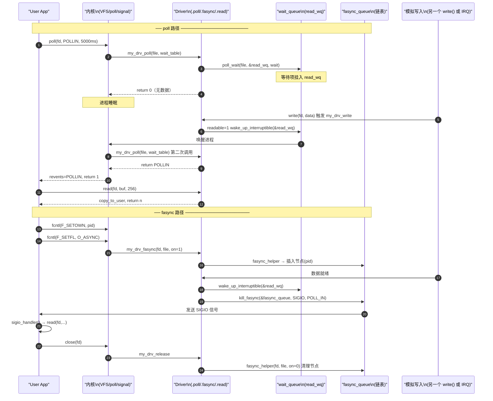

# 进阶 fops 实现：poll 与 fasync 驱动开发完全指南

> [!note]
> **Ref:** [`sdk/100ask_imx6ull-sdk/Linux-4.9.88/fs/pipe.c:517`](/home/pi/imx/sdk/100ask_imx6ull-sdk/Linux-4.9.88/fs/pipe.c), [`note/SysCall/IO/03-poll机制详解.md`](./03-poll机制详解.md), [`note/SysCall/IO/04-IO范式总览.md`](./04-IO范式总览.md), [`prj/01_hello_drv/src/driver_fops.c`](/home/pi/imx/prj/01_hello_drv/src/driver_fops.c)

## 0. 全景预览：两个 fops 钩子的职责

```
.poll   ─── 支持 select / poll / epoll 多路复用
              ↑ 用户调用 poll()/select()/epoll_wait() 时内核主动回调

.fasync ─── 支持 O_ASYNC 信号驱动 IO（SIGIO 通知）
              ↑ 用户执行 fcntl(F_SETFL, O_ASYNC) 时内核回调（注册/注销）
              ↑ 硬件事件发生时驱动主动调用 kill_fasync() 发信号
```

两者都**依赖等待队列（wait_queue）** 作为底层事件同步机制，可以同时实现，互不冲突。

---

## 1. 等待队列：驱动侧基础设施

在实现任何进阶 fops 之前，驱动必须先建立等待队列和事件标志。

### 1.1 核心 API

| API | 作用 | 头文件 |
|-----|------|--------|
| `DECLARE_WAIT_QUEUE_HEAD(name)` | 静态定义等待队列头 | `<linux/wait.h>` |
| `init_waitqueue_head(&wq)` | 动态初始化 | `<linux/wait.h>` |
| `wait_event_interruptible(wq, cond)` | 阻塞等待条件成立（可被信号打断） | `<linux/wait.h>` |
| `wake_up_interruptible(&wq)` | 唤醒等待队列上的进程 | `<linux/wait.h>` |
| `poll_wait(file, &wq, pt)` | 将等待队列注册到 poll_table（不睡眠） | `<linux/poll.h>` |

### 1.2 驱动骨架：全局状态

```c
#include <linux/wait.h>
#include <linux/poll.h>
#include <linux/fs.h>
#include <linux/uaccess.h>
#include <linux/sched.h>

#define BUF_SIZE 256

static char           kbuf[BUF_SIZE];
static int            buf_len  = 0;   /* 当前有效数据长度 */
static int            readable = 0;   /* 数据就绪标志（读）*/
static int            writable = 1;   /* 写缓冲区可用标志 */

/* 读/写分开两个等待队列，精确唤醒对应方向的等待者 */
static DECLARE_WAIT_QUEUE_HEAD(read_wq);
static DECLARE_WAIT_QUEUE_HEAD(write_wq);

/* fasync 链表头：记录所有注册了 O_ASYNC 的文件描述符 */
static struct fasync_struct *fasync_queue;
```

**为什么读写分开两个 wq？**
- `wake_up_interruptible(&read_wq)` 只唤醒等待可读的进程；
- `wake_up_interruptible(&write_wq)` 只唤醒等待可写的进程；
- 混用单个队列会导致无效唤醒（thundering herd）。

---

## 2. `.poll` 实现

### 2.1 函数签名

```c
static unsigned int my_drv_poll(struct file *file,
                                 poll_table  *wait);
```

`poll_table *wait` 是内核传入的"等待表"，**不是 `struct pollfd`**，而是一个用于挂载等待项的内核内部结构。

### 2.2 实现规则（两步固定范式）

```c
static unsigned int my_drv_poll(struct file *file, poll_table *wait)
{
    unsigned int mask = 0;

    /* ── 步骤 1：登记等待队列 ──────────────────────────────────── */
    /* poll_wait 不睡眠！仅把本进程挂到队列上，等唤醒时再次调用 poll */
    poll_wait(file, &read_wq,  wait);
    poll_wait(file, &write_wq, wait);

    /* ── 步骤 2：原子地检查当前状态，返回就绪位掩码 ────────────── */
    if (readable)
        mask |= POLLIN  | POLLRDNORM;   /* 有数据可读 */

    if (writable)
        mask |= POLLOUT | POLLWRNORM;   /* 缓冲区可写 */

    return mask;
    /* 返回 0 表示当前无就绪事件，内核将进程挂起 */
}
```

### 2.3 `poll_wait` 的真实语义

```
第一次调用 .poll（注册阶段）:
  wait != NULL
  poll_wait() → 将进程等待项挂入 read_wq/write_wq
  返回 mask（此时通常为 0，无数据）
  → 内核: 进程睡眠

硬件中断 → wake_up_interruptible(&read_wq)
  → 内核: 进程被唤醒

第二次调用 .poll（检查阶段）:
  wait != NULL（或 NULL，取决于实现）
  poll_wait() → 空操作（已注册过）
  返回 mask = POLLIN  ← 有数据了
  → 内核: 将结果返回给用户态
```

**关键陷阱**：`.poll` 会被内核调用**两次以上**，必须保证函数是**无副作用的只读检查**，不能在里面修改 `readable` 等状态。

### 2.4 与 read/write 的协作

当 `.poll` 标记可读后，用户态会调用 `read()`，驱动的 `.read` 必须相应清除 `readable`：

```c
static ssize_t my_drv_read(struct file *file,
                            char __user *buf,
                            size_t len, loff_t *off)
{
    ssize_t ret;

    /* 阻塞模式：等到有数据 */
    if (!(file->f_flags & O_NONBLOCK)) {
        ret = wait_event_interruptible(read_wq, readable != 0);
        if (ret)
            return -ERESTARTSYS;
    } else {
        if (!readable)
            return -EAGAIN;
    }

    /* 拷贝数据到用户空间 */
    len = min_t(size_t, len, buf_len);
    if (copy_to_user(buf, kbuf, len))
        return -EFAULT;

    /* ── 消费数据，更新状态 ── */
    readable  = 0;
    writable  = 1;
    buf_len   = 0;

    /* 唤醒等待写的进程（缓冲区空了）*/
    wake_up_interruptible(&write_wq);

    /* 通知 fasync 注册者：现在可写了 */
    kill_fasync(&fasync_queue, SIGIO, POLL_OUT);

    return len;
}
```

---

## 3. `.fasync` 实现

### 3.1 fasync 机制的完整生命周期

```
用户: fcntl(fd, F_SETFL, flags | O_ASYNC)
          │
          ▼
内核: vfs_fnctl() → file->f_op->fasync(fd, file, 1)   ← on=1：注册
          │
          ▼
驱动: fasync_helper(fd, file, 1, &fasync_queue)
      → 在 fasync_queue 链表中插入新节点（pid + file）

─────────────────────────────────────────

硬件事件 → 驱动中断处理函数
          │
          ▼
kill_fasync(&fasync_queue, SIGIO, POLL_IN)
          │
          ▼
内核: 向 fasync_queue 中每个注册进程发送 SIGIO

─────────────────────────────────────────

用户: close(fd)  或  fcntl(F_SETFL, flags & ~O_ASYNC)
          │
          ▼
内核: file->f_op->fasync(fd, file, 0)                  ← on=0：注销
          │
          ▼
驱动: fasync_helper(fd, file, 0, &fasync_queue)
      → 从链表中删除对应节点
```

### 3.2 实现规则（一行完成，不要多写）

```c
static int my_drv_fasync(int fd, struct file *file, int on)
{
    /*
     * fasync_helper 完成所有工作：
     *   on=1 → 申请 fasync_struct 节点，插入 fasync_queue 链表
     *   on=0 → 从链表删除并释放节点
     *
     * 返回值：
     *   >0  链表发生变化（新增或删除）
     *   =0  无变化
     *   <0  错误（如 -ENOMEM）
     */
    return fasync_helper(fd, file, on, &fasync_queue);
}
```

**禁止**在 `.fasync` 里做业务逻辑。它只是链表的维护接口。

### 3.3 `.release` 中必须清理

```c
static int my_drv_release(struct inode *inode, struct file *file)
{
    /* 文件关闭时，将此 fd 从 fasync 链表摘除，防止野指针 */
    my_drv_fasync(-1, file, 0);
    return 0;
}
```

这是**最常见的 bug 来源**：忘记在 release 中清理，导致进程退出后 `fasync_queue` 中残留悬空指针，后续 `kill_fasync` 时内核 crash。

### 3.4 事件触发：在中断中发送信号

```c
/* 通常在硬件中断处理函数、定时器回调、或其他内核线程中调用 */
static irqreturn_t my_irq_handler(int irq, void *dev_id)
{
    /* 1. 更新状态 */
    buf_len  = fill_data_from_hw(kbuf, BUF_SIZE);
    readable = 1;
    writable = 0;

    /* 2. 唤醒 poll/阻塞读 等待的进程 */
    wake_up_interruptible(&read_wq);

    /* 3. 向 fasync 注册者发送信号
     *    SIGIO  = 信号类型（标准信号，可用 SIGRTMIN+n 实现实时信号）
     *    POLL_IN = 信号原因码（传入 si_band，用于 SA_SIGINFO 处理函数）
     */
    kill_fasync(&fasync_queue, SIGIO, POLL_IN);

    return IRQ_HANDLED;
}
```

`kill_fasync` 的第三个参数 `band`：

| 常量 | 值 | 含义 |
|------|----|------|
| `POLL_IN`  | 1 | 数据可读 |
| `POLL_OUT` | 2 | 数据可写 |
| `POLL_ERR` | 4 | 发生错误 |
| `POLL_HUP` | 6 | 连接断开 |

---

## 4. 完整驱动示例

将以上所有部分整合成一个完整的字符驱动，支持阻塞、非阻塞、poll 多路复用、SIGIO 信号驱动四种 IO 范式：

```c
/* my_drv.c — 完整示例驱动（支持 poll + fasync）*/
#include <linux/module.h>
#include <linux/fs.h>
#include <linux/cdev.h>
#include <linux/device.h>
#include <linux/uaccess.h>
#include <linux/wait.h>
#include <linux/poll.h>
#include <linux/sched.h>
#include <linux/slab.h>

/* ── 设备状态 ─────────────────────────────────────────────── */
#define BUF_SIZE  256
#define DRV_NAME  "my_drv"
#define DRV_CLASS "my_class"

static char  kbuf[BUF_SIZE];
static int   buf_len  = 0;
static int   readable = 0;
static int   writable = 1;

static DECLARE_WAIT_QUEUE_HEAD(read_wq);
static DECLARE_WAIT_QUEUE_HEAD(write_wq);
static struct fasync_struct *fasync_queue;

/* ── 设备注册变量 ──────────────────────────────────────────── */
static dev_t         devno;
static struct cdev   my_cdev;
static struct class *my_class;

/* ── fops 实现 ────────────────────────────────────────────── */

static int my_drv_open(struct inode *inode, struct file *file)
{
    return 0;
}

static int my_drv_release(struct inode *inode, struct file *file)
{
    my_drv_fasync(-1, file, 0);   /* ← 必须：清理 fasync 链表 */
    return 0;
}

static ssize_t my_drv_read(struct file *file,
                            char __user *buf,
                            size_t len, loff_t *off)
{
    int ret;

    if (!(file->f_flags & O_NONBLOCK)) {
        ret = wait_event_interruptible(read_wq, readable != 0);
        if (ret)
            return -ERESTARTSYS;
    } else {
        if (!readable)
            return -EAGAIN;
    }

    len = min_t(size_t, len, (size_t)buf_len);
    if (copy_to_user(buf, kbuf, len))
        return -EFAULT;

    readable = 0;
    writable = 1;
    buf_len  = 0;

    wake_up_interruptible(&write_wq);
    kill_fasync(&fasync_queue, SIGIO, POLL_OUT);   /* 通知可写 */

    return (ssize_t)len;
}

static ssize_t my_drv_write(struct file *file,
                             const char __user *buf,
                             size_t len, loff_t *off)
{
    int ret;

    if (!(file->f_flags & O_NONBLOCK)) {
        ret = wait_event_interruptible(write_wq, writable != 0);
        if (ret)
            return -ERESTARTSYS;
    } else {
        if (!writable)
            return -EAGAIN;
    }

    len = min_t(size_t, len, (size_t)BUF_SIZE);
    if (copy_from_user(kbuf, buf, len))
        return -EFAULT;

    buf_len  = (int)len;
    readable = 1;
    writable = 0;

    wake_up_interruptible(&read_wq);
    kill_fasync(&fasync_queue, SIGIO, POLL_IN);    /* 通知可读 */

    return (ssize_t)len;
}

static unsigned int my_drv_poll(struct file *file, poll_table *wait)
{
    unsigned int mask = 0;

    poll_wait(file, &read_wq,  wait);   /* 步骤1：注册，不睡眠 */
    poll_wait(file, &write_wq, wait);

    if (readable)                        /* 步骤2：无副作用检查 */
        mask |= POLLIN  | POLLRDNORM;
    if (writable)
        mask |= POLLOUT | POLLWRNORM;

    return mask;
}

static int my_drv_fasync(int fd, struct file *file, int on)
{
    return fasync_helper(fd, file, on, &fasync_queue);
}

static const struct file_operations my_fops = {
    .owner          = THIS_MODULE,
    .open           = my_drv_open,
    .release        = my_drv_release,
    .read           = my_drv_read,
    .write          = my_drv_write,
    .poll           = my_drv_poll,
    .fasync         = my_drv_fasync,
};

/* ── 模块初始化 ───────────────────────────────────────────── */

static int __init my_drv_init(void)
{
    int ret;

    ret = alloc_chrdev_region(&devno, 0, 1, DRV_NAME);
    if (ret < 0) return ret;

    cdev_init(&my_cdev, &my_fops);
    ret = cdev_add(&my_cdev, devno, 1);
    if (ret) goto err_cdev;

    my_class = class_create(THIS_MODULE, DRV_CLASS);
    if (IS_ERR(my_class)) { ret = PTR_ERR(my_class); goto err_class; }

    device_create(my_class, NULL, devno, NULL, DRV_NAME);
    printk(KERN_INFO DRV_NAME ": loaded, major=%d\n", MAJOR(devno));
    return 0;

err_class: cdev_del(&my_cdev);
err_cdev:  unregister_chrdev_region(devno, 1);
    return ret;
}

static void __exit my_drv_exit(void)
{
    device_destroy(my_class, devno);
    class_destroy(my_class);
    cdev_del(&my_cdev);
    unregister_chrdev_region(devno, 1);
}

module_init(my_drv_init);
module_exit(my_drv_exit);
MODULE_LICENSE("GPL");
```

---

## 5. 用户态验证程序

### 5.1 poll 验证

```c
/* test_poll.c */
#include <poll.h>
#include <fcntl.h>
#include <stdio.h>
#include <unistd.h>

int main(void)
{
    int fd = open("/dev/my_drv", O_RDWR);
    char buf[256];

    struct pollfd pfd = { .fd = fd, .events = POLLIN };

    printf("等待数据...\n");
    int ret = poll(&pfd, 1, 5000);   /* 5s 超时 */

    if (ret > 0 && (pfd.revents & POLLIN)) {
        int n = read(fd, buf, sizeof(buf));
        printf("读到 %d 字节: %.*s\n", n, n, buf);
    } else if (ret == 0) {
        printf("超时\n");
    }
    close(fd);
}
```

### 5.2 fasync 验证

```c
/* test_fasync.c */
#include <signal.h>
#include <fcntl.h>
#include <stdio.h>
#include <unistd.h>

static int g_fd;

void sigio_handler(int sig)
{
    char buf[256];
    int n = read(g_fd, buf, sizeof(buf));
    if (n > 0)
        printf("[SIGIO] 收到 %d 字节: %.*s\n", n, n, buf);
}

int main(void)
{
    g_fd = open("/dev/my_drv", O_RDWR);

    signal(SIGIO, sigio_handler);

    /* 设置属主：内核向此 pid 发信号 */
    fcntl(g_fd, F_SETOWN, getpid());

    /* 使能 O_ASYNC，触发驱动 .fasync(on=1) */
    int flags = fcntl(g_fd, F_GETFL);
    fcntl(g_fd, F_SETFL, flags | O_ASYNC);

    printf("等待 SIGIO 信号...\n");
    while (1)
        pause();   /* 睡眠，被信号打断后自动返回并继续 */
}
```

---

## 6. 完整交互时序图



---

## 7. 常见陷阱与规范

| 陷阱 | 错误做法 | 正确做法 |
|------|---------|---------|
| poll 有副作用 | 在 `.poll` 里清 `readable=0` | `.poll` 只读状态，不修改，消费在 `.read` 里 |
| fasync 不清理 | release 里忘记 `fasync_helper(-1, file, 0)` | release 必须调用，防止野指针 crash |
| 单个等待队列 | 读写共用一个 `wq` | 读写分开 `read_wq` / `write_wq`，精准唤醒 |
| 忘记 ERESTARTSYS | 被信号打断后返回 0 或 -EINTR | 返回 `-ERESTARTSYS`，glibc 会自动重启 syscall |
| kill_fasync 时机 | 在 spinlock 持有期间调用 | `kill_fasync` 内部有自己的锁，可在中断上下文调用，但**不能**在持锁期间调用 |
| poll_wait 漏掉队列 | 只注册 read_wq，遗漏 write_wq | 把驱动所有方向的 wq 都传给 `poll_wait` |

## 8. 驱动能力矩阵

```
fops 钩子              支持的用户态能力
─────────────────────────────────────────────────────
.read  + wait_event    阻塞读
.read  + O_NONBLOCK    非阻塞读（-EAGAIN）
.poll  + poll_wait     select() / poll() / epoll_wait()
.fasync + fasync_helper  O_ASYNC → SIGIO 通知
.fasync + kill_fasync  主动推送信号（中断驱动）
```
