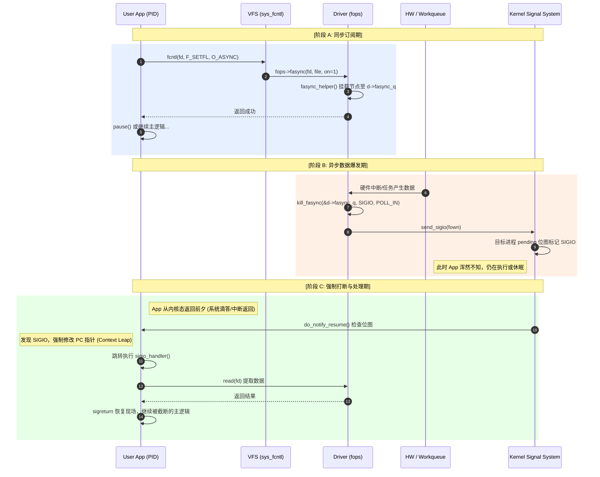

# Fasync 与 SIGIO 机制全景剖析

> [!note]
> 本文深度探讨 Linux “信号驱动 IO (Signal-driven IO)” 的工作原理。这是一种介于阻塞 IO 与多路复用（poll/epoll）之间的模型：**进程不主动轮询，而是由内核在数据就绪时，主动发送信号（默认 SIGIO）强制打断进程的线性执行流。**

## 1. 异步接力：跨越三大上下文的时序全景

信号驱动 IO 的精髓在于彻底解耦，其执行流横跨了**用户配置**、**异步线程生产**与**内核投递**三个完全独立的时空。我们先通过全景时序图建立宏观认知：



---

## 2. 阶段 A：订阅机制的实现

### 2.1 用户态的系统调用配置
要让一个文件描述符 (`fd`) 具备主动通知能力，用户程序需完成“三步走”：
1. **注册信号处理函数**：`sigaction(SIGIO, ...)` 准备好接应逻辑。
2. **确认通信接收方**：`fcntl(fd, F_SETOWN, getpid())` 告诉内核事件触发时该给谁发信号。
3. **开启异步开关**：`fcntl(fd, F_SETFL, flags | O_ASYNC)` 正式激活通知。

### 2.2 驱动层 `.fasync` 回调与安全边界
当 VFS 探测到 `O_ASYNC` 标志变化时，会路由至底层驱动的 `.fasync` 回调：
```c
static int adv_io_fasync(int fd, struct file *file, int on) {
    struct adv_io_dev *d = file->private_data;
    /* fasync_helper 会在内核态分配 fasync_struct 并安全挂载到 d->fasync_q */
    return fasync_helper(fd, file, on, &d->fasync_q);
}
```

> **⚠️ 致命安全陷阱：强制解绑**
> 当使用异步通知的程序崩溃，或主动关闭文件时，内核会调用驱动的 `.release`。此时**必须手动解绑**：
> ```c
> adv_io_fasync(-1, file, 0); 
> ```
> 若忘记此步骤，已销毁进程的节点将成为“定时炸弹”滞留在链表上。下次硬件触发遍历时，将引发严重的 **Use-After-Free**，直接导致内核崩溃（Kernel Panic）。

---

## 3. 阶段 B：底层的异步广播

当底层硬件产生中断或工作队列推进，驱动调用内核广播 API：
```c
kill_fasync(&d->fasync_q, SIGIO, POLL_IN);
```

**深入源码级 (`fs/fcntl.c`) 剖析：**
1. **并发保护**：`kill_fasync` 全程持有 **RCU 读锁**。这意味着它在任何严苛上下文（如中断底半部、Spinlock 内部）调用都是绝对安全且极低延迟的，不会引发睡眠。
2. **遍历投递**：它遍历 `d->fasync_q` 链表，取出当初记录的拥有者（`f_owner`），向其投递信号 `send_sigio`。
3. **信号挂载**：`send_sigio` 并不会立刻打断程序，它只是在目标进程（`task_struct`）的挂起信号位图（pending signal bitmap）中置位 `SIGIO`。如果用户配置了 `SA_SIGINFO`，还会将 `POLL_IN` 等掩码信息存入 `si_band`。

---

## 4. 阶段 C：打断与竞态启示

阶段 B 中悬挂的信号，其触发执行依赖于操作系统极巧妙的设计：**上下文返回劫持**。

当下一次系统时间片耗尽发生调度，或者目标进程由于任何原因陷入内核态（如执行了某个 syscall）准备**返回用户态前夕**，内核会执行 `do_notify_resume`。它探测到未决的 `SIGIO`，便强行修改进程用户态的栈帧和 PC 指针，迫使其跃迁至 `sigio_handler`。

**架构设计启示：**
正因为 `sigio_handler` 可能会在主程序执行的**任意两条机器指令之间**强行切入，它带来了极高的竞态风险：
- 信号处理函数中只能调用 **异步信号安全 (Async-Signal-Safe)** 的函数（如原生的 `read`, `write` 系统调用）。
- **严禁**使用带有内部隐藏锁的库函数（如 `printf`、`malloc`）。如果在主程序 `printf` 拿锁的瞬间信号切入，Handler 再次调用 `printf`，将造成无法挽回的死锁。