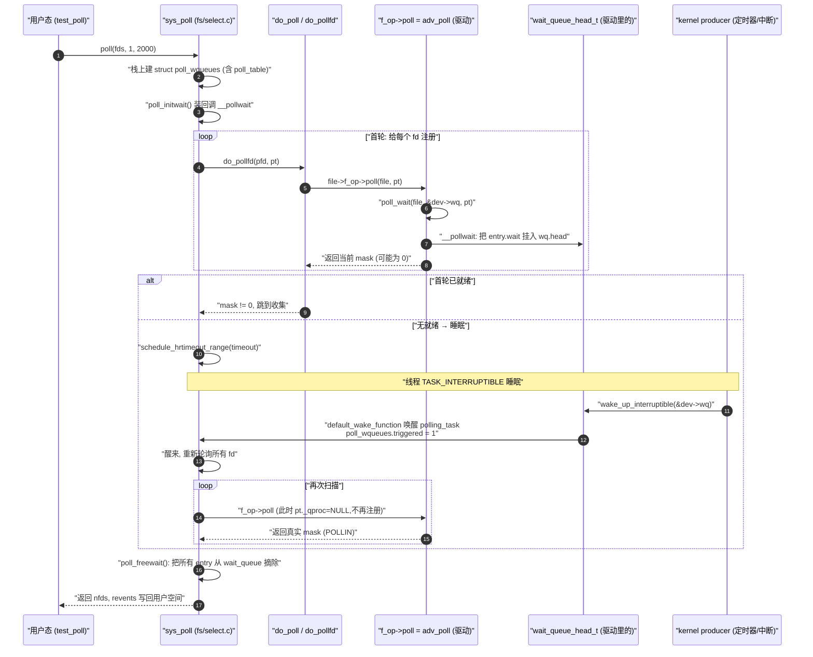

# poll 系统调用 — 内核机制全景

> [!note]
> **Ref:**
> - 内核源码: `fs/select.c` (`sys_poll`, `do_sys_poll`, `do_poll`, `__pollwait`)
> - 头文件: `include/linux/poll.h` (`poll_table`, `poll_wqueues`, `poll_wait`)
> - 本仓实例: `prj/03-Advanced-IO/src/` 的 `adv_poll`,strace 轨迹见 `note/SysCall/IO/Trail-straced-SysCall.md`

## 1. 三层接口:poll / select / epoll 的同源底座

用户态有三个 API,内核里其实**共享同一套等待原语** `poll_table` + `wait_queue`:

| API | 入口 (fs/select.c) | 数据结构 | 复杂度 |
|---|---|---|---|
| `select(2)` | `SYSCALL_DEFINE5(select, ...)` → `core_sys_select` → `do_select` | 三个 fd_set 位图 | O(nfds),每次重建 |
| `poll(2)` | `SYSCALL_DEFINE3(poll, ...)` → `do_sys_poll` → `do_poll` | `struct pollfd[]` 数组 | O(nfds),每次重建 |
| `epoll(7)` | `epoll_create/ctl/wait` (fs/eventpoll.c) | 红黑树 + 就绪链表 | O(就绪数),长期注册 |

**关键事实**:`poll/select` 每次调用都把所有 fd **重新挂到各自驱动的 wait_queue**,返回前再**全部摘下来**。epoll 是把"挂"这一步在 `epoll_ctl(ADD)` 时做一次,长期保留 —— 这就是它在大 fd 集合下胜出的根本原因。

下面只讲 **poll 这条路径**,因为它最能体现 `f_op->poll` 与 `wait_queue` 的协作。

---

## 2. 核心数据结构

```c
// include/linux/poll.h
typedef struct poll_table_struct {
    poll_queue_proc _qproc;   // 回调:把当前任务挂到一个 wait_queue
    unsigned long   _key;     // 关心的事件掩码 (POLLIN/POLLOUT/...)
} poll_table;

struct poll_wqueues {          // do_sys_poll 在栈上分配
    poll_table          pt;
    struct poll_table_page *table;   // 链式 slab,存 poll_table_entry
    struct task_struct *polling_task;
    int                 triggered;   // wake_up 后置 1
    int                 error;
    int                 inline_index;
    struct poll_table_entry inline_entries[N_INLINE_POLL_ENTRIES];
};

struct poll_table_entry {      // 每个 (fd, wait_queue) 一个
    struct file        *filp;
    unsigned long       key;
    wait_queue_entry_t  wait;     // 真正挂到驱动 wait_queue 里的节点
    wait_queue_head_t  *wait_address;
};
```

记住一句话:**`poll_table` 是一个"回调容器",用户线程把它递给 `f_op->poll`,让驱动用它把自己挂进等待队列**。这是一个典型的 inversion-of-control。

---

## 3. 全景时序



**这张图最容易被忽略的两点**:

- **第二轮扫描时 `pt._qproc = NULL`** —— 见 `poll_freewait` 之前 `do_poll` 内的 `pt = NULL` 等价逻辑(实际是把 `_qproc` 清空)。这样 `poll_wait()` 变成空操作,只用来**采集 mask**,不再重复挂队列。
- **挂队列只发生一次**,但**摘除队列**是必然的 —— 即便 timeout 也要遍历清理。这就是 poll/select 在大 fd 数下退化的真正原因(N 次 list_add + N 次 list_del per call)。

---

## 4. 驱动侧 `.poll` 的标准写法

```c
static __poll_t adv_poll(struct file *filp, struct poll_table_struct *pt)
{
    struct adv_dev *dev = filp->private_data;
    __poll_t mask = 0;

    poll_wait(filp, &dev->rwq, pt);     // 注册 (首轮才真做事)
    poll_wait(filp, &dev->wwq, pt);     // 可以挂多个 wait_queue

    spin_lock(&dev->lock);
    if (!kfifo_is_empty(&dev->fifo)) mask |= POLLIN  | POLLRDNORM;
    if (!kfifo_is_full(&dev->fifo))  mask |= POLLOUT | POLLWRNORM;
    spin_unlock(&dev->lock);

    return mask;
}
```

`poll_wait` 本质是:

```c
static inline void poll_wait(struct file *f, wait_queue_head_t *wq, poll_table *p)
{
    if (p && p->_qproc && wq)
        p->_qproc(f, wq, p);    // = __pollwait
}
```

`__pollwait` 做的事:

1. 从 `poll_wqueues.table` 里分配一个 `poll_table_entry`。
2. `init_waitqueue_func_entry(&entry->wait, pollwake)` —— 自定义唤醒回调。
3. `add_wait_queue(wq, &entry->wait)` —— 挂入驱动 wait_queue。

之后驱动调用 `wake_up_interruptible(&dev->rwq)` 时,`pollwake` 会被调用,它**置位 `triggered`** 并把 polling 线程踢醒。

---

## 5. 与 SIGIO/epoll 的对比要点

| 维度 | poll | epoll | SIGIO (fasync) |
|---|---|---|---|
| 注册时机 | 每次 syscall | `EPOLL_CTL_ADD` 一次 | `fcntl(F_SETFL, FASYNC)` 一次 |
| 就绪通知路径 | wait_queue → polling_task | wait_queue → ep_poll_callback → rdllist | fasync_struct → kill_fasync → 信号 |
| 驱动回调钩子 | `f_op->poll` | `f_op->poll` (相同!) | `f_op->fasync` |
| 用户态拿数据 | 醒来后**再扫所有 fd** | 直接读 `rdllist` | 信号 handler 里 read |
| 适合规模 | 几十个 fd | 数千~数万 | 单 fd |

**记忆点**:epoll 复用了 `f_op->poll`,只是把 `__pollwait` 换成了 `ep_ptable_queue_proc` —— 注册的回调是 `ep_poll_callback`,它把就绪 fd 直接 link 到 `eventpoll->rdllist`,**不需要轮询所有 fd**。

---

## 6. 一个常被忽略的细节:level-triggered 的来源

为什么 poll 是天然 level-triggered?因为**第二轮扫描时再次调用 `f_op->poll`**,只要驱动的 `kfifo_is_empty()` 还是 false,mask 就一直是 `POLLIN`。LT 不是协议,而是**重新查询当前状态**的副产品。

epoll 的 ET 反而需要额外约束:`ep_poll_callback` 只在 wake_up 那一瞬间把 fd 链入 rdllist,用户必须一次读干净 —— 因为**没有第二次调用 `f_op->poll`** 去重新确认状态。

---

## 7. 在本仓 strace 里能看到什么

回看 `Trail-straced-SysCall.md` 的 poll 段:

```
poll([{fd=3, events=POLLIN}], 1, 2000) = 1 ([{fd=3, revents=POLLIN}])
read(3, "\5", 32)                       = 1
poll(...)                               = 1 ([POLLIN])
read(3, "\6", 32)                       = 1
```

每对 `poll → read` 之间的 ~510 ms 间隔,正是 producer 的 wake_up 触发了上面图中第 9~12 步;`revents=POLLIN` 是第二轮扫描时驱动 `adv_poll` 看到 fifo 非空返回的。整个过程**用户态完全感知不到 wait_queue 的存在** —— 这就是 `f_op->poll` + `poll_table` 这层抽象的优雅之处。
