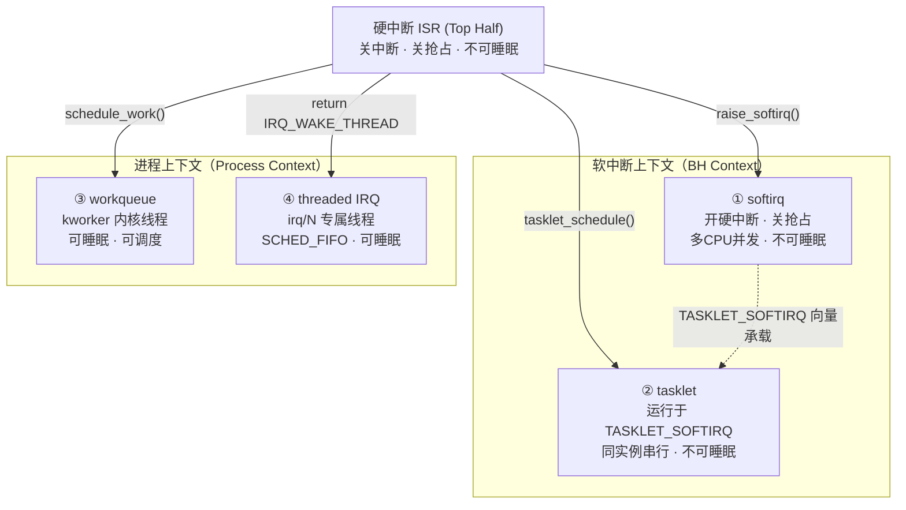
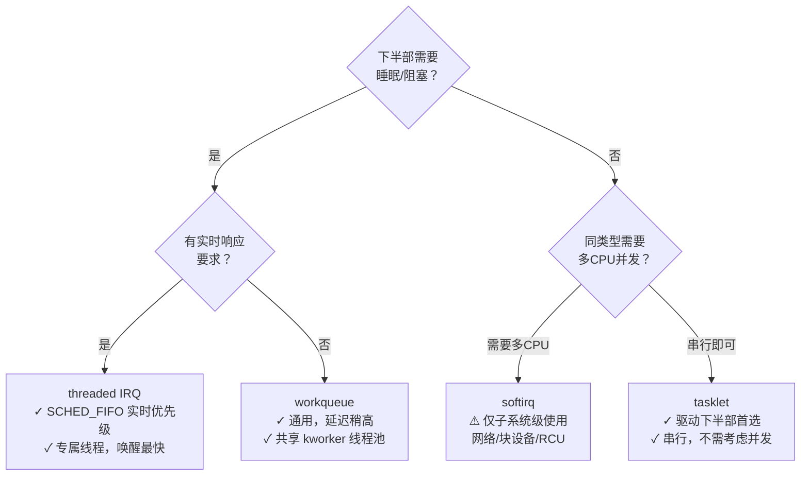

# 中断下半部机制全景

> [!note]
> **Ref:** [`sdk/Linux-4.9.88/include/linux/interrupt.h`](../../../sdk/100ask_imx6ull-sdk/Linux-4.9.88/include/linux/interrupt.h), [`sdk/Linux-4.9.88/kernel/softirq.c`](../../../sdk/100ask_imx6ull-sdk/Linux-4.9.88/kernel/softirq.c), [`sdk/Linux-4.9.88/kernel/workqueue.c`](../../../sdk/100ask_imx6ull-sdk/Linux-4.9.88/kernel/workqueue.c)

## 1. 为什么需要下半部

硬中断 ISR（Top Half）运行在**关抢占、关本CPU中断**的上下文，受三个强约束：

1. **不可睡眠**：禁止 `kmalloc(GFP_KERNEL)`、`mutex_lock()`、I2C/SPI 读写
2. **不可调度**：不能主动让出 CPU
3. **必须极短**：占用 CPU 时间过长会导致其他中断延迟、实时性劣化

Bottom Half 模式：ISR 只做最小必要工作（读状态、清中断标志），将耗时处理推迟到更宽松的上下文执行。

---

## 2. 四种机制全景



---

## 3. 选型决策



---

## 4. 横向对比

| 特性 | softirq | tasklet | workqueue | threaded IRQ |
|------|:-------:|:-------:|:---------:|:------------:|
| 执行上下文 | 软中断 BH | 软中断 BH | 进程（kworker）| 进程（irq/N）|
| 可以睡眠 | ✗ | ✗ | ✓ | ✓ |
| 同类并发（多CPU）| ✓ | ✗ | ✓ | ✗（专属线程）|
| 调度策略 | — | — | SCHED_NORMAL | SCHED_FIFO prio=50 |
| 驱动直接使用 | 极少 | ✓ | ✓ | ✓（推荐）|
| 触发开销 | 最低 | 低 | 中 | 低（直接唤醒）|
| 典型场景 | 网络/块设备 | DMA完成 | I2C/SPI读取 | 传感器/触摸屏 |

---

## 5. preempt_count 上下文检测

```c
/* include/linux/preempt.h — 四个上下文判断宏 */
in_irq()              /* 正在执行硬中断 handler */
in_softirq()          /* 正在执行 softirq（含 local_bh_disable 区域）*/
in_serving_softirq()  /* 正在执行 softirq handler（精确）*/
in_interrupt()        /* 硬中断 OR 软中断（任何中断上下文）*/
in_atomic()           /* 不可睡眠：持锁/中断/preempt_disable */
```

---

## 6. 笔记导航

| 文件 | 内容 |
|------|------|
| [`01-softirq.md`](./01-softirq.md) | softirq 执行上下文、preempt_count 机制、ksoftirqd |
| [`02-tasklet.md`](./02-tasklet.md) | tasklet 串行保证、API、ISR 上/下半部拆分模板 |
| [`03-workqueue.md`](./03-workqueue.md) | workqueue 体系、CMWQ、自定义WQ、delayed_work |
| [`04-threaded-irq.md`](./04-threaded-irq.md) | 线程化IRQ内核实现、irq_thread主循环、IRQF_ONESHOT原理 |
