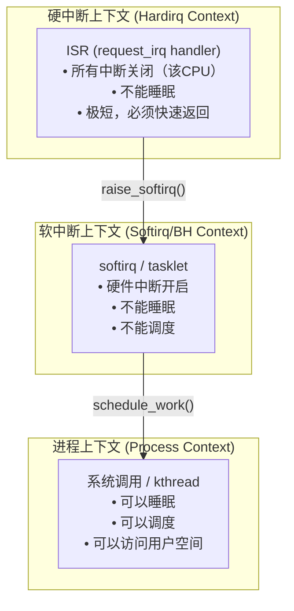
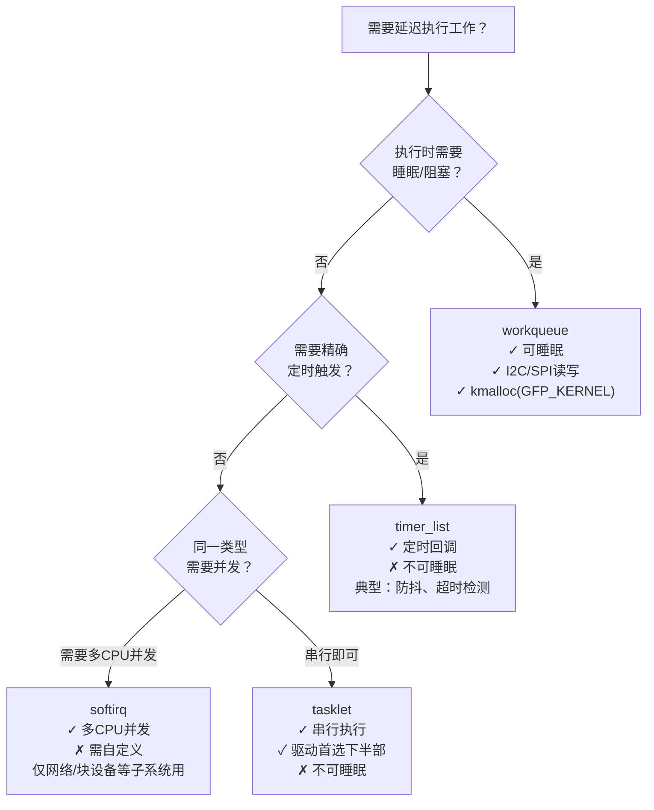
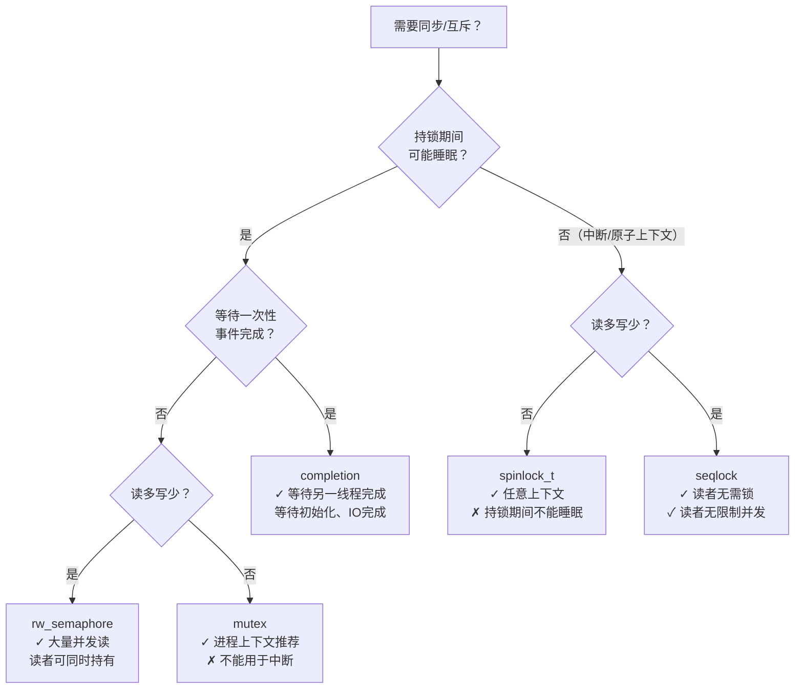

# 内核延迟机制与同步原语全景

> [!note]
> **Ref:** [`note/虚拟化/进程通信IPC/semaphore/04-kernel-sync-primitives.md`](../../虚拟化/进程通信IPC/semaphore/04-kernel-sync-primitives.md), [`note/Subsystem/Interrupt/02-kernel-framework.md`](../../Subsystem/Interrupt/02-kernel-framework.md), `sdk/Linux-4.9.88/include/linux/`

## 1. 执行上下文分类

Linux 内核代码运行在 3 种上下文，每种有不同的能力约束：



---

## 2. 延迟执行机制选型

驱动中断处理需要延迟/异步执行时的机制选择：



---

## 3. 同步原语选型



**上下文与原语约束速查：**

| 原语 | 硬中断 ISR | 软中断/tasklet | 进程上下文 |
|------|:---:|:---:|:---:|
| `spinlock_t` | ✓ (需 `_irq` 变体) | ✓ (需 `_bh` 变体) | ✓ |
| `mutex` | ✗ | ✗ | ✓ |
| `semaphore` | ✗ | ✗ | ✓ |
| `completion` | ✗ (wait侧) | ✗ (wait侧) | ✓ |
| `atomic_t` | ✓ | ✓ | ✓ |

---

## 4. wait_queue — 睡眠/唤醒核心机制

`wait_queue` 是 mutex、semaphore、IO 等待的**底层实现基础**，驱动中也可直接使用。

```c
/* 典型模式：生产者-消费者 */
wait_queue_head_t wq;
int data_ready = 0;

// 消费者（进程上下文）：等待数据
wait_event_interruptible(wq, data_ready != 0);

// 生产者（中断 ISR）：产生数据后唤醒
data_ready = 1;
wake_up_interruptible(&wq);
```

详见 → [`01-wait-queue.md`](./01-wait-queue.md)

---

## 5. 笔记导航

| 文件 | 内容 |
|------|------|
| [`01-wait-queue.md`](./01-wait-queue.md) | wait_queue 睡眠/唤醒机制，condition 语义，独占唤醒 |
| [`02-softtimer.md`](./02-softtimer.md) | timer_list 定时器、softirq、tasklet 三级底半部 |
| [`03-workqueue.md`](./03-workqueue.md) | 工作队列：system WQ、自定义 WQ、delayed work |
| [`../../虚拟化/进程通信IPC/semaphore/04-kernel-sync-primitives.md`](../../虚拟化/进程通信IPC/semaphore/04-kernel-sync-primitives.md) | 同步原语全览：mutex/spinlock/rwsem/completion/seqlock |
