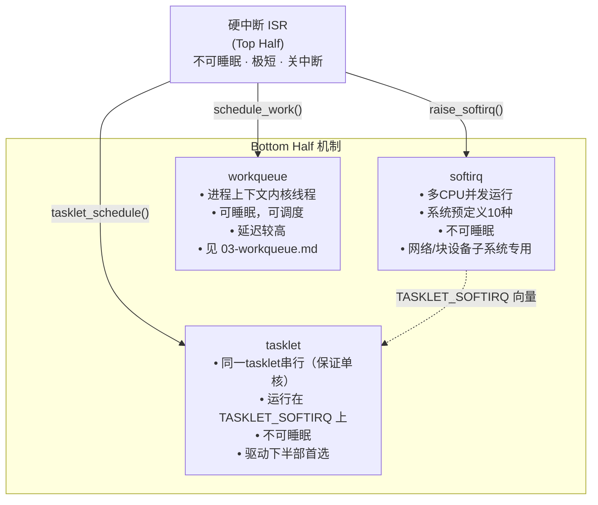
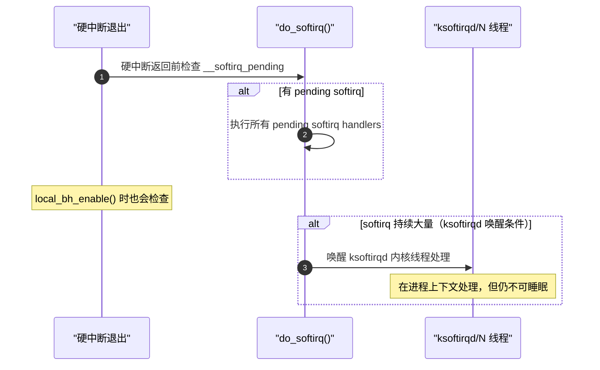

# 软定时器与底半部：timer_list / softirq / tasklet

> [!note]
> **Ref:** [`sdk/Linux-4.9.88/include/linux/timer.h`](../../../sdk/100ask_imx6ull-sdk/Linux-4.9.88/include/linux/timer.h), [`sdk/Linux-4.9.88/include/linux/interrupt.h`](../../../sdk/100ask_imx6ull-sdk/Linux-4.9.88/include/linux/interrupt.h), [`note/Subsystem/Interrupt/02-kernel-framework.md`](../../Subsystem/Interrupt/02-kernel-framework.md)

## 1. 底半部机制三层对比



| 特性 | softirq | tasklet | workqueue |
|------|---------|---------|-----------|
| 执行上下文 | 软中断 | 软中断 | 进程（kworker）|
| 可以睡眠 | ✗ | ✗ | ✓ |
| 同类并发执行 | ✓（多CPU）| ✗（串行）| ✓（多worker）|
| 驱动直接使用 | 极少 | ✓ | ✓ |
| 调度延迟 | 最低 | 低 | 中 |

---

## 2. timer_list — 软定时器

### 数据结构

```c
/* include/linux/timer.h */
struct timer_list {
    struct hlist_node  entry;        /* 挂入时间轮的链表节点 */
    unsigned long      expires;      /* 触发时刻（单位：jiffies）*/
    void             (*function)(unsigned long);  /* 回调函数 */
    unsigned long      data;         /* 传给 function 的参数 */
    u32                flags;
};
```

> **timer 运行在软中断上下文（`TIMER_SOFTIRQ`）**，因此回调函数不可睡眠。

### 时间单位换算

```c
HZ                          /* 每秒 jiffies 数（IMX6ULL Linux-4.9 = 100 或 CONFIG_HZ）*/
jiffies                     /* 当前时刻（单调递增，溢出安全）*/

/* 常用换算宏 */
msecs_to_jiffies(ms)        /* 毫秒 → jiffies */
usecs_to_jiffies(us)        /* 微秒 → jiffies */
jiffies_to_msecs(j)         /* jiffies → 毫秒 */

/* 时间比较（处理 jiffies 溢出）*/
time_before(a, b)           /* a < b */
time_after(a, b)            /* a > b */
time_after_eq(a, b)         /* a >= b */
```

### API 使用

```c
struct timer_list my_timer;

/* 初始化（Linux 4.x 旧式 API）*/
setup_timer(&my_timer, my_callback, (unsigned long)dev);
/* 或等价写法 */
init_timer(&my_timer);
my_timer.function = my_callback;
my_timer.data     = (unsigned long)dev;

/* 调度：N 毫秒后触发 */
my_timer.expires = jiffies + msecs_to_jiffies(200);
add_timer(&my_timer);

/* 修改到期时间（无论是否已调度）*/
mod_timer(&my_timer, jiffies + msecs_to_jiffies(200));

/* 检查是否已调度 */
if (timer_pending(&my_timer)) { ... }

/* 取消（有竞争风险：回调可能正在其他CPU运行）*/
del_timer(&my_timer);

/* 取消并等待回调执行完毕（安全取消）*/
del_timer_sync(&my_timer);   /* 不能在中断上下文调用！ */
```

### 驱动典型：GPIO 按键防抖

```c
/* 中断上半部：不直接处理，只重置定时器 */
static irqreturn_t key_isr(int irq, void *dev_id)
{
    struct gpio_desc *g = dev_id;
    /* mod_timer 在定时器已调度时直接修改到期时间
     * 连续抖动时反复刷新 200ms，只有最后一次会真正触发 */
    mod_timer(&g->key_timer, jiffies + msecs_to_jiffies(20));
    return IRQ_HANDLED;
}

/* 定时器回调（软中断上下文，不可睡眠）*/
static void key_timer_cb(unsigned long data)
{
    struct gpio_desc *g = (struct gpio_desc *)data;
    int val = gpio_get_value(g->gpio);
    /* 20ms 后电平已稳定，读取真实状态 */
    printk("key %d stable: %d\n", g->gpio, val);
    /* 上报事件等 */
}

/* probe 中初始化 */
setup_timer(&g->key_timer, key_timer_cb, (unsigned long)g);
request_irq(g->irq, key_isr, IRQF_TRIGGER_RISING | IRQF_TRIGGER_FALLING,
            "key", g);
```

---

## 3. softirq — 软中断（系统级底半部）

### 预定义向量

```c
/* include/linux/interrupt.h */
enum {
    HI_SOFTIRQ      = 0,  /* 高优先级 tasklet（tasklet_hi_schedule）*/
    TIMER_SOFTIRQ   = 1,  /* 内核定时器到期处理 */
    NET_TX_SOFTIRQ  = 2,  /* 网络发送 */
    NET_RX_SOFTIRQ  = 3,  /* 网络接收 */
    BLOCK_SOFTIRQ   = 4,  /* 块设备 IO 完成 */
    IRQ_POLL_SOFTIRQ= 5,  /* IRQ 轮询 */
    TASKLET_SOFTIRQ = 6,  /* 普通 tasklet */
    SCHED_SOFTIRQ   = 7,  /* 调度器负载均衡 */
    HRTIMER_SOFTIRQ = 8,  /* 高分辨率定时器（已废弃，占位）*/
    RCU_SOFTIRQ     = 9,  /* RCU 回调处理（始终最后）*/
    NR_SOFTIRQS
};
```

### 触发时机



### API（驱动几乎不直接用，了解即可）

```c
/* 注册 softirq 处理函数（内核启动时，子系统使用）*/
open_softirq(NET_RX_SOFTIRQ, net_rx_action);

/* 触发 softirq（通常在 ISR 中调用）*/
raise_softirq(NET_RX_SOFTIRQ);
raise_softirq_irqoff(NET_RX_SOFTIRQ);  /* 已关中断时调用更高效 */

/* 临界区保护（进程上下文与 softirq 之间）*/
local_bh_disable();   /* 禁止本 CPU 执行 BH（softirq + tasklet）*/
/* ... 临界区 ... */
local_bh_enable();    /* 恢复，可能立即执行 pending softirq */
```

> **驱动规则：** 除非是网络/块设备子系统核心开发，否则**不要自定义 softirq**，直接使用 tasklet 或 workqueue。

---

## 4. tasklet — 驱动下半部首选

### 数据结构

```c
/* include/linux/interrupt.h */
struct tasklet_struct {
    struct tasklet_struct *next;   /* 调度链表 */
    unsigned long          state;  /* TASKLET_STATE_SCHED | TASKLET_STATE_RUN */
    atomic_t               count;  /* 禁用计数：0=使能，>0=禁用 */
    void                 (*func)(unsigned long);
    unsigned long          data;   /* 传给 func 的参数 */
};
```

**tasklet 串行保证**：同一个 `tasklet_struct` 实例在任意时刻只在一个 CPU 上执行（`TASKLET_STATE_RUN` 互锁），但**不同 tasklet 实例可以并发**。

### 初始化与调度

```c
/* 静态声明（使能状态）*/
DECLARE_TASKLET(my_tasklet, my_tasklet_func, (unsigned long)dev);

/* 静态声明（禁用状态，需手动 enable）*/
DECLARE_TASKLET_DISABLED(my_tasklet, my_tasklet_func, (unsigned long)dev);

/* 动态初始化 */
struct tasklet_struct t;
tasklet_init(&t, my_tasklet_func, (unsigned long)dev);

/* 调度执行（从 ISR 或其他 BH 中调用）*/
tasklet_schedule(&my_tasklet);      /* 普通优先级（TASKLET_SOFTIRQ）*/
tasklet_hi_schedule(&my_tasklet);   /* 高优先级（HI_SOFTIRQ）*/

/* 禁用/使能（调度不受影响，但不会执行）*/
tasklet_disable(&my_tasklet);       /* count++ */
tasklet_enable(&my_tasklet);        /* count-- */

/* 取消并等待执行完毕（driver remove 时必须调用）*/
tasklet_kill(&my_tasklet);          /* 不能在中断上下文调用 */
```

### 驱动典型：ISR 上/下半部拆分

```c
struct my_dev {
    struct tasklet_struct dma_tasklet;
    u32  dma_status;
};

/* 下半部：tasklet 回调（软中断上下文，不可睡眠）*/
static void dma_complete_bh(unsigned long data)
{
    struct my_dev *dev = (struct my_dev *)data;
    /* 处理 DMA 完成：更新描述符、上报数据 */
    process_dma_result(dev);
    /* 可以 wake_up 等待的进程 */
    wake_up_interruptible(&dev->read_wq);
}

/* 上半部：ISR（关中断，极短）*/
static irqreturn_t dma_isr(int irq, void *dev_id)
{
    struct my_dev *dev = dev_id;
    /* 只读取状态，清中断标志 */
    dev->dma_status = readl(dev->base + DMA_STATUS);
    writel(DMA_IRQ_CLEAR, dev->base + DMA_STATUS);
    /* 调度下半部 */
    tasklet_schedule(&dev->dma_tasklet);
    return IRQ_HANDLED;
}

/* probe: 初始化 tasklet */
tasklet_init(&dev->dma_tasklet, dma_complete_bh, (unsigned long)dev);

/* remove: 释放 tasklet */
tasklet_kill(&dev->dma_tasklet);
```

---

## 5. 软中断上下文检测（调试辅助）

```c
/* include/linux/preempt.h */
in_interrupt()     /* 硬中断 OR 软中断 */
in_irq()           /* 仅硬中断上下文 */
in_softirq()       /* 仅软中断上下文（含 BH disable 区域）*/
in_serving_softirq()  /* 正在执行 softirq handler */
in_atomic()        /* 不能睡眠（spinlock持有/中断上下文/preempt_disable）*/

/* 使用示例：运行时断言 */
void my_func(void)
{
    WARN_ON(in_interrupt());  /* 警告：不应在中断上下文调用 */
    mutex_lock(&lock);        /* 如果真的在中断中，会 BUG */
}
```
