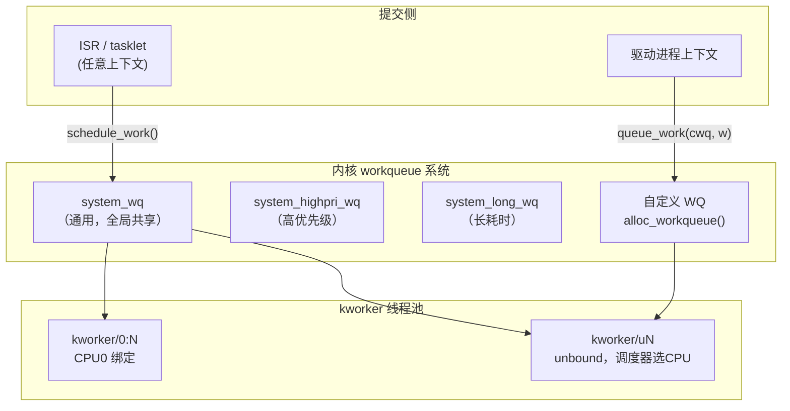

# workqueue：内核延迟进程上下文执行

> [!note]
> **Ref:** [`sdk/Linux-4.9.88/include/linux/workqueue.h`](../../../sdk/100ask_imx6ull-sdk/Linux-4.9.88/include/linux/workqueue.h), [`sdk/Linux-4.9.88/kernel/workqueue.c`](../../../sdk/100ask_imx6ull-sdk/Linux-4.9.88/kernel/workqueue.c)

## 1. workqueue 体系结构



**workqueue vs tasklet：**

| | tasklet | workqueue |
|--|---------|-----------|
| 执行上下文 | 软中断（BH）| 进程（kworker）|
| 可睡眠 | ✗ | ✓ |
| 可调用 mutex_lock | ✗ | ✓ |
| 可调用 kmalloc(GFP_KERNEL) | ✗ | ✓ |
| 可做 I2C/SPI 读写 | ✗ | ✓ |
| 调度延迟 | 更低 | 更高 |

---

## 2. 核心数据结构

```c
/* include/linux/workqueue.h */

typedef void (*work_func_t)(struct work_struct *work);

struct work_struct {
    atomic_long_t data;         /* 状态标志位 + 指向 pool_workqueue 的指针 */
    struct list_head entry;     /* 工作队列链表节点 */
    work_func_t      func;      /* 工作函数（驱动提供）*/
};

struct delayed_work {
    struct work_struct work;    /* 内嵌 work_struct */
    struct timer_list  timer;   /* 延迟触发定时器 */
    struct workqueue_struct *wq;
};
```

### container_of 反向取回驱动结构体

```c
/* 工作函数只接收 work_struct*，通过 container_of 获取宿主结构 */
struct my_dev {
    struct work_struct  rx_work;
    char                rx_buf[256];
    int                 rx_len;
};

static void rx_work_fn(struct work_struct *work)
{
    struct my_dev *dev = container_of(work, struct my_dev, rx_work);
    /* 现在可以访问 dev->rx_buf 等 */
    process_rx_data(dev);
}
```

---

## 3. work_struct API

### 初始化

```c
/* 静态声明 */
DECLARE_WORK(my_work, my_work_fn);

/* 动态初始化（嵌入结构体时）*/
struct my_dev dev;
INIT_WORK(&dev.rx_work, rx_work_fn);
```

### 提交工作

```c
/* 提交到 system_wq（最常用，绑定到 unbound kworker）*/
schedule_work(&work);

/* 提交到指定 WQ */
queue_work(my_wq, &work);

/* 保证在特定 CPU 上执行（通常不需要）*/
queue_work_on(cpu, my_wq, &work);
```

### 同步与取消

```c
/* 等待 work 执行完成（阻塞，进程上下文）*/
flush_work(&work);

/* 取消已调度的 work，并等待正在执行的完成 */
cancel_work_sync(&work);   /* 不能在中断上下文调用 */

/* 检查 work 是否在队列中等待执行 */
work_pending(&work);       /* bool */
```

---

## 4. delayed_work — 延迟工作

**用途：** N 毫秒后在进程上下文执行，结合了定时器和 workqueue。

```c
struct my_dev {
    struct delayed_work poll_work;
};

/* 初始化 */
INIT_DELAYED_WORK(&dev->poll_work, poll_work_fn);

/* 调度：200ms 后执行 */
schedule_delayed_work(&dev->poll_work, msecs_to_jiffies(200));

/* 或提交到指定 WQ */
queue_delayed_work(my_wq, &dev->poll_work, msecs_to_jiffies(200));

/* 重置到期时间（防抖典型用法）*/
mod_delayed_work(system_wq, &dev->poll_work, msecs_to_jiffies(200));

/* 取消延迟工作（并等待正在执行的完成）*/
cancel_delayed_work_sync(&dev->poll_work);
```

### delayed_work 防抖（与 timer_list 对比）

```c
/* timer_list 防抖：回调在软中断上下文，不可睡眠 */
mod_timer(&dev->timer, jiffies + msecs_to_jiffies(20));

/* delayed_work 防抖：回调在进程上下文，可以 I2C 读取 */
mod_delayed_work(system_wq, &dev->debounce_work, msecs_to_jiffies(20));
```

---

## 5. 自定义 workqueue

**何时需要自定义 WQ：**
- 工作函数执行时间很长（避免阻塞 system_wq 影响其他驱动）
- 需要严格并发数控制（如 max_active=1 保证串行）
- 需要高优先级或特定绑定行为

```c
/* 创建 WQ */
struct workqueue_struct *my_wq;

/* alloc_workqueue(name, flags, max_active)
 * max_active: 最大并发执行数，0=默认(256)，1=强制串行
 */
my_wq = alloc_workqueue("my_drv_wq", WQ_UNBOUND | WQ_MEM_RECLAIM, 1);
if (!my_wq)
    return -ENOMEM;

/* WQ 常用标志 */
WQ_UNBOUND        /* 不绑定 CPU，调度器自由选择（推荐）*/
WQ_HIGHPRI        /* 高优先级 kworker */
WQ_MEM_RECLAIM    /* 保证在内存压力下仍可执行（驱动推荐设置）*/
WQ_FREEZABLE      /* 系统挂起时冻结工作 */

/* 销毁（driver remove 时）*/
destroy_workqueue(my_wq);  /* 等待所有 pending work 完成后销毁 */
```

---

## 6. 完整驱动示例：ISR → workqueue 数据处理

```c
struct sensor_dev {
    struct i2c_client    *client;
    struct workqueue_struct *wq;
    struct work_struct    data_work;
    wait_queue_head_t     read_wq;
    u8                    data[6];
    int                   data_ready;
};

/* workqueue 工作函数（进程上下文，可睡眠）*/
static void sensor_data_work(struct work_struct *work)
{
    struct sensor_dev *dev = container_of(work, struct sensor_dev, data_work);

    /* 可以做 I2C 读取（会睡眠等待总线）*/
    i2c_master_recv(dev->client, dev->data, sizeof(dev->data));

    /* 上报数据 */
    dev->data_ready = 1;
    wake_up_interruptible(&dev->read_wq);  /* 唤醒 read() 等待者 */
}

/* ISR（硬中断上下文，不可睡眠）*/
static irqreturn_t sensor_isr(int irq, void *dev_id)
{
    struct sensor_dev *dev = dev_id;
    /* 不在 ISR 里做 I2C，调度 workqueue */
    queue_work(dev->wq, &dev->data_work);
    return IRQ_HANDLED;
}

/* probe */
static int sensor_probe(struct i2c_client *client, ...)
{
    struct sensor_dev *dev = devm_kzalloc(&client->dev, sizeof(*dev), GFP_KERNEL);

    init_waitqueue_head(&dev->read_wq);
    INIT_WORK(&dev->data_work, sensor_data_work);

    dev->wq = alloc_workqueue("sensor_wq", WQ_UNBOUND | WQ_MEM_RECLAIM, 1);

    devm_request_irq(&client->dev, client->irq, sensor_isr,
                     IRQF_TRIGGER_FALLING, "sensor", dev);
    return 0;
}

/* remove */
static int sensor_remove(struct i2c_client *client)
{
    struct sensor_dev *dev = i2c_get_clientdata(client);
    cancel_work_sync(&dev->data_work);  /* 等待进行中的 work 完成 */
    destroy_workqueue(dev->wq);
    return 0;
}
```

---

## xxxxxxxxxx /* include/linux/preempt.h */in_interrupt()     /* 硬中断 OR 软中断 */in_irq()           /* 仅硬中断上下文 */in_softirq()       /* 仅软中断上下文（含 BH disable 区域）*/in_serving_softirq()  /* 正在执行 softirq handler */in_atomic()        /* 不能睡眠（spinlock持有/中断上下文/preempt_disable）*/​/* 使用示例：运行时断言 */void my_func(void){    WARN_ON(in_interrupt());  /* 警告：不应在中断上下文调用 */    mutex_lock(&lock);        /* 如果真的在中断中，会 BUG */}c

Linux 4.x 的 workqueue 使用 **CMWQ（Concurrency Managed Workqueue）** 架构：

- 每个 CPU 维护一个 worker pool（普通优先级 + 高优先级）
- kworker 数量动态扩缩：有 worker 睡眠（如等待 I2C）时自动创建新 worker
- `WQ_UNBOUND` 的 work 由 unbound 全局 pool 处理，调度器可跨 CPU 迁移

```bash
# 查看 kworker 线程
ps aux | grep kworker

# 查看 workqueue 状态（需 CONFIG_WQ_WATCHDOG 或 debugfs）
cat /sys/kernel/debug/workqueue/wq_stats 2>/dev/null
```
