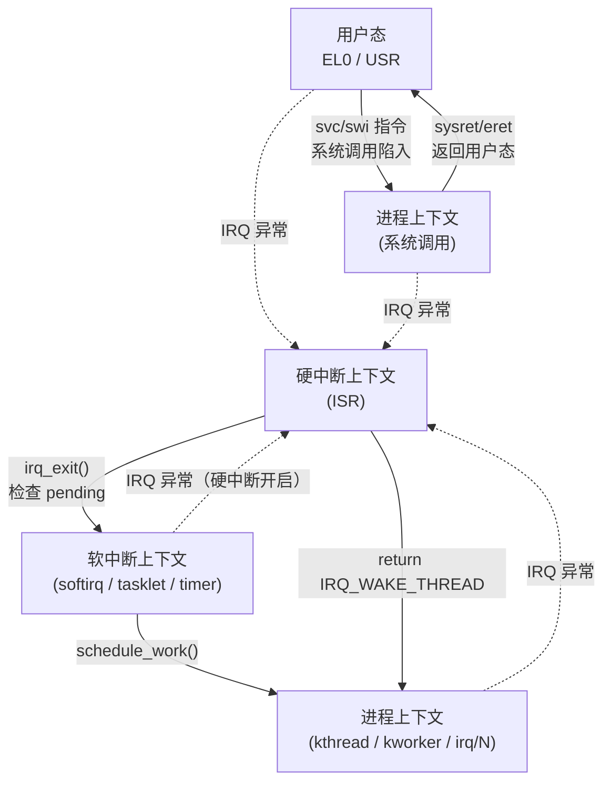
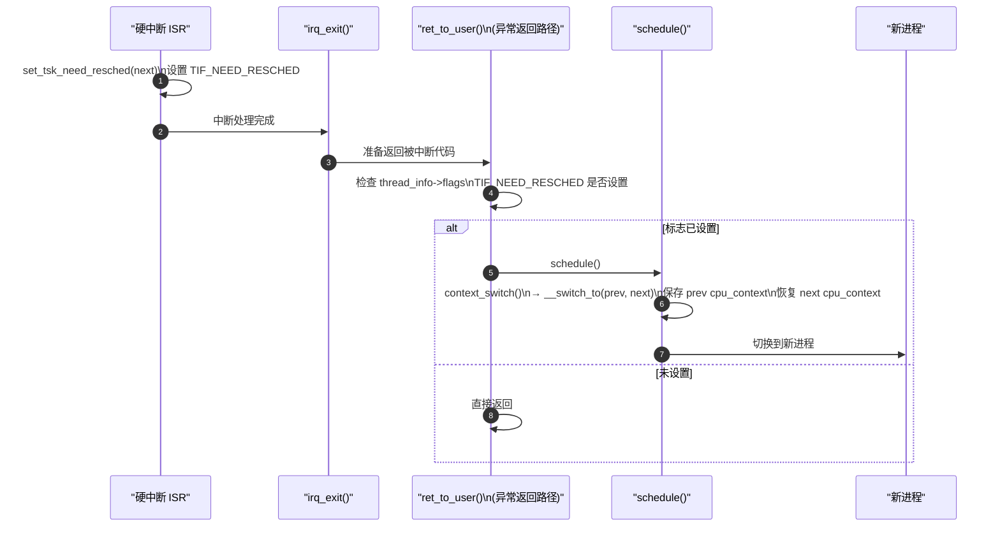

# Linux 执行上下文全景

> [!note]
> **Ref:** [`sdk/Linux-4.9.88/include/linux/preempt.h`](../../../sdk/100ask_imx6ull-sdk/Linux-4.9.88/include/linux/preempt.h), [`sdk/Linux-4.9.88/include/linux/sched.h`](../../../sdk/100ask_imx6ull-sdk/Linux-4.9.88/include/linux/sched.h), [`sdk/Linux-4.9.88/arch/arm/include/asm/thread_info.h`](../../../sdk/100ask_imx6ull-sdk/Linux-4.9.88/arch/arm/include/asm/thread_info.h)

Linux 代码运行在 5 种上下文中，从宽松到严格依次为：

---

## 1. 用户态上下文（User Context）

**进入方式：** 程序正常执行用户代码（`main()` 及调用链）

| 特征 | 状态 |
|------|------|
| ARM 模式 | EL0 / USR |
| 使用的栈 | 用户栈（用户地址空间内）|
| 可访问地址范围 | `0x0` ~ `TASK_SIZE`（3GB 用户空间）|
| 特权指令 | 触发 Undefined Instruction 异常 |
| `current` | 有效，指向当前进程 `task_struct` |

需要内核服务时通过**系统调用**（ARM `svc` / `swi` 指令）陷入内核。

---

## 2. 内核态 — 进程上下文（Process Context）

**进入方式：** 系统调用（`read/write/ioctl`）、内核线程（`kthread`）、workqueue（`kworker`）、threaded IRQ（`irq/N`）

| 特征 | 状态 |
|------|------|
| ARM 模式 | EL1 / SVC |
| 使用的栈 | 内核栈（`task_struct` 关联的 8KB 栈）|
| `current` | 有效，知道"我是谁"|
| 可以被抢占 | ✓（`preempt_count == 0` 时）|
| 可以睡眠/调度 | ✓ |
| 可以 `copy_to/from_user` | ✓（仅 syscall 上下文）|
| 可以 `mutex_lock` | ✓ |

这是内核中**约束最少**的上下文，大部分驱动代码在此运行。

### 两种子类型

| | 系统调用上下文 | 内核线程上下文 |
|--|---------------|---------------|
| `current` | 发起 syscall 的用户进程 | kthread 自身 |
| `current->mm` | 非 NULL（有用户地址空间）| **NULL**（无用户空间）|
| `copy_to_user` | ✓ | ✗ |
| 典型代表 | `read()`/`ioctl()` handler | `kworker`、`ksoftirqd`、`kthread_run()` |

---

## 3. 内核态 — 软中断上下文（Softirq / BH Context）

**进入方式：** 硬中断返回时 `irq_exit()` → `__do_softirq()`，或 `local_bh_enable()` 触发

| 特征 | 状态 |
|------|------|
| 线程归属 | **不是独立线程**，借用当前 CPU 执行流 |
| 使用的栈 | 被中断进程的内核栈 |
| `current` | 有效但**无意义**（是被中断的进程）|
| 硬件中断 | **开启** ✓（可被新硬中断打断）|
| 抢占 | **禁止** ✗ |
| 可以睡眠 | ✗ |
| 可以 `copy_to_user` | ✗ |
| 可以 `spinlock` | ✓（不能用 `mutex`）|

**包含的具体场景：**

| 场景 | 说明 |
|------|------|
| softirq handler | `NET_RX_SOFTIRQ` 等 |
| tasklet 回调 | 运行在 `TASKLET_SOFTIRQ` / `HI_SOFTIRQ` 上 |
| `timer_list` 回调 | 运行在 `TIMER_SOFTIRQ` 上 |
| `local_bh_disable()` 区域 | 进程上下文中禁用 BH 期间 |

---

## 4. 内核态 — 硬中断上下文（Hardirq Context）

**进入方式：** 外设触发 IRQ → GIC → CPU 异常向量 → `gic_handle_irq()`

| 特征 | 状态 |
|------|------|
| ARM 模式 | EL1 / IRQ 模式 |
| 使用的栈 | 被中断进程的内核栈（或独立 IRQ 栈）|
| `current` | 有效但**无意义** |
| 硬件中断 | **关闭** ✗（本 CPU，其他 CPU 不受影响）|
| 抢占 | **禁止** ✗ |
| 可以睡眠 | ✗ |
| 可以 `spinlock` | ✓（**必须**用 `_irqsave` 变体）|
| 可以 `raise_softirq` | ✓ |

> **约束最严**的常规上下文。ISR 必须极短（< 100μs）。

---

## 5. 内核态 — NMI 上下文（Non-Maskable Interrupt）

**进入方式：** 不可屏蔽中断（看门狗超时、硬件故障、perf 采样）

| 特征 | 状态 |
|------|------|
| 不能被任何中断打断 | ✓（包括 NMI 自身）|
| 不能持有任何锁 | ✓（会死锁）|
| 用途 | panic 输出、perf 采样、watchdog 复位 |

---

## 6. 横向对比矩阵

| 能力 | 用户态 | 进程上下文 | 软中断 BH | 硬中断 IRQ | NMI |
|------|:------:|:---------:|:---------:|:----------:|:---:|
| 可以睡眠 | ✓ | ✓ | ✗ | ✗ | ✗ |
| 可以调度 | ✓ | ✓ | ✗ | ✗ | ✗ |
| `copy_to/from_user` | — | ✓ | ✗ | ✗ | ✗ |
| `mutex_lock` | ✓ | ✓ | ✗ | ✗ | ✗ |
| `spin_lock` | — | ✓ | ✓ | ✓(`_irqsave`) | ✗ |
| `kmalloc(GFP_KERNEL)` | — | ✓ | ✗ | ✗ | ✗ |
| `kmalloc(GFP_ATOMIC)` | — | ✓ | ✓ | ✓ | ✗ |
| 硬件中断状态 | 开 | 开 | **开** | **关** | 关 |
| 可被抢占 | ✓ | ✓(无锁) | ✗ | ✗ | ✗ |
| `current` 有效 | ✓ | ✓ | 有但无意义 | 有但无意义 | 有但无意义 |

---

## 7. `preempt_count` 一个字段区分所有上下文

```
 bit 31     20  19     16  15      8  7       0
    ┌──────────┬──────────┬──────────┬──────────┐
    │  NMI (4) │hardirq(4)│softirq(8)│preempt(8)│
    └──────────┴──────────┴──────────┴──────────┘
```

```c
/* include/linux/preempt.h */
in_irq()              /* hardirq 位域 > 0 */
in_softirq()          /* softirq 位域 > 0（含 local_bh_disable 区域）*/
in_serving_softirq()  /* 正在执行 softirq handler（精确判断）*/
in_interrupt()        /* hardirq | softirq > 0（任何中断上下文）*/
in_atomic()           /* 整个字段 != 0 → 不可睡眠 */
in_task()             /* !in_interrupt()，真正的进程上下文 */
```

各上下文对应的 `preempt_count` 状态：

| 上下文 | NMI位 | hardirq位 | softirq位 | preempt位 |
|--------|:-----:|:---------:|:---------:|:---------:|
| 进程上下文（无锁）| 0 | 0 | 0 | 0 |
| 进程上下文（持 spinlock）| 0 | 0 | 0 | >0 |
| `local_bh_disable` 区域 | 0 | 0 | >0 | 可能>0 |
| softirq handler | 0 | 0 | >0 | >0 |
| hardirq handler | 0 | >0 | 可能>0 | >0 |
| NMI handler | >0 | 可能>0 | 可能>0 | >0 |

---

## 8. 上下文切换路径全景



> 硬中断可以打断**除 NMI 外的任何上下文**（包括软中断），因此 softirq 中访问与 ISR 共享的数据需要 `spin_lock_irqsave`，而非普通 `spin_lock`。

---

## 9. Cortex-A7 调度触发点

Cortex-A 通过 `TIF_NEED_RESCHED` 标志 + 固定检查点实现延迟调度（对比 Cortex-M 的 PendSV 机制见 → [`06-cortexM-pendsv.md`](./06-cortexM-pendsv.md)）：



**调度检查点（`TIF_NEED_RESCHED` 生效的位置）：**

| 检查点 | 时机 |
|--------|------|
| `ret_to_user` | 从内核态返回用户态前（系统调用/中断返回）|
| `preempt_schedule_irq` | 中断返回内核态时（CONFIG_PREEMPT）|
| `preempt_schedule` | `spin_unlock` / `preempt_enable` 时 |
| `cond_resched()` | 长循环中主动让出点 |
