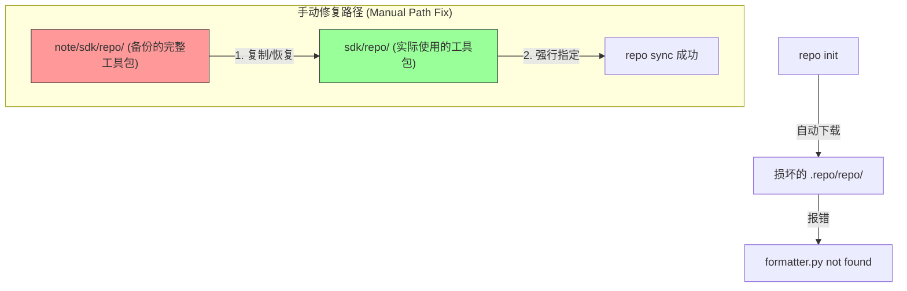

# 100ask-BSP 源码同步与脚本 WSL 适配指南

本指南详细说明如何在 **Ubuntu 22.04 (Python 3.10+)** 环境下，修复 100ask 官方 BSP 同步脚本的兼容性问题，并完成源码拉取。

> REF: [formatter.py](formatter.py) 

## 1. 核心问题：`formatter.py not found` 深度解析

在使用 100ask 提供的旧版 `repo` 脚本进行初始化时，最常见的报错并非直接的语法错误，而是诡异的：
**`error: internal error: formatter.py not found`**

### 报错根源：
1.  **初始化死锁**：旧版 `repo` 启动器（Wrapper）在下载内部工具包（Repo Project）到 `.repo/repo/` 目录时，由于 Python 3.10+ 的不兼容或 WSL 路径处理差异，导致初始化过程看似完成实则**目录结构不完整**或**符号链接失效**。
2.  **路径盲区**：启动器在后续调用时，无法在预期的内部路径中定位到 `formatter.py`。
3.  **二次伤害**：即使文件存在，由于前述的 `collections.Iterable` 语法错误，Python 解析器在尝试加载该文件时可能直接崩溃，转而向用户抛出一个模糊的 "Not Found" 错误。

---

## 2. 核心解决方案：手动部署“已知好用”的工具集

既然自动下载会造成“找不到文件”或“文件损坏”，我们的策略是：**彻底废弃自动下载，改为手动部署我们备份在 `sdk/repo/` 下的完整工具链。**

### 修复架构图



### 修复核心：`formatter.py` (缺失的标准库补丁)

**真相纠正**：
这个脚本**并不是**用来修复 `collections.Iterable` 错误的（源码中甚至没有引用 collections）。
**它的真实作用是填补空缺**：Python 3.10 彻底移除了标准库中的 `formatter` 模块（该模块自 3.4 起被废弃）。旧版 `repo` 工具严重依赖这个模块，因此在 Ubuntu 22.04 上运行时，会因为找不到该模块而直接崩溃，报出 `formatter.py not found` 或 `ModuleNotFoundError`。

你在 `sdk/repo/` 下保留的这个文件，实质上是一个 **Polyfill（兼容性垫片）**。它手动实现了已移除的 `formatter` 模块的功能，强行让旧版 `repo` 能够继续运行。

---

## 3. 实操步骤 (WSL 适配流程)

### 步骤 1: 准备工作目录

```bash
mkdir -p /home/pi/imx/sdk
cd /home/pi/imx/sdk
```

### 步骤 2: 部署修复版工具集

将备份在笔记目录下的修复脚本部署到 `sdk/repo` 目录下（如果尚未部署）：

```bash
# 假设你已经有了这些修复好的脚本
# 重点确保 sdk/repo/formatter.py 存在，这是 Python 3.10 缺失的模块
cp /home/pi/imx/note/sdk/formatter.py /home/pi/imx/sdk/repo/formatter.py
```

### 步骤 3: 使用本地工具执行初始化

关键在于使用 `--repo-url` 参数指向本地已修复的路径，或者直接调用本地的 `repo` 包装脚本，并配合 `--no-repo-verify`。

```bash
cd /home/pi/imx/sdk

# 使用本地修复好的 repo 脚本进行初始化
# --no-repo-verify 阻止其从网络下载可能存在 Bug 的旧版本
# 且本地包含 formatter.py，解决了标准库缺失问题
./repo/repo init -u https://gitee.com/weidongshan/manifests.git \
    -b linux-sdk \
    -m imx6ull/100ask_imx6ull_linux4.9.88_release.xml \
    --no-repo-verify
```

### 步骤 3: 如果依然提示 Not Found
如果系统环境依然顽固地去查找 `.repo/repo/formatter.py`，则执行硬覆盖：

```bash
# 强行同步工具链到内核预期的位置
mkdir -p .repo/repo
cp -r repo/* .repo/repo/

echo ">>> 强制手动补全 .repo 工具链完成，formatter.py 已就位"
```

---


## 4. 关键脚本说明

### `formatter.py` 的核心修改点：

在 Python 3.10+ 中，必须明确从 `collections.abc` 导入：

```python
# 修改前 (会导致 AttributeError):
# import collections
# ... if isinstance(obj, collections.Iterable):

# 修改后 (兼容 Python 3.10+):
import collections.abc
# ... if isinstance(obj, collections.abc.Iterable):
```

你备份在 `/home/pi/imx/note/sdk/formatter.py` 的版本已经完成了此项修改，它是确保 100ask BSP 在现代 WSL2 (Ubuntu 22.04) 环境下能够运行的灵魂组件


