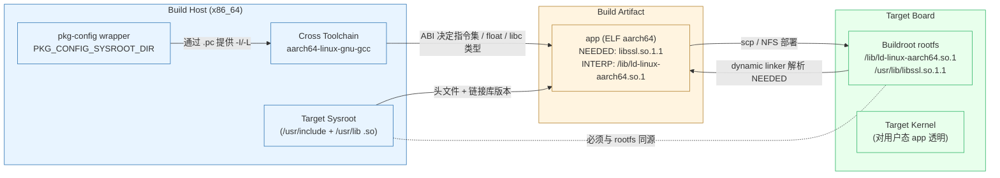

# 用户空间应用开发与 sysroot

> [!note]
> **Ref:**
> - Buildroot manual, "Using the generated toolchain outside Buildroot" — `/home/pi/imx/sdk/tspi-rk3566-sdk/buildroot/docs/manual/using-buildroot-toolchain.adoc`
> - Buildroot manual §19 Cross-compilation toolchain — <https://buildroot.org/downloads/manual/manual.html>
> - GCC docs, `--sysroot` 行为说明


## 1. 场景设定：cross-compile 跑通 ≠ 目标板能跑

很多新人第一次接触嵌入式应用开发，会把"我手上有一个 `aarch64-linux-gnu-gcc`，能编出一个 ELF"等同于"应用能在目标板上跑"。但真到目标板上一执行，常见三类报错：

```text
./app: /lib/aarch64-linux-gnu/libssl.so.3: version `OPENSSL_3.0.7' not found
./app: error while loading shared libraries: libQt6Widgets.so.6: cannot open shared object file
./app: /lib/ld-linux-aarch64.so.1: bad ELF interpreter
```

具体例子：你想为目标板编一个 link 到 `libssl` 的 HTTPS 客户端。

| 维度 | host (Ubuntu 24.04) | target (Buildroot rootfs) |
|------|---------------------|---------------------------|
| openssl | 3.0.13 (symbol OPENSSL_3.0.13) | 1.1.1w (symbol OPENSSL_1_1_0) |
| libc | glibc 2.39 | glibc 2.36 / 或 musl 1.2 |
| dynamic linker | `/lib64/ld-linux-x86-64.so.2` | `/lib/ld-linux-aarch64.so.1` |
| `libssl.so` soname | `libssl.so.3` | `libssl.so.1.1` |

只要你在 host 上随手 `apt install libssl-dev` 然后让 cross-gcc 去找 `-lssl`，gcc 会愉快地把 host 那份头文件 + soname 写进 ELF。到目标板一跑，soname 对不上，dynamic linker 报错。

结论：用户空间应用必须保证 **ABI + 头文件 + 链接库三者** 和目标 rootfs 保持一致，缺一不可。


## 2. 必须配套的两件事

### 2.1 编译器（cross toolchain）

决定的是 **不可改变的 ABI 契约**：

| 属性 | 例 |
|------|----|
| 目标三元组 | `arm-linux-gnueabihf` / `aarch64-linux-gnu` / `arm-linux-musleabihf` |
| FPU / float ABI | `hardfp` vs `softfp` |
| libc 实现 | glibc / musl / uClibc-ng |
| C++ ABI | libstdc++ 版本（GCC version） |
| endianness | little / big |

一旦 libc 选错（比如目标板是 musl 但你拿 glibc 的 toolchain），生成的 ELF 找不到 dynamic linker，直接 `bad ELF interpreter`。

### 2.2 用户空间运行时（rootfs 中的库与头文件）

即使 toolchain 选对了，仍然需要一份 **与目标 rootfs 同步** 的：

- `/usr/include/...`：头文件决定编译期 struct layout、宏值、function prototype
- `/usr/lib/<triple>/*.so`：链接期需要 soname 匹配
- `/lib/ld-*.so.*`：dynamic linker 路径必须存在于目标 rootfs

这一整套东西被打包成 **sysroot**，本质上是"target rootfs 的开发版镜像"。

### 2.3 sysroot 的角色

> [!note]
>
> 广义sysroot : 编译器查找头文件和库的基准目录。交叉编译器内部自带一份lib
>
> 狭义sysroot: 狭义的板载根文件系统：实际目标板子上 `/lib、/usr/lib` 等完整内容，包含一堆第三方库（如 Qt、openssl），GCC 通过 `--sysroot=<DIR>` 把所有 `/usr/include`、`/usr/lib`、`/lib` 的查找路径都重定向到 `<DIR>` 下，编译期"假装"自己就在目标板上：


```bash
aarch64-linux-gnu-gcc \
    --sysroot=$HOME/sdk/aarch64-buildroot-linux-gnu/sysroot \
    app.c -o app -lssl
```

此时 gcc 看到的 `libssl.so` 是 Buildroot 编出来的那一份，头文件版本、soname 都与目标 rootfs 一致。


## 3. 哪些活只需要 target kernel + cross-compiler

并非每一项工作都需要完整 sysroot：

>[!tip]
>
>target板上的hello wolrd 程序，依赖libc.a 静态库（编译器进入elf)。该静态库集成在 cross-gcc lib，与target系统上libc无关。
>
>但若改成动态链接：
>
>- 交叉编译器**依然会使用它自带的 sysroot**（通常位于工具链安装目录下），从中找到 `libc.so`（它其实是一个链接脚本，指向实际的 `libc-2.xx.so`）以及 `stdio.h` 等头文件。
>- **编译本身不需要目标板上的 rootfs**。从这个角度讲，编译时仍然“不依赖 target sysroot”。
>- 运行阶段：强依赖 target 系统的 libc，**内核会调用动态链接器 `ld-linux.so`**，由它去加载 `libc.so.6` 等依赖：
>  - ABI，ELF中硬编码的链接器路径，libc符号版本，任一不匹配都会panic。
>
>  情况 A：用 distro 装的 cross-gcc（如 apt install gcc-arm-linux-gnueabihf）
>  - 大概率 ABI 对得上（armhf 主流）
>  - libc 路径基本能对上（都是 glibc）
>  - 最容易翻车在第 3 关：Ubuntu 22.04 自带的 cross-gcc 链接的是 glibc 2.35+，而 buildroot rootfs 里如果选了 glibc
>    2.31，跑起来就 GLIBC_2.34 not found。单纯 helloworld（只用 printf）通常能跑，因为 printf 是 GLIBC_2.0
>    时代的符号；但只要用到 fcntl64、getrandom 这种较新 API 就翻车。
>  - 如果目标 rootfs 是 musl（buildroot 选了 musl），直接挂——interpreter 路径就对不上。
>
>  情况 B：用 buildroot 导出的 SDK 工具链（make sdk 产物）
>  - 三关全部按目标 rootfs 配套生成的，包括 helloworld 在内的动态链接程序都能跑，这就是 SDK 存在的意义。

| 工作类型 | 是否需要完整 sysroot | 真正依赖什么 |
|----------|------------------|--------------|
| Out-of-tree kernel module（如字符设备驱动） | 否 | kernel headers + kernel build tree (`Module.symvers`) + 编译器 ABI |
| **完全静态**的小工具（`musl-gcc -static hello.c`） | 否 | 仅 cross-compiler + libc.a |
| `arm-none-eabi-` 裸机程序 | 否 | 只要 newlib / picolibc |
| 用户态应用 link 任何 `.so` | **是** | sysroot + 头文件 |
| C++ 应用 link libstdc++ | **是** | sysroot + libstdc++ |
| Qt / GStreamer / DBus 应用 | **是** | sysroot + 大量 buildroot 包 |

**示例 1**：编一个 hello world 内核模块只需要：

```bash
make -C $KDIR M=$PWD ARCH=arm64 CROSS_COMPILE=aarch64-linux-gnu- modules
```

这里 `$KDIR` 指向Host上的Kernel Header，**完全不接触 rootfs**。

**示例 2**：musl-static hello world：

```bash
aarch64-linux-musl-gcc -static hello.c -o hello
file hello   # ELF 64-bit ... statically linked
```

直接 scp 到任何 aarch64 板子就能跑（甚至跑在 glibc rootfs 上也行），因为没有 `.interp` 段。


## 4. 哪些活必须用 buildroot rootfs 的 sysroot

只要 ELF 里有 `.dynamic` 段且 `NEEDED` 列了任何 `.so`，编译期就需要 sysroot：

- link `libstdc++.so.6` —— 必须与 rootfs 里 buildroot 装的那份 GCC 一致
- link Qt5 / Qt6 / SDL2 / OpenSSL / GStreamer —— 这些库版本由 buildroot defconfig 决定
- 任何 audio/video 栈（PulseAudio、ALSA、PipeWire）—— runtime 还依赖 dbus、udev
- 任何走 `pkg-config` 找 `.pc` 文件的项目 —— `.pc` 中的 `Libs:`、`Cflags:` 全部相对 sysroot
- 任何引用 `/lib/ld-linux-armhf.so.3` 作 dynamic linker 的应用

注意 dynamic linker 路径是写死在 ELF 的 `PT_INTERP` 段里的。host gcc 默认会写 `/lib64/ld-linux-x86-64.so.2`；只有让 cross-gcc 用 sysroot 编译才会写成 `/lib/ld-linux-aarch64.so.1`。


## 5. 横向对比：拿到工具链的姿势

| 发行版/构建系统 | 应用开发者如何拿到 SDK | sysroot 定位 | C library 选择 | 优点 | 痛点 |
|:----------------|:----------------------:|:-------------|----------------|------|------|
| **Buildroot**   | 默认不主动产 SDK；需 `make sdk` 或拷贝 `output/host/` | 内嵌在 `output/host/<triple>/sysroot/` | 编译期可选 glibc/musl/uClibc-ng | 极简、配置透明、单一 `.config` | SDK 是后置概念，需要显式导出 |
| **Yocto / OpenEmbedded** | `bitbake meta-toolchain` 生成 `.sh` 安装包，附 `environment-setup-<triple>` | SDK 内部 `sysroots/<triple>/` 与 `sysroots/x86_64-pokysdk-linux/` | 默认 glibc，可换 musl | SDK 是 first-class 概念，独立分发 | 配置层级深、首次构建慢 |
| **Debian / Ubuntu (multiarch)** | `apt install crossbuild-essential-armhf` + `apt install libssl-dev:armhf` | 散布在 host 的 `/usr/<triple>/`、`/usr/include/<triple>/`、`/usr/lib/<triple>/` | glibc only | 安装快、走包管理 | 受 host 发行版库版本绑架，无法重现历史版本 |
| **NXP / Rockchip vendor BSP** | 厂商打包好的 `sdk-toolchain.sh`（其实是 Yocto/Buildroot 加皮） | 厂商指定路径 | 厂商定 | 开箱即用 | 黑盒、版本固定 |

要点：**Buildroot 的哲学是"我管整套系统"**，因此默认没把 SDK 拆出来。如果只发 rootfs 给客户，开发者拿不到匹配的头文件，这时必须显式 `make sdk`。


## 6. 导出 target sysroot 的必要性与方法

### 6.1 用 `make sdk` 生成 relocatable SDK

```bash
cd buildroot
make sdk
# 产物：output/images/<triple>_sdk-buildroot.tar.gz
```

解压并修正路径：

```bash
mkdir -p ~/sdk && tar -xf output/images/aarch64-buildroot-linux-gnu_sdk-buildroot.tar.gz -C ~/sdk
cd ~/sdk/aarch64-buildroot-linux-gnu_sdk-buildroot
./relocate-sdk.sh
```

`relocate-sdk.sh` 会把 SDK 内部所有写死的 host build path 替换成新的解压路径，否则 `.pc`、`.la`、wrapper 脚本里的绝对路径会指向构建机上不存在的目录。

### 6.2 仅做准备不打 tar：`make prepare-sdk`

适用于"SDK 不外发，本机直接用"的场景；保留在 `output/host/` 下。

### 6.3 启用 environment-setup 脚本

在 menuconfig 中勾上 `BR2_PACKAGE_HOST_ENVIRONMENT_SETUP`，SDK 顶层会多出一个 `environment-setup` 文件：

```bash
. ~/sdk/aarch64-buildroot-linux-gnu_sdk-buildroot/environment-setup
# 此后 PATH、CC、CXX、AR、CONFIGURE_FLAGS、PKG_CONFIG_* 全部就位
```

> 注意：source 之后，shell 就只能跑交叉编译；想再做本机编译要另开 terminal 或反向 unset。

### 6.4 不推荐的做法：直接用 `output/host/<triple>/sysroot/`

可以工作，但 `output/host/` 含构建机绝对路径，**不可移植**到第二台机器或团队其他成员手中。仅供本机一次性使用。


## 7. 应用开发流程示例

最小可重现脚本：

```bash
#!/bin/bash
# === 1. 一次性导出 SDK 路径 ===
export SDK=$HOME/sdk/aarch64-buildroot-linux-gnu_sdk-buildroot
export SYSROOT=$SDK/aarch64-buildroot-linux-gnu/sysroot
export PATH=$SDK/bin:$PATH

# === 2. pkg-config 必须用 target 的 .pc，不要用 host 的 ===
export PKG_CONFIG_SYSROOT_DIR=$SYSROOT       # 给每个 -I/-L 加 SYSROOT 前缀
export PKG_CONFIG_LIBDIR=$SYSROOT/usr/lib/pkgconfig:$SYSROOT/usr/share/pkgconfig
unset PKG_CONFIG_PATH                         # 防止 host 的 .pc 泄漏

# === 3. 编译 ===
aarch64-linux-gnu-gcc \
    --sysroot=$SYSROOT \
    app.c -o app \
    $(pkg-config --cflags --libs openssl)

# === 4. 部署：通过 NFS 或 scp ===
scp app target:/usr/local/bin/
ssh target /usr/local/bin/app
```

排错速查：

| 现象 | 根因 | 修复 |
|------|------|------|
| `version 'GLIBC_2.32' not found` | host 的 libc 头/库 leak 进来 | 检查 `PKG_CONFIG_SYSROOT_DIR` 是否设了；检查 `--sysroot` 是否生效（`gcc -print-sysroot`） |
| `cannot find -lssl` | sysroot 内没装 libssl | 回 buildroot menuconfig 选上 openssl，重 build，重 `make sdk` |
| `bad ELF interpreter` | 用了 host gcc 而非 cross gcc | `file app` 看 interpreter 是否是 target 的路径 |
| Qt 程序起来后中文乱码 | font / locale package 没装进 rootfs | menuconfig 加 `BR2_PACKAGE_LIBQT5_FONT_*` / `BR2_ENABLE_LOCALE` |


## 8. 四角关系图



图示的关键约束：
- TC 与 SR 在 host 上必须 **同源**（同一次 buildroot 构建产出）
- SR 与 ROOTFS 必须 **同源**（rootfs 镜像与 sysroot 同一次构建）
- 一旦三方任一错位，app 就在 host 编得过、target 跑不起来


## 9. 一句话总结

**Cross-compile 是必要条件，sysroot 才是充分条件。**
内核模块、静态程序可以绕开 sysroot；任何动态链接到 buildroot 装的库的应用，必须用 `make sdk` 导出的 relocatable SDK，并配齐 `--sysroot` + `PKG_CONFIG_SYSROOT_DIR` + `PKG_CONFIG_LIBDIR` 三件套。
