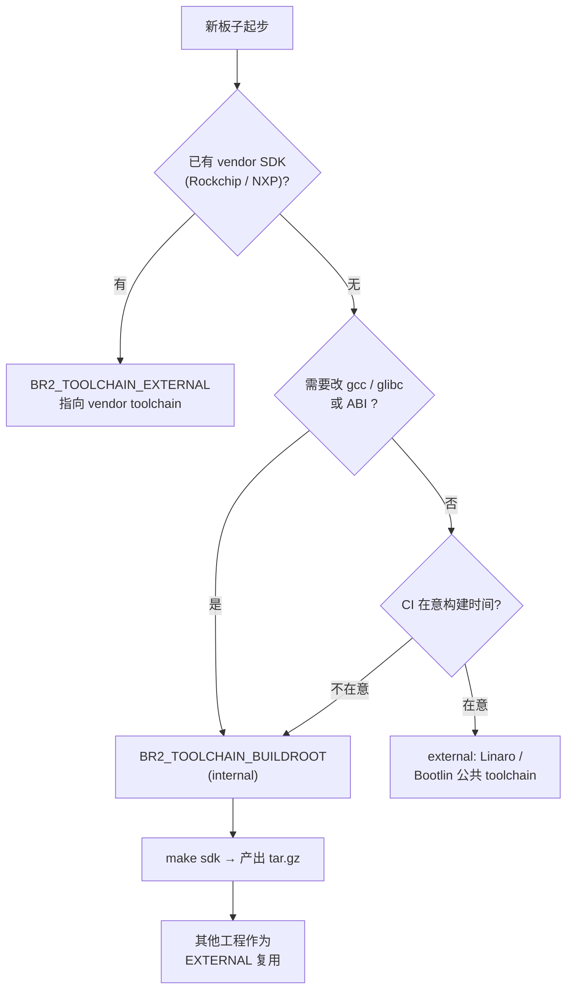
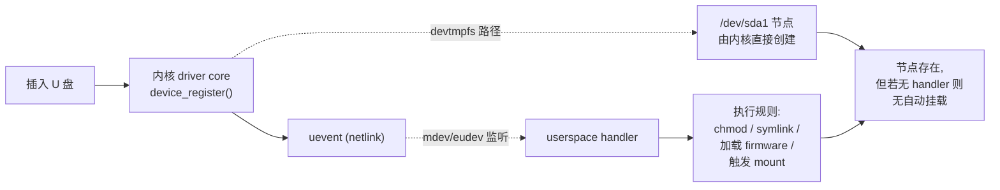
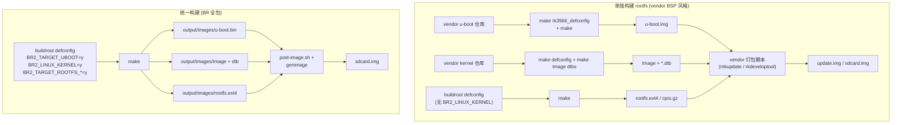

# Buildroot 配置全景 — 工具链 / 设备节点 / Init / 整机协同

> [!note]
> **Ref:**
> - [Buildroot manual §3 General architecture](https://buildroot.org/downloads/manual/manual.html#_general_architecture)
> - [Buildroot manual §6.2 toolchain backend](https://buildroot.org/downloads/manual/manual.html#_cross_compilation_toolchain)
> - [Buildroot manual §17 customize](https://buildroot.org/downloads/manual/manual.html#customize)
> - [Buildroot manual §20 makedev / device table](https://buildroot.org/downloads/manual/manual.html#makedev-syntax)
> - 本地源码：`/home/pi/imx/sdk/tspi-rk3566-sdk/buildroot/`
> - 本地配置参考：[rockchip/base/common.config](../../../sdk/tspi-rk3566-sdk/buildroot/configs/rockchip/base/common.config)、[system/Config.in](../../../sdk/tspi-rk3566-sdk/buildroot/system/Config.in)


## 1. Toolchain（工具链）

### 1.1 Internal vs External 后端

menuconfig 路径：`Toolchain → Toolchain type`，对应 `BR2_TOOLCHAIN_BUILDROOT` 与 `BR2_TOOLCHAIN_EXTERNAL`。

| 维度 | Internal (`BR2_TOOLCHAIN_BUILDROOT=y`) | External (`BR2_TOOLCHAIN_EXTERNAL=y`) |
|---|---|---|
| 集成性 / 可控性 | 完全可控，binutils / gcc / C 库版本、patch 由 buildroot 决定 | 受限于第三方 release（Linaro / ARM / Bootlin / vendor BSP），只能调用其 sysroot |
| 首次构建时间 | 30 min – 2 h（要从头编 binutils → gcc-stage1 → C 库 → gcc-stage2） | 解压几秒，立刻进入用户空间构建 |
| 体积 / 可复用性 | 每次 defconfig 都重编一次（除非走 ccache + per-package build） | 一份 SDK 可被多个板子 / 多个 buildroot 树共享 |
| 调试能力 | 可直接打 gcc / glibc patch、改 `BR2_GCC_VERSION_*`、加 `--enable-*` flag | 黑盒，遇到 glibc bug 只能等上游 |
| 升级路径 | 跟 buildroot release 走，节奏与 Kbuild 同步 | 跟 Linaro / Bootlin toolchain 库走，自主选版 |
| 典型场景 | 自研 SoC、要改编译器 ABI、教学/研究 | 量产 BSP、vendor 锁定 toolchain（如 Rockchip 给的 aarch64-linux-gnu） |

经验：**第一次跑通用 internal**（自己掌握每一个变量），**量产线和 CI 切到 external**（保证 reproducible、节省构建时间）。tspi-rk3566 自身选择是 internal + glibc，见 [rockchip/base/common.config:20-21](../../../sdk/tspi-rk3566-sdk/buildroot/configs/rockchip/base/common.config)：

```text
BR2_TOOLCHAIN_BUILDROOT_GLIBC=y
BR2_TOOLCHAIN_BUILDROOT_CXX=y
```

### 1.2 C 库三选

menuconfig 路径：`Toolchain → C library`，三选一：

| C 库 | 旋钮 | 体积量级 | 适用场景 | 主要短板 |
|---|---|---|---|---|
| **glibc** | `BR2_TOOLCHAIN_BUILDROOT_GLIBC` | ~8 MB+ | 兼容性最好；桌面级软件、Qt、Chromium、Java 几乎"开箱即用"；systemd 默认前提 | 体积大；不适合 < 16 MB flash 的 deeply-embedded |
| **musl** | `BR2_TOOLCHAIN_BUILDROOT_MUSL` | ~600 KB | 轻量、静态链接友好、严格 POSIX；容器镜像、网关设备 | 部分软件（glibc-only 扩展、`__GLIBC_PREREQ`）不兼容；systemd 不支持 |
| **uClibc-ng** | `BR2_TOOLCHAIN_BUILDROOT_UCLIBC` | ~400 KB（可裁剪到更小） | 极致体积、支持 MMU-less（noMMU Cortex-M / Nios II / Blackfin） | 软件适配差；线程模型选项多、配错易踩坑 |

> i.MX6ULL（Cortex-A7，有 MMU、glibc 完全可用）和 RK3566（Cortex-A55）都没有体积压力，默认 glibc 最省事；如果是 Cortex-M7 + uClinux 走 noMMU，才需要认真考虑 uClibc-ng。

### 1.3 用 buildroot 产出外部 SDK 给别的项目用

Buildroot 既能消费 external toolchain，也能**导出**自己 internal 编出的 toolchain，让别的项目（裸驱动开发 / CI / 第二个 buildroot 树）拿来用：

```bash
# 1. 在 menuconfig 里确认 internal toolchain（默认即是）
make menuconfig
#    Toolchain → Toolchain type → Buildroot toolchain
#    Toolchain → C library      → glibc
#    Toolchain → GCC compiler Version → BR2_TOOLCHAIN_BUILDROOT_GCC_AT_LEAST_*

# 2. 产出 SDK tarball（见 Makefile:651 target "sdk"）
make sdk
#    输出：output/images/<arch>-buildroot-linux-gnu_sdk-buildroot.tar.gz
#    或解压形态：output/host/  （已 fix-rpath + relocate-sdk.sh 处理）

# 3. 在新机器上解压、重定位
tar xf aarch64-buildroot-linux-gnu_sdk-buildroot.tar.gz -C /opt/
cd /opt/aarch64-buildroot-linux-gnu_sdk-buildroot
./relocate-sdk.sh        # 重写 sysroot 内部硬编码路径
```

把这份 SDK **塞回 buildroot 当 external toolchain** 用：

```text
BR2_TOOLCHAIN_EXTERNAL=y
BR2_TOOLCHAIN_EXTERNAL_CUSTOM=y
BR2_TOOLCHAIN_EXTERNAL_PREINSTALLED=y
BR2_TOOLCHAIN_EXTERNAL_PATH="/opt/aarch64-buildroot-linux-gnu_sdk-buildroot"
BR2_TOOLCHAIN_EXTERNAL_GCC_x_y=y
BR2_TOOLCHAIN_EXTERNAL_HEADERS_x_y=y
BR2_TOOLCHAIN_EXTERNAL_CUSTOM_GLIBC=y
```

也可以脱离 menuconfig 直接 sed 改 `.config`（CI 友好）：

```bash
sed -i \
  -e 's|^# BR2_TOOLCHAIN_EXTERNAL .*|BR2_TOOLCHAIN_EXTERNAL=y|' \
  -e '$aBR2_TOOLCHAIN_EXTERNAL_PATH="/opt/aarch64-buildroot-linux-gnu_sdk-buildroot"' \
  .config
make olddefconfig
```

工具链后端选择流程：




## 2. /dev 管理（设备节点创建）

menuconfig 路径：`System configuration → /dev management`，四选一（注意：选择 `BR2_INIT_SYSTEMD` 时此选项被强制为 eudev，没有选择窗口）。源码定义见 [system/Config.in](../../../sdk/tspi-rk3566-sdk/buildroot/system/Config.in)。

| 方案 | 旋钮 | 何时创建节点 | 谁负责 | 适用场景 | 风险点 |
|---|---|---|---|---|---|
| **Static** | `BR2_ROOTFS_DEVICE_CREATION_STATIC` | rootfs 打包时 `makedevs` 一次性 mknod | `system/device_table_dev.txt` + `BR2_ROOTFS_DEVICE_TABLE` | 极简、固定硬件、无热插拔、no `CONFIG_DEVTMPFS` 的内核 | 插 U 盘后 `/dev/sda1` 不会冒出来；表里没列的就用不了 |
| **devtmpfs only** | `BR2_ROOTFS_DEVICE_CREATION_DYNAMIC_DEVTMPFS` | 内核启动期由 driver core 自动 `device_create()` | kernel `CONFIG_DEVTMPFS` + `CONFIG_DEVTMPFS_MOUNT` | 嵌入式入门最常用；只关心"内核自带的"设备 | 没有 uevent userspace handler；不会自动加载 firmware；不会触发 hotplug 脚本 |
| **devtmpfs + mdev** | `BR2_ROOTFS_DEVICE_CREATION_DYNAMIC_MDEV` | 内核 uevent → busybox mdev | busybox mdev + `/etc/mdev.conf` | 想要热插拔但又不想引入 udev 那一坨依赖 | mdev rule 语法极简陋；不支持 udev 的 SUBSYSTEM 嵌套 / TAG / SYMLINK+= 等高级特性 |
| **devtmpfs + eudev** | `BR2_ROOTFS_DEVICE_CREATION_DYNAMIC_EUDEV` | uevent → udev daemon (eudev) | eudev rules（`/lib/udev/rules.d/*.rules`） | 桌面级 / 复杂热插拔策略 / 需 firmware 加载 / 需持久 symlink | 体积涨 ~2-3 MB；依赖 `BR2_USE_WCHAR`（musl 默认 OK，uClibc 要开 wchar） |
| **udev via systemd** | 隐式：`BR2_INIT_SYSTEMD=y` 时 | systemd-udevd | systemd 自带 udev | 已经决定上 systemd 的系统 | 与 init 强绑定，不能单独换掉 |

tspi-rk3566 默认走 **eudev**（[rockchip/base/base.config:6](../../../sdk/tspi-rk3566-sdk/buildroot/configs/rockchip/base/base.config)），因为它要支持 USB 热插拔、HDMI 热插拔、firmware 加载（Mali GPU / Wi-Fi）。

行为对照（以 `/dev/sda1` 为例）：



要点：**devtmpfs 创建"节点"，udev/mdev 跑"规则"**。仅 devtmpfs 也能让节点出现，但 firmware 加载、systemd 触发挂载、按 vendor:product 起 symlink 这些事都需要 userspace handler。


## 3. Init system（init 系统）

menuconfig 路径：`System configuration → Init system`。源码见 [system/Config.in](../../../sdk/tspi-rk3566-sdk/buildroot/system/Config.in)：`BR2_INIT_BUSYBOX` / `BR2_INIT_SYSV` / `BR2_INIT_OPENRC` / `BR2_INIT_SYSTEMD` / `BR2_INIT_NONE`。重点对比常用三种。

### 3.1 busybox-init（默认，最轻量）

- 旋钮：`BR2_INIT_BUSYBOX=y`（默认值）
- PID 1 = `/sbin/init` → busybox applet
- 配置文件：`/etc/inittab`，**语法是 busybox 私有的**，不完全兼容 sysvinit。每行格式 `<id>:<runlevels>:<action>:<process>`，但 `<id>` 是 tty 设备名而不是 sysvinit 的两字符 id，`<runlevels>` 通常留空。

最小 `/etc/inittab` 示例：

```text
# /etc/inittab - busybox-init 风格
::sysinit:/etc/init.d/rcS
::respawn:-/sbin/getty -L ttyS2 1500000 vt100
::ctrlaltdel:/sbin/reboot
::shutdown:/etc/init.d/rcK
::shutdown:/sbin/swapoff -a
::shutdown:/bin/umount -a -r
::restart:/sbin/init
```

执行 `/etc/init.d/rcS` 时会依次跑 `/etc/init.d/S??*` 脚本，启动顺序由数字前缀决定。

### 3.2 sysvinit（经典 System V）

- 旋钮：`BR2_INIT_SYSV=y`，依赖 `BR2_USE_MMU`
- PID 1 = sysvinit `/sbin/init`
- `/etc/inittab` 用经典 runlevel 语义（0–6，S）；`/etc/init.d/rcS` 由 `start-stop-daemon` 控制服务
- 适合需要 runlevel 切换（如 single user mode）、习惯 sysvinit 语义的场景

### 3.3 systemd（重型，unit-driven）

- 旋钮：`BR2_INIT_SYSTEMD=y`
- 隐含依赖（menuconfig 会自动 select / 拒绝）：
  - **C 库必须是 glibc**（musl / uClibc 不支持，依赖 NSS 与 glibc-only API）
  - `BR2_USE_WCHAR=y`、`BR2_TOOLCHAIN_HAS_THREADS=y`、`BR2_TOOLCHAIN_HEADERS_AT_LEAST_4_15`
  - kernel 必须打开 `CONFIG_CGROUPS`、`CONFIG_FHANDLE`、`CONFIG_INOTIFY_USER`、`CONFIG_SIGNALFD`、`CONFIG_TIMERFD`、`CONFIG_EPOLL`、`CONFIG_NET`、`CONFIG_SYSFS`、`CONFIG_PROC_FS`，建议同时开 cgroup v2
  - `/dev` 管理被强制为 eudev/systemd-udevd
- 配置形态：`/etc/systemd/system/*.service` unit file，依赖关系由 `After=` / `Wants=` 显式表达
- 适合：需要并行启动、需 socket activation、需 D-Bus 完整生态、需 journald 日志管理的较重型设备

### 3.4 决策表

| 需求 | 推荐 | 备注 |
|---|---|---|
| rootfs < 4 MB，几乎没有服务 | **busybox-init** | 默认；inittab 几行搞定 |
| 启动时间 < 1 s（cold boot 极致） | busybox-init + 静态链接 | systemd 至少 2–5 s 起步 |
| 强依赖管理 / socket activation / D-Bus | **systemd** | 必须 glibc |
| 多 runlevel、要照搬 Debian 风格脚本 | sysvinit | 已被 systemd 取代，新项目不推荐 |
| musl + 想要轻量服务管理 | busybox-init 或 OpenRC | OpenRC 是 Gentoo/Alpine 阵营选择 |
| 需要单独热补丁某服务 / live reload | systemd | `systemctl daemon-reload` |
| 量产 IoT 网关、想要 OTA 友好 | systemd | unit + drop-in 文件易于增量更新 |


## 4. 单独构建 rootfs vs 统一构建 uboot+kernel+rootfs

### 4.1 两种 buildroot 用法

Buildroot 自身能力上**完全可以**统一管理 bootloader、kernel、rootfs，但大量 vendor BSP（Rockchip、NXP、Allwinner、瑞萨）出于版本控制、签名、私有补丁等理由，选择**让 buildroot 只管用户空间**，bootloader 和 kernel 走 vendor 自有的构建脚本。

| 维度 | 单独构建 rootfs | 统一构建（BR 全包） |
|---|---|---|
| 谁出 u-boot.img | vendor 脚本（如 rk make.sh / NXP imx-mkimage） | buildroot：`BR2_TARGET_UBOOT=y` |
| 谁出 zImage / Image / dtb | vendor kernel 仓库的 `make ARCH=arm64 defconfig && make` | buildroot：`BR2_LINUX_KERNEL=y` + `BR2_LINUX_KERNEL_DEFCONFIG` |
| 版本收敛 | 三套独立 git 仓库，要靠人 / repo manifest 对齐 | 一个 buildroot defconfig 锁住三方版本 |
| 适用 | 量产 BSP、私有 kernel patch、kernel/u-boot 团队独立 | mainline-only 项目、CI 一键复现、教学/科研 |
| 切版风险 | 各自迭代，rootfs 可能跟 kernel 头文件错位 | defconfig 一改全改，单点失误影响面广 |
| `output/images/` 内容 | 仅 rootfs.tar / rootfs.ext4 / rootfs.cpio.gz | 多出 `zImage` / `Image` / `*.dtb` / `u-boot.bin` / `u-boot.img` |

tspi-rk3566 就是典型**单独构建 rootfs**：kernel-6.1 和 u-boot 是独立 git submodule，buildroot 的 defconfig 里既不开 `BR2_LINUX_KERNEL` 也不开 `BR2_TARGET_UBOOT`（确认见 [rockchip/base/common.config](../../../sdk/tspi-rk3566-sdk/buildroot/configs/rockchip/base/common.config)，仅控制用户空间）。

### 4.2 触发统一构建的旋钮

```text
# 让 buildroot 顺带编 kernel
BR2_LINUX_KERNEL=y
BR2_LINUX_KERNEL_CUSTOM_GIT=y                    # 或 _TARBALL / _LATEST_VERSION
BR2_LINUX_KERNEL_CUSTOM_REPO_URL="https://..."
BR2_LINUX_KERNEL_CUSTOM_REPO_VERSION="v6.1"
BR2_LINUX_KERNEL_DEFCONFIG="multi_v7"            # 或自定义 defconfig 路径
BR2_LINUX_KERNEL_DTS_SUPPORT=y
BR2_LINUX_KERNEL_INTREE_DTS_NAME="rockchip/rk3566-tspi"
BR2_LINUX_KERNEL_IMAGE=y                         # zImage / Image / uImage

# 让 buildroot 顺带编 u-boot
BR2_TARGET_UBOOT=y
BR2_TARGET_UBOOT_BOARD_DEFCONFIG="evb-rk3566"
BR2_TARGET_UBOOT_CUSTOM_VERSION=y
BR2_TARGET_UBOOT_CUSTOM_VERSION_VALUE="2024.01"
BR2_TARGET_UBOOT_FORMAT_BIN=y                    # 产 u-boot.bin
BR2_TARGET_UBOOT_BOOT_SCRIPT=y                   # 可选：boot.scr
```

打开后 `make` 一次性产出（落点：`output/images/`）：

```
output/images/
├── Image / zImage / *.dtb       ← 来自 BR2_LINUX_KERNEL
├── u-boot.bin / u-boot.img      ← 来自 BR2_TARGET_UBOOT
├── rootfs.ext4 / rootfs.cpio.gz ← 来自 BR2_TARGET_ROOTFS_*
└── sdcard.img (可选)            ← 来自 board/<vendor>/genimage.cfg + post-image.sh
```

### 4.3 流水线对比



### 4.4 选型建议

- **学习 / 实验 / 复现 mainline**：统一构建，一份 defconfig 锁住所有版本。
- **基于 vendor BSP 做产品**：单独构建 rootfs，让 vendor 的 kernel / u-boot 团队保持独立节奏；buildroot 仅作用户空间打包工具，避免与 vendor 的 build system 打架。
- **混合策略**（常见）：u-boot 走 vendor 脚本，kernel 和 rootfs 走 buildroot——这种情形下只开 `BR2_LINUX_KERNEL`，关闭 `BR2_TARGET_UBOOT`，并通过 `BR2_LINUX_KERNEL_CUSTOM_GIT` 指向私有 kernel 仓库。


## 5. 配置 cheatsheet

| 你想要 | 改这几个旋钮 |
|---|---|
| 让构建快 5–10 倍（牺牲可控） | `BR2_TOOLCHAIN_EXTERNAL=y` + 指向公共 SDK |
| 体积最小 rootfs | `BR2_TOOLCHAIN_BUILDROOT_MUSL=y` + `BR2_INIT_BUSYBOX=y` + `BR2_ROOTFS_DEVICE_CREATION_DYNAMIC_DEVTMPFS=y` |
| 桌面级功能完备 | `BR2_TOOLCHAIN_BUILDROOT_GLIBC=y` + `BR2_INIT_SYSTEMD=y`（强制 eudev） |
| 要热插拔 + 不上 systemd | `BR2_INIT_BUSYBOX=y` + `BR2_ROOTFS_DEVICE_CREATION_DYNAMIC_EUDEV=y` |
| 把自家 toolchain 发给同事 | `make sdk`，把 `output/images/*_sdk-buildroot.tar.gz` 发出去 |
| 一键复现 mainline 整机 | `BR2_TARGET_UBOOT=y` + `BR2_LINUX_KERNEL=y` 锁定 git revision |
