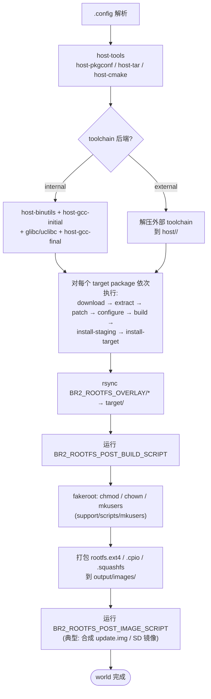
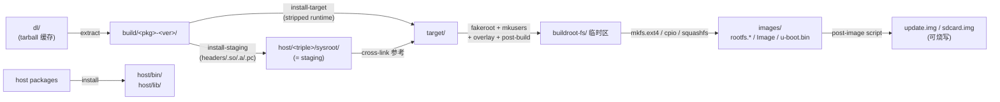

# Buildroot 日常使用手册 —— make 目标、依赖分析、产物布局与 SDK 发布

> [!note]
> **Ref:**
> - 本地源码: `/home/pi/imx/sdk/tspi-rk3566-sdk/buildroot/Makefile`、`package/pkg-generic.mk`
> - 本地手册: `/home/pi/imx/sdk/tspi-rk3566-sdk/buildroot/docs/manual/rebuilding-packages.adoc`、`using-buildroot-toolchain.adoc`、`make-tips.adoc`
> - 本地实测: `/home/pi/imx/sdk/tspi-rk3566-sdk/buildroot/output/latest/`
> - 上游文档: [Buildroot Manual §8 make tips](https://buildroot.org/downloads/manual/manual.html#make-tips)、[§9.4 graphs](https://buildroot.org/downloads/manual/manual.html#graph-depends)
> - 关联笔记: [[01-build-sh]]、[[03-buildroot-board]]


## 1. make 技巧 / 构建流程全景 / 全量重构时机


### 1.1 常用 make 目标速查表

下表中所有目标都在 `Makefile` 第 1163~1247 行 `help:` 中被官方声明，可执行 `make help` 复核。

| 类别 | 目标 | 作用 / 关键行为 |
|---|---|---|
| 全局 | `make` / `make all` | 构建到 `world → target-post-image`，产出 `output/images/` 下的最终镜像 |
| 全局 | `make V=1 <target>` | 打印所有底层命令（make-tips.adoc §8） |
| 全局 | `make list-defconfigs` | 列出 `configs/*_defconfig` 与外部 BR2-EXTERNAL 的 defconfig |
| 全局 | `make show-targets` | 打印当前 `.config` 选中的所有 PACKAGES + ROOTFS targets |
| 全局 | `make show-build-order` | 按依赖拓扑顺序打印构建顺序 |
| 全局 | `make printvars VARS='BUSYBOX_%DEPENDENCIES'` | dump 内部 make 变量 |
| 单包 | `make <pkg>` | 跑该包的 download → extract → patch → configure → build → install 全链 |
| 单包 | `make <pkg>-source` | 仅下载源码到 `dl/` |
| 单包 | `make <pkg>-extract` / `-patch` | 解压、打 patch（卡在哪一阶段调试时用） |
| 单包 | `make <pkg>-configure` / `-build` | 推进到 configure / build 步停下来 |
| 单包 | `make <pkg>-rebuild` | 跳过 configure，从 build 步重新跑（修了源码就用它） |
| 单包 | `make <pkg>-reconfigure` | 从 configure 步重新跑（动了 configure flags / Kconfig 的子选项） |
| 单包 | `make <pkg>-reinstall` | 仅重做 install staging / install target |
| 单包 | `make <pkg>-dirclean` | 删除 `output/build/<pkg>-<ver>/`，下次 `make <pkg>` 等同从零开始 |
| 单包 | `make <pkg>-show-depends` | 列出直接依赖 |
| 单包 | `make <pkg>-show-rdepends` | 反向依赖（谁依赖我） |
| 单包 | `make <pkg>-show-recursive-depends` | 递归依赖闭包 |
| 单包 | `make <pkg>-graph-depends` / `-graph-rdepends` | 单包子图（PDF/PNG/SVG） |
| Kconfig | `make linux-menuconfig` | 进 kernel `.config`；改完 `linux-savedefconfig` 回写到 `BR2_LINUX_KERNEL_CUSTOM_CONFIG_FILE` 指向的 defconfig |
| Kconfig | `make busybox-menuconfig` | 进 busybox 配置；保存到 `BR2_PACKAGE_BUSYBOX_CONFIG` |
| Kconfig | `make uboot-menuconfig` / `-savedefconfig` | 仅当 U-Boot 启用 Kconfig 后端时可用 |
| Kconfig | `make savedefconfig` | 把当前 buildroot `.config` 折叠成 minimal `<board>_defconfig` 回写到 `BR2_DEFCONFIG` |
| 清理 | `make clean` | 删除 `host/ staging/ target/ build/ images/ graphs/`，保留 `.config` 与 `dl/` |
| 清理 | `make distclean` | 在 `make clean` 基础上再删 `.config` 与 `dl/`（仅当 `O=$(CURDIR)/output` 时） |
| 发布 | `make sdk` | 生成可重定位 SDK tarball 到 `output/images/<triple>_sdk-buildroot.tar.gz` |
| 发布 | `make prepare-sdk` | 仅原地 fix-rpath、植入 `relocate-sdk.sh`，不打包 |
| 分析 | `make graph-depends` | 全局依赖图 → `output/graphs/graph-depends.pdf` |
| 分析 | `make graph-build` | 各包各阶段耗时柱状图/饼图/时间线 → `output/graphs/build.*.pdf` |
| 分析 | `make graph-size` | rootfs 体积占比图 + 包/文件级 CSV |
| 合规 | `make legal-info` | 收集所有包的 license + 源码到 `output/legal-info/` |
| 离线 | `make source` | 拉齐所有选中包源码到 `dl/`，便于离线构建 |


### 1.2 构建流程全景

`make` 的内部时序如下（依据 `Makefile` 中 `world: target-post-image` 与 `pkg-generic.mk` 的 stamp 链）：



每个 package 的子流程由 `package/pkg-generic.mk` 内的 stamp 文件驱动（`.stamp_downloaded` → `.stamp_extracted` → `.stamp_patched` → `.stamp_configured` → `.stamp_built` → `.stamp_staging_installed` → `.stamp_target_installed`）。`make <pkg>-rebuild` 实际上就是删除 `.stamp_built` 之后的 stamp 再触发构建。


### 1.3 全量重构 vs 增量重构 决策表

来源: `docs/manual/rebuilding-packages.adoc`。

| 修改类型 | 推荐操作 | 原因 |
|---|---|---|
| 改 target 架构 (`BR2_ARCH`, FPU/ABI) | `make distclean` + 重选 defconfig | ABI 不兼容，已构建的 .a/.so 全部作废 |
| 改 toolchain 后端 / C 库 / gcc 版本 | `make distclean` | sysroot 完全改变 |
| 改 init 系统 (`BR2_INIT_*`) | `make clean all` | 影响 inittab、systemd unit 等 skeleton 文件 |
| 改 rootfs skeleton | `make clean all` | 不被 Buildroot 检测 |
| 新增一个 package | 直接 `make` | Buildroot 检测无 stamp，按需补建 |
| 已构建包启用了新 sub-option | `make <pkg>-reconfigure`（若该子选项影响 configure）或 `<pkg>-rebuild` | Buildroot 不追踪 Kconfig sub-option 变化 |
| 启用了被其他包可选依赖的库（如 ctorrent 已建后开 openssl） | `make <依赖方>-dirclean && make` 或全量 `make clean all` | 已建方不会自动重链新 lib |
| 修改 `BR2_ROOTFS_OVERLAY` / post-build / post-image 脚本 | 直接 `make` | rootfs 装配阶段每次都重跑 |
| 删除一个 package | `make clean all` | Buildroot 不追踪文件归属，无法做"反安装" |
| 修改单个包的 patch 或源码 | `make <pkg>-rebuild`（改源码）或 `<pkg>-dirclean && make <pkg>`（改 patch） | stamp 控制 |
| 切换 defconfig | `make distclean && make <new>_defconfig && make` | 避免残留旧 host/staging |

经验法则: **遇到诡异构建错误，先做一次 `make clean all`。若错误依然复现，再去报 bug。**


## 2. 软件包依赖 / 构建时长 / 大小分析

三类分析图统一落到 `output/graphs/`，依赖 `graphviz` 的 `dot`。输出格式由 `BR_GRAPH_OUT` 控制，默认 `pdf`（`Makefile` L241），可改 `BR_GRAPH_OUT=png`/`svg`。


### 2.1 依赖分析

```sh
# 全局依赖图（包含所有选中 package）
make graph-depends
# → output/graphs/graph-depends.pdf + .dot

# 单包反向依赖：谁会拉它进来
make openssl-graph-rdepends
# → output/graphs/openssl-graph-rdepends.pdf

# 文本式快速看
make openssl-show-rdepends
# 输出形如: ctorrent curl libcurl wpa-supplicant ...

# 递归依赖闭包（看一个包到底拖进来多少子树）
make qt5base-show-recursive-depends | wc -l
```

读图约定（来源: `support/scripts/graph-depends`）：

- **实线** = mandatory dependency（写在 `<PKG>_DEPENDENCIES` 里的）
- **虚线** = optional / 由 Kconfig `select` 引入的可选依赖
- 节点颜色: target package 蓝、host package 橙、virtual package 灰

定向过滤可通过 `BR2_GRAPH_DEPS_OPTS` 注入 graph-depends 脚本参数（如 `--exclude-pkg=host-*` 去掉 host 包）。


### 2.2 构建时长分析

`make graph-build` 依赖 `output/build/build-time.log`，该文件由 `pkg-generic.mk` 在每个 stamp 切换时追加一行 `timestamp:start|end:step:pkg`。本地实测样例:

```
$ head -4 output/latest/build/build-time.log
1777208768.734930964:start:download            : host-skeleton
1777208768.750256353:end  :download            : host-skeleton
1777208768.775958919:start:extract             : host-skeleton
1777208768.796867220:end  :extract             : host-skeleton
```

调用:

```sh
make graph-build
# 产出（Makefile L912 起）:
#   output/graphs/build.hist-name.pdf      按包名排序的耗时柱状图
#   output/graphs/build.hist-build.pdf     按编译顺序排序
#   output/graphs/build.hist-duration.pdf  按耗时降序 ← 找 long pole 用它
#   output/graphs/build.pie-packages.pdf   各包占比饼图
#   output/graphs/build.pie-steps.pdf      各阶段(download/extract/build/...) 占比
#   output/graphs/build.timeline.pdf       甘特图式时间线
```

典型 long pole（按经验排序）: `host-gcc-final` > `glibc` > `qt5base` > `linux` > `webkit`/`chromium`。若 toolchain 后端选 external pre-built 可直接砍掉前两项。


### 2.3 软件包大小分析

```sh
make graph-size
# Makefile L941, 走 support/scripts/size-stats:
#   output/graphs/graph-size.pdf       rootfs 内每个 package 占用饼图
#   output/graphs/file-size-stats.csv  按文件粒度统计
#   output/graphs/package-size-stats.csv  按 package 粒度统计
```

`package-size-stats.csv` 字段（`package`, `file size`, `% of total`）可直接 `sort -t, -k3 -n -r | head -20` 找出 rootfs 体积前 20 名做裁剪。

**staging vs target 必须分清**：

| 维度 | `output/staging/`（= `host/<triple>/sysroot/`） | `output/target/` |
|---|---|---|
| 包含 | `.so` + `.a` + 头文件 + `.pc` + libtool `.la` | 仅运行所需 `.so`，已 strip |
| 作用 | 给 cross-toolchain 链接用 | 装配进 rootfs 镜像 |
| 大小 | 通常是 target 的 3~10 倍 | rootfs 实际体积 |
| 谁看 | 应用开发者 | 终端设备 |

`make graph-size` 只统计 `target/`，不会把 `staging/` 的开发文件算进去——这正是它能作为裁剪决策依据的原因。


## 3. 构建产物梳理（output/ 目录布局）

本地实测（`/home/pi/imx/sdk/tspi-rk3566-sdk/buildroot/output/latest/`，本质是指向 `rockchip_rk3566_taishanpi_1m_v10/rockchip_rk3566/` 的 symlink）:

```
output/
├── build/        # 解压后的 package 源码树 + .stamp_* 标记 + build-time.log
│   ├── busybox-1.37.0/
│   ├── linux-custom/
│   ├── alsa-lib-1.2.11/
│   ├── buildroot-config/  # mconf/conf 等 host kconfig 工具
│   ├── buildroot-fs/      # rootfs 临时装配区
│   └── build-time.log
├── host/         # 给本机用的工具集 + cross-toolchain + sysroot
│   ├── bin/      # arm-buildroot-linux-gnueabihf-gcc / pkg-conf / cmake ...
│   ├── lib/      # host 工具依赖的 host 端 .so
│   ├── share/
│   └── aarch64-buildroot-linux-gnu/   # = $(HOST_DIR)/<triple>/
│       └── sysroot/                   # ← 应用开发要的 sysroot
│           ├── usr/include/
│           ├── usr/lib/
│           └── lib/
├── staging       # → symlink 到 host/<triple>/sysroot （向后兼容旧布局）
├── target/       # 即将装入 rootfs 的内容（已 strip，缺 /dev、缺 setuid 位）
│   ├── bin/  etc/  lib/  usr/ ...
│   └── THIS_IS_NOT_YOUR_ROOT_FILESYSTEM   ← 字面警告文件
├── images/       # 真正发到板子的产物
│   ├── rootfs.ext4
│   ├── rootfs.cpio.gz
│   ├── rootfs.squashfs
│   ├── rootfs.tar
│   ├── Image            # kernel
│   ├── *.dtb
│   └── u-boot.bin
├── graphs/       # 分析图（make graph-* 才会生成）
└── ../../../dl/  # 上游源码包缓存，所有 buildroot 工程共享
```



关键陷阱:

- **`target/` 不能直接 `tar` 出去当 rootfs**：缺 `/dev/console`、缺 setuid 位、属主全是当前 user。Buildroot 在 `support/scripts/mkusers` + fakeroot 阶段才完成这些修正，且产物只体现在 `images/rootfs.*` 里。
- **`output/staging` 是 symlink**（`Makefile` 第 1152 行 `clean:` 中明确以 symlink 处理），实测指向 `host/<triple>/sysroot/`。新 SDK 已不存在独立的 `staging/` 物理目录。
- **`dl/` 一定要做 NFS/共享挂载或显式 `BR2_DL_DIR` 重定向**，否则多工程切换会重复下载几个 GB 的源码。


## 4. `make sdk` —— 把 Buildroot 当 SDK Builder 用


### 4.1 目标与产物

`make sdk` 把 `output/host/` 整体打包成一个 **可重定位** tarball，应用开发者拿到后即可在自己的笔记本上跑 `<triple>-gcc --sysroot=...` 做交叉开发，无需安装 Buildroot 本体。

实现链路（`Makefile` L635~658）:

```
make sdk
 ├─ prepare-sdk: world         # 先确保 world 完成
 ├─ fix-rpath host             # support/scripts/fix-rpath 处理 host/bin/* 的 RPATH
 ├─ fix-rpath staging          # 处理 sysroot 内 .so 的 RPATH
 ├─ ppd-fixup-paths            # 修 per-package-dir 残留路径
 ├─ install relocate-sdk.sh    # support/misc/relocate-sdk.sh → host/relocate-sdk.sh
 ├─ echo $HOST_DIR > host/share/buildroot/sdk-location   # 记录原始路径
 └─ tar czf images/<triple>_sdk-buildroot.tar.gz \
        --transform='s#host/#<triple>_sdk-buildroot/#' \
        host/
```

产物文件名由 `BR2_SDK_PREFIX` 控制，默认是 `$(GNU_TARGET_NAME)_sdk-buildroot`，例如本仓库实际产物为
`output/images/aarch64-buildroot-linux-gnu_sdk-buildroot.tar.gz`。


### 4.2 典型工作流

```sh
# === Buildroot 侧（构建机）===
make sdk
ls -lh output/images/*_sdk-buildroot.tar.gz

# 分发
scp output/images/*_sdk-buildroot.tar.gz dev-laptop:/opt/

# === 应用开发机（dev-laptop）===
ssh dev-laptop
sudo mkdir -p /opt/buildroot-sdk && cd /opt/buildroot-sdk
sudo tar xf /opt/aarch64-buildroot-linux-gnu_sdk-buildroot.tar.gz
cd aarch64-buildroot-linux-gnu_sdk-buildroot/

# 关键一步：重写所有内嵌路径
./relocate-sdk.sh
# → 输出: Relocating the buildroot SDK from /home/pi/imx/.../host to /opt/buildroot-sdk/...

# 可选：source 出 PATH / CC / CXX / CONFIGURE_FLAGS
# (需要先在 buildroot 中勾选 BR2_PACKAGE_HOST_ENVIRONMENT_SETUP)
. ./environment-setup

# 编译
aarch64-buildroot-linux-gnu-gcc hello.c -o hello
file hello   # → ELF 64-bit LSB executable, ARM aarch64
```

`relocate-sdk.sh` 内部用 `sed` 把 `share/buildroot/sdk-location` 里记录的 `OLDPATH` 在所有受影响文件（含 `.la`、`.pc`、wrapper 脚本）里替换成 `NEWPATH`。**一次 SDK 解包后必须运行一次**，否则 pkg-config 解析、libtool 链接都会指向构建机的 `/home/pi/imx/...`。


### 4.3 与 BR2_TOOLCHAIN_EXTERNAL 形成闭环

发布出去的 SDK 也可以被另一个 Buildroot 工程当 **external toolchain** 反吃回来，相关 Kconfig:

| 旋钮 | 取值 |
|---|---|
| `BR2_TOOLCHAIN_EXTERNAL=y` | 启用外部 toolchain |
| `BR2_TOOLCHAIN_EXTERNAL_CUSTOM=y` | 自定义来源 |
| `BR2_TOOLCHAIN_EXTERNAL_PREINSTALLED=y` | 指向已解压目录 |
| `BR2_TOOLCHAIN_EXTERNAL_PATH="/opt/buildroot-sdk/aarch64-buildroot-linux-gnu_sdk-buildroot"` | 即解压并 relocate 后的根 |
| `BR2_TOOLCHAIN_EXTERNAL_GCC_*` / `_HEADERS_*` / `_CUSTOM_GLIBC=y` | 对齐 gcc 版本、kernel headers、C 库类型 |


### 4.4 常见踩坑

| 现象 | 根因 | 解法 |
|---|---|---|
| `pkg-config --cflags foo` 输出 `-I/home/pi/imx/...` 这种构建机路径 | `.pc` 文件未 relocate | 一定要跑 `./relocate-sdk.sh`；或显式 `export PKG_CONFIG_SYSROOT_DIR=$SDK/<triple>/sysroot` 让 pkg-config 在运行时改写 |
| 应用最终链到了 `/usr/lib/x86_64-linux-gnu/libssl.so` 而非 sysroot 内的 ARM libssl | `pkg-config` 默认搜本机 `PKG_CONFIG_PATH` | `export PKG_CONFIG_LIBDIR=$SDK/<triple>/sysroot/usr/lib/pkgconfig`（用 LIBDIR 而非 PATH，前者会覆盖默认路径） |
| SDK tarball 一两 GB 太大 | sysroot 里塞满 `.a` 静态库 + 未 strip 的 host 工具 | 构建前 `BR2_STRIP_strip=y`；分发前手工 `find host/<triple>/sysroot -name "*.a" -delete`（代价：再也不能静态链接） |
| 应用跑在板子上报 `version GLIBC_2.34 not found` | SDK 用 glibc 2.36 编出，板子 rootfs 用 musl 或更旧 glibc | SDK 和 rootfs 必须同构出炉；不要拿别的工程的 SDK 编当前 rootfs |
| `make sdk` 报 `prepare-sdk: world` 失败 | 之前 `world` 没跑过或 build dirty | 先 `make` 把 `world` 跑绿，再 `make sdk` |


---

至此一条完整闭环: **`make` 出 rootfs → `make graph-*` 量化决策 → `make <pkg>-rebuild`/`dirclean` 增量迭代 → `make savedefconfig` 固化配置 → `make sdk` 发布给应用团队**，覆盖 Buildroot 在产品生命周期内 90% 的日常操作。
