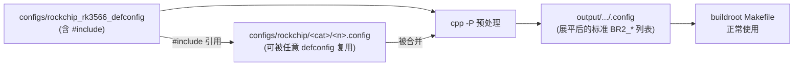
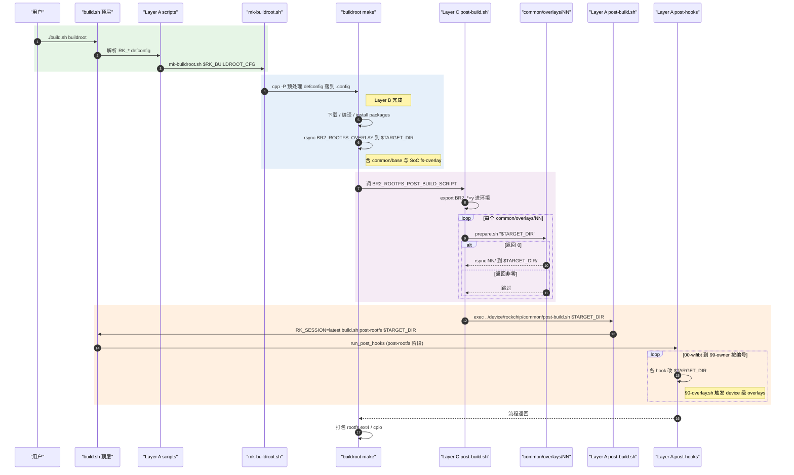
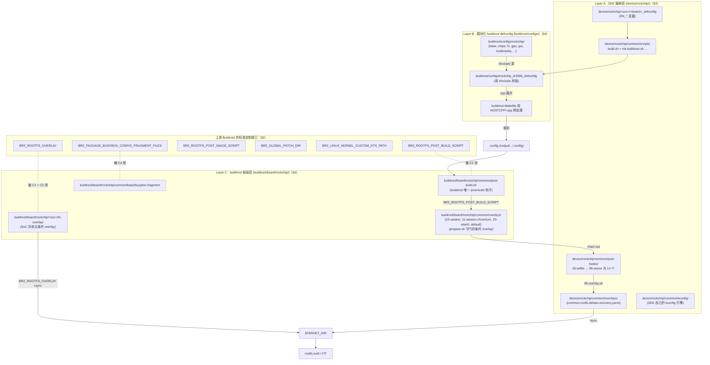

# Buildroot 定制体系：上游接口 / Rockchip 三层架构 / BR2_EXTERNAL / 新包集成 / SDK 应用开发

> [!note]
> **Ref:**
> - SDK 编排层：[`device/rockchip/`](../../../sdk/tspi-rk3566-sdk/device/rockchip/) — 全 SoC 共享脚本与 post-hooks 落在 [`common/`](../../../sdk/tspi-rk3566-sdk/device/rockchip/common/)，板级 defconfig 落在 [`rk3566_rk3568/`](../../../sdk/tspi-rk3566-sdk/device/rockchip/rk3566_rk3568/)
> - buildroot 板级层：[`buildroot/board/rockchip/`](../../../sdk/tspi-rk3566-sdk/buildroot/board/rockchip/)
> - 模块化 defconfig：[`buildroot/configs/rockchip_rk3566_defconfig`](../../../sdk/tspi-rk3566-sdk/buildroot/configs/rockchip_rk3566_defconfig) + [`buildroot/configs/rockchip/`](../../../sdk/tspi-rk3566-sdk/buildroot/configs/rockchip/)
> - 入口：[`build.sh`](../../../sdk/tspi-rk3566-sdk/build.sh) → 实际指向 [`device/rockchip/common/scripts/build.sh`](../../../sdk/tspi-rk3566-sdk/device/rockchip/common/scripts/build.sh)
> - Buildroot 官方手册 §6 §9 §17 §19 — <https://buildroot.org/downloads/manual/manual.html>
> - 合入并替代：[`../tspi/03-buildroot-board.md`](../tspi/03-buildroot-board.md)

## 1. 一图看懂：上游接口 vs Rockchip 的三层架构

> gen from gpt


**核心论点**：

- **上游 buildroot 一共就这么几个 `BR2_*` 钩子**（§2），看似简单。
- Rockchip 没用 `BR2_EXTERNAL`，而是直接 fork 了 buildroot 源码树，**在那几个钩子上叠加了三层包装**（A → B → C）。
- 上面那张图的执行序：**B 解析 .config → C 板级 overlay + 条件 overlay → 通过 C 的 post-build chain 回 A 的 post-hooks**。三层共用 `$TARGET_DIR`，按图中箭头方向逐次叠加。
- 要改任何东西，先定位"它属于哪一层"。改错层就要么不生效，要么 `make` 一次被覆盖。


## 2. 上游 buildroot 的标准定制接口（基线）

Buildroot upstream **没有"板级目录自动生效"概念**。仓库根 `board/` 只是一个被动资源池——只有 defconfig 把它的路径写进下表里的某个 `BR2_*` 变量，对应文件才会被拉进流水线。

| Buildroot 变量 | 触发时机 | 典型放置内容 | tspi 里谁在用 |
|---|---|---|---|
| `BR2_ROOTFS_OVERLAY` | rootfs 打包前，对 `$TARGET_DIR` 做 rsync 合并（支持空格分隔多路径） | `fs-overlay/` 目录 | §5 `buildroot/board/rockchip/<soc>/fs-overlay/` |
| `BR2_ROOTFS_POST_BUILD_SCRIPT` | overlay 合并完之后、生成镜像之前 | shell 脚本，参数为 `$TARGET_DIR` | §5 `buildroot/board/rockchip/common/post-build.sh` |
| `BR2_ROOTFS_POST_IMAGE_SCRIPT` | rootfs 镜像（ext4/squashfs/cpio）做完之后 | `post-image.sh` + `genimage.cfg.in` | tspi 里**空**（最终镜像由 Layer A 拼） |
| `BR2_LINUX_KERNEL_CUSTOM_DTS_PATH` | 内核编译期 | 板级 `.dts` / `.dtsi` 补丁 | tspi 不用（内核由 SDK 单独编） |
| `BR2_GLOBAL_PATCH_DIR` | 各 package 解包后 patch 阶段 | `<dir>/<pkgname>/*.patch` | 私有补丁集中点 |
| `BR2_PACKAGE_BUSYBOX_CONFIG_FRAGMENT_FILES` | busybox 配置阶段 | `<file>.fragment`（含 `CONFIG_*=y/n`） | §5 `common/base/busybox.fragment` |

> [!IMPORTANT]
> 看新板子第一步：在 `output/.../.config` 里 grep `^BR2_ROOTFS_`、`^BR2_GLOBAL_PATCH_DIR`、`^BR2_PACKAGE_BUSYBOX_CONFIG_FRAGMENT_FILES`，**所有定制入口就这几个**。其它都是这些钩子被 vendor 套出来的二级机制。


## 3. Layer A：SDK 编排层（`device/rockchip/`）

这一层不属于 buildroot，是 Rockchip 自己写的"包装壳"。所有顶层符号链接都指向它：

```text
tspi-rk3566-sdk/
├── Makefile  -> device/rockchip/common/Makefile
├── README.md -> device/rockchip/common/README.md
├── build.sh  -> device/rockchip/common/scripts/build.sh        ← 真正入口
├── common    -> device/rockchip/common
└── device/rockchip/
    ├── common/                    ← 全 SoC 共享层
    │   ├── scripts/               ← mk-buildroot.sh / mk-kernel.sh / build.sh ...
    │   ├── kconfig/               ← SDK 自己的 kconfig 引擎
    │   ├── configs/               ← Config.in.buildroot / Config.in.kernel ...
    │   ├── post-hooks/            ← 00-wifibt ... 99-owner
    │   ├── overlays/              ← 5 大类条件 overlay
    │   ├── post-build.sh          ← 触发 post-rootfs 流程的入口
    │   ├── build-hooks/           ← 构建期钩子（per-stage hook）
    │   └── extra-parts/           ← 额外分区生成
    └── rk3566_rk3568/             ← SoC 级
        ├── rockchip_rk3566_taishanpi_1m_v10_defconfig   ← 板级 defconfig (RK_*)
        ├── parameter-buildroot-fit.txt                  ← 分区表
        ├── boot.its                                     ← FIT 描述
        └── ...
```

### 3.1 板级 defconfig 用的是 `RK_*` 不是 `BR2_*`

[`device/rockchip/rk3566_rk3568/rockchip_rk3566_taishanpi_1m_v10_defconfig`](../../../sdk/tspi-rk3566-sdk/device/rockchip/rk3566_rk3568/rockchip_rk3566_taishanpi_1m_v10_defconfig) 实测内容（节选）：

```text
RK_KERNEL_DTS_NAME="tspi-rk3566-user-v10-linux"   # 内核 DTS 文件名
RK_PARAMETER="parameter-buildroot-fit.txt"        # 分区表选择
RK_UBOOT_SPL=y                                    # 启用 U-Boot SPL
RK_USE_FIT_IMG=y                                  # 启用 FIT 镜像
RK_TARGET_BOARD="taishanpi"                       # 板名
RK_ROOTFS_HOSTNAME_CUSTOM=y
RK_ROOTFS_HOSTNAME="taishanpi"
```

这些变量与 buildroot **完全无关**——都是 SDK 自己的 kconfig 引擎（[`device/rockchip/common/kconfig/`](../../../sdk/tspi-rk3566-sdk/device/rockchip/common/kconfig/)）认识的符号。SDK 在 `build.sh` 启动期读这套 `.config` 决定：

- 编哪个 SoC 的 U-Boot
- 编哪个内核 DTS
- 用哪个 buildroot defconfig（见 §3.4）
- 用哪个分区表生成最终镜像

### 3.2 入口流程：`./build.sh` → `mk-buildroot.sh` → buildroot make

[`device/rockchip/common/scripts/mk-buildroot.sh`](../../../sdk/tspi-rk3566-sdk/device/rockchip/common/scripts/mk-buildroot.sh) 的关键逻辑（已实测）：

```sh
BUILDROOT_BOARD=$1                                       # 来自 RK_BUILDROOT_CFG
BUILDROOT_OUTPUT_DIR="$BUILDROOT_DIR/output/${RK_DEFCONFIG%_defconfig}/$BUILDROOT_BOARD"
# 落点示例：buildroot/output/rockchip_rk3566_taishanpi_1m_v10/rockchip_rk3566/

make -C "$BUILDROOT_DIR" O="$BUILDROOT_OUTPUT_DIR" ${BUILDROOT_BOARD}_defconfig
make -C "$BUILDROOT_DIR" O="$BUILDROOT_OUTPUT_DIR"
```

观察点：

- 输出目录路径**编码了两级**——SDK 顶层 `RK_DEFCONFIG` + buildroot defconfig。这样**同一份 buildroot 可以服务多块板子**而不互相覆盖。
- 入口板名 `BUILDROOT_BOARD` 来自 SDK kconfig 的 `RK_BUILDROOT_CFG`，规则在 [`device/rockchip/common/configs/Config.in.buildroot`](../../../sdk/tspi-rk3566-sdk/device/rockchip/common/configs/Config.in.buildroot)：

```kconfig
config RK_BUILDROOT_BASE_CFG
    string "buildroot base cfg (rockchip_<cfg>_defconfig)"
    default RK_CHIP if RK_CHIP = "rk3126c" || \
        RK_CHIP_FAMILY = "rk3566_rk3568"
    default RK_CHIP_FAMILY

config RK_BUILDROOT_CFG
    default "rockchip_${RK_BUILDROOT_BASE_CFG}"
```

所以 tspi（`RK_CHIP_FAMILY=rk3566_rk3568`）落到 `rockchip_rk3566_rk3568` → 但实际查表后还得拼一道，最终落到 [`buildroot/configs/rockchip_rk3566_defconfig`](../../../sdk/tspi-rk3566-sdk/buildroot/configs/rockchip_rk3566_defconfig)（详见 §4）。

### 3.3 SDK post-hooks：14 个按编号执行的钩子

[`device/rockchip/common/post-hooks/`](../../../sdk/tspi-rk3566-sdk/device/rockchip/common/post-hooks/) 真实目录：

```text
post-hooks/
├── 00-wifibt.sh              # WiFi/BT 固件搬运
├── 01-hostname.sh            # /etc/hostname
├── 10-os-release.sh          # /etc/os-release
├── 20-info.sh                # /info/ 调试信息（os-release/fstab/cmdline 链接）
├── 30-fstab.sh               # /etc/fstab 按分区表自动生成
├── 40-busybox-reboot.sh      # busybox reboot 替换 systemd 时的兼容处理
├── 50-locale.sh
├── 90-overlay.sh             # ⭐ 触发 device/rockchip/common/overlays/ 安装（§3.4）
├── 91-modules.sh             # 拷贝/裁剪 kernel modules 到 /lib/modules/
├── 92-overlays.sh            # 安装 dtbo 到 /boot/overlays/
├── 95-extra-parts.sh         # 额外分区内容（如 oem/userdata）
├── 96-post-os.sh             # 按 init system 做最后调整
├── 97-ldcache.sh             # ldconfig 生成 /etc/ld.so.cache
├── 99-owner.sh               # chown
├── README
└── post-helper               # 被每个 hook source 的公共库
```

调度入口在 [`device/rockchip/common/scripts/build.sh`](../../../sdk/tspi-rk3566-sdk/device/rockchip/common/scripts/build.sh:404)：

```sh
run_post_hooks()
{
    LOG_FILE="$(start_log post-rootfs)"
    echo -e "# run hook: $@\n" >> "$LOG_FILE"
    run_hooks "$RK_POST_HOOK_DIR" "$@" 2>&1 | tee -a "$LOG_FILE"
}
# 同文件 line 437:  export RK_POST_HOOK_DIR="post-hooks"
# 同文件 line 775:  case 'post-rootfs') run_post_hooks "$@" ;;
```

`./build.sh post-rootfs <dir>` 是给**外部脚本调用**的入口——下一节会看到 buildroot 的 post-build.sh **自己把自己 chain 回这里**。

### 3.4 SDK 级 overlay：`device/rockchip/common/overlays/`

与 buildroot 板级 overlay（§5.3）**同名但语义完全不同**。目录结构：

```text
device/rockchip/common/overlays/
├── common/      → 跨 OS 共享（如 udev-rules/）
├── rootfs/      → 仅 buildroot rootfs 用
│   ├── async-commit/        bootanim/        chromium/
│   ├── dhcpcd/              disk-helpers/    fonts/
│   ├── frecon/              fstrim/          generate-logs/
│   ├── input-event-daemon/  irqbalance/      log-guardian/
│   ├── systemd-fsck/        tools/           usb-gadget/
├── debian/      → 仅 debian 用
├── recovery/    → recovery 镜像
└── yocto/       → yocto 用
```

每个 feature 子目录（如 `rootfs/dhcpcd/`）的内部约定：

- 可选 `prepare.sh`：返回非零即跳过
- 可选 `install.sh`：自定义安装逻辑（参数 `$TARGET_DIR $POST_OS`）
- 否则按 rsync 默认规则把整个子目录灌进 `$TARGET_DIR`

触发逻辑在 [`device/rockchip/common/post-hooks/90-overlay.sh`](../../../sdk/tspi-rk3566-sdk/device/rockchip/common/post-hooks/90-overlay.sh)：

```sh
RK_RSYNC="rsync -av --chmod=u=rwX,go=rX --copy-unsafe-links \
          --keep-dirlinks --exclude .empty --exclude .git --exclude /install.sh"

do_install_overlay()
{
    OVERLAY="$(realpath "$1")"
    if [ -x "$OVERLAY/install.sh" ]; then
        RK_RSYNC="$RK_RSYNC" "$OVERLAY/install.sh" "$TARGET_DIR" "$POST_OS"
    else
        $RK_RSYNC "$OVERLAY/" "$TARGET_DIR/"
    fi
}
```

它需要 SDK kconfig 里的 `RK_OVERLAY=y` 才启动，并按 `$POST_OS`（`buildroot` / `debian` / `yocto`）选择 `overlays/{common,$POST_OS}/` 两条路径。


## 4. Layer B：模块化 buildroot defconfig（cpp 预处理）

Rockchip 在 buildroot upstream 之上做的**第二件改动**：让 `defconfig` 支持 C 风格的 `#include`。这是改 buildroot 主 `Makefile` 实现的，不是改 kconfig。

### 4.1 实测证据

[`buildroot/configs/rockchip_rk3566_defconfig`](../../../sdk/tspi-rk3566-sdk/buildroot/configs/rockchip_rk3566_defconfig) 头部：

```text
#include "base/base.config"
#include "chips/rk3566_rk3568_aarch64.config"
#include "font/chinese.config"
#include "fs/exfat.config"
#include "fs/ntfs.config"
#include "fs/vfat.config"
#include "gpu/mali.config"
#include "multimedia/audio.config"
...
BR2_PACKAGE_IPERF3=y
BR2_PACKAGE_MINICOM=y
...
```

这些 `.config` 都在 [`buildroot/configs/rockchip/`](../../../sdk/tspi-rk3566-sdk/buildroot/configs/rockchip/) 下：

```text
buildroot/configs/rockchip/
├── ai/        ← npu2.config 等
├── base/      ← base.config / common.config 等基线
├── bus/
├── chips/     ← per-SoC 的 BR2_aarch64=y / ARM=y 等架构旋钮
├── font/      ← chinese.config 等
├── fs/        ← vfat / ntfs / exfat
├── gpu/       ← mali.config
├── gui/       ← weston.config
├── locale/
├── multimedia/← audio/camera/gst*/mpp.config
├── network/   ← chromium.config 等
├── products/  ← 产品级组合 config
├── security/
├── toolchain/
├── tools/     ← benchmark / common / test
└── wifibt/    ← bt.config / wireless.config
```

### 4.2 预处理工作机制

Buildroot upstream `Makefile:331` 起就有 `HOSTCPP := cpp` 的定义，但**调用 `cpp` 处理 defconfig 是 Rockchip 在 mk-buildroot 之前那一步做的预处理**（具体在 SDK Makefile / build.sh 的 prepare 流程里把 `.config` 喂给 `cpp -P` 展开）。流程：



### 4.3 设计动机

| 上游做法 | Rockchip 做法 |
|---|---|
| 每块板一份独立 defconfig，几百行 `BR2_PACKAGE_*=y` 容易漂移 | 把"功能模块"切成 `.config` 片段，板级 defconfig 只写 `#include` + 个性化覆盖 |
| 改一处需要 `make savedefconfig` 跨板复制 | 改 `gpu/mali.config` 一次，所有引用它的板子自动同步 |
| 显式依赖 buildroot 的 kconfig select/depends | 显式声明依赖在 fragment 内部解决 |

### 4.4 累加语法 `+=`

[`base/common.config`](../../../sdk/tspi-rk3566-sdk/buildroot/configs/rockchip/base/common.config) 里有：

```text
BR2_ROOTFS_OVERLAY+="board/rockchip/common/base"
```

注意 `+=` 不是标准 buildroot 语法——是 cpp 预处理后，由 SDK 自定义处理脚本把多次 `+=` 合并成一个等号赋值。最终 `.config` 里看到的 `BR2_ROOTFS_OVERLAY="board/rockchip/common/base board/rockchip/rk3566_rk3568/fs-overlay/"` 就是这么拼出来的。


## 5. Layer C：buildroot 板级层（`buildroot/board/rockchip/`）

这是**真正落到上游 `BR2_*` 钩子**的那部分——Rockchip 给 `BR2_ROOTFS_OVERLAY` 和 `BR2_ROOTFS_POST_BUILD_SCRIPT` 填的具体内容都在这里。

### 5.1 目录全景（实测）

```text
buildroot/board/rockchip/
├── common/
│   ├── base/
│   │   └── busybox.fragment                          ← BR2_PACKAGE_BUSYBOX_CONFIG_FRAGMENT_FILES 引用
│   ├── post-build.sh                                 ← BR2_ROOTFS_POST_BUILD_SCRIPT 入口
│   ├── overlays/
│   │   ├── 10-weston/      prepare.sh + 资源文件
│   │   ├── 11-weston-chromium/
│   │   ├── 20-wlan0/       prepare.sh + /etc/network/...
│   │   └── default/        (无 prepare.sh，无条件 rsync；当前只有 .empty)
│   ├── pcba/               ← 工厂测试 rootfs
│   ├── security-ramdisk/   ← 安全启动 ramdisk
│   ├── tinyrecovery/       ← 极小 recovery rootfs（含独立 busybox.fragment + post-build）
│   └── tinyrootfs/         ← 极小常规 rootfs
├── rk3566_rk3568/fs-overlay/                         ← SoC 共有无条件 overlay
│   ├── etc/.usb_config
│   ├── etc/udev/rules.d/90-pulseaudio-rockchip.rules
│   ├── etc/usb-gadget.d/rndis.sh
│   └── usr/share/pulseaudio/alsa-mixer/...
├── rk3506/fs-overlay/      ← 同样结构的其它 SoC（rk3036/rk312x/rk3308/...）
├── rk3528/...
├── rk3576/...
├── rk3588/...
├── rv1126b/...
└── electric/               ← 非 SoC，按产品类别分目录
```

### 5.2 SoC 级 fs-overlay（无条件）

[`buildroot/board/rockchip/rk3566_rk3568/fs-overlay/`](../../../sdk/tspi-rk3566-sdk/buildroot/board/rockchip/rk3566_rk3568/fs-overlay/) 全部文件：

```text
etc/.usb_config
etc/.skip_fsck                                            ← 跳过 e2fsck 标志
etc/udev/rules.d/90-pulseaudio-rockchip.rules
etc/usb-gadget.d/rndis.sh                                 ← USB Gadget 默认走 RNDIS
usr/share/pulseaudio/alsa-mixer/paths/analog-input-headset-mic-rockchip.conf
usr/share/pulseaudio/alsa-mixer/paths/analog-output-headphones-rockchip.conf
usr/share/pulseaudio/alsa-mixer/paths/hdmi-output-rockchip-{1,2}.conf
usr/share/pulseaudio/alsa-mixer/profile-sets/pulse-rockchip-hdmi.conf
usr/share/pulseaudio/alsa-mixer/profile-sets/pulse-rockchip.conf
```

这些是"**只要选了这个 SoC family 就一定要装**"的东西——不需要任何 kconfig 守门。

`BR2_ROOTFS_OVERLAY` 在 `.config` 里实际展开为两路径并列（来自 §4.4 的 `+=` 合并 + §5.3 的 SoC 选择）：

```sh
$ grep BR2_ROOTFS_OVERLAY output/.../buildroot/output/.../.config
BR2_ROOTFS_OVERLAY="board/rockchip/common/base board/rockchip/rk3566_rk3568/fs-overlay/"
```

> [!warning]
> `board/rockchip/common/base` 是个**反例陷阱**——它的唯一作用是托管 `busybox.fragment`，被 `BR2_PACKAGE_BUSYBOX_CONFIG_FRAGMENT_FILES` 引用作 busybox kconfig fragment。它**确实**被 rsync 进了 `$TARGET_DIR`（因为出现在 `BR2_ROOTFS_OVERLAY` 列表里），但 fragment 文件没什么副作用就被留在那里了。命名是历史包袱，不要因此误以为 `common/base/` 是"基线 rootfs 文件"。

### 5.3 条件 overlay：`common/overlays/<NN-name>/prepare.sh`

[`buildroot/board/rockchip/common/post-build.sh`](../../../sdk/tspi-rk3566-sdk/buildroot/board/rockchip/common/post-build.sh)（**关键代码全文**）：

```sh
#!/bin/bash -e

TARGET_DIR="${TARGET_DIR:-"$@"}"

# Export configs to environment
export $(grep -E "^BR2_.*=y|^BR2_DEFCONFIG=" \
    "${BR2_CONFIG:-"$TARGET_DIR/../.config"}")

OVERLAYS="$(dirname "$0")/overlays"
for dir in $(ls "$OVERLAYS"); do
    OVERLAY_DIR="$OVERLAYS/$dir"
    if [ -x "$OVERLAY_DIR/prepare.sh" ] && \
        ! "$OVERLAY_DIR/prepare.sh" "$TARGET_DIR"; then
        echo ">>> Ignored $OVERLAY_DIR"
        continue
    fi

    echo ">>> Copying $OVERLAY_DIR"
    rsync -av --chmod=u=rwX,go=rX --exclude .empty --exclude /prepare.sh \
        "$OVERLAY_DIR/" "$TARGET_DIR/"
done

# === 关键：chain 出去，把控制权交给 SDK 编排层 ===
POST_SCRIPT="../device/rockchip/common/post-build.sh"
[ -x "$POST_SCRIPT" ] || exit 0
export PATH="$(echo $PATH | xargs -d':' -n 1 | grep -v "^$O" | paste -sd':')"
$POST_SCRIPT "$(realpath "$TARGET_DIR")" 2>&1 | ...
```

**两个动作**：

1. 把 `.config` 里所有 `BR2_*=y` **导出为环境变量**——这是 prepare.sh 能用 `[ "$BR2_PACKAGE_WESTON" ]` 守门的前提。
2. 遍历同目录的 `overlays/<NN>/`，按字母序逐一处理；每个子目录是"一组开机就该存在的文件 + 一个 prepare.sh 守门"。
3. **末尾 chain 到 `../device/rockchip/common/post-build.sh`**——这是 Layer C 通向 Layer A 的桥梁。

### 5.4 当前 overlay 列表（实测）

| 子目录 | prepare.sh 守门条件 | 安装什么 |
|---|---|---|
| `10-weston/` | `[ "$BR2_PACKAGE_WESTON" ]` | weston.ini + 桌面背景/图标/launcher |
| `11-weston-chromium/` | weston + chromium 同时启用 | 把 Chromium 注册为 weston launcher |
| `20-wlan0/` | `BR2_PACKAGE_DHCPCD` + `BR2_PACKAGE_WPA_SUPPLICANT` + `BR2_PACKAGE_IFUPDOWN_SCRIPTS`，并向 `/etc/network/interfaces` 追加 `source-directory /etc/network/interfaces.d` | dhcpcd / wpa_supplicant 配置 |
| `default/` | 无 prepare.sh（无条件）；当前仅 `.empty`（占位） | 预留兜底位 |

### 5.5 busybox kconfig fragment

[`buildroot/board/rockchip/common/base/busybox.fragment`](../../../sdk/tspi-rk3566-sdk/buildroot/board/rockchip/common/base/busybox.fragment)（节选）：

```text
CONFIG_FEATURE_SEAMLESS_GZ=y
CONFIG_FEATURE_TAR_AUTODETECT=y
CONFIG_GROUPS=y
CONFIG_TIMEOUT=y
...
```

这不是 rootfs 文件——是 busybox 自己的 kconfig 片段，在 buildroot 编译 busybox 之前 merge 进 `.config`。改这个 fragment 后要 `./build.sh bmake busybox-rebuild`。


## 6. 三层钩子的执行时序

把 §3 §4 §5 串起来：



执行序总结：

1. **Stage B（buildroot make）**：package 编译 + 无条件 `BR2_ROOTFS_OVERLAY` rsync。
2. **Stage C2a（buildroot post-build 内层）**：iterate `buildroot/board/rockchip/common/overlays/` 的条件 overlay。
3. **Stage C2b（chain 出去）**：进入 SDK 后处理。
4. **Stage A3（SDK post-hooks）**：14 个按编号执行的钩子，其中 `90-overlay.sh` 触发 SDK 级 overlay（包括 chromium、bootanim、dhcpcd 等大型功能模块）。
5. 同名文件**后面的阶段覆盖前面的阶段**——`base → fs-overlay → common/overlays → SDK overlay → SDK post-hooks 改文件`，可以利用这点做"默认值 → 特性覆盖"。


## 7. 两个 `overlays/` 目录的高频混淆点

| 维度 | `buildroot/board/rockchip/common/overlays/` | `device/rockchip/common/overlays/` |
|---|---|---|
| 所属层 | Layer C（buildroot 板级） | Layer A（SDK 编排层） |
| 触发时机 | buildroot 内 post-build（Stage 2） | SDK post-rootfs / `90-overlay.sh`（Stage 3） |
| 数量 | 4 个：10-weston / 11-weston-chromium / 20-wlan0 / default | 几十个 feature 子目录，按 `{common,rootfs,debian,recovery,yocto}` 五大类组织 |
| 守门方式 | `prepare.sh` 检查 `BR2_PACKAGE_*` 环境变量 | `prepare.sh` 检查 `RK_*` 环境变量 + 可选 `install.sh` 自定义安装 |
| 适合放什么 | 与 buildroot package 强相关、需要 `BR2_*` 守门的配置（如 weston/wifi） | 跨 OS（buildroot/debian/yocto 都能复用）或与 SDK 整体特性绑定（如 boot anim、log guardian、async commit） |

**判断口诀**：要 `BR2_PACKAGE_*` 守门就放 buildroot 那个；想跨 OS 复用就放 SDK 那个。


## 8. `device/rockchip/` 与 `buildroot/board/rockchip/` 的分工

| 目录 | 作用域 | 解决什么问题 |
|---|---|---|
| `buildroot/board/rockchip/` | 只服务 Buildroot 阶段 | rootfs overlay、busybox fragment、Buildroot post-build |
| `device/rockchip/` | 顶层 SDK 全局（U-Boot / Kernel / Recovery / Buildroot / Debian / Yocto 都用） | 板级 defconfig、分区表（`parameter-*.txt`）、`boot.its`、`post-hooks/`、dtbo 安装、A/B 升级 |

**判断口诀**：只在 buildroot 范围内改 rootfs 就改 `buildroot/board/`；要影响 U-Boot / kernel / 分区 / 最终镜像就改 `device/rockchip/`。


## 9. `BR2_EXTERNAL`：上游推荐的私有定制方案

Rockchip 选择了直接 fork buildroot 源码树（in-tree 定制），是历史遗留。**新项目应该优先用 `BR2_EXTERNAL`**——上游官方机制，无需碰 buildroot 源码。

### 9.1 目录约定

```text
my-br-external/
├── external.desc           # name=MYCO 决定 BR2_EXTERNAL_MYCO_PATH 变量名
├── external.mk             # include $(sort $(wildcard $(BR2_EXTERNAL_MYCO_PATH)/package/*/*.mk))
├── Config.in               # source 各 package Config.in
├── configs/                # 自定义 defconfig（可用 $(BR2_EXTERNAL_MYCO_PATH) 引用资源）
├── board/myco/myboard/     # 与上游 board/ 同结构
├── package/<mypkg>/        # 你的 package（Config.in + <pkg>.mk）
└── patches/<pkg>/          # 覆盖式 patch（配合 BR2_GLOBAL_PATCH_DIR）
```

### 9.2 使用

```sh
# 首次：把外部树挂上去
make BR2_EXTERNAL=/path/to/my-br-external myboard_defconfig

# 后续 make 不用再传 —— 已经存进 output/.br-external.mk
make

# 多棵外部树用冒号串联
make BR2_EXTERNAL=/path/a:/path/b mycombo_defconfig
```

defconfig 内部用 `$(BR2_EXTERNAL_<NAME>_PATH)` 避免硬编码绝对路径：

```text
BR2_ROOTFS_OVERLAY="$(BR2_EXTERNAL_MYCO_PATH)/board/myco/myboard/fs-overlay"
BR2_ROOTFS_POST_BUILD_SCRIPT="$(BR2_EXTERNAL_MYCO_PATH)/board/myco/myboard/post-build.sh"
BR2_LINUX_KERNEL_CUSTOM_DTS_PATH="$(BR2_EXTERNAL_MYCO_PATH)/board/myco/myboard/dts/myboard.dts"
```

### 9.3 何时选哪条路线

| 路线 | 适用 |
|---|---|
| **`BR2_EXTERNAL`**（上游推荐） | 私有产品线、想保留升级 buildroot 主线的能力、不需要修改 buildroot 自身行为 |
| **fork buildroot**（Rockchip 等 vendor 路线） | 需要改 buildroot Makefile / package infrastructure（如 §4.2 的 cpp 预处理）、需要给 upstream package 打深度补丁 |


## 10. 集成新软件包流程（`myapp` 示例）

### 10.1 位置选择

- 打算贡献 upstream：`buildroot/package/myapp/`
- 仅服务私有产品：`<BR2_EXTERNAL>/package/myapp/`

两种位置文件结构一致：`Config.in` + `<pkg>.mk`。

### 10.2 `package/myapp/Config.in`

```kconfig
config BR2_PACKAGE_MYAPP
    bool "myapp"
    depends on BR2_USE_MMU
    select BR2_PACKAGE_OPENSSL
    help
      myapp is a tiny CLI tool that does X and Y.

      https://example.com/myapp
```

`select` = 强依赖（自动选上）；`depends on` = 条件可见。

### 10.3 `package/myapp/myapp.mk`

按上游构建系统挑 infrastructure：

| 上游构建系统 | infrastructure |
|---|---|
| autotools (`./configure && make`) | `autotools-package` |
| CMake | `cmake-package` |
| Meson / Ninja | `meson-package` |
| qmake (.pro) | `qmake-package` |
| 纯 Makefile / 自定义 | `generic-package` |
| 需要 kconfig（busybox 类） | `kconfig-package` |

```make
################################################################################
#
# myapp
#
################################################################################

MYAPP_VERSION = 1.2.3
MYAPP_SITE = https://example.com/dl
MYAPP_SOURCE = myapp-$(MYAPP_VERSION).tar.gz
MYAPP_LICENSE = MIT
MYAPP_LICENSE_FILES = LICENSE
MYAPP_DEPENDENCIES = openssl

$(eval $(cmake-package))
```

### 10.4 注册到 kconfig

在 `package/Config.in` 找一个合适的 menu，加：

```text
source "package/myapp/Config.in"
```

tspi-rk3566-sdk 的 [`buildroot/package/Config.in`](../../../sdk/tspi-rk3566-sdk/buildroot/package/Config.in) 顶部样例（实测）：

```text
menu "Hardware Platforms"
    source "package/rockchip/Config.in"
endmenu
menu "Audio and video applications"
    source "package/alsa-utils/Config.in"
    ...
```

### 10.5 构建与迭代命令

| 命令 | 作用 |
|---|---|
| `make myapp` | 首次构建（download → extract → patch → configure → build → install） |
| `make myapp-rebuild` | 只重跑 build + install（不重 configure） |
| `make myapp-reconfigure` | 重新跑 configure 再 build |
| `make myapp-dirclean` | 把 `output/build/myapp-*/` 完全删掉再来 |
| `make myapp-source` | 只下载 / 验证 tarball |
| `make myapp-show-depends` | 列出依赖 |
| `make myapp-graph-depends` | 生成依赖图 SVG |

构建失败先看 `output/build/myapp-<ver>/`，里面就是上游源码 + 一份 `.stamp_*` 状态文件。

### 10.6 本地源（开发期）

```make
MYAPP_VERSION = 1.0.0-dev
MYAPP_SITE = /home/pi/work/myapp
MYAPP_SITE_METHOD = local
```

每次 `make myapp-rebuild` 会从该目录 rsync 源码再 build。

### 10.7 法务字段

`LICENSE` / `LICENSE_FILES` 必填，否则 `make legal-info` 报红。可填 SPDX 标识（`MIT`、`GPL-2.0+`、`Apache-2.0`），多 license 用逗号分隔。


## 11. SDK 应用开发（以 Qt 为例）

### 11.1 前置：拿 SDK

参见 [[02-BR_usage]] `make sdk` 一节。tspi-rk3566-sdk 习惯用 `./build.sh sdk`（顶层 wrapper）一键产出 relocatable tarball 到 `output/buildroot/host/` 或 `output/images/`。

### 11.2 Qt 的特殊性

Qt 是"既要 host 工具又要 target 库"的典型：

- **target 端**：必须 link buildroot 提供的 `libQt5Core.so.5`（或 Qt6）。版本、build options（XCB / Wayland / EGLFS）都要与 target rootfs 严格一致。host 的 `apt install qtbase5-dev` 不能用。
- **host 端代码生成器**：`moc` / `uic` / `rcc` 必须用 SDK 提供的 `host/bin/moc-qt5`，它感知 sysroot 内头文件路径。
- **pkg-config**：`qmake-qt5` / `cmake` 需要 sysroot 内的 `Qt5Core.pc` 才能解析依赖；必须导出 `PKG_CONFIG_SYSROOT_DIR` 与 `PKG_CONFIG_LIBDIR`。

### 11.3 典型工作流

```sh
# 1. 解压 SDK，relocate（改写硬编码绝对路径）
tar xf rk3566_xxx_sdk-buildroot.tar.gz -C /opt/sdk/
cd /opt/sdk/rk3566_xxx_sdk-buildroot
./relocate-sdk.sh

# 2. 暴露 env（建议写进 envsetup.sh 然后 source）
export PATH=$PWD/host/bin:$PWD/host/sbin:$PATH
export SYSROOT=$PWD/host/aarch64-buildroot-linux-gnu/sysroot
export PKG_CONFIG_SYSROOT_DIR=$SYSROOT
export PKG_CONFIG_LIBDIR=$SYSROOT/usr/lib/pkgconfig:$SYSROOT/usr/share/pkgconfig

# 3. 用 SDK 的 qmake / cmake
cd ~/work/myapp
qmake-qt5 myapp.pro
make -j$(nproc)

# 4. 部署到 target
scp myapp tspi:/usr/bin/
ssh tspi 'export QT_QPA_PLATFORM=eglfs; /usr/bin/myapp'
```

### 11.4 常见踩坑

| 现象 | 真因 |
|---|---|
| `Could not find QPA plugin "eglfs"` | buildroot Qt 关了 `BR2_PACKAGE_QT5BASE_EGLFS`，rootfs 没装 eglfs 后端 |
| link 报 `version 'GLIBC_2.36' not found` | 用了 host gcc 而非 SDK 的 cross gcc；`which aarch64-buildroot-linux-gnu-g++` 必须指向 SDK 的 `host/bin/` |
| `no Qt platform plugin could be initialized` | `$SYSROOT/usr/lib/qt5/plugins/` 没拷到目标板对应路径；或 `QT_QPA_PLATFORM_PLUGIN_PATH` 未设 |
| 编出来是 x86 ELF | host 的 qmake 抢先在 PATH 命中。重排 PATH 或显式 `$PWD/host/bin/qmake-qt5` |
| `pkg-config --cflags Qt5Core` 找不到 | `PKG_CONFIG_SYSROOT_DIR` / `PKG_CONFIG_LIBDIR` 未导出 |

### 11.5 打包回 rootfs

| 风格 | 适用阶段 | 怎么做 |
|---|---|---|
| **走 package**（量产推荐） | 长期维护 | 在 `<BR2_EXTERNAL>/package/myapp/` 写 `myapp.mk`（`qmake-package` / `cmake-package`），enable `BR2_PACKAGE_MYAPP` |
| **走 overlay**（开发期） | 一次性验证 | 把 cross-build 出的二进制塞进 `buildroot/board/rockchip/<soc>/fs-overlay/usr/bin/myapp`，重打 rootfs |

> [!tip]
> 开发循环建议：**前期 overlay 快速调试，定型后立刻迁移到 package**。否则团队里很快出现"线上 rootfs 跑的是谁电脑上某次本地编译的 binary"这种事故。


## 12. CheatSheet

| 想干的事 | 落手点 | 所属层 |
|---|---|---|
| 改默认开机自启的 service | `buildroot/board/rockchip/<soc>/fs-overlay/etc/init.d/SXX_*` | C |
| 改 busybox applet | `buildroot/board/rockchip/common/base/busybox.fragment` | C |
| 加"装了某 BR2_PACKAGE_X 才生效"的配置 | `buildroot/board/rockchip/common/overlays/NN-foo/` + `prepare.sh` 用 `[ "$BR2_PACKAGE_X" ]` | C |
| 加"跨 OS（buildroot/debian）都要的"功能模块 | `device/rockchip/common/overlays/{common,rootfs}/<feature>/` | A |
| 加 buildroot post-rootfs 系统级钩子 | `device/rockchip/common/post-hooks/<NN-name>.sh` | A |
| 给某个 upstream package 打私有 patch | `BR2_GLOBAL_PATCH_DIR/<pkg>/*.patch` | C |
| 切换 init 系统 | `BR2_INIT_BUSYBOX` / `BR2_INIT_SYSV` / `BR2_INIT_SYSTEMD` / `BR2_INIT_OPENRC` | B |
| 替换内核 DTS | 板级 `RK_KERNEL_DTS_NAME`（Layer A），**不是** `BR2_LINUX_KERNEL_CUSTOM_DTS_PATH` | A |
| 改分区表 | `device/rockchip/<soc>/parameter-*.txt` | A |
| 改最终 FIT 镜像描述 | `device/rockchip/<soc>/boot.its` | A |
| 加新软件包 | `<BR2_EXTERNAL>/package/<pkg>/` 或 `buildroot/package/<pkg>/`（§10） | C / B |
| 把私有 board / package 抽出去 | `BR2_EXTERNAL=/path/to/my-br-external`（§9） | 上游 |
| 给应用开发者发 SDK | `make sdk`（产物在 `output/images/`） | B |

> [!note]
> **不要直接编辑 `buildroot/output/<arch>/target/`**——那是 rsync 的产物，下一次 `make` 会被覆盖。所有 rootfs 改动都要落到上面那张表里。


## Addtion : Mermaid Diagram source



