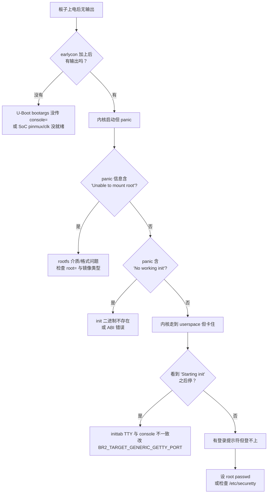
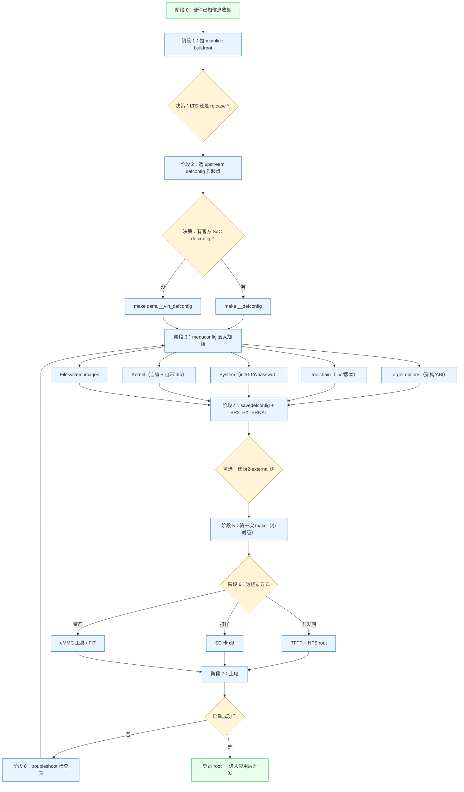

# 用 Mainline Buildroot 为自定义硬件板从零构建 rootfs

> [!note]
> **Ref:**
> - Buildroot manual §3 Getting started / §6 Quickstart — <https://buildroot.org/downloads/manual/manual.html>
> - Buildroot manual §9 Customization / §6.2 BR2_EXTERNAL — `/home/pi/imx/sdk/tspi-rk3566-sdk/buildroot/docs/manual/customize-outside-br.adoc`
> - Buildroot upstream README — `/home/pi/imx/sdk/100ask_imx6ull-sdk/Buildroot_2020.02.x/README`
> - 同 KB 同步笔记：`01-BR_config.md`、`02-BR_usage.md`、`03-BR_custom.md`


本笔记假设场景：手上有一块板子，kernel 与 U-Boot 都已经能独立跑起来；现在只想用 **upstream buildroot**（不依赖任何 vendor BSP）出一个最小可登录的 rootfs，并烧到板子上。


## 1. 前置条件清单

在拉 buildroot 之前，必须先把下面这张表填完。任何一项含糊，后面 menuconfig 都做不到位：

| 决策项 | 你必须明确知道的信息 | 决定 buildroot 的哪个旋钮 |
|--------|----------------------|---------------------------|
| 目标架构 / ABI | 例：`armv7-a hardfp NEON`、`aarch64 little-endian` | `BR2_arm` / `BR2_aarch64` + `BR2_ARM_FPU_*` + `BR2_ARM_EABIHF` |
| Endianness | little / big | `BR2_ENDIAN` |
| C library | glibc / musl / uClibc-ng | `BR2_TOOLCHAIN_BUILDROOT_LIBC` |
| Toolchain 来源 | 让 buildroot 自己编 / 用外部已有 toolchain | `BR2_TOOLCHAIN_BUILDROOT` vs `BR2_TOOLCHAIN_EXTERNAL` |
| Init 系统 | busybox-init / sysvinit / systemd / OpenRC | `BR2_INIT_*` |
| 串口控制台节点 | `/dev/ttyS0`、`/dev/ttymxc0`、`/dev/ttyAMA0`、`/dev/ttyFIQ0` | `BR2_TARGET_GENERIC_GETTY_PORT` |
| 控制台波特率 | 通常 115200 | `BR2_TARGET_GENERIC_GETTY_BAUDRATE` |
| Boot 介质 | SD / eMMC / SPI-NAND / raw-NAND | 决定 rootfs 格式 `BR2_TARGET_ROOTFS_*` |
| 分区方案 | 单分区 ext4 / squashfs+overlay / initramfs | 决定要不要 `BR2_TARGET_ROOTFS_INITRAMFS` |
| Kernel 自己编 还是 buildroot 编 | 推荐 buildroot 编（保证 module-version 对得上 rootfs） | `BR2_LINUX_KERNEL` |
| Hostname / root 密码 | 任意 | `BR2_TARGET_GENERIC_HOSTNAME` / `BR2_TARGET_GENERIC_ROOT_PASSWD` |

> 实务建议：把这张表先在仓库里落成一个 `board/<name>/SPEC.md`，后面 PR review 时一眼能看到每个决策的理由。


## 2. 从 git 拉 mainline buildroot

```bash
git clone https://gitlab.com/buildroot.org/buildroot.git
cd buildroot
git branch -a | grep -E '202[0-9]\.02\.x|202[0-9]\.11\.x'
```

### 2.1 LTS vs master：怎么选

| 选项 | 适用场景 | 优劣 |
|------|----------|------|
| **LTS 分支** `2024.02.x` | 产品代码、需要稳定 + 上游 bugfix 流入 | 仅 backport 安全/bug 补丁；包版本基本冻结；新硬件支持有限 |
| **稳定 release** `2024.11` | 实验、教学、新硬件 bringup | 包版本新；但不再回流 fix，需自己维护 |
| **master** | 你打算给 upstream 提 PR / 调内部包 | 永远滚动；CI 偶尔挂；不可作产品基线 |

**经验法则**：bringup 阶段先用最新 release 跑通；进入产品化阶段（feature freeze）切到当年的 LTS 分支并 pin commit。


## 3. 找一个最接近的 upstream defconfig 作为起点

完全从空 `.config` 起步几乎不可能——光 Target options 就要点几十下。正确姿势：找最近的 upstream defconfig 复制并改名。

```bash
# 列出所有 defconfig
make list-defconfigs | less

# 按 SoC / 厂商关键字筛
make list-defconfigs | grep -iE 'imx|rockchip|allwinner|stm32'

# 找不到自家 SoC 时退而求其次：用通用 qemu defconfig
ls configs/ | grep -E 'qemu_(aarch64|arm)_'
# qemu_aarch64_virt_defconfig  ← aarch64 起步首选
# qemu_arm_vexpress_defconfig  ← armv7 起步首选
```

加载为起点：

```bash
make qemu_aarch64_virt_defconfig          # 落到 .config
make savedefconfig                         # 立即另存为 minimal defconfig
cp defconfig configs/myboard_defconfig
```

后续所有改动都通过 `make menuconfig` + `make savedefconfig` 收敛回 `configs/myboard_defconfig`，**永远不要直接编辑 `.config`**。


## 4. menuconfig 必看的几组旋钮

下表是首次构建必须逐项确认的菜单分组。其它菜单可以先不动。

| 菜单分组 | 关键选项 | 决定什么 |
|----------|----------|----------|
| **Target options** | `BR2_arm` / `BR2_aarch64` / `BR2_riscv`；ARM core 选型（cortex-a7 / a53 / a72）；FPU；ABI（EABIhf / OABI）；endianness | 决定整个 toolchain 的 march/mfpu/mtune；选错则板子直接 illegal instruction |
| **Build options** | `BR2_DL_DIR` 指向共享 download 目录；`BR2_CCACHE` 启用 ccache | 影响重复构建速度，不影响产物 |
| **Toolchain** | Internal vs External；C library（glibc/musl/uClibc-ng）；GCC version；kernel headers version；C++ / fortran / OpenMP 选项 | 决定 sysroot 内容；kernel headers 必须 ≤ 实际 kernel 版本 |
| **System configuration** | hostname；banner；root password；`/dev` management（devtmpfs/static/mdev/eudev）；init 系统；getty TTY 与 baudrate；locale；overlay 路径 | 决定 rootfs 启动后的样子 |
| **Kernel** | `BR2_LINUX_KERNEL=y`；版本号；defconfig 来源（in-tree / external file）；dtb 列表；image format（zImage / Image / uImage / FIT） | 控制 buildroot 是否管 kernel；推荐 buildroot 管 |
| **Target packages** | busybox（必选）；选可选包（openssh、dropbear、htop、strace…） | rootfs 里装哪些用户态程序 |
| **Filesystem images** | ext2/3/4、squashfs、cpio (initramfs)、tar、ubifs、jffs2；是否压缩；rootfs 大小 | 决定 `output/images/` 里出什么文件 |
| **Bootloaders** | 一般留 None；只有用 buildroot 编 U-Boot/grub 时才开 | 通常自己另外管 bootloader |

`/dev` management 的常见误区：

| 选项 | 行为 | 何时用 |
|------|------|--------|
| `Dynamic using devtmpfs only` | 内核挂 devtmpfs；无 hotplug | 设备纯静态、不需要 udev 规则 |
| `Dynamic using devtmpfs + mdev` | 加 busybox mdev 处理 hotplug | 内存吃紧的小系统 |
| `Dynamic using devtmpfs + eudev` | 完整 udev，规则丰富 | systemd 系统或需要复杂规则 |
| `Static using device table` | 全静态，开发期少用 | 极简或只读 squashfs |


## 5. 第一次 `make` 之前的清单

```bash
# (a) 把 .config 收敛回 minimal defconfig
make savedefconfig
mv defconfig configs/myboard_defconfig

# (b) 准备 BR2_EXTERNAL 树（即使现在只有空目录）
mkdir -p ~/br2-ext-myboard/{configs,board/myboard,package,patches}
cat > ~/br2-ext-myboard/external.desc <<'EOF'
name: MYBOARD
desc: My custom board br2-external tree
EOF
touch ~/br2-ext-myboard/Config.in ~/br2-ext-myboard/external.mk

# (c) 把 defconfig 移到外部树（推荐）
mv configs/myboard_defconfig ~/br2-ext-myboard/configs/

# (d) 之后所有 make 都带上 BR2_EXTERNAL
make BR2_EXTERNAL=~/br2-ext-myboard myboard_defconfig
```

为什么一开始就引入 BR2_EXTERNAL：以后加自己的 package、board overlay、kernel patch 时不用改 buildroot 源树，升级 buildroot 时一条 `git pull` 就完事。

预留的 board 目录结构：

```text
~/br2-ext-myboard/board/myboard/
├── linux.config           # kernel defconfig
├── busybox.config         # 可选：自定义 busybox 配置
├── overlay/               # 直接 cp 进 rootfs 的文件
│   ├── etc/init.d/S99myapp
│   └── usr/local/bin/...
├── post-build.sh          # rootfs 打包前钩子
└── post-image.sh          # 镜像生成后钩子（拼 SD 卡镜像、做 FIT 等）
```


## 6. 首次 `make` 流程

```bash
make BR2_EXTERNAL=~/br2-ext-myboard 2>&1 | tee build.log
```

时间预期：

| 阶段 | 首次耗时（i7-13700 + NVMe） | 增量重建 |
|------|----------------------------|----------|
| 下载所有 tarball | 5–30 分钟（取决于网络与镜像） | 0 |
| 编 host-tools (m4 / bison / cmake) | 5–15 分钟 | 0 |
| 编 cross toolchain（gcc + glibc） | 20–60 分钟 | 0 |
| 编 kernel | 3–15 分钟 | 1–3 分钟 |
| 编全部 target packages | 视包数量 10 分钟 – 数小时 | 仅改动包 |
| 生成 rootfs 镜像 | 1–5 分钟 | 每次都重做 |

合计：**首次小时级**。首次完成后只要 `.config` 不大改，增量 build 在分钟级。

构建完成后的 `output/` 速览：

```text
output/
├── build/                # 每个包的解压源码（make clean 会删）
├── host/                 # host toolchain + sysroot + binutils（== make sdk 的内容）
│   └── <triple>/sysroot/ # 给 cross-gcc 用的 --sysroot
├── images/               # 最终产物 ★
│   ├── Image / zImage
│   ├── *.dtb
│   ├── rootfs.ext4 / rootfs.cpio.gz / rootfs.tar
│   └── sdcard.img        # 若 post-image 脚本拼了
├── staging -> host/<triple>/sysroot/   # 软链接
└── target/               # 给打包 rootfs 用的中间镜像（不可直接 chroot）
```

关键提醒：**`output/target/` 不是最终 rootfs**，里面文件 owner/permission 不对（不是 root:root，是构建用户）。只有 `output/images/rootfs.*` 才是经过 fakeroot 修过 owner 的最终产物。


## 7. 把 rootfs 灌到板子上的几种方法

| 方法 | 命令骨架 | 适用场景 | 优劣 |
|------|----------|----------|------|
| **SD 卡 dd** | `sudo dd if=output/images/sdcard.img of=/dev/sdX bs=4M conv=fsync` | 量产前打样、第一次开机 | 简单；改一次烧一次 |
| **TFTP + NFS root** | U-Boot 里：`setenv bootargs ... root=/dev/nfs nfsroot=<srv>:/path,vers=3 rw ip=dhcp`；`tftp $kernel_addr Image; tftp $fdt_addr myboard.dtb; booti ...` | 开发期反复修 rootfs | rootfs 改动立刻见效；调试首选 |
| **initramfs in FIT** | `make` 时勾 `BR2_TARGET_ROOTFS_INITRAMFS`；用 `mkimage -f myboard.its` 把 Image + dtb + cpio 合进单一 FIT | 无盘启动、嵌入式 OTA | 单文件好升级；rootfs 全驻内存，大小受限 |
| **eMMC 烧录工具** | 厂商工具（rkdeveloptool / uuu / fastboot） | 量产 | 板子相关，不通用 |
| **USB 大容量存储模式（U-Boot ums）** | U-Boot 输入 `ums 0 mmc 0`，host 当 U 盘挂载然后 dd | 没有读卡器时 | 慢但方便 |

**NFS root 调试模板**（开发期最高效）：

```bash
# host
sudo apt install nfs-kernel-server
echo "/srv/rootfs *(rw,sync,no_subtree_check,no_root_squash)" | sudo tee -a /etc/exports
sudo mkdir -p /srv/rootfs && sudo tar -xf output/images/rootfs.tar -C /srv/rootfs
sudo exportfs -ra

# U-Boot
setenv serverip 192.168.1.10
setenv ipaddr   192.168.1.20
setenv bootargs 'console=ttyS0,115200 root=/dev/nfs nfsroot=192.168.1.10:/srv/rootfs,vers=3 rw ip=dhcp'
tftp 0x80080000 Image
tftp 0x83000000 myboard.dtb
booti 0x80080000 - 0x83000000
```

修了任何 rootfs 内容，只需要 host 上重 `tar -xf` 覆盖 `/srv/rootfs/`，板子重启即可。


## 8. 首次开机 troubleshoot 检查表

| 现象 | 最可能的根因 | 修复定位 |
|------|--------------|----------|
| 内核 panic：`VFS: Unable to mount root fs on unknown-block(0,0)` | bootargs 的 `root=` 与实际介质不匹配；或 rootfs 文件系统类型与内核 builtin 不一致 | 检查 `root=/dev/mmcblk0p2` 写对；ext4 必须在 kernel `=y` 或 initramfs 内 |
| 启动到 `Run /init as init process` 后停住 | busybox init 找不到第一个 getty；或 inittab 的 TTY 与实际 console 不符 | `BR2_TARGET_GENERIC_GETTY_PORT` 必须等于 `console=` 后那个 tty（不带 `/dev/`） |
| 内核启动正常但串口看不到任何用户态输出 | bootargs 没写 `console=ttyXXX,115200`；或 DTS 的 `chosen/stdout-path` 不对 | 加 `earlycon` 验证 |
| 登录提示符出现但 `root` 登不上 | `BR2_TARGET_GENERIC_ROOT_PASSWD` 为空且 `BR2_TARGET_ENABLE_ROOT_LOGIN` 未启用；或 `/etc/securetty` 不含当前 tty | menuconfig 给 root 设密码；或加 overlay 改 `/etc/securetty` |
| 找不到任何用户态命令 | rootfs 没装 busybox / `BR2_PACKAGE_BUSYBOX=y` 没开 | menuconfig 确认 |
| `can't open /dev/tty1: No such file or directory` | `/dev` 管理选了 static device table 但表里没 tty1 | 改回 `devtmpfs` |
| 启动一直 `Waiting for root device /dev/mmcblk1p1...` | `CONFIG_MMC_*` 没编进 kernel | 改 kernel defconfig 把对应控制器驱动 `=y`（不能 `=m`，否则 root 阶段加载不到） |
| 内核能起来但 `libc.so.6: ELF file class incorrect` | toolchain ABI 与板子 CPU 不匹配（编了 aarch64 烧了 armv7 板，或反之） | 重头检查 Target options |

调试方法论：




## 9. 完整流程 mermaid 图



图例说明：
- 黄色 = 决策点（需要根据前置清单回答）
- 蓝色 = 执行动作
- 绿色 = 阶段闭合状态

最容易卡的两个回路是 `S8 → S3`（troubleshoot 后回去改 menuconfig）和 Kernel/DTS 与 Filesystem images 之间的强约束。


## 10. 下一步要看的笔记

| 后续主题 | 笔记 | 重点 |
|----------|------|------|
| Buildroot 配置体系深入（Kconfig 结构、`make *-config` 全家桶） | `01-BR_config.md` | `.config` / defconfig / savedefconfig / olddefconfig 的差异 |
| 日常使用与调试（`<pkg>-rebuild`、`<pkg>-reconfigure`、`make show-info`） | `02-BR_usage.md` | 增量构建、OVERRIDE_SRCDIR 开发流 |
| 自定义包与 board 集成（写 `pkg.mk`、写 post-image、做 BR2_EXTERNAL） | `03-BR_custom.md` | autotools / cmake / generic 三种 infra；rootfs overlay |
| 应用开发与 sysroot | `00-用户空间应用开发与sysroot.md` | `make sdk`、PKG_CONFIG_SYSROOT_DIR、relocatable SDK |

本篇的目标是 **bringup**：拿到第一个能登录的 shell。一旦登录上，再回到 `01–03` 加包、加配置、加业务代码。
