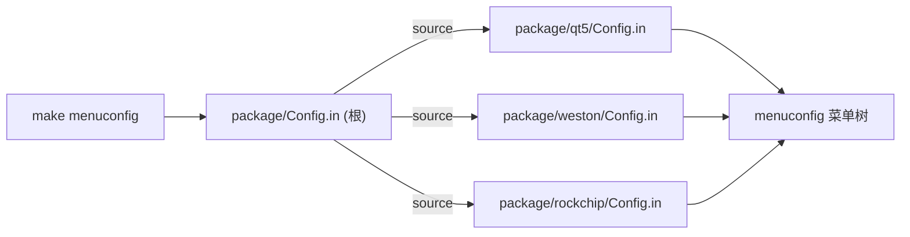
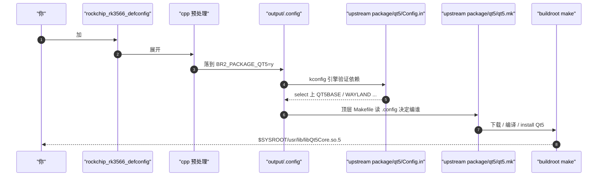

# Buildroot package 的 kconfig 机制：`BR2_PACKAGE_*` 怎么进 menuconfig，upstream 与 vendor 的边界

> [!note]
> **Ref:**
> - 上游 package 实例（实测）：[`buildroot/package/qt5/`](../../../sdk/tspi-rk3566-sdk/buildroot/package/qt5/)、[`buildroot/package/weston/`](../../../sdk/tspi-rk3566-sdk/buildroot/package/weston/)
> - vendor 私货实例（实测）：[`buildroot/package/rockchip/`](../../../sdk/tspi-rk3566-sdk/buildroot/package/rockchip/)
> - 根入口：[`buildroot/package/Config.in`](../../../sdk/tspi-rk3566-sdk/buildroot/package/Config.in)
> - 相关笔记：[[03-BR_custom]] §10（写新 package 流程）、[[05-BR_QT用户空间应用开发环境]] §3（启用上游 Qt5）


## 1. 核心结论

| 问题 | 答案 |
|---|---|
| `BR2_PACKAGE_QT5=y` 这个符号是谁定义的？ | **upstream buildroot 主线**，在 `package/qt5/Config.in` 里 |
| `BR2_PACKAGE_WESTON=y` 呢？ | 同上 upstream，在 `package/weston/Config.in` 里 |
| Rockchip 是不是改了它们？ | tspi 实测**没改**——Rockchip 只是在 defconfig 里把开关置 `=y`，机制全用上游 |
| Rockchip 自己写的 package 在哪？ | `package/rockchip/<name>/`（rkmpp、rknpu、rkaiq 等）+ 上游已有 `package/rockchip/Config.in` 注册它们 |
| 机制是 upstream 定义还是 vendor 自创？ | **机制 100% upstream**——vendor 只是按上游约定加自己的子目录 |


## 2. 机制：每个 package 是 `Config.in` + `<pkg>.mk` 两件套

上游 buildroot 的 `package/` 目录是一个**约定式扫描点**。每个子目录就是一个 package，必须有两件套：

| 文件 | 角色 | 谁解析 |
|---|---|---|
| `package/<pkg>/Config.in` | kconfig 片段，定义 `BR2_PACKAGE_<NAME>` 符号 + `depends on` / `select` / `help` | kconfig 引擎（menuconfig/conf） |
| `package/<pkg>/<pkg>.mk` | makefile 片段，定义 download/extract/patch/configure/build/install | buildroot 顶层 Makefile |

### 2.1 Config.in 实例（upstream weston，节选）

[`buildroot/package/weston/Config.in`](../../../sdk/tspi-rk3566-sdk/buildroot/package/weston/Config.in:6):

```kconfig
config BR2_PACKAGE_WESTON
    bool "weston"
    depends on BR2_PACKAGE_HAS_UDEV
    depends on !BR2_STATIC_LIBS              # wayland 需要 dynamic
    depends on BR2_TOOLCHAIN_HAS_THREADS     # wayland 需要线程
    depends on BR2_TOOLCHAIN_HEADERS_AT_LEAST_3_0
    select BR2_PACKAGE_WAYLAND
    select BR2_PACKAGE_WAYLAND_PROTOCOLS
    select BR2_PACKAGE_LIBXKBCOMMON
    select BR2_PACKAGE_CAIRO
    select BR2_PACKAGE_LIBPNG
    select BR2_PACKAGE_JPEG
    select BR2_PACKAGE_LIBINPUT
    select BR2_PACKAGE_LIBDRM
    help
      Weston is the reference implementation of a Wayland compositor.
```

**关键语义**：

- `depends on X` — 只有 X 启用时这个条目才在 menuconfig 里**可见 / 可选**
- `select X` — 选上本 package 自动连带选上 X，无视 X 自己的 depends
- `help ...` — menuconfig 里按 `?` 看到的帮助文本

### 2.2 .mk 实例（upstream qt5，节选）

[`buildroot/package/qt5/qt5.mk`](../../../sdk/tspi-rk3566-sdk/buildroot/package/qt5/qt5.mk:7):

```make
QT5_VERSION_MAJOR = 5.15
QT5_VERSION = $(QT5_VERSION_MAJOR).11
QT5_SITE = https://invent.kde.org/qt/qt          # ← upstream KDE 镜像

include $(sort $(wildcard package/qt5/*/*.mk))   # 嵌套：拉所有 qt5 子模块的 .mk
```

`_SITE` 是非常好的"出身鉴别"线索——指向上游 KDE / freedesktop / GitHub 主线就是 upstream package，指向 vendor 自家 git/gitlab 就是私货。


## 3. menuconfig 看到 package 的过程：根 `Config.in` 的 `source` 递归

[`buildroot/package/Config.in`](../../../sdk/tspi-rk3566-sdk/buildroot/package/Config.in) 是 menuconfig 的根入口，实测里相关行：

```text
358:    source "package/qt5cinex/Config.in"
414:    source "package/qt5/Config.in"
428:    source "package/weston/Config.in"
1317:   source "package/python-pyqt5/Config.in"
```

**这就是全部魔法**：



> [!IMPORTANT]
> **buildroot 没有自动扫描 package/ 目录**——你新加一个 `package/myapp/`，必须显式在 `package/Config.in` 里 `source "package/myapp/Config.in"`，否则永远不会出现在 menuconfig 里。

`.mk` 那一边相反，由根 [`buildroot/Makefile`](../../../sdk/tspi-rk3566-sdk/buildroot/Makefile) 通过 `include $(sort $(wildcard package/*/*.mk))` 拉进来——用的是 wildcard 通配，**.mk 自动生效**，不需要显式注册。这是上游故意的不对称：kconfig 用 source 是为了控制菜单结构（手工排版到合适的 menu 下），.mk 用 wildcard 是因为只要 kconfig 没选中就不会触发。


## 4. upstream 自带 vs vendor 私货：边界划在哪

| 维度 | upstream 自带（qt5、weston、busybox、openssl…几千个） | vendor 私货（Rockchip 系） |
|---|---|---|
| 维护者 | buildroot 主线社区 | Rockchip / 你自己 |
| 位置 | `package/<name>/` | `package/<vendor>/<name>/`（约定俗成，不是强制） |
| 升级路径 | git pull buildroot upstream | 跟厂商 BSP 发布 |
| `_SITE` 指向 | 上游 OSS 镜像（KDE、GNU、GitHub 主线...） | 厂商私有 git |
| 数量级 | tspi 树里 2000+ 个 | tspi 里几十个 |

### 4.1 实测 tspi 里的 Rockchip 私货

[`buildroot/package/rockchip/`](../../../sdk/tspi-rk3566-sdk/buildroot/package/rockchip/) 子目录（节选）：

```text
camera-engine-rkaiq/      # RK ISP AIQ 算法
camera-engine-rkisp/      # RK ISP1 老接口
gstreamer1-rockchip/      # gstreamer Rockchip 插件
libv4l-rkmpp/             # MPP 视频编解码 v4l 后端
rkadk/                    # Rockchip Android DK (linux 适配)
rknpu/   rknpu2/          # NPU runtime
rknn-llm/                 # NPU 上跑 LLM
rkwifibt/                 # WiFi/BT 配置工具
rockchip-mali/            # Mali GPU 闭源 blob
...共 30+ 个
```

这些 upstream buildroot 都**没有**——RK 芯片专属，必须 vendor 自己维护。

### 4.2 vendor Config.in 怎么挂到主菜单

[`buildroot/package/rockchip/Config.in`](../../../sdk/tspi-rk3566-sdk/buildroot/package/rockchip/Config.in:1)：

```kconfig
menuconfig BR2_PACKAGE_ROCKCHIP
    bool "Rockchip Platform"
    select BR2_PACKAGE_WESTON_DEFAULT_PIXMAN \
        if BR2_PACKAGE_WESTON && !BR2_PACKAGE_ROCKCHIP_HAS_GPU

if BR2_PACKAGE_ROCKCHIP

config BR2_PACKAGE_ROCKCHIP_HAS_GPU
    bool

config BR2_PACKAGE_ROCKCHIP_HAS_ISP1
    bool

choice
    default BR2_PACKAGE_RK3588
    prompt "Rockchip SoC"
    ...
```

注意三件事：

1. **`menuconfig BR2_PACKAGE_ROCKCHIP`** — 这给 menuconfig 加了"Rockchip Platform"一整个子菜单，里面再 source 各个 rockchip 子 package。
2. **`select BR2_PACKAGE_WESTON_DEFAULT_PIXMAN if BR2_PACKAGE_WESTON && ...`** — vendor kconfig **引用并约束** upstream package 行为。
3. **`config BR2_PACKAGE_ROCKCHIP_HAS_GPU` 没有 prompt** — 这是"capability flag"，由 SoC choice 间接 select 上，user 不能直接选。

这是 vendor 在上游约定内自己加菜单的标准做法——**所有动作都用上游 kconfig 语法**，没有任何 buildroot fork 才能用的特殊语法。


## 5. 怎么判断一个 `BR2_PACKAGE_X` 是上游还是 vendor 的

三招速查：

### 5.1 grep Config.in 看位置

```sh
$ grep -rn 'BR2_PACKAGE_QT5\b' buildroot/package/ | head -3
buildroot/package/qt5/Config.in:33:menuconfig BR2_PACKAGE_QT5
# ↑ 在 package/qt5/ 不在 package/<vendor>/ → upstream

$ grep -rn 'BR2_PACKAGE_RKNPU2\b' buildroot/package/ | head -3
buildroot/package/rockchip/rknpu2/Config.in:1:config BR2_PACKAGE_RKNPU2
# ↑ 在 package/rockchip/ → vendor 私货
```

### 5.2 看 `_SITE` 指向

```sh
$ grep -E '_SITE\s*=' buildroot/package/qt5/qt5.mk
QT5_SITE = https://invent.kde.org/qt/qt
# ↑ KDE 上游镜像 → upstream

$ grep -E '_SITE\s*=' buildroot/package/rockchip/rknpu/*.mk
# 指向 rockchip.git → vendor
```

### 5.3 git blame（如果想知道是不是 vendor 改过 upstream package）

```sh
cd buildroot
git log --oneline package/qt5/Config.in | head -5         # 大量上游提交
git log --oneline package/rockchip/rknpu/Config.in | head # 全是 Rockchip 提交
```


## 6. 自己加 package 的三条路径

| 路径 | 适用 | 位置 | 升级影响 |
|---|---|---|---|
| 塞进 vendor 区 | 私有产品、跟着 SDK 发布 | `buildroot/package/<myco>/<pkg>/` + 在 `package/Config.in` 加一行 source | 升级 buildroot 主线时手工合并 |
| `BR2_EXTERNAL` | 想跟 upstream 解耦、保留升级能力 | `<external>/package/<pkg>/` + `<external>/Config.in` 里 source（详见 [[03-BR_custom]] §9） | upstream 升级不动你的代码 |
| 贡献回 upstream | 通用 OSS、想让别人复用 | `buildroot/package/<pkg>/` + 发 patch 到 buildroot ML | 进上游后全员可见 |


## 7. 回到原问题：为什么 `BR2_PACKAGE_QT5=y` 就能用？

把 [[05-BR_QT用户空间应用开发环境]] §3 那段串起来：



- **你只动了一行**（defconfig 的 `=y`）
- **`BR2_PACKAGE_QT5` 符号本身**来自 upstream `package/qt5/Config.in`
- **依赖求解（select QT5BASE / WAYLAND / ...）**来自同一份 upstream Config.in
- **下载源码 / 编译规则**全部来自 upstream `qt5.mk`
- **vendor 在这条链里没参与任何环节**

类比记忆：`BR2_PACKAGE_QT5` 之于 buildroot 就像 `CONFIG_PCI` 之于 Linux kernel——配置项是上游已经写好的，你只是在 .config 里把它打开。区别只是 buildroot 把"装哪些用户空间软件"也变成了 kconfig 决策。


## 8. 速查：相关文件位置

| 想看什么 | 文件 |
|---|---|
| menuconfig 根入口 | `buildroot/package/Config.in` |
| 上游 package 实例 | `buildroot/package/qt5/{Config.in,qt5.mk}` |
| 上游 package 子模块嵌套 | `buildroot/package/qt5/qt5base/{Config.in,qt5base.mk}` |
| vendor 私货实例 | `buildroot/package/rockchip/{Config.in, rknpu/, rkmpp/, ...}` |
| 自己加 package 的官方文档 | Buildroot manual §17 *Adding new packages* |
| 选 `BR2_PACKAGE_X` 的菜单路径 | menuconfig 里 `/` 搜索符号名即可定位 |
