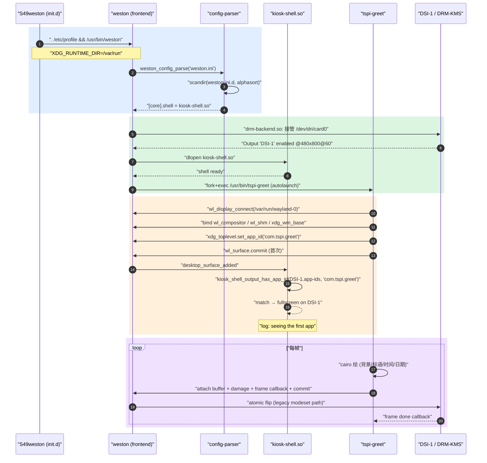
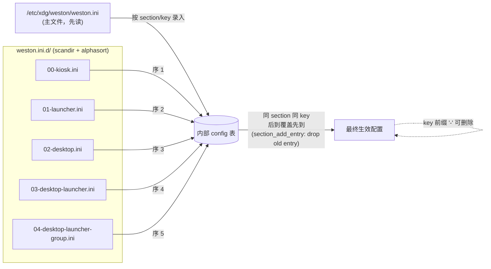

# Weston Kiosk-Shell 与 TSPI Greet Demo

> [!note]
> **Ref:**
>
> - 上游协议：[wayland xdg-shell](https://wayland.app/protocols/xdg-shell)、[weston.ini man](https://manpages.debian.org/unstable/weston/weston.ini.5.en.html)
> - weston源码（buildroot 已下载解压）：`sdk/tspi-rk3566-sdk/buildroot/output/.../build/weston-14.0.2/`
>   - `kiosk-shell/kiosk-shell.c`、`frontend/main.c`、`shared/config-parser.c`、`clients/simple-shm.c`
> - 工程源码：`/home/pi/imx/prj/tspi-greet/`
> - 上层笔记：[[../../Subsystem/Graph-Stack/03-wayland-weston]]

## 背景

 tspi-rk3566 板出厂的 GUI 形态：Weston 14.0.2 跑 **desktop-shell**，带 panel + launcher

**Kiosk** 形态是另一条线：单应用全屏接管输出，无 panel、无桌面图标、无窗口装饰 — 适合自助终端、信息屏、欢迎页。本节用 480×800 MIPI-DSI 做一个最小可观察的 kiosk 欢迎页：自写 wayland 客户端，由 weston 的 `kiosk-shell.so` 通过 `app-ids` 绑定到 DSI-1 全屏。

## kiosk-shell vs desktop-shell

|         | desktop-shell                          | kiosk-shell                          |
|---------|---------------------------------------|---------------------------------------|
| 动态库 | `/usr/lib/weston/desktop-shell.so`     | `/usr/lib/weston/kiosk-shell.so`      |
| Panel   | 有（top/bottom/left/right/none）        | **无**                                |
| Launcher | 桌面图标，`[launcher]` 段配置          | **无**                                |
| 窗口装饰 | 标题栏 + 关闭按钮                       | **无**（CSD 也会被全屏覆盖）           |
| 多客户端 | 浮窗 / 平铺                            | **每 output 单 surface 全屏**         |
| 绑定方式 | 任意客户端任意位置                      | 通过 `[output].app-ids = X` 把 `xdg_toplevel.set_app_id("X")` 的 surface 固定到该 output |
| 适用    | 开发桌面                                | 单应用终端、欢迎屏、看板               |

## 一、全链路概览

从宿主开发机到板上 DSI 屏点亮的端到端管道：


## 二、交叉编译环境

### 2.1 工具链与 sysroot 位置

使用buildroot sdk

```text
sdk/tspi-rk3566-sdk/buildroot/output/rockchip_rk3566_taishanpi_1m_v10/rockchip_rk3566/
├── host/
│   ├── bin/
│   │   ├── aarch64-buildroot-linux-gnu-gcc   # 交叉编译器
│   │   ├── aarch64-buildroot-linux-gnu-readelf
│   │   └── wayland-scanner                   # 协议代码生成器（host arch）
│   └── aarch64-buildroot-linux-gnu/sysroot/  # 目标 rootfs 镜像
│       └── usr/
│           ├── include/
│           │   ├── wayland-client.h
│           │   ├── wayland-server.h
│           │   └── cairo/cairo.h
│           ├── lib/
│           │   ├── libwayland-client.so → .0.x.x
│           │   ├── libcairo.so → .2.x.x
│           │   └── libpixman-1.so ...
│           └── share/wayland-protocols/stable/xdg-shell/xdg-shell.xml
```

**为什么直接用 sysroot 而不是 pkg-config？** Buildroot 的 `pkg-config` wrapper 需要正确设置 `PKG_CONFIG_SYSROOT_DIR`、`PKG_CONFIG_LIBDIR`。直接 `--sysroot=` + 显式 `-l<name>` 最稳。

### 2.2 xdg-shell 协议代码生成

xdg-shell 是 wayland 之上的桌面/全屏窗口协议（kiosk-shell 也用它）。源码只是 XML，需要 `wayland-scanner` 生成 C 头文件和绑定代码：

```sh
# 客户端头文件：提供 xdg_wm_base / xdg_surface / xdg_toplevel 的 API 与 listener 结构
wayland-scanner client-header xdg-shell.xml src/xdg-shell-client.h

# 协议私有代码：包含 wl_interface 描述与 wire-format 编解码
wayland-scanner private-code  xdg-shell.xml src/xdg-shell-protocol.c
```

生成产物只在构建期使用，**不要 commit**。Makefile 的依赖规则让它在缺失时自动重生。`stable/xdg-shell` 是 v1 稳定版（自 wayland-protocols 1.12 起），整个 weston 桌面世界都用它。

### 2.3 客户端链接依赖

`readelf -d` 看产物 NEEDED：

```text
NEEDED   libwayland-client.so.0      # 协议 marshalling、socket、event loop
NEEDED   libcairo.so.2               # 2D 绘图（文字 / 渐变 / 路径）
NEEDED   libm.so.6                   # cairo 内部三角函数
NEEDED   libc.so.6
INTERP   /lib/ld-linux-aarch64.so.1  # 板上 glibc 动态链接器
```

**没有 libwayland-server**（我们是 client），**没有 libGL/libEGL**（用 SHM 而非 EGL — 简单可靠，60Hz 居中文字开销可忽略）。

### 2.4 Makefile 完整解读

`/home/pi/imx/prj/tspi-greet/Makefile` 的核心约 25 行：

```makefile
TSPI_SDK := $(HOME)/imx/sdk/tspi-rk3566-sdk/buildroot/output/rockchip_rk3566_taishanpi_1m_v10/rockchip_rk3566
SYSROOT  := $(TSPI_SDK)/host/aarch64-buildroot-linux-gnu/sysroot
TC       := $(TSPI_SDK)/host/bin/aarch64-buildroot-linux-gnu-
SCANNER  := $(TSPI_SDK)/host/bin/wayland-scanner
PROTO    := $(SYSROOT)/usr/share/wayland-protocols/stable/xdg-shell/xdg-shell.xml

CC      := $(TC)gcc
CFLAGS  := --sysroot=$(SYSROOT) -O2 -Wall -Wno-unused-parameter -Isrc -I$(SYSROOT)/usr/include/cairo
LDFLAGS := --sysroot=$(SYSROOT) -lwayland-client -lcairo -lrt -lm

TARGET := tspi-greet
SRCS   := src/main.c src/xdg-shell-protocol.c
GEN_H  := src/xdg-shell-client.h
GEN_C  := src/xdg-shell-protocol.c

all: $(TARGET)
$(GEN_H):     ; $(SCANNER) client-header $(PROTO) $@
$(GEN_C):     ; $(SCANNER) private-code  $(PROTO) $@
$(TARGET): $(GEN_H) $(SRCS)
	$(CC) $(CFLAGS) $(SRCS) -o $@ $(LDFLAGS)
clean:
	rm -f $(TARGET) $(GEN_H) $(GEN_C)
```

逐行要点：

| 变量 | 含义 | 错配后果 |
|------|------|---------|
| `TSPI_SDK` | buildroot 输出根 | 路径错 → 后续全 404 |
| `SYSROOT` | 目标 rootfs 镜像 | 缺失 → 找不到 wayland-client.h |
| `TC` | 工具链前缀 | 用宿主 gcc 编出 x86_64，板上跑不动 |
| `SCANNER` | host 架构的 wayland-scanner | 错用目标架构会 exec format error |
| `PROTO` | xdg-shell.xml | 缺 → scanner 报"no such file" |
| `--sysroot=` | 同时给 CC 和 LD | 缺 → 链接器找宿主 `/usr/lib` |
| `-Isrc` | 让 main.c 能 `#include "xdg-shell-client.h"` | 缺 → 编译时找不到生成头 |
| `-I.../cairo` | cairo.h 不在标准 include 根 | 缺 → 报 `cairo.h: No such file` |
| `-lwayland-client -lcairo` | 显式链接 | 缺 → 链接 undefined reference |
| `-lm` | cairo 用 sin/cos | 缺 → libm undefined |
| `-lrt` | 历史保留（mkstemp 后实际未用） | 可去 |

依赖关系：`tspi-greet` ← `xdg-shell-client.h` + `main.c` + `xdg-shell-protocol.c`。`xdg-shell-client.h` 缺失或被 clean 后会触发 wayland-scanner 重生成。

### 2.5 一键 build.sh + 自动校验

```sh
#!/usr/bin/env bash
set -euo pipefail
cd "$(dirname "$0")"
make clean >/dev/null
make -j"$(nproc)"
echo "[ok] built: $(file tspi-greet | cut -d, -f1-2)"
```

实测输出：

```text
[ok] built: tspi-greet: ELF 64-bit LSB pie executable, ARM aarch64
```

LSP（clang）会报 `xdg-shell-client.h not found` —— **误报**，因为头文件是构建时生成。gcc 实际编译已通过，可忽略。

## 三、NFS 部署环节

### 3.1 路径映射

[[reference-tspi-infra]] 已固化：

|         | 宿主                                | 板                   |
|---------|------------------------------------|---------------------|
| 挂载点  | `/home/pi/imx/prj/nfs_tspi/`        | `/mnt/nfs`          |
| NFS 协议 | server 端（pi@imx）                  | client 端（root@tspi） |
| 传输参数 | `rw,sync` ; vers=3; rsize=1 MB     | 同上                 |
| 网段    | 192.168.137.0/24（RNDIS）           |                     |

板上 `/proc/mounts` 实测一行：

```text
192.168.137.1:/home/pi/imx/prj/nfs_tspi /mnt/nfs nfs rw,sync,vers=3,rsize=1048576,wsize=1048576,proto=tcp,...
```

### 3.2 deploy.sh

只做"拷贝 + 改权限"，所有"上板动作"留给后续 ssh 阶段：

```sh
#!/usr/bin/env bash
set -euo pipefail
cd "$(dirname "$0")"
DST=/home/pi/imx/prj/nfs_tspi/tspi-greet
[ -f tspi-greet ] || { echo "[err] not built"; exit 1; }
mkdir -p "$DST"
install -m 755 tspi-greet         "$DST/tspi-greet"
install -m 644 etc/00-kiosk.ini   "$DST/00-kiosk.ini"
echo "[ok] deployed to $DST"
```

为什么不直接 `scp` 上板？— NFS 是 zero-copy 视图，调试时反复 `make && ./deploy.sh` 后板上立刻看得到新文件，比 scp 快、更不易丢同步。

## 四、板上部署配置

### 4.1 全套 ssh 命令链

```sh
ssh tspi <<'SH'
  set -e

  # 1. 装 bin
  install -m 755 /mnt/nfs/tspi-greet/tspi-greet /usr/bin/tspi-greet

  # 2. 备份原 desktop-shell 配置（首次执行）
  cd /etc/xdg/weston
  [ -d weston.ini.d.bak ] || cp -a weston.ini.d weston.ini.d.bak

  # 3. 清空 desktop ini 片段（4 个 launcher / panel / desktop / desktop-launcher-group）
  rm -f weston.ini.d/0[1-4]-*.ini

  # 4. 写入 kiosk ini 片段
  cp /mnt/nfs/tspi-greet/00-kiosk.ini weston.ini.d/

  # 5. 重启 weston（init.d 单次拉起，非 supervisor）
  /etc/init.d/S49weston restart
SH
```

回滚：

```sh
ssh tspi 'cd /etc/xdg/weston && rm -rf weston.ini.d && \
          mv weston.ini.d.bak weston.ini.d && \
          /etc/init.d/S49weston restart'
```

### 4.2 S49weston sdk profile

`/etc/init.d/S49weston` 关键三行：

```sh
. /etc/profile                               # 注入 XDG_RUNTIME_DIR=/var/run 等
start_weston() {
    /usr/bin/weston 2>&1 | tee /var/log/weston.log &
}
stop_weston() { killall weston ; }
```

`. /etc/profile` 不可省 — weston **fatal** 退出条件是缺 `XDG_RUNTIME_DIR`。手动 `/usr/bin/weston` 启动会 fatal。

### 4.3 weston.ini 最终生效内容

主文件 `/etc/xdg/weston/weston.ini`（出厂自带，不动）：

```ini
[core]
backend=drm-backend.so
require-input=false
[shell]
panel-position=none
locking=false
startup-animation=none
[output]
name=DSI-1
mode=480x800@60
scale=1
```

新增片段 `/etc/xdg/weston/weston.ini.d/00-kiosk.ini`（删 01-04，仅留这个）：

```ini
[core]
shell=kiosk-shell.so

[output]
name=DSI-1                # 必须与主 ini 中 [output].name 一致才合并
app-ids=com.tspi.greet

[autolaunch]
path=/usr/bin/tspi-greet
# 不写 watch — weston 14 里 watch=true 是"子进程死则 weston 自杀"，非自动重拉
```

合并结果（weston 内部视图）：

| Section | Key | 来源 | 值 |
|---------|-----|------|-----|
| `[core]` | `backend` | 主 ini | drm-backend.so |
| `[core]` | `shell` | **00-kiosk** | kiosk-shell.so |
| `[output:DSI-1]` | `mode` | 主 ini | 480x800@60 |
| `[output:DSI-1]` | `app-ids` | **00-kiosk** | com.tspi.greet |
| `[autolaunch]` | `path` | **00-kiosk** | /usr/bin/tspi-greet |

调试 ini 合并：`WESTON_MAIN_PARSE=1 weston` 会逐行打印 `"file: section/key from X to Y"`，是 weston 内置的合并 trace 开关。

## 五、启动链路（运行时）

从 S49weston 拉起到 DSI 显示首帧的完整 sequence：



实机日志关键行（截取）：

```text
[09:56:18.688] Output 'DSI-1' enabled with head(s) DSI-1
[09:56:18.688] Loading module '/usr/lib/weston/kiosk-shell.so'
[09:56:18.836] seeing the first app           ← kiosk-shell 接管成功标志
```

## 六、weston.ini 合并语义（深入）

源码：`shared/config-parser.c:560-630` 的 `weston_config_parse`。



**关键事实**：

1. **顺序**：主 `weston.ini` → `weston.ini.d/*.ini` 按 `alphasort`；
2. **同 section 同 key** → 后覆盖前；
3. **同 section 不同 key** → 累加合并；
4. **`[output]` 段按 `name=` 索引**：没有 `name=` 的匿名 `[output]` 段不会与 `[output] name=DSI-1` 合并（[[trail-greet-deploy]] 坑 2）；
5. **`-key=value`** 前缀 `-` 可从合并表里删除该 entry —— 比 commit-out 灵活；
6. **`WESTON_MAIN_PARSE=1`** 启动开关打印每次覆盖：`"file: section/key from X to Y"`。

## 七、app_id 绑定原理

`kiosk-shell.c:760-780` 的 `kiosk_shell_output_has_app_id`：

```c
/* 简化 */
while ((cur = strstr(config_app_ids, app_id))) {
    /* 完整匹配：左侧是逗号或开头，右侧是逗号或末尾 */
    if ((cur[app_id_len] == ',' || cur[app_id_len] == '\0') &&
        (cur == config_app_ids || cur[-1] == ','))
        return true;
    cur += app_id_len;
}
```

- `[output].app-ids = com.tspi.greet,com.tspi.menu` 支持逗号分隔；
- 边界检查避免 `com.tspi.gre` 误命中 `com.tspi.greet`；
- **大小写敏感** — 客户端 `xdg_toplevel_set_app_id(...)` 必须与 ini 一字不差；
- 没有任何 output 匹配时，第一个进来的 surface 落在第一个 output（fallback "seeing the first app"）。

客户端侧关键三调用：

```c
/* 1. 把 app_id 告诉 compositor，kiosk-shell 才能匹配 */
xdg_toplevel_set_app_id(a.top, "com.tspi.greet");

/* 2. SHM buffer + cairo ARGB32 一体化绘制 */
cairo_surface_t *cs = cairo_image_surface_create_for_data(
    map_ptr, CAIRO_FORMAT_ARGB32, w, h, w * 4);

/* 3. 用 frame callback 驱动重绘（compositor 节流到刷新率） */
struct wl_callback *cb = wl_surface_frame(a->surf);
wl_callback_add_listener(cb, &frame_listener, a);
```

## 八、两阶段实施

| 阶段 | 改动位置 | 持久性 | 验证耗时 |
|------|---------|--------|---------|
| 1 — NFS 快速验证 | 板上 `/etc/xdg/weston/weston.ini.d/`、`/usr/bin/`（运行时） | 重启失效 | 秒级 |
| 2 — buildroot 固化 | `buildroot/configs/rockchip/gui/weston.config` + `package/tspi-greet/` + `overlays/11-tspi-greet/` + post-build 脚本 | 烧录后永久 | 一次重编 ~20 min |

阶段 1 已跑通（[[trail-greet-deploy]]），阶段 2 改动清单见 [[../buildroot/07-tspi-greet-package]]（待写）。

## 九、踩坑速查

1. **weston 启动后无 log**：S49weston 用 `pipe+tee` 让 stderr block-buffer，fatal 行被卡缓冲。临时调试 `stdbuf -oL -eL /usr/bin/weston 2>&1 | head -80`；
2. **`[output]` 段必须配 `name=`** 才能与主 ini 合并，否则 `app-ids` 落入孤段；
3. **`[autolaunch].watch=true` 是"weston 跟随子进程退出"** —— 非自动重拉。init.d 链路下不写 watch；要真重拉需 systemd 监管 weston；
4. **大小写敏感**：`xdg_toplevel_set_app_id` 字符串与 `[output].app-ids` 必须完全一致；
5. **XDG_RUNTIME_DIR**：`/etc/profile.d/xdg.sh` 提供；不经 profile 启动 weston 立即 fatal；
6. **kiosk-shell.so 缺失**：`buildroot/package/weston/Config.in:171` 默认 y，但若 menuconfig save 历史取消过会丢。`ls /usr/lib/weston/kiosk-shell.so` 预检；
7. **LSP 报 `xdg-shell-client.h not found`**：构建时生成头，clang 静态分析在生成前扫描的误报，gcc 实际编译已通过。

## 十、关联笔记

- [[../../Subsystem/Graph-Stack/03-wayland-weston]] — Wayland 协议 + Weston compositor 总览
- [[../../Subsystem/Graph-Stack/04-kernel-fb-drm-kms]] — DRM/KMS 内核侧
- [[04-desktop-app]] — TSPI desktop-shell 形态（前置对照）
- [[trail-greet-deploy]] — 实机部署观察记
- [[../buildroot/06-package-kconfig]] — buildroot package Kconfig 语法（阶段 2 固化要用）
- [[../buildroot/07-tspi-greet-package]] — 阶段 2 buildroot 固化（待写）
