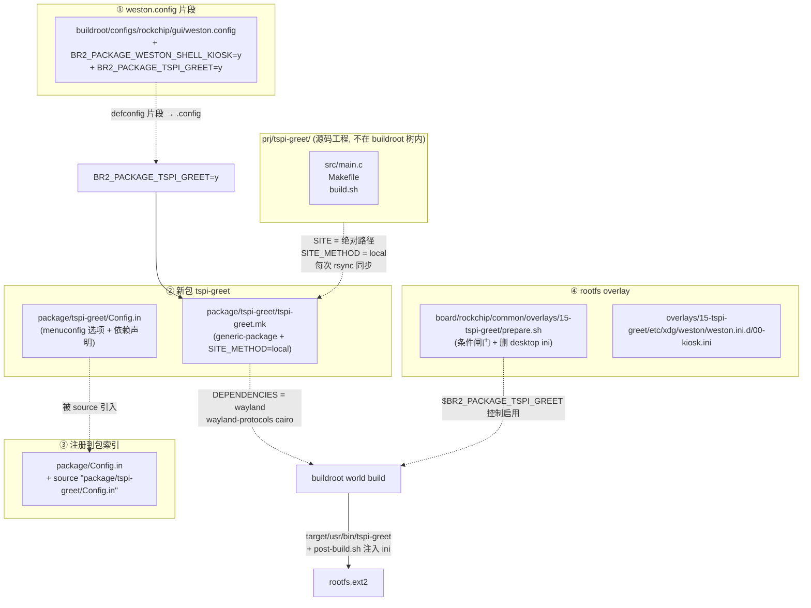
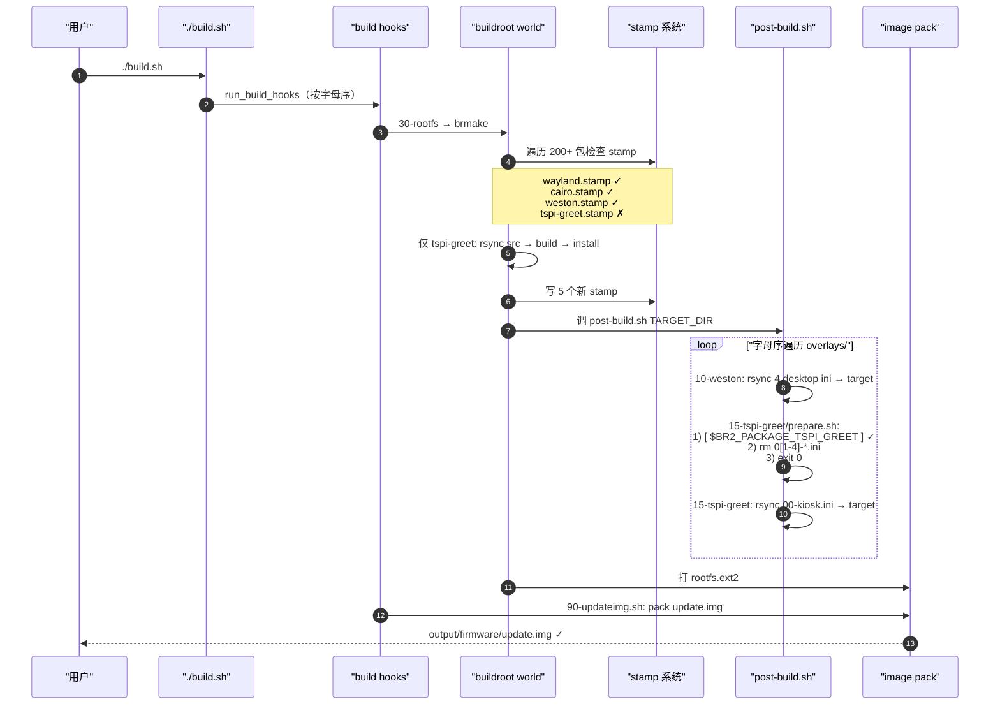

# 用户空间应用的 Buildroot 集成 — 以 tspi-greet 为例

> [!note]
> **Ref:**
> - 业务侧笔记：[[01-weston-kiosk-greet]]（客户端代码、kiosk-shell 原理、weston.ini 合并语义）
> - 工程源码：`/home/pi/imx/prj/tspi-greet/`
> - SDK 路径：`/home/pi/imx/sdk/tspi-rk3566-sdk/`
> - Buildroot manual：[generic-package infra](https://buildroot.org/downloads/manual/manual.html#generic-package-tutorial)
> - SDK 内部脚本：
>   - `buildroot/package/pkg-generic.mk`（generic-package 实现，stamp 机制）
>   - `device/rockchip/common/scripts/mk-buildroot.sh`（SDK 对 buildroot 的封装）
>   - `device/rockchip/common/post-build.sh`（overlay 自动注入）
> - 前置知识：[[03-BR_custom]]（自定义包基本流程）、[[06-package-kconfig]]（Config.in 语法）

## 定位

[[01-weston-kiosk-greet]] 讲了 demo 业务侧 — kiosk-shell 接管 DSI 的原理与客户端代码。本节专讲**集成层**：怎么把外部源码工程 `prj/tspi-greet/`（**不在 buildroot 树内**）固化到 rootfs，并让 menuconfig / build.sh / overlay 自动协作。整套机制对所有"外置工程 → 固化进 Rockchip BSP"场景都通用，不局限于这个 demo。

## 一、修改点全景


四个文件 + 一个新目录，共五处改动，三种集成机制各一处：



| # | 文件 / 目录 | 改动类型 | 关键机制 |
|---|------------|---------|---------|
| ① | `buildroot/configs/rockchip/gui/weston.config` | 追加 2 行 | defconfig 片段，由主 defconfig `#include` |
| ② | `buildroot/package/tspi-greet/Config.in` + `tspi-greet.mk` | 新建 | **generic-package** + SITE_METHOD=local |
| ③ | `buildroot/package/Config.in` | 插入 1 行 | menuconfig 索引 |
| ④ | `buildroot/board/rockchip/common/overlays/15-tspi-greet/` | 新建（含 `prepare.sh`、`etc/xdg/weston/weston.ini.d/00-kiosk.ini`） | **Rockchip 自定义 overlay 自动注入**（不是 buildroot 原生 BR2_ROOTFS_OVERLAY） |

## 二、四处改动详解

### 2.1 weston.config 片段

文件：`buildroot/configs/rockchip/gui/weston.config`

```diff
 BR2_PACKAGE_WAYLAND=y
 BR2_PACKAGE_WAYLAND_UTILS=y
 BR2_PACKAGE_WESTON=y
 BR2_PACKAGE_WESTON_DRM=y
 BR2_PACKAGE_WESTON_DEMO_CLIENTS=y
 BR2_PACKAGE_WESTON_SIMPLE_CLIENTS=y
+BR2_PACKAGE_WESTON_SHELL_KIOSK=y
+BR2_PACKAGE_TSPI_GREET=y
```

- `BR2_PACKAGE_WESTON_SHELL_KIOSK=y`：显式锁定 weston kiosk-shell 子模块编译。`package/weston/Config.in:171` 的 `default y` 已经会编出 `kiosk-shell.so`，但 menuconfig save 历史可能取消过 — 显式写入避免漂移。
- `BR2_PACKAGE_TSPI_GREET=y`：启用我们新加的包。

主 defconfig `buildroot/configs/rockchip_rk3566_taishanpi_1m_v10_defconfig` 已经通过 `#include configs/rockchip/gui/weston.config` 把这个片段拉进来，所以追加这两行后**下次 `make ${BOARD}_defconfig`** 就会同步进 `.config`。

### 2.2 新包 `package/tspi-greet/`

#### Config.in

```kconfig
config BR2_PACKAGE_TSPI_GREET
    bool "tspi-greet"
    depends on BR2_PACKAGE_WAYLAND
    depends on BR2_PACKAGE_CAIRO
    depends on BR2_PACKAGE_WESTON
    depends on BR2_PACKAGE_WESTON_SHELL_KIOSK
    depends on BR2_PACKAGE_WAYLAND_PROTOCOLS
    help
      tspi-greet — a minimal wayland-client + cairo "Welcome" client...

comment "tspi-greet needs weston + kiosk-shell + cairo + wayland-protocols"
    depends on !BR2_PACKAGE_WAYLAND || !BR2_PACKAGE_CAIRO || \
        !BR2_PACKAGE_WESTON || !BR2_PACKAGE_WESTON_SHELL_KIOSK || \
        !BR2_PACKAGE_WAYLAND_PROTOCOLS
```

要点：

- 用 `depends on` 而**不是** `select`：依赖项（weston / wayland 等）由 `weston.config` 显式开启，本包只检查它们存在 — `select` 会强制开依赖，会污染最小化配置。
- `comment` 块在依赖缺失时给 menuconfig 用户提示，否则该选项会被隐藏，用户搞不清为啥找不到。

#### tspi-greet.mk

```makefile
TSPI_GREET_VERSION = 1.0
TSPI_GREET_SITE = /home/pi/imx/prj/tspi-greet
TSPI_GREET_SITE_METHOD = local
TSPI_GREET_LICENSE = GPL-3.0
TSPI_GREET_DEPENDENCIES = wayland wayland-protocols cairo

define TSPI_GREET_BUILD_CMDS
	$(MAKE) -C $(@D) \
		CC="$(TARGET_CC)" \
		SYSROOT="$(STAGING_DIR)" \
		SCANNER="$(HOST_DIR)/bin/wayland-scanner" \
		PROTO="$(STAGING_DIR)/usr/share/wayland-protocols/stable/xdg-shell/xdg-shell.xml" \
		CFLAGS="$(TARGET_CFLAGS) -Isrc -I$(STAGING_DIR)/usr/include/cairo" \
		LDFLAGS="$(TARGET_LDFLAGS) -lwayland-client -lcairo -lrt -lm"
endef

define TSPI_GREET_INSTALL_TARGET_CMDS
	$(INSTALL) -D -m 0755 $(@D)/tspi-greet \
		$(TARGET_DIR)/usr/bin/tspi-greet
endef

$(eval $(generic-package))
```

逐行解读：

| 变量 | 作用 |
|------|------|
| `TSPI_GREET_VERSION = 1.0` | generic-package 强制要求；local source 时不影响实际行为，只是 build 目录后缀 `tspi-greet-1.0/` |
| `TSPI_GREET_SITE = /home/pi/imx/prj/tspi-greet` | **绝对路径**（demo 阶段约束）；可移植场景应改用 `$(BR2_EXTERNAL_*_PATH)` |
| `TSPI_GREET_SITE_METHOD = local` | 不下载，直接 rsync 本地目录 → 关键 |
| `TSPI_GREET_DEPENDENCIES = wayland wayland-protocols cairo` | **build-graph 拓扑序**：buildroot 保证这三者的 `staging install` 早于 tspi-greet 的 BUILD_CMDS（详见 [[01-weston-kiosk-greet]] §"循环依赖"） |
| `TSPI_GREET_BUILD_CMDS` | 用 command-line 注入变量覆盖 prj/Makefile 的默认值（Make 优先级 `cmd-line > := > env > ?=`） |
| `TARGET_CC` / `STAGING_DIR` / `HOST_DIR` / `TARGET_CFLAGS` | buildroot 提供的标准变量，不要硬编码路径 |
| `$(@D)` | 当前包的 build 目录 = `output/build/tspi-greet-1.0/` |
| `INSTALL` | buildroot 提供的 install 命令，自动处理跨主机 root/非 root |
| `$(eval $(generic-package))` | 调用 buildroot `package/pkg-generic.mk` 注入 6 阶段生命周期（rsync → patch → configure → build → install staging → install target） |

### 2.3 注册到包索引

文件：`buildroot/package/Config.in`，L427-429 之间插入：

```diff
 	source "package/tekui/Config.in"
+	source "package/tspi-greet/Config.in"
 	source "package/weston/Config.in"
 	source "package/x11r7/Config.in"
```

放在 **Display managers** menu 内、weston 之前（字母序）。这样 `make menuconfig` 在 "Display managers" 下能看到 tspi-greet 选项。

### 2.4 rootfs overlay

目录：`buildroot/board/rockchip/common/overlays/15-tspi-greet/`

```text
15-tspi-greet/
├── prepare.sh                                       (+x)
└── etc/xdg/weston/weston.ini.d/00-kiosk.ini
```

**prepare.sh** —— Rockchip 自定义 overlay 的 "可执行闸门"：

```bash
#!/bin/bash -e
[ "$BR2_PACKAGE_TSPI_GREET" ] || exit 1      # 闸门：包没启用就跳过整个 overlay
TARGET_DIR="$1"
rm -f "$TARGET_DIR"/etc/xdg/weston/weston.ini.d/0[1-4]-*.ini   # 清掉 10-weston 注入的 desktop ini
exit 0
```

两层语义：

1. **闸门**：返回非 0 → `post-build.sh` 跳过整个 overlay，连 `00-kiosk.ini` 也不写入
2. **清理**：返回 0 之前先 `rm` 掉冲突文件 — 因为 `10-weston/` 在字母序上**先**于 `15-tspi-greet/` 被处理，4 个 desktop ini 已经躺在 target 里了

**00-kiosk.ini** —— 同 prj/etc/00-kiosk.ini，让 kiosk-shell 接管 DSI-1 + autolaunch tspi-greet。

编号选 `15-` 而非 `11-` 的原因：仓库已有 `11-weston-chromium/`，避免编号冲突；且必须 ≥ `10-weston` 才能在它之后跑（清理它注入的文件）。

## 三、generic-package 与 local-source 机制

`$(eval $(generic-package))` 这一行把 6 个阶段的 Makefile 规则全展开，每个阶段都有专属 stamp 文件：

```mermaid
flowchart LR
    A["TSPI_GREET_SITE<br/>= /home/pi/imx/prj/tspi-greet"]
    A -->|"rsync -a"| B["output/build/tspi-greet-1.0/"]
    B --> S1[".stamp_rsynced"]
    S1 --> CFG["configure 阶段<br/>(本包无自定义 CMDS, 跳过)"]
    CFG --> S2[".stamp_configured"]
    S2 --> BLD["TSPI_GREET_BUILD_CMDS<br/>make -C $(@D) CC=... ..."]
    BLD --> S3[".stamp_built"]
    S3 --> IS["INSTALL_STAGING_CMDS<br/>(本包无, 跳过)"]
    IS --> S4[".stamp_installed"]
    S4 --> IT["TSPI_GREET_INSTALL_TARGET_CMDS<br/>install -D -m 0755 → target/usr/bin/"]
    IT --> S5[".stamp_target_installed"]
    S5 --> POST["post-build.sh<br/>(系统级，扫所有 overlay)"]
```



| stamp | 何时打 | 何时失效 |
|-------|--------|---------|
| `.stamp_rsynced` | rsync 完 | local source：**每次构建都重 rsync**（mtime 检测），改 prj 源码会感知 |
| `.stamp_configured` | configure 阶段完 | `.stamp_rsynced` 比它新 |
| `.stamp_built` | BUILD_CMDS 完 | `.stamp_configured` 比它新 |
| `.stamp_installed` | INSTALL_STAGING_CMDS 完 | `.stamp_built` 比它新 |
| `.stamp_target_installed` | INSTALL_TARGET_CMDS 完 | `.stamp_installed` 比它新 |

要强制重编：`rm -rf output/build/tspi-greet-1.0/` 或 `./build.sh bmake tspi-greet-dirclean`。

### 为什么是 generic-package 不是 cmake-package / autotools-package

prj/tspi-greet 用的是裸 GNU Make，没有 configure 脚本、没有 CMakeLists.txt。**`generic-package`** 是最低门槛的选项 — 只需提供 BUILD_CMDS / INSTALL_*_CMDS 即可，让 buildroot 不要去尝试 `./configure` 或 `cmake`。

如果原始工程用了 CMake，应该改用 `cmake-package`，BUILD_CMDS 可以省略，buildroot 会自动跑 `cmake $(@D) && make`。同理 autotools。

## 四、overlay 自动注入机制（post-build.sh）

文件：`device/rockchip/common/post-build.sh`（已经存在，**不需要改**）

```bash
OVERLAYS="$(dirname "$0")/overlays"
for dir in $(ls "$OVERLAYS"); do        # 字母序
    OVERLAY_DIR="$OVERLAYS/$dir"
    if [ -x "$OVERLAY_DIR/prepare.sh" ] && \
        ! "$OVERLAY_DIR/prepare.sh" "$TARGET_DIR"; then
        echo ">>> Ignored $OVERLAY_DIR"; continue
    fi
    rsync -av "$OVERLAY_DIR/" "$TARGET_DIR/"
done
```

每个 overlay 子目录：

- 没有 `prepare.sh` → 总是 rsync（10-weston 就是这种）
- 有 `prepare.sh`：
  - 返回 0 → rsync 整个目录到 target
  - 返回非 0 → 整个目录被忽略（连 ini 文件也不写）

`prepare.sh` 收到 target 目录作为 `$1`，可以在 rsync 之前**主动改 target**（删冲突文件、生成动态内容、写计算值 …）。这是 buildroot 原生 `BR2_ROOTFS_OVERLAY` 做不到的—— Rockchip BSP 自己造的轮子，但很好用。

**字母序很关键**：

```text
10-weston/        →  注入 4 个 desktop ini
11-weston-chromium/  → ...
15-tspi-greet/    →  prepare.sh 删 4 个 desktop ini → 注入 00-kiosk.ini
20-wlan0/         → ...
```

所以 `15-` 选了"在 10/11- 之后但远早于 20- 的中间位置"，约定俗成留出扩展槽。

## 五、构建流程

### 5.1 SDK 与 Buildroot 的两层指挥

```text
./build.sh                      ← SDK 顶层（多链路：loader/kernel/rootfs/recovery/firmware/updateimg）
   └─ run_build_hooks            ← 调度 device/rockchip/common/build-hooks/*.sh（字母序）
        ├─ 10-kernel.sh           build OOT kernel-6.1/ → boot.img
        ├─ 30-rootfs.sh           build_rootfs → build_buildroot → mk-buildroot.sh
        │     └─ mk-buildroot.sh: utils/brmake -C buildroot ...   ≡ make world
        ├─ 80-firmware.sh         link images
        └─ 90-updateimg.sh        pack update.img
```

`./build.sh bmake X` 进**另一条**路径：

```text
./build.sh bmake X
   └─ run_build_hooks "pre-build" bmake X    ← 注意是 pre-build，不是 build
        └─ 30-rootfs.sh:bmake → mk-buildroot.sh make X
              └─ make -C buildroot O=... X $@   ← 直接透传给 buildroot
```

### 5.2 各命令的实际含义

| 命令 | 实际等价 | 用途 | 速度 |
|------|---------|------|------|
| `./build.sh bmake tspi-greet` | `make -C buildroot O=... tspi-greet` | **单包构建** | 秒级（stamp 命中跳依赖） |
| `./build.sh bmake tspi-greet-rebuild` | 删 `.stamp_built` 再 build | 改源码强制重编 | 秒级 |
| `./build.sh bmake tspi-greet-dirclean` | 删整个 build 目录 | 重置 | 立即 |
| `./build.sh bmake`（**不带 target**） | `make -C buildroot O=...` ≡ `make world` | 全 build graph 评估 | **首次极慢**（kernel 下载！） |
| `./build.sh rootfs` / `buildroot` | `utils/brmake` + post-build + pack rootfs.img | 完整 rootfs | 增量秒级 |
| `./build.sh` / `./build.sh all` | 上面全链路依次跑 | 一键出 update.img | 增量秒级 |

### 5.3 时序：增量构建命中 stamp



## 六、避坑

### 6.1 `bmake` 不带 target = world build

```bash
./build.sh bmake          # ❌ 等价 make world，首次会下载 kernel 源码、20+ 分钟
./build.sh bmake tspi-greet   # ✅ 单包
```

`mk-buildroot.sh:52` 把 `$1` 当 TARGET 透传给 buildroot make，空字符串就退化成默认 target `all` (≡ world)。

### 6.2 OOT kernel 与 buildroot linux-headers 的二重计

SDK 同时维护两套 kernel 视角：

- **OOT 路径**：`./build.sh kernel` → `kernel-6.1/` 自编 → 生成 `boot.img`
- **buildroot 路径**：`BR2_KERNEL_HEADERS_AS_KERNEL=y` + `BR2_LINUX_KERNEL_VERSION=custom` → buildroot 自己的 `linux-custom` 包，用来抽 kernel headers 给 sysroot

后者 stamp 不在 OOT 路径里生成。所以**第一次** `./build.sh bmake`（无 target → world）会发现 linux-custom 没编 → 拉源码 tarball → 解压 → make headers_install。看起来像"agent 已经全编译过为什么又下载 kernel" — 实际是这两条路径的 stamp 不共享。

避免：永远带 target 用 bmake；做完整 rootfs 用 `./build.sh rootfs` 或 `./build.sh`。

### 6.3 prj/Makefile 的变量赋值方式

最初用 `?=` 试图让 buildroot 注入参数，被 environment `CC=cc` 干扰。改回 `:=` 后稳定。Make 变量优先级口诀：

> **command-line > `:=`/`=` > environment > `?=`**

buildroot `.mk` 通过 `make CC=$(TARGET_CC) ...` command-line 形式注入，优先级最高，能盖掉 prj/Makefile 的 `:=` 默认值；同时不被 environment 干扰。

### 6.4 SITE 用绝对路径不便携

`TSPI_GREET_SITE = /home/pi/imx/prj/tspi-greet` 写死路径，换机器 / 换用户名就断。便携做法是用 BR2_EXTERNAL：

```bash
# 注册 prj/ 为 buildroot external tree
make BR2_EXTERNAL=$PWD/prj/buildroot-ext ${BOARD}_defconfig
```

然后 `.mk` 里写：

```makefile
TSPI_GREET_SITE = $(BR2_EXTERNAL_TSPI_PATH)/tspi-greet
```

demo 阶段为简化暂用绝对路径，正式化时再迁移。

## 七、产物核查清单

完整构建后：

```bash
cd /home/pi/imx/sdk/tspi-rk3566-sdk

# 1. 包 stamp
ls buildroot/output/rockchip_rk3566_taishanpi_1m_v10/rockchip_rk3566/build/tspi-greet-1.0/.stamp_*
# 期望：rsynced / configured / built / installed / target_installed 五个

# 2. target binary
file buildroot/output/.../target/usr/bin/tspi-greet
# 期望：ELF 64-bit aarch64 PIE, stripped, ~22 KB

# 3. kiosk-shell.so
ls buildroot/output/.../target/usr/lib/weston/kiosk-shell.so
# 期望：~71 KB

# 4. weston.ini.d 注入正确
ls buildroot/output/.../target/etc/xdg/weston/weston.ini.d/
# 期望：只有 00-kiosk.ini （prepare.sh 已删 01-04）

# 5. rootfs + update image
ls -la output/firmware/rootfs.img output/firmware/update.img
```

烧录用 `output/firmware/update.img`（板进 maskrom / loader 模式），或灰度 `scp tspi-greet` 直推。

## 八、Memory 沉淀

集成过程中固化的反直觉 / 易踩坑知识：

- [[../../../../.claude/projects/-home-pi-imx/memory/feedback_weston_autolaunch_watch]] — Weston `[autolaunch].watch=true` 反直觉语义
- 本节 §6.1 — bmake 必须带 target，否则 = world build
- 本节 §6.2 — OOT kernel ≠ buildroot linux-custom，两套 stamp 不共享
- 本节 §6.3 — Make 变量优先级：command-line > `:=` > environment > `?=`

## 关联笔记

- [[01-weston-kiosk-greet]] — 业务侧（demo 设计、kiosk vs desktop、客户端代码）
- [[../03-BR_custom]] — buildroot 自定义包基本流程
- [[../06-package-kconfig]] — Config.in / Kconfig 语法
- [[../00-用户空间应用开发与sysroot]] — 跨编译 sysroot 基础概念
