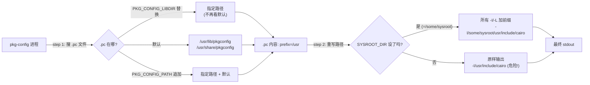
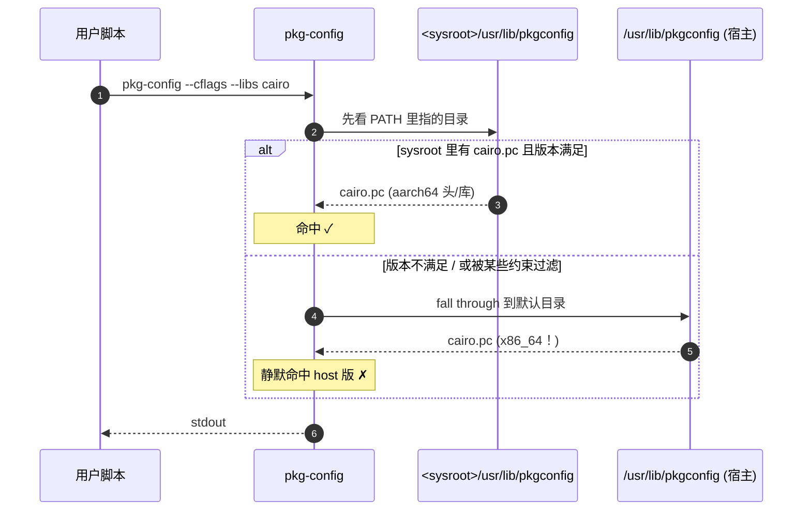
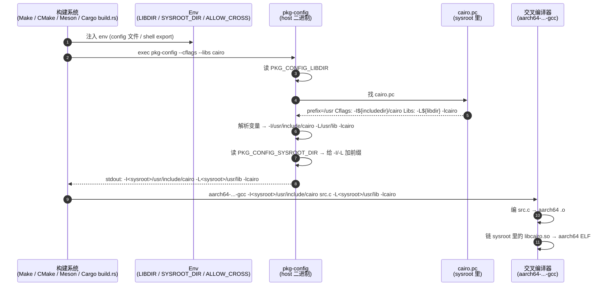

# pkg-config 在交叉编译中的角色

> [!note]
> **Ref:**
> - [`prj/05-GraphStack/tspi-greet-rs/.cargo/config.toml`](../../../prj/05-GraphStack/tspi-greet-rs/.cargo/config.toml) —— 三件套在 Rust 工程的落地
> - [`prj/05-GraphStack/tspi-greet-rs/Design-CrossCompile.md`](../../../prj/05-GraphStack/tspi-greet-rs/Design-CrossCompile.md) §5 —— 同一套机制在 cairo-sys-rs build.rs 里的体感版
> - [`man pkg-config(1)`](https://linux.die.net/man/1/pkg-config)
> - [pkg-config 官方文档](https://www.freedesktop.org/wiki/Software/pkg-config/)
>
> TLDR:
>
> ```bash
> ❯ tldr pkg-config
> 
>   pkg-config
> 
>   Provide the details of installed libraries for compiling applications.
>   More information: https://manned.org/pkg-config.
> 
>   Get the list of libraries and their dependencies:
> 
>     pkg-config --libs library1 library2 ...
> 
>   Get the list of libraries, their dependencies, and proper cflags for gcc:
> 
>     pkg-config --cflags --libs library1 library2 ...
> 
>   Compile your code with libgtk-3, libwebkit2gtk-4.0 and all their dependencies:
> 
>     c++ example.cpp $(pkg-config --cflags --libs gtk+-3.0 webkit2gtk-4.0) -o example
> ```

## 1.`which pkg-config`

1.pkg-config` 是一个在 Linux/Unix 世界里的“自动问路器”，可以帮你解决编译代码时查找和链接第三方库的麻烦。

手动编译一个依赖第三方库的程序时，需要开发者自己弄清楚三件事：

1. **头文件 (Headers) 在哪：** 编译时要用 `-I` 参数告诉编译器。
2. **库文件 (Libraries) 在哪：** 链接时要用 `-L` 参数指定路径。
3. **库的名字 (Name) 是什么：** 链接时要用 `-l` 参数指定库名。

这些信息不仅难记，不同的系统路径还可能不同。`pkg-config` 的作用，就是把这些繁琐的细节自动化，变成一个简单的命令。

## 2. `.pc` 文件解剖

`.pc` 文件是个普通文本，安装在 `<prefix>/lib/pkgconfig/` 下（个别发行版也用 `share/pkgconfig`）。以 cairo 为例：

```ini
# 实际文件：<sysroot>/usr/lib/pkgconfig/cairo.pc
prefix=/usr
exec_prefix=${prefix}
libdir=${exec_prefix}/lib
includedir=${prefix}/include

Name: cairo
Description: Multi-platform 2D graphics library
Version: 1.17.4

Requires.private: pixman-1 >= 0.36.0 fontconfig >= 2.10.91 ...
Libs: -L${libdir} -lcairo
Libs.private: -lz -lpthread ...
Cflags: -I${includedir}/cairo
```

关键观察：

1. **`prefix=/usr` 是写死的**。这个 `.pc` 文件是 buildroot 把它装进 sysroot 时写下的，prefix 用的是**目标 rootfs 视角的 /usr**。直接 `pkg-config --cflags cairo` 会得到 `-I/usr/include/cairo` —— **是 sysroot 视角的路径，不是宿主上能用的绝对路径**。
2. **`Libs / Cflags` 都通过 `${...}` 间接引用 `prefix`**。这是关键 —— 改 `prefix` 一处就能整体重定位。
3. **`Requires` 链式展开** —— `pkg-config --cflags cairo` 会递归把 pixman / fontconfig 的 Cflags 也展开进来。所以一次拿到 cairo 的所有 `-I` 集合。

**结论**：要让 pkg-config 在 cross-build 输出"宿主上能用的 `-I/<sysroot>/usr/include/cairo`"，必须让它知道两件事：

- **去哪儿找 `.pc`**（不是 host `/usr/lib/pkgconfig`，是 sysroot 里的） → `PKG_CONFIG_LIBDIR`
- **把 `.pc` 里的 prefix 前面再加什么前缀** → `PKG_CONFIG_SYSROOT_DIR`


## 3. 三个核心环境变量



| 变量 | 语义 | cross-build 应当用 | 漏掉的代价 |
|------|-----|------------------|-----------|
| `PKG_CONFIG_LIBDIR` | **替换** 默认 .pc 搜索路径，只看指定的那个目录 | ✅ 必须 | 命中宿主 `.pc` → x86_64 库 |
| `PKG_CONFIG_PATH` | **追加** 在默认搜索路径**之后**（注意"之后"） | ❌ 不要用 | 等同没设；不能阻止宿主 .pc 漏入 |
| `PKG_CONFIG_SYSROOT_DIR` | 给 `.pc` 输出的所有 `-I/-L` **加前缀** | ✅ 必须 | `.pc` 找对了但路径全是 `/usr/...` 解析到宿主 |
| `PKG_CONFIG_ALLOW_CROSS` | 解除 pkg-config-rs (Rust 工具链) 的 cross 拒绝保护 | ✅（用 Rust 时） | build.rs panic："pkg-config has not been configured for cross-compilation" |
| `PKG_CONFIG_ALLOW_SYSTEM_CFLAGS` | 默认 pkg-config 会过滤掉 `-I/usr/include`（认为冗余） | 几乎不需要改 | 默认行为 OK |
| `PKG_CONFIG_ALLOW_SYSTEM_LIBS` | 同上，过滤 `-L/usr/lib /usr/lib64` | 几乎不需要改 | 默认行为 OK |

### 3.1 `PKG_CONFIG_LIBDIR` —— 替换语义

设了它之后：

```
默认搜索路径 /usr/lib/pkgconfig + /usr/share/pkgconfig   被完全替换
→ 只搜  ${PKG_CONFIG_LIBDIR}（可以是多个目录，用 : 分隔）
```

cross-build 把它指向 sysroot 内的 .pc 目录：

```sh
export PKG_CONFIG_LIBDIR=<sysroot>/usr/lib/pkgconfig:<sysroot>/usr/share/pkgconfig
```

宿主 `/usr/lib/pkgconfig/cairo.pc` 即使存在也**绝不会被命中** —— 这是"杜绝宿主漏入"的底线。

### 3.2 `PKG_CONFIG_PATH` —— 追加语义

设了它之后：

```
${PKG_CONFIG_PATH}  +  默认搜索路径 (/usr/lib/pkgconfig + /usr/share/pkgconfig)
```

PATH 加在**前面**，所以**会优先匹配**。但只要你设的版本约束比宿主低，或者你设了不存在的 .pc，pkg-config 还是会 fall through 到宿主目录拿 `.pc`。

**所以 PATH 在 cross-build 下完全不可靠** —— 它是给 native 用户"额外补几个安装位置"用的（如 Homebrew 装的库在 `/usr/local/opt/.../pkgconfig`）。

### 3.3 `PKG_CONFIG_SYSROOT_DIR` —— 前缀重写

设了它之后，pkg-config 把 `.pc` 输出的所有 `-I path` / `-L path` 这种以 `/` 开头的绝对路径**全部加前缀**：

```sh
export PKG_CONFIG_SYSROOT_DIR=<sysroot>

# 不设时
pkg-config --cflags cairo   # 输出: -I/usr/include/cairo

# 设了之后
pkg-config --cflags cairo   # 输出: -I<sysroot>/usr/include/cairo
```

这一步把"sysroot 视角的 .pc"翻译成"宿主上能编译的绝对路径"。**不可少**。

> [!IMPORTANT]
> SYSROOT_DIR 重写的是 `-I/-L`，**不会**重写 `.pc` 里 `prefix=` 那一行本身在 pkg-config 内部的语义。也不会重写 `Libs: -lcairo` 里的库名（因为 `-l` 后面跟的是 SONAME 而非路径）。


## 4. 关键陷阱：LIBDIR vs PATH 一字之差

新手最容易写成：

```sh
# ❌ 错误：cross-build 用 PKG_CONFIG_PATH
export PKG_CONFIG_PATH=<sysroot>/usr/lib/pkgconfig
export PKG_CONFIG_SYSROOT_DIR=<sysroot>
```

表面看起来"指了 sysroot 的目录"。**实际行为**：



后果："看上去能 build，链接时报奇怪的错"或者"build 完跑不起来"。

正确做法：

```sh
# ✅ cross-build 必须用 LIBDIR（替换语义）
export PKG_CONFIG_LIBDIR=<sysroot>/usr/lib/pkgconfig
export PKG_CONFIG_SYSROOT_DIR=<sysroot>
```

记忆口诀：**"cross 用 LIBDIR、native 用 PATH"**。


## 5. ALLOW_* 保护开关

### 5.1 `PKG_CONFIG_ALLOW_CROSS` —— 给 Rust 用的

这个变量**不是 pkg-config 本体识别的**，是 Rust 生态的 `pkg-config` crate (`pkg-config-rs`) 自己加的"保险"。

```rust
// pkg-config-rs/src/lib.rs 大意
if host_triple != target_triple
   && env::var("PKG_CONFIG_ALLOW_CROSS").is_err() {
    panic!("pkg-config has not been configured to support cross-compilation.
            Install a sysroot for the target platform and configure it via
            PKG_CONFIG_SYSROOT_DIR and PKG_CONFIG_LIBDIR, or pass --allow-cross.");
}
```

设计意图：避免"用户没想好 cross 配置，结果链了宿主库"。一旦你确认 LIBDIR / SYSROOT_DIR 都设对了，显式 `PKG_CONFIG_ALLOW_CROSS=1` 开闸。

**C / CMake / Meson 工程不需要这个变量** —— 它们的 pkg-config 集成直接调 pkg-config 二进制，没有这层 Rust 自己加的保护。

### 5.2 `PKG_CONFIG_ALLOW_SYSTEM_*` —— pkg-config 本身的过滤

pkg-config 默认会从输出里**剥掉** `-I/usr/include` 和 `-L/usr/lib`，因为它认为这些是 system 默认搜索路径，没必要重复。在 cross-build 设了 SYSROOT_DIR 后这些会变成 `-I<sysroot>/usr/include` 形式，**不再触发过滤**，所以**通常无需设这两个变量**。

只有在你**强行用 PATH 而非 LIBDIR**（不推荐）且 `.pc` 里写了 `-I/usr/include/cairo` 这种"被 pkg-config 默认认为多余"的内容时，才可能需要：

```sh
export PKG_CONFIG_ALLOW_SYSTEM_CFLAGS=1
export PKG_CONFIG_ALLOW_SYSTEM_LIBS=1
```


## 6. 完整工作流程：一次 cross-build 期间 pkg-config 做了什么




## 7. 各构建系统的集成

> 三个 env 变量是"通用语言"，各构建系统只是不同的 "封装"。

### 7.1 Makefile（最直接）

```make
SYSROOT := /path/to/sysroot
export PKG_CONFIG_LIBDIR      := $(SYSROOT)/usr/lib/pkgconfig
export PKG_CONFIG_SYSROOT_DIR := $(SYSROOT)

CC      := aarch64-linux-gnu-gcc
CFLAGS  := $(shell pkg-config --cflags cairo)
LDLIBS  := $(shell pkg-config --libs cairo)

app: src.c
	$(CC) $(CFLAGS) src.c -o $@ $(LDLIBS)
```

注意 `export` —— Make 默认不把变量传给子进程，必须显式 export 才能被 `pkg-config` 子进程看到。

### 7.2 Autotools (`./configure`)

Autotools 生成的 configure 脚本里大量 `PKG_CHECK_MODULES([CAIRO], [cairo])`。它在底层就是调 pkg-config，所以**只要 env 设对了就工作**：

```sh
export PKG_CONFIG_LIBDIR=<sysroot>/usr/lib/pkgconfig
export PKG_CONFIG_SYSROOT_DIR=<sysroot>
./configure --host=aarch64-linux-gnu --prefix=/usr
make
```

`--host=` 同时让 configure 切换到 cross 模式（如不再做 test program 实跑）。

### 7.3 CMake

CMake 用 `find_package(PkgConfig); pkg_check_modules(CAIRO REQUIRED cairo)`：

```cmake
find_package(PkgConfig REQUIRED)
pkg_check_modules(CAIRO REQUIRED cairo)
add_executable(app src.c)
target_include_directories(app PRIVATE ${CAIRO_INCLUDE_DIRS})
target_link_libraries(app PRIVATE ${CAIRO_LIBRARIES})
```

cmake -DCMAKE_TOOLCHAIN_FILE=... 配 cross-build 时，toolchain 文件里设：

```cmake
set(CMAKE_SYSROOT "<sysroot>")
set(ENV{PKG_CONFIG_LIBDIR}      "<sysroot>/usr/lib/pkgconfig")
set(ENV{PKG_CONFIG_SYSROOT_DIR} "<sysroot>")
```

### 7.4 Meson

Meson 把 cross-config 集中在一个 `cross-file.ini`：

```ini
[binaries]
c          = '/path/to/aarch64-linux-gnu-gcc'
ar         = '/path/to/aarch64-linux-gnu-ar'
strip      = '/path/to/aarch64-linux-gnu-strip'
pkg-config = '/usr/bin/pkg-config'

[built-in options]
sys_root = '/path/to/sysroot'
pkg_config_path = '/path/to/sysroot/usr/lib/pkgconfig'

[host_machine]
system     = 'linux'
cpu_family = 'aarch64'
cpu        = 'aarch64'
endian     = 'little'
```

Meson 看到 `sys_root` 后**自动**给 pkg-config 子进程注入 `PKG_CONFIG_SYSROOT_DIR=...` —— 用户无需手设。但 `pkg_config_path` 这个名字是 Meson 自己的，**它实际上 set 的是 `PKG_CONFIG_LIBDIR`**（替换语义），别被名字误导。

### 7.5 Cargo (`pkg-config-rs` crate)

`*-sys` crate (如 cairo-sys-rs, openssl-sys) 在 build.rs 调：

```rust
pkg_config::Config::new()
    .atleast_version("1.16")
    .probe("cairo")
    .unwrap();
```

cargo 端在 `.cargo/config.toml` 注入：

```toml
[env]
PKG_CONFIG_ALLOW_CROSS = "1"
PKG_CONFIG_SYSROOT_DIR = "/path/to/sysroot"
PKG_CONFIG_LIBDIR      = "/path/to/sysroot/usr/lib/pkgconfig"
```

实战详例：见 [`prj/05-GraphStack/tspi-greet-rs/.cargo/config.toml`](../../../prj/05-GraphStack/tspi-greet-rs/.cargo/config.toml) + [`Design-CrossCompile.md` §5](../../../prj/05-GraphStack/tspi-greet-rs/Design-CrossCompile.md)。


## 8. 通用配置模板（可直接抄）

任何"宿主 → 交叉目标"组合都套这个模板，替换 `<sysroot>`：

```sh
# === 三件套：cross-build pkg-config ===
export PKG_CONFIG_LIBDIR="<sysroot>/usr/lib/pkgconfig:<sysroot>/usr/share/pkgconfig"
export PKG_CONFIG_SYSROOT_DIR="<sysroot>"
# Rust 工程额外：
export PKG_CONFIG_ALLOW_CROSS=1
# 几乎不需要，仅当用 PATH 而非 LIBDIR 时才考虑：
# export PKG_CONFIG_ALLOW_SYSTEM_CFLAGS=1
# export PKG_CONFIG_ALLOW_SYSTEM_LIBS=1

# === 验证 ===
pkg-config --cflags cairo   # 期望全部 -I 以 <sysroot> 开头
pkg-config --libs   cairo   # 期望 -L<sysroot>/usr/lib -lcairo
pkg-config --modversion cairo   # 期望 sysroot 里的版本（不是宿主）
```


## 9. 故障排查表

| 现象 | 第一动作 | 根因 |
|------|---------|------|
| `Package cairo was not found in the pkg-config search path` | `echo $PKG_CONFIG_LIBDIR; ls $PKG_CONFIG_LIBDIR/cairo.pc` | LIBDIR 没设 / 路径错 / 包没编进 sysroot |
| 输出里有 `-I/usr/include/cairo`（没 sysroot 前缀） | `echo $PKG_CONFIG_SYSROOT_DIR` | SYSROOT_DIR 没设 |
| 输出**部分** `-I` 有 sysroot 前缀，部分没有 | 检查 `.pc` 里是否有硬编码绝对路径 | 极少数 `.pc` 里写了 `-I/some/abs/path` 而非 `-I${includedir}/...` —— buildroot 包打 patch 修；或上游 bug |
| Rust build.rs panic "not configured for cross-compilation" | `echo $PKG_CONFIG_ALLOW_CROSS` | ALLOW_CROSS=1 没设 |
| `.pc` 找到但版本不满足 | `pkg-config --modversion cairo` | sysroot 里装的版本旧；改 atleast_version 或重编 buildroot 包 |
| 链接报 ABI 错 / undefined symbol | `file <sysroot>/usr/lib/libcairo.so` | LIBDIR 命中了宿主 `.pc`（用 PATH 不用 LIBDIR 的典型后果） |
| 跑起来 `libfoo.so: cannot open shared object file` | 板上 rootfs 缺包 | sysroot 与 rootfs 不同源 —— 二者必须是同一次 buildroot 构建的产物 |


## 10. pkg-config 帮不上忙的场景

| 场景 | 原因 | 替代方案 |
|------|-----|---------|
| 库没装 `.pc` 文件 | 老 / 闭源 / 私有库 | 手写 `-I -L -l`；或自己造 `.pc` 文件放到 sysroot |
| Header-only 库 (boost, glm) | 没有 `.so` / `.a` | 手写 `-I` |
| 模板/宏深耦合 (如 ICU + libxml2) | `.pc` 不够，还有头文件路径配置 | 仍调 pkg-config 拿 `-I/-L`，运行时配置走应用 |
| 多版本并存 (gtk-3.0 vs gtk-4.0) | `.pc` 不同名 (gtk+-3.0.pc / gtk4.pc) | 显式指 module 名；`pkg-config --list-all` 看清楚 |


## 11. 与本仓笔记的衔接

| 想看哪个角度 | 看这里 |
|-------------|-------|
| 同一套机制在 Rust cairo-sys-rs build.rs 里的真实落地 + 实测 stdout | [`prj/05-GraphStack/tspi-greet-rs/Design-CrossCompile.md`](../../../prj/05-GraphStack/tspi-greet-rs/Design-CrossCompile.md) §5 |
| buildroot sysroot 是怎么生成的 | [[../buildroot/01-BR_config]] / [[../buildroot/02-BR_usage]] |
| Qt / CMake 用户空间开发集成 | [[../buildroot/05-BR_QT用户空间应用开发环境]] |


## 12. 一句话总结

> `pkg-config` 是 C 生态的"库元信息解析器"。**cross-build 想让它输出 sysroot 路径**，只需三件套：
>   - `PKG_CONFIG_LIBDIR` —— 用 **替换** 语义把 .pc 搜索路径压到 sysroot 内（**别用 PATH**）
>   - `PKG_CONFIG_SYSROOT_DIR` —— 给输出的所有 `-I/-L` 加 sysroot 前缀
>   - `PKG_CONFIG_ALLOW_CROSS` —— 只对 Rust 工具链有意义，开闸 pkg-config-rs 的 cross 拒绝保护
>
> 验证只看一行：`pkg-config --cflags <pkg>` 输出的所有 `-I` 是否**都以 sysroot 开头**。
