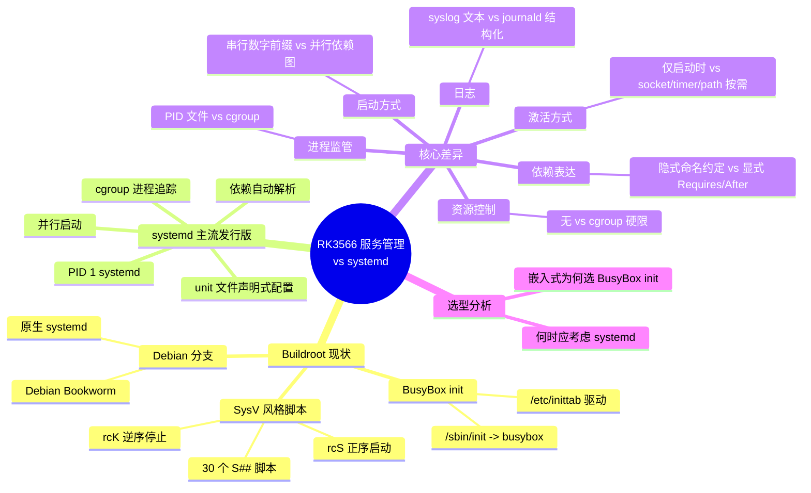
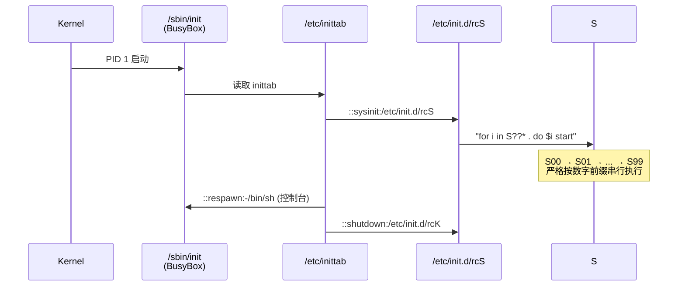
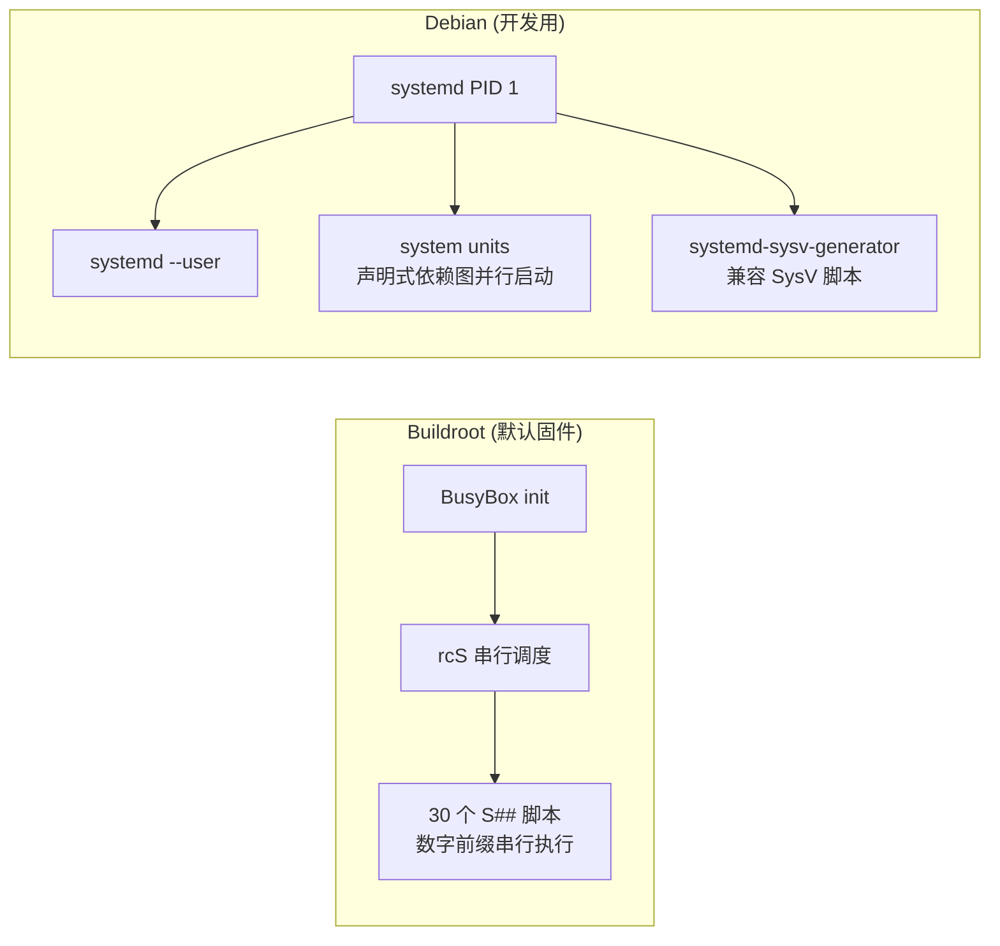
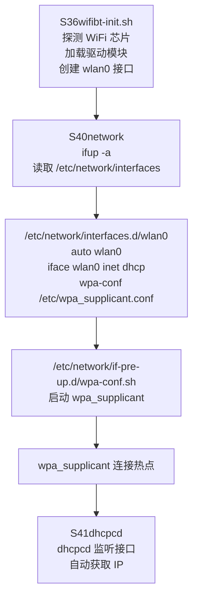
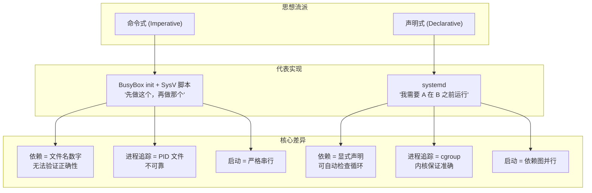

## 思维导图



---

# 1. RK3566 Buildroot SDK 服务管理现状

## 1.1 总体架构：两套根文件系统，两套 Init

SDK 提供了三种根文件系统构建选项，其中实际使用的是两种，各自对应一种 init 体系：

| 根文件系统 | Init 系统 | 构建方式 | 适用场景 |
|-----------|----------|---------|---------|
| **Buildroot**（默认） | **BusyBox init** | `./build.sh buildroot` | 出厂固件、极简嵌入式 |
| **Debian** | **systemd** | `./build.sh debian` | 开发调试、功能完整 |
| Yocto | (未使用) | `./build.sh yocto` | — |

> **关键发现**：在 `buildroot/configs/rockchip/products/electric.config` 中明确配置了 `BR2_INIT_SYSTEMD=y`，这说明 **Buildroot 本身支持用 systemd 替代 BusyBox init**，只是 RK3566 的默认 defconfig 没有走这个产品配置。Rockchip 官方为不同产品形态预置了 init 系统的选择。

## 1.2 Buildroot（默认固件）：BusyBox init + SysV 脚本

### 初始化链路



**`/etc/inittab` 内容**（实际构建产物）：

```
::sysinit:/etc/init.d/rcS
::respawn:-/bin/sh
::shutdown:/etc/init.d/rcK
```

只有三行——简洁到极致。没有 runlevel 概念，没有 `ctrlaltdel` 处理，没有 `tty` 管理（`getty` 由其他机制处理）。

### rcS 调度机制

`rcS` 脚本的核心逻辑（来自 Buildroot 包 `package/initscripts/init.d/rcS`）：

```sh
for i in /etc/init.d/S??* ; do
    # 忽略备份文件和 .rpmsave
    case "$i" in *.sh) . "$i" ;; *) "$i" start ;; esac
done
```

- **`.sh` 后缀**：直接 `source`，在当前 shell 执行（用于环境变量导出等）
- **其他文件**：以 `start` 参数独立调用
- **执行顺序**：完全由文件名前缀 `S##` 的数字**从小到大串行**执行
- **无并行能力**：这是 BusyBox init 的根本限制——无法表达"这两个服务互不依赖，可以同时启动"

### 30 个 Init 脚本全景

构建产物 `/etc/init.d/` 下的完整脚本列表，按启动顺序排列：

| 顺序 | 脚本 | 功能 | 提供方 |
|------|------|------|--------|
| S00 | `mountall.sh` | 挂载所有文件系统（`mount -a`） | Buildroot |
| S01 | `log-guardian.sh` | 日志守护 | Rockchip |
| S01 | `seedrng` | 随机数种子（urandom） | Buildroot |
| S01 | `syslogd` | 系统日志守护进程 | BusyBox |
| S02 | `klogd` | 内核日志守护进程 | BusyBox |
| S02 | `sysctl` | 内核参数设置（`sysctl -p`） | Buildroot |
| S05 | `async-commit.sh` | 异步提交（帧缓冲相关） | Rockchip |
| S10 | `udev` | 设备管理（eudev） | Buildroot |
| S13 | `irqbalance` | IRQ 负载均衡 | Buildroot |
| S30 | `dbus` | D-Bus 消息总线 | Buildroot |
| S36 | `wifibt-init.sh` | Wi-Fi/BT 芯片探测、固件加载、驱动加载 | Rockchip |
| S40 | `bluetoothd` | 蓝牙守护进程 | BlueZ |
| S40 | `network` | 网络接口初始化（`ifup -a`） | Buildroot |
| S40 | `rkaiq_3A` | Rockchip 相机 3A 算法服务 | Rockchip |
| S41 | `dhcpcd` | DHCP 客户端（监听接口自动获取 IP） | Buildroot |
| S49 | `chronyd` | NTP 时间同步 | Buildroot |
| S49 | `weston` | Wayland 合成器（图形显示） | Buildroot |
| S50 | `crond` | Cron 定时任务 | BusyBox |
| S50 | `dropbear` | 轻量 SSH 服务器 | Buildroot |
| S50 | `pulseaudio` | 音频服务器 | Buildroot |
| S50 | `sshd` | OpenSSH 服务器 | Buildroot |
| S50 | `usb-gadget.sh` | USB Gadget（RNDIS + ADB 复合设备） | Rockchip |
| S80 | `dnsmasq` | DNS/DHCP 服务器 | Buildroot |
| S98 | `iodomain.sh` | IO 域电压域配置 | Rockchip |
| S99 | `auto-reboot` | 自动重启（看门狗相关） | Rockchip |
| S99 | `chromium-wayland.sh` | Chromium 浏览器（Wayland 后端） | Rockchip |
| S99 | `fstrim` | 文件系统 trim（仅 eMMC） | Buildroot |
| S99 | `input-event-daemon` | 输入事件守护 | Rockchip |
| — | `rcS` | 启动调度器（本身不是 S## 脚本） | Buildroot |
| — | `rcK` | 关机调度器（逆序调用 S## stop） | Buildroot |

### 板级定制：Overlay 机制

Buildroot 通过 **overlay 目录** 直接将文件覆盖到目标根文件系统。RK3566 的 overlay 链路：

```
buildroot/board/rockchip/common/overlays/
├── 10-weston/          → weston.ini, wayland 环境
├── 11-weston-chromium/ → chromium 配置
├── 15-tspi-greet/      → TSPI kiosk 模式（weston kiosk-shell）
└── 20-wlan0/           → /etc/network/interfaces.d/wlan0
                          /etc/network/if-pre-up.d/wpa-conf.sh
                          /etc/network/if-down.d/...

buildroot/board/rockchip/rk3566_rk3568/fs-overlay/
├── etc/usb-gadget.d/   → USB gadget 后置钩子
├── etc/udev/rules.d/   → udev 规则
└── etc/pulse/          → PulseAudio 配置
```

> **关键限制**：overlay 是**静态文件覆盖**，不涉及任何动态依赖解析或服务排序逻辑。服务之间的启动顺序完全依赖开发者手工为脚本命名 `S##` 编号——依赖关系隐含在数字中，不显式、不可验证。

## 1.3 Debian 分支：原生 systemd

SDK 的 Debian 构建基于 **Debian Bookworm (12)** 的 Linaro ARM64 基础根文件系统，使用原生 systemd。

`debian/overlay/etc/init.d/rockchip.sh` 是一个典型的 Rockchip 板级初始化脚本——它以 SysV 脚本形式存在，但由 systemd 的兼容层（`systemd-sysv-generator`）自动转换为 service unit 管理。



---

# 2. 核心维度对比

## 2.1 启动模型：串行 vs 并行依赖图

这是最根本的架构差异。

### Buildroot / BusyBox init

```
时间轴 →
S00 ──→ S01 ──→ S02 ──→ ... ──→ S50 ──→ ... ──→ S99
      (串行：每个脚本必须等前一个完成才能开始)
```

所有 30 个脚本**严格串行**执行。即使 `S40network` 和 `S40bluetoothd` 之间没有实际依赖，它们也只能按文件名字典序依次执行。启动时间 = 所有服务启动时间的**总和**。

### systemd

```
时间轴 →
        ┌─ nginx.service ────┐
        │                    │
default.target ─┼─ postgresql.service ─┼─→ 就绪
        │                    │
        └─ redis.service ────┘
        (无依赖的服务并行启动)
```

启动时间 = 关键路径（critical chain）上最慢的那条依赖链，而非所有服务之和。

**实测数据**（主流发行版）：

| 场景 | SysV init | systemd |
|------|-----------|---------|
| 典型桌面启动 | 25-40s | 5-10s |
| 服务器（50+ 服务） | 45-60s | 8-15s |
| 嵌入式（15 服务） | 8-15s | 3-5s |

对于 RK3566 的 30 个服务，串行启动的开销虽然不比服务器严重，但在有 `weston`（图形）、`chromium`（浏览器）等重量级服务时，阻塞效应明显。

## 2.2 依赖表达：数字隐含 vs 显式声明

### Buildroot 的隐式依赖

```sh
# S36wifibt-init.sh 需要在 udev(S10) 和 dbus(S30) 之后
# 但这是"通过数字保证的"，没有任何机器可读的约束
# 开发者只能靠注释、文档、以及经验来维护顺序
```

- **正确性靠人工审核**：没有人或工具能验证 S40 的三个脚本是否真的可以任意排序
- **冲突难排查**：若两个脚本意外使用同一个资源（如设备节点），无法自动检测
- **维护负担**：加新服务时需要研究已有编号，找到一个"合适的"数字

### systemd 的显式依赖

```ini
[Unit]
Description=TSPI WiFi/BT Init
After=systemd-udev-settle.service dbus.service
Requires=dbus.service
Wants=systemd-udev-settle.service
```

- **声明式**：依赖关系是配置的一部分，有明确的语义
- **可验证**：`systemd-analyze dot` 可以生成依赖图，`systemd-analyze verify` 检查错误
- **自动排序**：systemd 根据依赖拓扑自行计算启动顺序，开发者只需声明"需要什么"

## 2.3 进程监管：PID 文件 vs cgroup

### Buildroot 的 PID 文件模式

```sh
# S41dhcpcd 的典型模式（伪代码）
start() {
    start-stop-daemon -S -b -p /var/run/dhcpcd.pid -x /sbin/dhcpcd -- -AL
}
stop() {
    start-stop-daemon -K -p /var/run/dhcpcd.pid
}
```

**根本问题**：
- **PID 文件不可靠**：进程崩溃后 PID 文件残留（stale PID），stop 操作找不到进程
- **fork 炸弹无法追踪**：守护进程 fork 出的子进程不在 PID 文件里，`stop` 可能导致孤儿进程
- **无法确定"属于这个服务的所有进程"**：`start-stop-daemon` 只能按 PID 文件或可执行文件名匹配，但子进程可能改了 `argv[0]`

### systemd 的 cgroup 模式

```
/sys/fs/cgroup/system.slice/
├── nginx.service/
│   ├── pids: 1234 (master), 1235 (worker), 1236 (worker)
│   ├── memory.current: 128M
│   └── cpu.stat: ...
├── postgresql.service/
│   └── pids: 2345 (postmaster), 2346, 2347, ...
```

- **准确追踪**：无论进程 fork 多少次、改了什么名字，都在 cgroup 内
- **一键清理**：`systemctl stop` 时内核保证 cgroup 内所有进程被终止（通过 `cgroup.procs` 的 `kill` 语义）
- **资源计量**：CPU/内存/IO 使用量精确归因到每个 service

## 2.4 日志：syslog 文本 vs journald 结构化

### Buildroot 日志流

```
内核 printk  →  klogd  →  syslogd  →  /var/log/messages (文本)
用户进程      →  syslogd →  /var/log/messages (文本)
服务 stdout   →  (丢失或重定向到文件)
```

- **不可查询**：需要 `grep | awk | sed` 组合
- **stdout/stderr 可能丢失**：除非脚本显式重定向
- **日志归因模糊**：多服务日志混在同一文件，按进程名/PID 区分不可靠

### systemd 日志流

```
内核 printk  →  journald  →  /var/log/journal/ (二进制索引)
用户进程      →  journald (stdout+stderr 自动捕获)
服务 stdout   →  journald (默认 StandardOutput=journal)
```

- **结构化**：每条日志有 `_SYSTEMD_UNIT`、`_PID`、`_UID`、`_COMM` 等字段
- **精确过滤**：`journalctl -u sshd.service -p err -b`
- **完整性**：从服务启动到关闭的 stdout/stderr 全部保留

## 2.5 资源控制：无 vs cgroup Controller

### Buildroot

```
# 没有任何机制限制一个服务能使用的资源
# S50chromium-wayland.sh 如果内存泄漏，整个系统 OOM
```

### systemd

```ini
[Service]
MemoryMax=512M          # 硬限制：超过即 OOM kill（仅该 cgroup）
CPUQuota=50%            # CPU 使用上限
IOReadBandwidthMax=/dev/mmcblk0 10M  # 读带宽限制
TasksMax=100            # 最大进程/线程数
```

这是嵌入式场景的刚需——资源极度有限，一个泄漏的进程不能拖死整板。

## 2.6 激活方式：仅启动时 vs 按需激活

| 激活方式 | Buildroot | systemd |
|---------|-----------|---------|
| 启动时启动 | ✅ 唯一方式 | ✅ |
| 套接字激活（socket activation） | ❌ | ✅ `*.socket` unit |
| 定时器激活（timer activation） | ⚠️ crond（粗粒度） | ✅ `*.timer` unit（秒级、单调时钟、日历事件） |
| 路径激活（path activation） | ❌ | ✅ `*.path` unit（inotify） |
| 设备激活（device activation） | ⚠️ udev 规则可触发 | ✅ `*.device` unit（与 udev 深度集成） |
| D-Bus 激活 | ❌ | ✅ `Type=dbus` |

**嵌入式场景中套接字激活的价值**：

```ini
# 例如：只在 PC 通过 RNDIS 连接时启动 adbd
# systemd 方式：*.socket 监听 5555，连接到达时自动启动 adbd
# Buildroot 方式：adbd 常驻运行，消耗内存
```

在 RK3566 的 4GB 内存中常驻一个 `adbd`（~2MB）不算什么，但 10 个"偶尔"使用的服务加起来就有 20-30MB——对于 512MB/1GB 内存的低配嵌入式设备，这就很可观了。

## 2.7 状态监控：被动检查 vs 主动通知

### Buildroot：轮询/手动检查

```bash
# 检查服务是否运行
ps | grep wpa_supplicant
# 检查端口是否在监听
netstat -tlnp | grep 5555
# 没有标准化的健康状态查询接口
```

### systemd：统一状态查询

```bash
systemctl is-active nginx      # active / inactive / failed
systemctl status nginx          # 最近 10 行日志 + 状态
systemctl list-units --state=failed  # 全局失败视图
```

以及 **`Type=notify`**——服务可以在真正就绪时主动通知 systemd（`sd_notify("READY=1")`），而不是靠"进程已启动"来猜测。这在初始化时间不规律的服务（如需要加载 AI 模型的 NPU 服务）上非常重要。

---

# 3. 信号处理的对比

上一节 systemd 手册翻译中详细列出了 systemd 支持的 **25 种信号**（SIGTERM、SIGINT、SIGWINCH、SIGPWR、SIGUSR1/2、SIGHUP、以及 SIGRTMIN+N 系列），可以实现：

| 操作 | systemd | BusyBox init |
|------|---------|-------------|
| 守护进程重载 | `systemctl daemon-reload` (SIGHUP) | ❌ 无此机制 |
| 状态序列化/反序列化 | SIGTERM（reexec） | ❌ |
| 切换运行模式 | `systemctl isolate rescue.target` | ❌ 无 runlevel 概念 |
| 日志级别动态调整 | SIGRTMIN+22/23 | ❌ 需重启 |
| 立即关机/重启 | SIGRTMIN+13~16 | `reboot -f` 直接系统调用 |

BusyBox init 只响应极少量的信号（主要是 SIGINT 和 SIGTERM 的默认行为），没有运行时状态管理能力。

---

# 4. 实物对比：WiFi 连接这一件事

让我们以"开发板上电后自动连接 WiFi"这一再常见不过的需求，直观对比两套体系：

### Buildroot 方式（实际代码路径）



- **5 个独立脚本/配置文件**，分散在 3 个不同 overlay 目录中
- 依赖关系全靠 `S36 < S40 < S41` 的数字顺序保证
- 若 WiFi 驱动加载慢（SDIO 初始化），但 `S40network` 已执行——接口尚未出现，配网失败。无重试机制
- 无法在 WiFi 可用时**才**启动依赖网络的服务（如 `S49chronyd` NTP 同步）——只能盲排顺序

### systemd 方式（等价逻辑）

```ini
# 1. wifibt-init.service —— 探测芯片+加载驱动
[Unit]
Description=WiFi/BT Chip Init
Before=network.target

[Service]
Type=oneshot
ExecStart=/usr/bin/wifibt-init.sh

# 2. wpa_supplicant@wlan0.service —— 连接热点
[Unit]
Description=WPA Supplicant on %i
After=wifibt-init.service

[Service]
ExecStart=/sbin/wpa_supplicant -i %i -c /etc/wpa_supplicant.conf

# 3. network.target 在接口获得 IP 后 reachable
# 4. chronyd.service
[Unit]
After=network.target
```

- **显式依赖**：chronyd 明确声明 `After=network.target`，网络不可用时不会被错误启动
- **自动重试**：wpa_supplicant 可以配置 `Restart=on-failure` + `RestartSec=10s`
- **状态可查**：`systemctl status wpa_supplicant@wlan0.service` 直接看到连接状态和最近日志

---

# 5. 为什么嵌入式选择 BusyBox init？

尽管 systemd 在功能上全面领先，Buildroot 默认选择 BusyBox init 有其合理考量：

| 维度 | BusyBox init | systemd |
|------|-------------|---------|
| **二进制体积** | `/sbin/init` 是 busybox 的一部分（~800KB total busybox） | systemd + journald + udev + ... ≈ **15-25MB** |
| **内存占用（运行时）** | <1MB | PID 1 ~3-5MB，+ journald ~3-5MB，+ logind ~2MB，≈ **10-15MB** |
| **依赖复杂度** | 无。内核 + busybox = 可启动 | dbus、glibc（非 uclibc/musl 友好）、libcap、libmount、pam 等 |
| **Flash 占用** | ~1MB | ~20-30MB |
| **启动时间** | <1s（串行 30 个脚本总计 5-8s 是服务本身耗时，非 init 开销） | 自身启动 ~0.5s，但需要 dbus 先起来 |
| **配置复杂性** | inittab（3 行）+ 若干 shell 脚本 | unit 文件（每个服务一个 .service 文件）+ 多层配置目录 |
| **调试工具** | `ps`、`cat /var/log/messages`、shell | `systemctl`、`journalctl`、`systemd-analyze` |

**结论**：对于 512MB 以下内存、128MB 以下 Flash 的嵌入式设备，systemd 的体积开销可能不可接受。RK3566 拥有 2-4GB 内存和 32GB+ eMMC，实际上**完全有能力运行 systemd**。

---

# 6. 实际建议：何时该用 systemd？

### 保持 BusyBox init 的场景

- Flash < 256MB 或内存 < 256MB
- 固件需要极简攻击面（安全认证要求）
- 只有 3-5 个后台服务，串行启动时间本身 < 3s
- 团队不熟悉 systemd，且不需要频繁改动服务配置

### 切换到 systemd 的场景

- 服务数量 > 15 个，且启动顺序的维护成本开始显现
- 需要**套接字激活**（如 adbd 按需启动）或**定时器激活**（替代 cron）
- 需要**资源限制**（防止某个服务 OOM 拖死全系统）
- 需要**统一的结构化日志**
- 使用 Debian rootfs（**已经是 systemd**，无需额外工作）
- 系统有 512MB+ 内存和 512MB+ Flash（RK3566 满足）

### RK3566 Buildroot 切换到 systemd 的路径

```bash
# Buildroot 本身已支持——修改 defconfig：
# 或直接使用已有的 electric.config 产品配置
./build.sh buildroot-config
# 在 menuconfig 中:
#   System configuration  --->
#       Init system  --->
#           ( ) BusyBox    →    (X) systemd
#
# 或直接在 defconfig 中添加:
# BR2_INIT_SYSTEMD=y
# BR2_PACKAGE_SYSTEMD=y
```

---

# 7. 总结



RK3566 Buildroot SDK 的默认服务管理是基于 **BusyBox init + SysV 风格脚本**的经典嵌入式方案——简洁、低开销、依赖少，但缺乏依赖显式表达、并行启动、进程准确追踪和资源控制能力。

RK3566 是一个能力很强的 SoC（4×Cortex-A55、4GB 内存），物理资源完全足以运行 systemd。选择 BusyBox init 是**传统嵌入式思维**的延续（"能省则省"），而非能力限制。在需要复杂服务编排、按需激活或严格资源隔离的场景下，迁移到 systemd（或直接用 SDK 的 Debian 分支）是现实的优化路径。

---

> **Ref:** [systemd(1) 手册翻译与讲解](../systemd-manual-translation.md)；`/home/pi/imx/sdk/tspi-rk3566-sdk/buildroot/configs/`；`/home/pi/imx/sdk/tspi-rk3566-sdk/buildroot/output/.../target/etc/init.d/`；`/home/pi/imx/sdk/tspi-rk3566-sdk/debian/overlay/etc/init.d/`。
