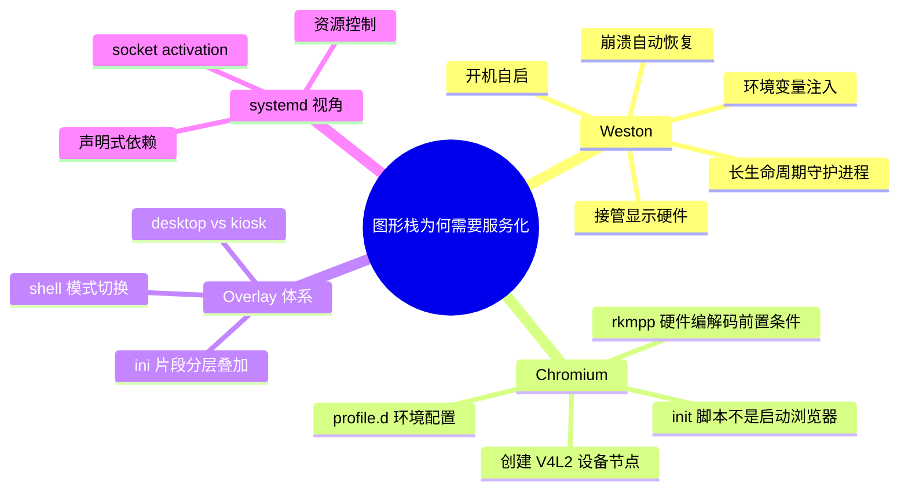
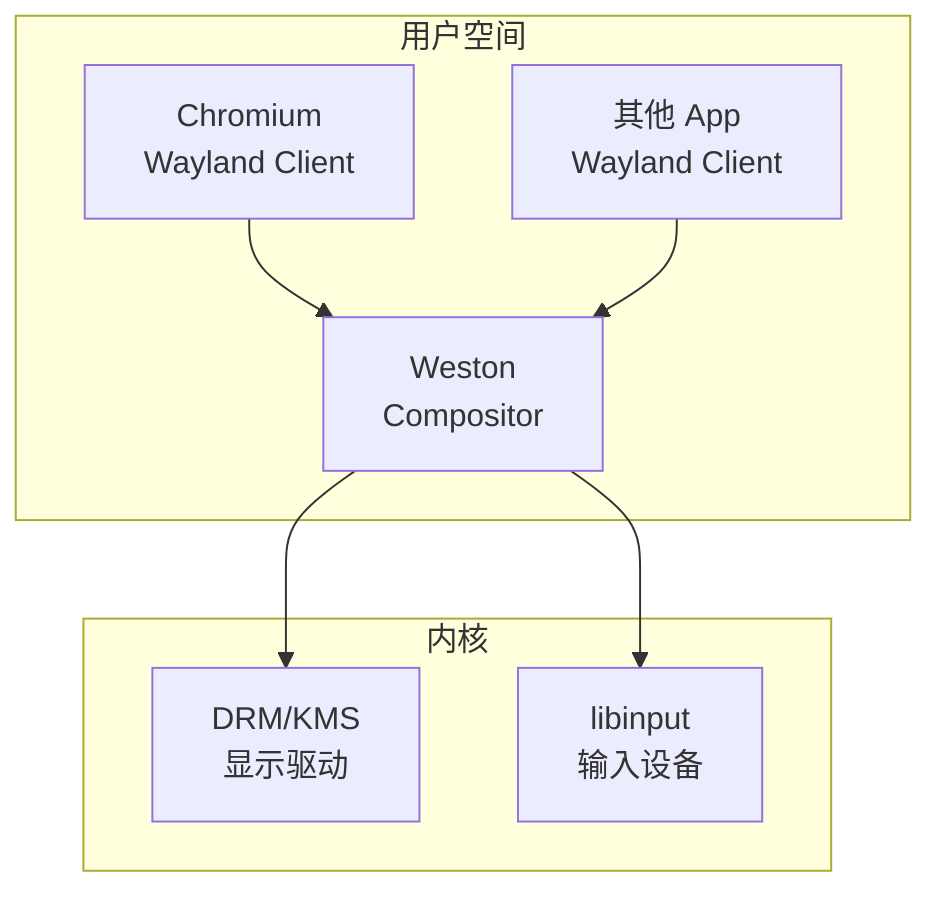
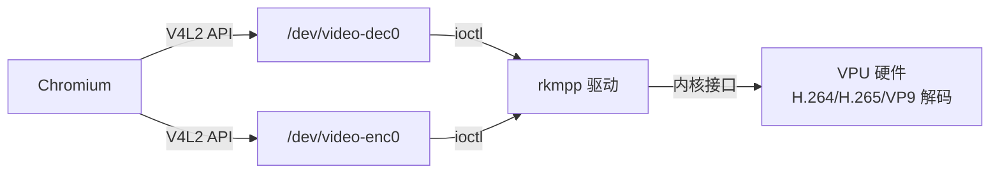
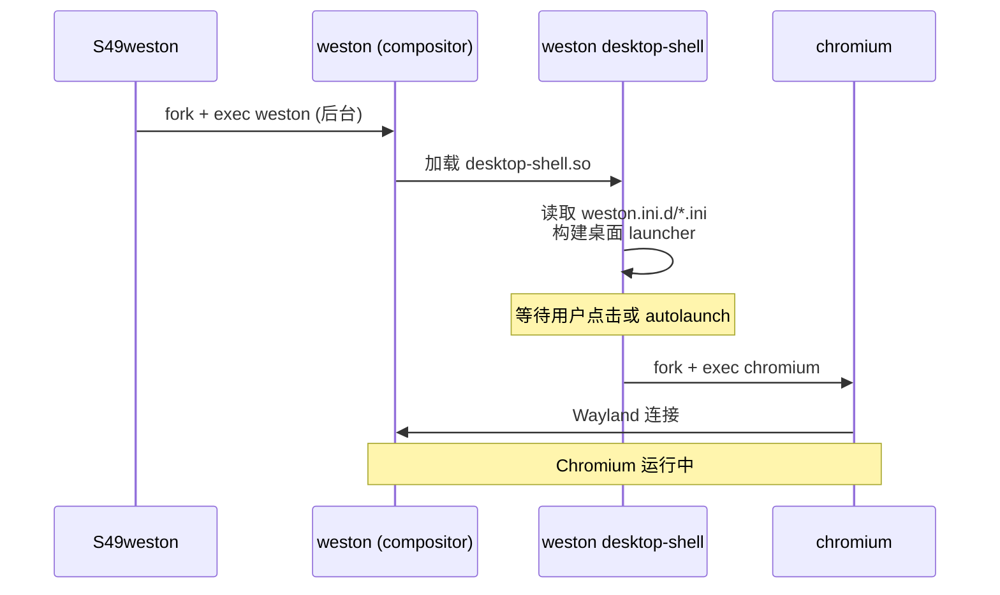
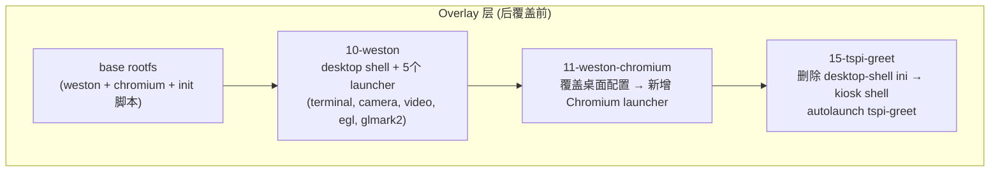

## 思维导图



---

# 1. 问题的核心：什么才"需要"成为一个服务？

在回答 West 和 Chromium 之前，先理清一个根本问题：**什么决定了"一个程序应该被 init 系统管理"？**

| 条件 | 说明 |
|------|------|
| **需要开机自动启动** | 不能依赖用户手动登录后执行 |
| **是长生命周期进程** | 不是一次性任务，而是持续运行 |
| **需要崩溃后自动恢复** | 不能因为一次错误就永久消失 |
| **依赖特定的启动顺序** | 需要在某些前置条件满足后才能启动 |
| **需要标准化的启停控制** | 管理员应能用统一的命令 start/stop/restart |
| **需要状态追踪** | 需要知道"它现在活着还是死了" |

Weston **满足全部 6 条**。Chromium 的 init 脚本则是一个**值得细究的反例**——它并不启动 Chromium 本身，而是做前置初始化。

---

# 2. Weston：为何必须是服务

## 2.1 Weston 的角色：显示栈的"内核态"

在 Wayland 架构中，Weston 是 **compositor（合成器）**——它直接与 DRM/KMS 内核接口交互，管理所有显示输出、输入设备和窗口合成：



Weston **接管了显示硬件**——它打开 `/dev/dri/card0`，成为 DRM master。这意味着：

- **它必须是唯一的**：同一时间只有一个 compositor 可以打开 DRM 设备
- **它崩溃 = 所有客户端失联**：所有 Wayland client（Chromium、其他 app）依赖 compositor 来显示内容
- **它需要最早启动、最晚退出**：图形栈的生命周期 = Weston 的生命周期

这三点决定了 Weston **必须由 init 系统管理**。

## 2.2 实际的 S49weston 脚本分析

```sh
# S49weston — 实际代码（来自 buildroot/package/weston/S49weston）
start_weston()
{
    # 关键设计：
    # 1. 后台运行 (&) —— compositor 持续运行，不阻塞 init 继续
    # 2. stderr 也捕获 —— DRM/libinput 错误只在 stderr 输出
    # 3. tee 保留控制台可见性 + 持久化日志
    /usr/bin/weston 2>&1 | tee /var/log/weston.log &
}

stop_weston()
{
    killall weston  # 信号终止，Weston 会清理 DRM 资源
}

# restart 中有等待逻辑：
while pgrep -x weston; do sleep .1; done
# 确保旧进程完全退出后才启动新实例（DRM master 必须释放）
```

**为什么不能直接在 shell 里跑？**

```bash
# 如果这样启动：
$ weston &

# 问题 1：shell 退出 → SIGHUP → weston 可能被 kill
# 问题 2：无人监控 —— 崩溃后不会自动重启
# 问题 3：每次开机要手动操作
# 问题 4：stdout/stderr 去哪了？不知道
```

## 2.3 环境变量注入：`/etc/profile.d/weston.sh`

Weston 的 init 脚本先 `source /etc/profile`，这会加载 `weston.sh`，其中设置了大量**必须在 weston 进程启动前就存在**的环境变量：

```sh
# Weston 启动前必须设置的关键环境变量（来自实际 weston.sh）
export WESTON_DISABLE_ATOMIC=1       # 禁用 DRM atomic modesetting
export WESTON_DRM_MIRROR=1           # 开启屏幕镜像
export WESTON_DRM_KEEP_RATIO=1       # 镜像保持宽高比
export WESTON_FREEZE_DISPLAY=/tmp/.freeze_weston  # 冻结显示的标记文件
export WL_OUTPUT_VERSION=3           # Chromium 兼容（旧版协议）
```

**这些环境变量必须在 Weston 进程 fork 之前就设置好**——因为 Weston 在初始化阶段读取它们并配置 DRM 后端。不能在 Weston 启动后再改。

**这就是"配置为服务"的价值之一**：init 脚本里的 `. /etc/profile` 为所有被管理进程提供了统一的环境变量注入点。

## 2.4 崩溃恢复

```sh
# 当前脚本的问题是：Weston 崩溃后不会自动重启
# start_weston 只是把它放到后台，然后脚本就结束了
# 这就是嵌入式 BusyBox init 的典型局限

# 等效的 systemd unit 可以轻松实现自动恢复：
[Service]
ExecStart=/usr/bin/weston
Restart=on-failure     # 崩溃自动重启
RestartSec=1s          # 间隔 1 秒
```

---

# 3. Chromium：init 脚本的真正用途——一个"伪装"成服务的初始化钩子

## 3.1 最大的误解修正

> **S99chromium-wayland.sh 并不启动 Chromium 浏览器。**

它的全部代码：

```sh
case "$1" in
    start)
        # 创建虚拟 V4L2 设备节点，供 Chromium 的硬件编解码使用
        echo dec > /dev/video-dec0
        echo enc > /dev/video-enc0
        ;;
    stop) ;;
    restart|reload) ;;
esac
```

两个操作：
1. `echo dec > /dev/video-dec0` — 向 `/dev/video-dec0` 写入 "dec"，激活 V4L2 解码器
2. `echo enc > /dev/video-enc0` — 向 `/dev/video-enc0` 写入 "enc"，激活 V4L2 编码器

**这是一个"前置条件初始化"脚本**——它利用了 init 系统的执行框架，但本身不是守护进程。它等价于 systemd 中的 `Type=oneshot` + `RemainAfterExit=yes`。

## 3.2 为什么需要这些设备节点？

Rockchip 的 **rkmpp**（Rockchip Media Process Platform）提供硬件视频编解码加速。Chromium 通过 **V4L2 VDA/VEA**（Video Decode/Encode Accelerator）接口使用 rkmpp：



`/dev/video-dec0` 和 `/dev/video-enc0` 是虚拟 V4L2 设备，由 `libv4l-rkmpp` 创建。向它们写入 `dec`/`enc` 是 Rockchip 特有的设备激活协议——告诉驱动分配解码/编码 pipeline 资源。

**这必须在 Chromium 启动之前完成**。所以脚本被编排为 `S99`——在 `weston`(S49) 之后、但在用户通过 Weston launcher 点击 Chromium 图标之前。

## 3.3 Chromium 到底是怎么启动的？

Chromium **不是**通过 init 脚本启动的，而是通过 **Weston 的 launcher 系统**启动的。

在 overlay `11-weston-chromium` 的 `04-desktop-launcher-group.ini` 中：

```ini
[desktop-launcher]
icon=/usr/share/icons/hicolor/256x256/apps/chromium.png
path=/usr/bin/chromium www.baidu.com
displayname=Chromium
group=big
```

Weston 启动桌面 shell 后，桌面上会出现一个 Chromium 图标。**用户点击图标**（或者在 kiosk 模式下 `autolaunch` 自动启动），Weston 才 fork 出 Chromium 进程。

**这就是 Wayland 架构的特点**——compositor 是客户端（client）的"父进程"，客户端由 compositor 管理生命周期：



## 3.4 Chromium 的环境变量注入

`chromium-wayland.sh`（安装在 `/etc/profile.d/`）设置了：

```sh
export CHROMIUM_FLAGS="--enable-wayland-ime"
```

这个环境变量被 `/usr/lib/chromium/chromium-wrapper` 读取，追加到 Chromium 的命令行参数中。`chromium-wrapper` 是一个 shell wrapper：

```sh
# 实际代码（来自 chromium-wayland.mk 的 sed 替换）：
CHROME_EXTRA_ARGS="${CHROMIUM_FLAGS}"
# 然后 exec chromium $CHROME_EXTRA_ARGS "$@"
```

---

# 4. Overlay 分层体系：同一套服务脚本，不同的产品形态

这就是 Rockchip SDK 设计最精妙的地方——通过 **overlay 分层叠加**，同一套 init 脚本在不同产品形态下呈现出完全不同的行为：



### Desktop 模式（default）：
```
10-weston 提供 desktop-shell + 应用 launcher
11-weston-chromium 加入 Chromium 图标
→ 启动后显示桌面 + 可交互的应用图标
```

### Kiosk 模式（生产固件）：
```
15-tspi-greet 的 prepare.sh 执行:
  rm -f 01-launcher.ini 02-desktop.ini 03-desktop-launcher.ini 04-desktop-launcher-group.ini
→ 只加载 00-kiosk.ini → kiosk-shell
→ 自动全屏启动 tspi-greet，无桌面、无交互
```

**同一个 `S49weston` 脚本，同一个 `weston` 二进制——不同的 overlay 决定了不同的用户体验。** 这就是将 weston 作为服务管理的好处：服务脚本本身是稳定的，业务逻辑变化通过配置文件（ini 片段）来表达。

---

# 5. 系统视角：完整的图形栈启动链

将 Weston、Chromium init、overlay 配置放在一条时间线上：

```
时间 →
0s    S00 mountall          挂载文件系统
1s    S10 udev              /dev/dri/card0 出现
4s    S30 dbus              D-Bus 消息总线
7s    S36 wifibt-init       WiFi 驱动加载
8s    S40 network           网络就绪
10s   S49 weston            ← Weston compositor 启动
      |    source /etc/profile
      |    → weston.sh: DRM 参数
      |    → chromium-wayland.sh: CHROMIUM_FLAGS
      |    fork weston
      |    加载 weston.ini → shell (desktop/kiosk)
      |    如果是 kiosk → autolaunch tspi-greet
12s   S99 chromium-wayland   ← 创建 /dev/video-{dec,enc}0
      |    (此时 Chromium 尚未启动——在等用户点击或 autolaunch)
15s   用户可见界面            ← 桌面或 kiosk 应用显示
```

---

# 6. 如果用 systemd，这些会变成什么样？

把当前的 BusyBox init + SysV 脚本映射到 systemd：

### 当前：S49weston

```sh
# 15 行 shell 脚本
# 手动 & 后台、手动 tee 日志、手动 killall
```

### systemd 等价：

```ini
# weston.service
[Unit]
Description=Weston Wayland Compositor
After=udev.service dbus.service
Wants=udev.service dbus.service

[Service]
Type=notify
# 不需要 & 后台 —— systemd 管理生命周期
# 不需要 tee —— journald 自动捕获 stdout+stderr
EnvironmentFile=-/etc/profile.d/weston.sh
EnvironmentFile=-/etc/profile.d/chromium-wayland.sh
ExecStart=/usr/bin/weston
ExecStop=/usr/bin/killall weston
Restart=on-failure
RestartSec=1s

# systemd 特有的能力（BusyBox init 无法做到）：
MemoryMax=256M           # Weston 用了硬件 overlay，内存通常稳定
# 如果某个 Wayland client 导致 Weston 内存泄漏，保护系统不 OOM

[Install]
WantedBy=multi-user.target
```

### 当前：S99chromium-wayland.sh

```sh
# 3 行 shell 脚本
# 创建两个设备节点
```

### systemd 等价：

```ini
# chromium-v4l2-init.service
[Unit]
Description=Initialize V4L2 devices for Chromium rkmpp
After=weston.service

[Service]
Type=oneshot
RemainAfterExit=yes
ExecStart=/bin/sh -c 'echo dec > /dev/video-dec0 && echo enc > /dev/video-enc0'

[Install]
WantedBy=multi-user.target
```

一旦有了 `Type=oneshot`，你可以写出精确的依赖链：

```ini
# chromium-launcher.service (如果需要自动启动 Chromium)
[Unit]
After=weston.service chromium-v4l2-init.service
Requires=weston.service chromium-v4l2-init.service

[Service]
Type=simple
ExecStart=/usr/bin/chromium --kiosk www.example.com
Restart=on-failure
```

**这就是 systemd 的核心价值**——依赖关系显式、可验证、可分析，而不是藏在 S## 编号里。

---

# 7. 总结

| 问题 | 答案 |
|------|------|
| **Weston 为什么是服务？** | 它是长生命周期的 compositor，接管 DRM 硬件，是图形栈的"内核"。必须开机自启、崩溃恢复、有标准化启停控制。 |
| **Chromium 的 init 脚本做什么？** | **不启动浏览器**。它创建 `/dev/video-{dec,enc}0` 虚拟设备节点，为 Chromium 的硬件编解码做前置准备。Chromium 本身由 Weston launcher 系统按需启动。 |
| **Weston 的环境变量为什么必须在服务脚本中设置？** | DRM 后端参数（atomic 开关、mirror 模式、输出冻结路径等）必须在 Weston 进程初始化之前就存在于环境变量中。 |
| **Overlay 和服务脚本的关系？** | 服务脚本是稳定的运行时框架，overlay 中的 ini 片段是变化的业务配置。同一套 `S49weston` + 不同 overlay = 桌面 / kiosk 两种完全不同的产品。 |
| **systemd 能做得更好吗？** | 能。`Type=notify` 替代盲等、`Restart=on-failure` 替代无自动恢复、`MemoryMax=` 做资源保护、journald 替代手动 `tee` 日志。但代价是 ~15MB 的额外体积。 |

**根本原则**：一个程序需要成为"服务"，不是因为它重要，而是因为它需要**被管理系统所管理**——需要确定性的启停、确定性的依赖顺序、确定性的崩溃恢复。Weston 满足全部条件；Chromium 的 init 脚本则是一个更微妙的设计——它利用服务的执行框架做一次性初始化，让"正确的操作在正确的时机发生"。

---

> **Ref:** `buildroot/package/weston/S49weston`；`buildroot/package/weston/weston.sh`；`buildroot/package/weston/weston.service`；`buildroot/package/chromium-wayland/S99chromium-wayland.sh`；`buildroot/board/rockchip/common/overlays/10-weston/`；`buildroot/board/rockchip/common/overlays/11-weston-chromium/`；`buildroot/board/rockchip/common/overlays/15-tspi-greet/`；[[03-buildroot-init-vs-systemd]]
