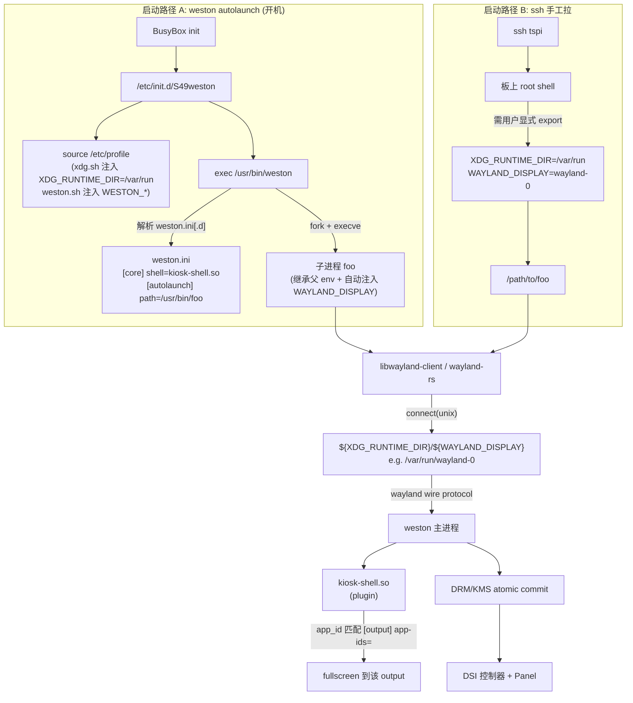
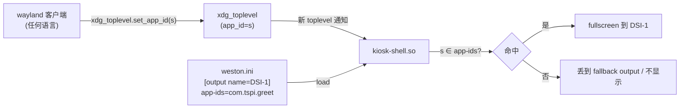
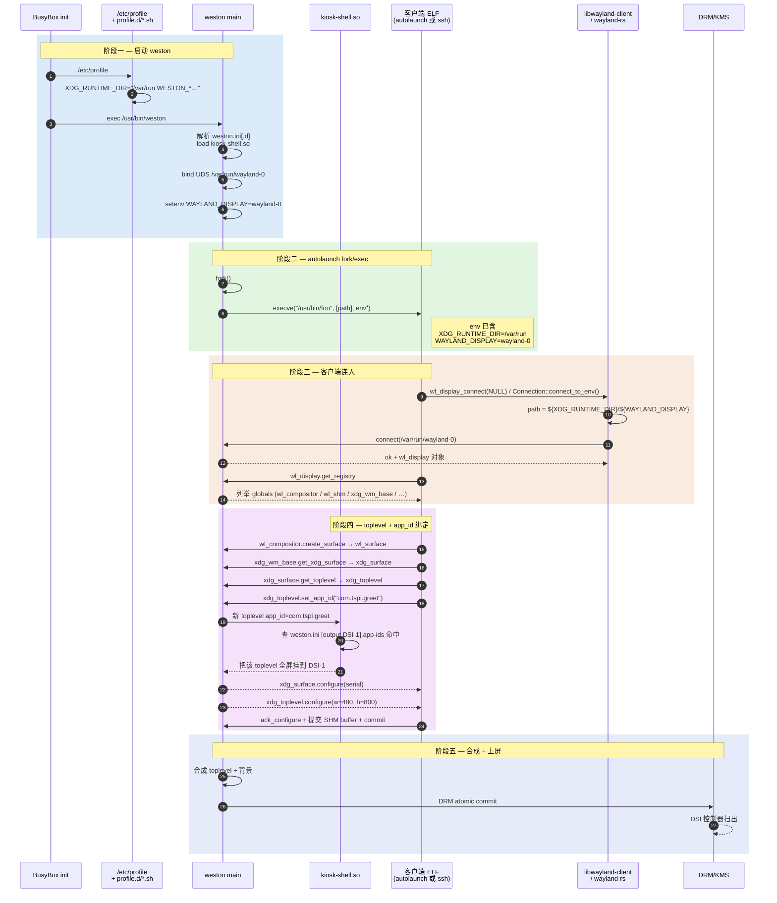

# Wayland 客户端如何把图形投到 Weston —— 命令行启动 / autolaunch / kiosk-toplevel 全链路解剖

> [!note]
> **Ref:**
> - 本仓库 [[03-wayland-weston]] —— Wayland/Weston 体系结构（协议、合成器、后端）
> - 本仓库 [[05-tspi-buildroot-weston-de]] —— tspi 板上 weston DE 与 SDK 落点
> - [[../05-tspi-buildroot-weston-de#94]] —— kiosk-shell 切换说明
> - 工程实例：[`prj/05-GraphStack/tspi-greet-rs/`](../../../prj/05-GraphStack/tspi-greet-rs/) —— wayland-rs + cairo 版欢迎页
>     - [`Design-Wayland-Rs.md`](../../../prj/05-GraphStack/tspi-greet-rs/Design-Wayland-Rs.md) —— Dispatch / set_app_id 设计
>     - [`Design-TimeSeq.md`](../../../prj/05-GraphStack/tspi-greet-rs/Design-TimeSeq.md) —— 完整握手 + 主循环时序
> - C 对照版：[`prj/05-GraphStack/tspi-greet/`](../../../prj/05-GraphStack/tspi-greet/)
> - 板上来源：`/etc/init.d/S49weston` · `/etc/profile.d/xdg.sh` · `/etc/profile.d/weston.sh` · `/etc/xdg/weston/weston.ini[.d]`
> - [Weston man page weston.ini(5)](https://man.archlinux.org/man/weston.ini.5)
>
> **TL;DR:**
>
> wayland client 程序，是通过socket与wayland server通信的，协议规定，server暴露出文件`$XDG_RUNTIME_DIR/$WAYLAND_DISPLAY` 以供client建立连接，commit buffer


## 1. 目的

把"板上一个 ELF 怎么把像素送上 DSI 屏"拆成一条**可观测的因果链**：

```
shell / init / weston ─→ env vars (XDG_RUNTIME_DIR / WAYLAND_DISPLAY)
   ─→ libwayland-client (或 wayland-rs) 打开 unix socket
   ─→ 与 weston 进程对讲 wayland wire protocol
   ─→ kiosk-shell.so 按 app-id 把新 toplevel 绑到 output
   ─→ weston 合成 → DRM/KMS atomic commit → DSI 控制器 → 屏幕
```

特别要回答三件容易踩坑的事：

1. 两个环境变量是如何"指向同一只 unix socket"的；缺谁、错谁后看到什么报错。
2. weston `[autolaunch] path=…` 启动子进程时，**env 是从哪儿继承的**，与从 ssh / 命令行启的有何差别。
3. kiosk-shell 凭什么把某个 client 全屏到某个 output —— `set_app_id` 与 `weston.ini [output] app-ids=` 的契约。


## 2. 全景架构



两条启动路径**汇聚到同一只 unix socket** —— 这是理解整个机制的关键：weston 自己创建 socket，所有 client（无论是 weston 自己 fork 出来的还是 ssh 里手工跑的）只要 env 指向那只 socket 就能连上。


## 3. 两个环境变量 —— socket 地址的拼接规则

### 3.1 拼接公式

libwayland-client 在 `wl_display_connect(name)` 里做的实际事：

```c
// 简化伪代码，源出 libwayland-client wl_display_connect
const char *runtime = getenv("XDG_RUNTIME_DIR");
const char *display = name ? name : getenv("WAYLAND_DISPLAY");
if (!display) display = "wayland-0";              // libwayland 兜底默认
snprintf(path, "%s/%s", runtime, display);
fd = socket(AF_UNIX, ...);
connect(fd, path);
```

wayland-rs 0.31 的 `Connection::connect_to_env()` 内部走完全等价的逻辑。

**所以 socket 地址 = `${XDG_RUNTIME_DIR}/${WAYLAND_DISPLAY}`**。两个变量缺一不可。

### 3.2 解析顺序与板上实际值

| 变量 | 取值来源（按优先级，从高到低） | tspi 板上实际值 |
|------|----------------------------|----------------|
| `XDG_RUNTIME_DIR` | 用户 export → `/etc/profile.d/xdg.sh` → libwayland 不提供兜底，缺则**直接 NoCompositor** | **`/var/run`**（buildroot 通过 `RK_ROOTFS_FORCE_RAMTMP=y` 把它做成 tmpfs）<sup>[[note: /run 是 /var/run 的符号链接，两者等价]]</sup> |
| `WAYLAND_DISPLAY` | 用户 export → weston 启动 socket 时**自动 setenv 给所有子进程** → libwayland 无兜底 | weston启动后，创建**`$XDG_RUNTIME_DIR/wayland-0`**文件，导出变量`export WAYLAND_DISPLAY=wayland-0` |

> [!note]
>
> 因而，通过 kiosk-shell autolaunch 可以很轻松的launch应用，而用户使用命令行时，需要export `WAYLAND_DISPLAY`变量 (通常为wayland-0)。
>
> 导出/run 下首个wayland-前缀文件的basename:
>
> `export WAYLAND_DISPLAY=$(basename $(ls /run/wayland-* | head -1))`

### 3.3 缺一个的报错画像

| 现象 | 根因 |
|------|------|
| `panicked at … NoCompositor` (wayland-rs) / `wl_display_connect: No such file or directory` (libwayland) | `XDG_RUNTIME_DIR` 空 → 拼出来路径形如 `/wayland-0`，无此 socket |
| 同上，但能看到 `/var/run/wayland-0` 存在 | 你的 shell 里 `XDG_RUNTIME_DIR=/run/user/$UID`（XDG 标准默认），与 weston 实际监听位置 `/var/run` 不一致 |
| `Connection refused` | 路径对但 weston 没在跑 |
| 能 connect 上但 registry 是空 | 连到了另一个 compositor（比如同时跑了多个 weston，display 编号错） |


## 4. autolaunch 的 fork/exec 细节

### 4.1 weston.ini 里的 `[autolaunch]` 段

参考 weston-14 源码 `libweston/desktop/autolaunch.c`（kiosk-shell.so 也用同一段配置），关键字段：

```ini
[autolaunch]
path=/usr/bin/foo            # 绝对路径；不接受 PATH 搜索
watch=true|false             # weston-14 语义见 §4.3，默认 false
```

加载顺序：
1. weston 启动末尾、main loop 起来之前；
2. weston `fork()`；
3. 子进程 `execve(path, [path], inherited_envp)`；
4. **父进程不等子退出**（即使 watch=true 也只是注册 SIGCHLD 回调）。

### 4.2 子进程拿到的 env

子进程**完整继承 weston 的 process env**，且 weston 在创建 wayland socket 后**显式 setenv** 两个最重要的变量：

| 变量 | 设法 |
|------|-----|
| `WAYLAND_DISPLAY` | weston 创建好 listening socket 后调 `setenv("WAYLAND_DISPLAY", "wayland-0", 1)` |
| `WAYLAND_SOCKET` | 用于"fd 直传"模式（通常不启用） |
| `XDG_RUNTIME_DIR` | 从 weston 的 env 继承 —— 即 S49weston 注入的 `/var/run` |
| `WESTON_*` | 从 weston.sh 注入的所有 WESTON_* hack |
| `LD_LIBRARY_PATH` / `PATH` | 继承自 S49weston 的 `. /etc/profile` 链 |

**结论**：autolaunch 出来的子进程**根本不需要自己 export 任何变量**，env 已经被父进程铺好。这也是为什么写 weston 客户端开发者最初常以为"我不用管 env" —— 一旦切换到 ssh 手工拉，立即翻车。

### 4.3 `watch` 的语义陷阱

| `watch=` | 行为 (weston 14) |
|---------|------------------|
| 未设 / `false` | autolaunched 子进程死了 → weston 不动，**不会重启子进程** |
| `true` | **子进程死则 weston 一起死** —— init.d / systemd 看到 weston 退出会重启 weston，weston 再次起来又会 autolaunch → 间接达到"重拉"效果 |

容易误以为 `watch=true` 是"周期性看护并重拉子进程" —— 不是。它的"重拉"是借 init 系统的服务重启实现的。如果板上的 weston 不是 service 而是手动起的，**`watch=true` 就是单向自杀**。

### 4.4 与"普通 daemon"不同的点

autolaunched 子进程并不**属于** weston 这个 service（init 角度），它只是从 weston fork 出来的进程，但**没有被 init 接管**。所以：
- `systemctl restart weston`（或 init.d restart）会重启 weston，weston 再次拉子；
- `killall my-app` 杀子，**默认情况 weston 不会自动重拉**；
- `killall weston` 杀父，根据 weston 实现，**子进程不会被 SIGTERM 联动**（要看 prctl/PR_SET_PDEATHSIG 是否设；weston 14 没设）→ 留下孤儿进程。

## 5. kiosk-shell 与 `set_app_id` 的契约

### 5.1 三方约定



### 5.2 客户端侧 —— 一行代码

任何 wayland 客户端在 toplevel 创建后调用对应 binding：

| 语言 | 调用 |
|------|------|
| C (libwayland) | `xdg_toplevel_set_app_id(top, "com.tspi.greet");` |
| Rust (wayland-rs 0.31) | `top.set_app_id("com.tspi.greet".into());` |
| Qt | `QGuiApplication::setDesktopFileName("com.tspi.greet")` （Qt 6 Wayland 自动转 set_app_id） |
| GTK4 | `gtk_application_new("com.tspi.greet", …)` 自动设 |

> [!important]
> **协议本身不强制 compositor 拿 app_id 做任何事** —— 它是个 hint。
> 但 kiosk-shell 把它当**唯一的 output 绑定钥匙**，所以对 kiosk 场景就是硬要求。
>
> **相反地，desktop-shell 基本不读 set_app_id** —— 它就是一个hint，应用照样以浮动窗口模式出现，不影响显示位置 / output 绑定 / 任何 layout决策。这正是 kiosk-shell 的反面。

### 5.3 weston 侧 —— `[output] app-ids=`

[weston.ini(5)](https://man.archlinux.org/man/weston.ini.5) 文档里 kiosk-shell 的相关字段：

| 字段 | 例子 | 作用 |
|------|------|------|
| `[output] name=` | `DSI-1` | 标识哪个 DRM 输出 |
| `[output] app-ids=` | `com.tspi.greet,com.foo.bar` | 逗号分隔；命中其中之一的 toplevel 全屏到本 output |
| `[shell]` 段 | —— | kiosk-shell 不读，留着兼容 desktop-shell 配置 |

### 5.4 反向证伪

最直接的小实验：把 [`prj/05-GraphStack/tspi-greet-rs/src/main.rs`](../../../prj/05-GraphStack/tspi-greet-rs/src/main.rs) 里 `set_app_id("com.tspi.greet")` 改成 `set_app_id("foo.bar")` 后再跑：

- 进程能起、能 bind globals、能进 main loop —— wayland 协议层没毛病；
- 屏上**看不到画面** —— kiosk-shell 找不到匹配的 output 规则；
- weston 日志里 `kiosk-shell: surface app_id "foo.bar" did not match any output` 之类。

把 app_id 再改回来 → 重新上屏。**这是验证 §5 整个机制最干净的实验**。

### 5.5 与 desktop-shell 的差异

| 维度 | desktop-shell | kiosk-shell |
|------|--------------|------------|
| 是否读 `[output] app-ids=` | ❌ 不读 | ✅ 唯一绑定钥匙 |
| 是否允许 floating window | ✅ | ❌ 全部强制 fullscreen |
| `[shell] panel-*` | 用 | 忽略 |
| 多 client 行为 | 各自有窗口 | 第一个命中的占该 output；后续命中的同 output 会"覆盖"前者 |


## 6. 完整时序：从 weston 启动到第一帧




## 7. 实操：命令行替换 autolaunch 出来的应用

最常见场景：weston 已经按 weston.ini 启动并自动拉了 **应用 A**（如 C 版 tspi-greet），开发者想换跑 **应用 B**（如 Rust 版 tspi-greet-rs），**不想改 weston.ini**。

### 7.1 标准三步法

```sh
# ssh 进板
ssh -o ConnectTimeout=30 tspi

# 1) 干掉 autolaunched 的应用
killall tspi-greet                            # 注意：若 watch=true 这一步会顺带杀 weston

# 2) 拿到 weston 当前 socket 的环境变量
export XDG_RUNTIME_DIR=/var/run               # 与 /etc/profile.d/xdg.sh 同
export WAYLAND_DISPLAY=$(basename /var/run/wayland-*)   # 通常是 wayland-0

# 3) 用相同的 app_id 启动你的应用 → kiosk-shell 自动接管全屏
/mnt/nfs/tspi-greet-rs/tspi-greet-rs
```

关键：**应用 B 的 `set_app_id` 必须与 weston.ini 里 `[output] app-ids=` 命中的字符串相同** —— 否则它能跑、能进 main loop，但屏幕没画面（见 §5.4）。

### 7.2 watch=true 的绕开

若板上 weston.ini 写了 `watch=true`，§7.1 第 1 步会顺带杀掉 weston。绕开：

**方案 A**（临时挪开 ini 文件 → 重启 weston → 无 autolaunch → 手工拉）：

```sh
mv /etc/xdg/weston/weston.ini.d/*kiosk*.ini /tmp/
/etc/init.d/S49weston restart
# … step 2 + 3
mv /tmp/*kiosk*.ini /etc/xdg/weston/weston.ini.d/      # 用完恢复
```

**方案 B**（不重启 weston，直接 SIGSTOP 让被 autolaunch 的应用挂起而不退）：

```sh
pkill -STOP tspi-greet                         # 暂停而非杀 → weston 不触发 SIGCHLD
# … step 2 + 3
pkill -CONT tspi-greet                         # 恢复
```

`SIGSTOP` 不可被忽略，进程"冻住"占资源但不耗 CPU。kiosk-shell 视角上这个 client 还活着但不再产生新帧。

### 7.3 完全脱离 autolaunch 调试

开发期想用 ssh 反复试错应用，最干净的姿势：

```sh
# 让 weston 启起来但不 autolaunch 任何 app
mv /etc/xdg/weston/weston.ini.d/*kiosk*.ini /tmp/
/etc/init.d/S49weston restart

# 之后所有迭代都靠手工拉
export XDG_RUNTIME_DIR=/var/run
export WAYLAND_DISPLAY=wayland-0
/mnt/nfs/foo/foo            # 改一次 → scp → 跑一次 → Ctrl-C → 改 → 再跑
```

调试完恢复：

```sh
mv /tmp/*kiosk*.ini /etc/xdg/weston/weston.ini.d/
/etc/init.d/S49weston restart
```


## 8. 排查表

| 现象 | 第一动作 | 常见根因 |
|------|---------|---------|
| 应用 panic `NoCompositor` | `echo $XDG_RUNTIME_DIR $WAYLAND_DISPLAY; ls /var/run/wayland-*` | env 没 export；weston 没跑 |
| 应用 panic `Connection refused` | `pgrep -x weston` | weston 进程死了 |
| 应用能起、进 main loop、屏上无画面 | `cat /etc/xdg/weston/weston.ini.d/*kiosk*.ini` | `set_app_id` 与 `[output] app-ids=` 不匹配 |
| `killall my-app` 顺带杀 weston | `grep watch /etc/xdg/weston/weston.ini.d/*.ini` | `watch=true` 触发联动；见 §4.3 |
| ssh 过去手工跑能上屏，autolaunch 上屏不行 | `cat /etc/init.d/S49weston` | autolaunch 路径 / app_id 不对 |
| weston 起来但 DSI 屏黑 | `ls /sys/class/drm/`; `cat /var/log/weston.log` | DRM 后端 / panel 配置问题，与本笔记无关，见 [[04-kernel-fb-drm-kms]] / [[05-tspi-buildroot-weston-de]] |


## 9. 与本仓笔记的衔接

| 想读哪个角度 | 看这里 |
|-------------|-------|
| Wayland 协议为什么这么设计 | [[03-wayland-weston]] |
| tspi 板上 weston 是怎么编进来的 (buildroot 视角) | [[05-tspi-buildroot-weston-de]] §3-§5 |
| kiosk-shell vs desktop-shell 切换 | [[05-tspi-buildroot-weston-de]] §9.1 |
| 怎么从 Rust 端写一个 kiosk client (含交叉编译) | [`prj/05-GraphStack/tspi-greet-rs/`](../../../prj/05-GraphStack/tspi-greet-rs/) |
| DRM/KMS atomic commit 那一段 | [[04-kernel-fb-drm-kms]] |
| 用 Qt eglfs / 直吃 DRM 绕开 weston | [[05-tspi-buildroot-weston-de]] §9.2 |
