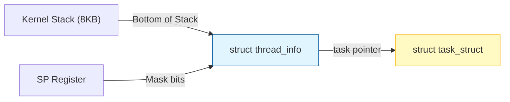

# 进程控制块：task_struct 的解剖

如果说进程是 Linux 系统中的“公民”，那么 **`task_struct`** 就是这个公民在公安局（内核）里的“完整档案”。

在 Linux 内核中，每一个进程（包括线程）都由一个 `task_struct` 实例来描述。这个结构体非常庞大（通常在 4.9.8 内核中也有数 KB 大小），它涵盖了进程的所有生命特征。

## 1. 核心档案概览

`task_struct` 定义在 `include/linux/sched.h` 中，其核心成员可以分为以下几大类：

### A. 状态与标识 (State & Identity)
- **`volatile long state`:** 进程的当前状态。
  - `TASK_RUNNING`: 正在运行或在就绪队列中等待。
  - `TASK_INTERRUPTIBLE`: 可中断的睡眠（等待 IO 或信号）。
  - `TASK_UNINTERRUPTIBLE`: 不可中断的睡眠（如等待磁盘 IO，不响应信号）。
  - `TASK_STOPPED`: 停止运行。
- **`pid_t pid`:** 进程 ID。
- **`pid_t tgid`:** 线程组 ID（即用户态看到的进程 ID）。

### B. 调度信息 (Scheduling)
- **`prio / static_prio / normal_prio`:** 进程的各种优先级。
- **`sched_class`:** 调度类指针（如 CFS 公平调度、实时调度）。
- **`policy`:** 调度策略（SCHED_NORMAL, SCHED_FIFO 等）。

### C. 内存管理 (Memory Management)
- **`struct mm_struct *mm`:** 指向进程的虚拟内存空间描述符。
  - 包含了页表指针（PGD）、代码段/数据段的起始与结束地址。
  - **注意:** 内核线程的 `mm` 为 NULL，它们借用上一个进程的内存上下文。

### D. 文件与资源 (Files & Resources)
- **`struct files_struct *files`:** 进程打开的文件描述符表（`fd_array`）。
- **`struct fs_struct *fs`:** 进程的当前工作目录（pwd）和根目录（root）。
- **`struct signal_struct *signal`:** 信号处理相关的结构。

## 2. 进程描述符的存储位置

在 ARMv7（如 IMX6ULL）中，内核利用了栈顶的特殊位置或寄存器来快速获取当前进程的 `task_struct`。

- **`thread_info`:** 这是一个小型结构，位于内核栈的底部（通常与 8KB 的内核栈对齐）。
- **`current` 宏:** 
  - 在内核代码中，我们随时可以使用 `current` 指针访问当前进程。
  - 背后逻辑：通过当前 SP（栈指针）屏蔽低 13 位（8KB 对齐），找到 `thread_info`，进而通过其中的 `task` 指针找到 `task_struct`。

## 3. task_struct 的动态演变

`task_struct` 是一个**常驻内核空间**的对象。

- **创建:** 当 `fork()` 发生时，内核在 slab 分配器（或更现代的 cache）中分配一个新的 `task_struct`。
- **消亡:** 进程退出后，其 `task_struct` 并不会立即消失，而是进入 `EXIT_ZOMBIE` 状态，等待父进程收割其 PID 和退出码后才彻底释放。

> [!note]
> **Ref:**
> - Linux Kernel: `include/linux/sched.h`
> - 《Linux内核设计与实现》 第3章 进程管理
