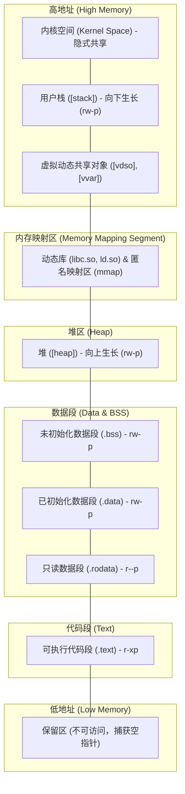

# 进程地址空间全景解析

> [!note]
> **Ref:** 
> - 本地测试工具与源码：[Address Space Analyzer Demo](./demo/README.md)
> - 核心观测接口：`/proc/[pid]/maps` 与 `/proc/[pid]/mem`

在现代操作系统中，每个进程都仿佛拥有一台独占的计算机，这得益于**虚拟地址空间（Virtual Address Space）**的抽象。通过编写一个简单的 C 程序并利用 `as_analyzer.py` 工具抓取其运行时的内存映射表，我们可以清晰地透视 Linux 进程的底层内存架构。

## 1. 终端实测输出现象

首先启动 `hello` 测试程序，并使用 `as_analyzer.py` 抓取其进程的地址空间映射与反汇编信息。以下为核心输出日志（截取）：

```text
❯ ./hello
Hello, Address Space!
PID: 98562
Global Var (Data): 0x6470ff524010
Static Var (Data/BSS): 0x6470ff524014
I am a test function at 0x6470ff5211c9
Sleeping for 30 seconds for analysis...

❯ sudo ./as_analyzer.py 98562
--- Analyzing Address Space for PID 98562 (Arch: x86-64) ---
Address Range             Perms  Offset     Path/Region
----------------------------------------------------------------------
6470ff520000-6470ff521000 r--p   00000000   /.../hello
6470ff521000-6470ff522000 r-xp   00001000   /.../hello
  [Disassembling first 1KB of /.../hello at 0x6470ff521000]
ff521000:       f3 0f 1e fa             endbr64
ff521004:       48 83 ec 08             sub    $0x8,%rsp
ff521008:       48 8b 05 d9 2f 00 00    mov    0x2fd9(%rip),%rax
...
--------------------------------------------------
6470ff522000-6470ff523000 r--p   00002000   /.../hello
6470ff523000-6470ff524000 r--p   00002000   /.../hello
6470ff524000-6470ff525000 rw-p   00003000   /.../hello
647128a6a000-647128a8b000 rw-p   00000000   [heap]
70c16c000000-70c16c028000 r--p   00000000   /usr/lib/x86_64-linux-gnu/libc.so.6
70c16c028000-70c16c1bd000 r-xp   00028000   /usr/lib/x86_64-linux-gnu/libc.so.6
  [Disassembling first 1KB of /usr/lib/x86_64-linux-gnu/libc.so.6 at 0x70c16c028000]
6c028000:       ff 35 02 20 1f 00       push   0x1f2002(%rip)
6c028006:       f2 ff 25 03 20 1f 00    bnd jmp *0x1f2003(%rip)
...
70c16c35e000-70c16c388000 r-xp   00002000   /usr/lib/x86_64-linux-gnu/ld-linux-x86-64.so.2
...
7ffeaf1a0000-7ffeaf1c2000 rw-p   00000000   [stack]
7ffeaf1dd000-7ffeaf1e1000 r--p   00000000   [vvar]
7ffeaf1e1000-7ffeaf1e3000 r-xp   00000000   [vdso]
  [Disassembling first 1KB of [vdso] at 0x7ffeaf1e1000]
af1e1000:       7f 45                   jg     0xaf1e1047
af1e1002:       4c                      rex.WR
...
```

## 2. 内存分段的实测印证

结合上述测试目标 `hello` 程序的运行输出与 `/proc/[pid]/maps` 映射表，我们可以形成完美的验证对照：

### 代码段与数据段的隔离 (W^X 策略)
- **代码段 (Code/Text)**：
  - 测试函数 `test_function` 地址：`0x6470ff5211c9`
  - 映射表：`6470ff521000-6470ff522000 r-xp`
  - **解析**：`r-xp` 代表可读、可执行、私有。现代系统严格执行 `W^X`（Write XOR Execute）安全策略，即内存页要么可写，要么可执行，绝不能同时具备。这段内存专门存放机器指令，不可被恶意篡改。
- **数据段 (Data/BSS)**：
  - 全局/静态变量地址：`0x6470ff524010` / `0x6470ff524014`
  - 映射表：`6470ff524000-6470ff525000 rw-p`
  - **解析**：`rw-p` 代表可读、可写、私有。程序运行期间需要修改的全局状态被统一分配于此。

### 细粒度的文件映射
单一的 ELF 可执行文件（如 `hello`）在内存中被切分映射了多次：
1. `r--p` (偏移 00000000): 包含 ELF 文件头及一些只读元数据。
2. `r-xp` (偏移 00001000): **.text**，可执行的机器指令代码段。
3. `r--p` (偏移 00002000/3000): **.rodata**，只读数据段，存放如 `"Hello, Address Space!\n"` 等字符串常量。
4. `rw-p` (偏移 00003000): **.data** 和 **.bss**，可读写数据段。

这种切分是编译器和链接器配合内核完成的精细化权限控制，防止越权访问。

## 3. 虚拟地址空间全貌图解

根据地址从高到低的分布，我们可以构建出如下的进程虚拟地址空间模型：



## 4. 核心机制深度解析

结合反汇编代码（`objdump` 提取的可执行段首 KB），我们能观察到现代操作系统托举一个普通进程所投入的底层机制：

### 4.1 动态链接与 PLT/GOT
在 `libc.so` 和主程序的开头，反汇编暴露出大量形如 `push $0x1`、`bnd jmp ...` 的指令。这是 **过程链接表 (PLT, Procedure Linkage Table)** 的典型特征。由于使用了动态库（如 `printf`），程序在编译时并不知道真实地址。调用时会先跳入 PLT，由 PLT 配合 GOT（全局偏移表）动态解析出真实地址，实现代码的高效复用和内存节约。

### 4.2 现代安全防御基石
- **ASLR (地址空间布局随机化)**：每次运行 `hello`，堆、栈、动态库甚至主程序的起始地址都会完全改变。这是内核为了防止攻击者预测内存地址而引入的随机化机制。
- **CET/MPX 防御 (`endbr64`, `bnd jmp`)**：反汇编中高频出现的 `endbr64` (Control-flow Enforcement Technology) 和 `bnd jmp` (Memory Protection Extensions) 是 Intel 提供的硬件级防御指令，用于阻断 ROP/JOP（返回/跳转导向编程）攻击。即使存在缓冲区溢出漏洞，非法跳转也会被 CPU 直接拦截。

### 4.3 内核与用户态的桥梁：VDSO
映射表末尾出现的 `[vdso]` (Virtual Dynamically Shared Object) 和 `[vvar]` 是内核性能优化的“黑科技”。
像 `gettimeofday` 这样的高频系统调用，如果每次都触发陷入内核态（Context Switch），开销极大。因此，内核将包含时间等安全状态的内存页直接以只读形式映射到用户空间（即 `[vvar]`），并将读取这些变量的极简代码映射到 `[vdso]`。用户态程序只需像调用普通函数一样执行 `[vdso]` 中的代码，即可在**不陷入内核**的情况下获取系统状态。由于这里包含的是特殊的 ELF 结构而非单纯代码，这也是为什么直接反汇编起始地址时会看到类似 `add %al,(%rax)` 的怪异输出。
