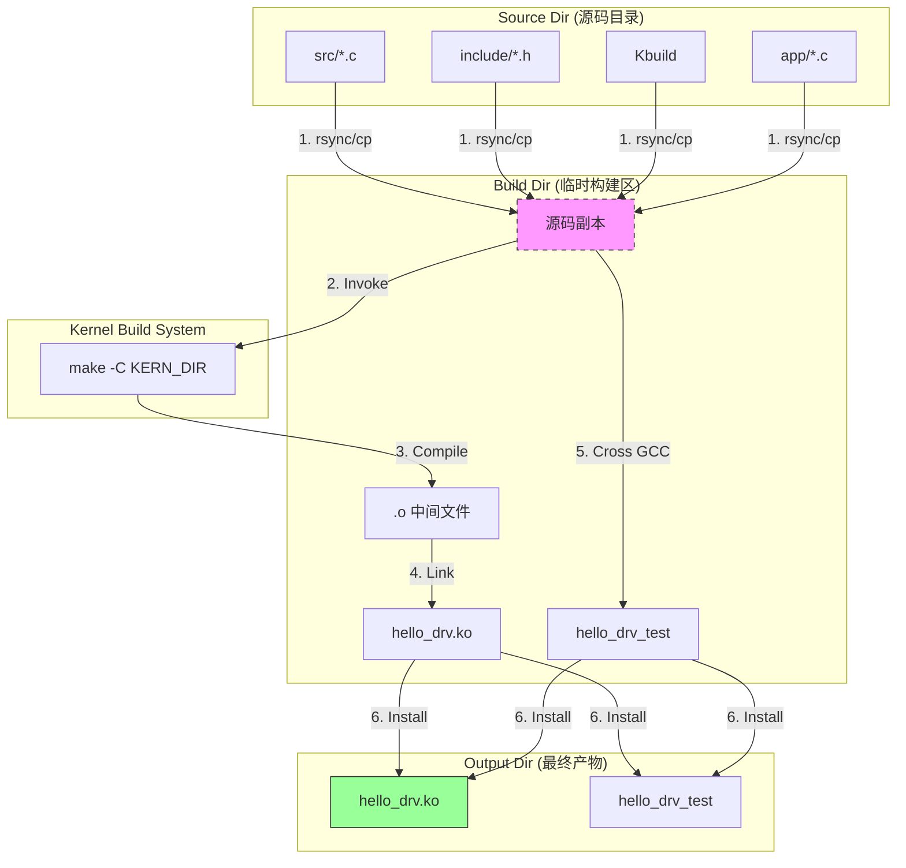

# 01_hello_drv - 高级 Linux 字符设备驱动模板

本项目展示了一个**工业级**的 Linux 驱动开发工程架构。它采用了**构建产物分离（Out-of-Tree Shadow Build）**的设计模式，彻底解决了传统内核开发中源码目录被 `.o`, `.ko` 等临时文件污染的问题。

---

## 1. 工程结构 (Project Structure)

本工程采用了**源码与配置分离、驱动与应用分层**的结构：

```text
01_hello_drv/
├── README.md           # 本文档
├── Makefile            # 【主控脚本】负责环境配置、目录拷贝、调用内核构建系统
├── Kbuild              # 【内核描述】负责告诉内核如何编译驱动 (obj-m)
├── output/             # 【最终产物】编译完成的 .ko 和 app 会自动汇总到这里
├── build/              # 【临时构建区】影子目录，包含源码副本和中间产物 (.o, .mod.c)
├── src/                # 【驱动源码】
│   ├── driver_main.c   # 驱动入口 (init/exit, cdev注册)
│   └── driver_fops.c   # 业务逻辑 (file_operations 实现)
├── include/            # 【驱动头文件】
│   └── driver_fops.h   # 内部接口声明
└── app/                # 【应用源码】
    ├── main.c          # 应用程序主入口
    ├── syscall_wrapper.c # 系统调用封装层
    └── syscall_wrapper.h
```

---

## 2. 构建机制详解 (Build Mechanism)

本工程通过一个精心设计的 `Makefile` 实现了“影子构建”流程。

### 2.1 构建流程图



### 2.2 Makefile vs Kbuild：谁在做什么？

这是理解本框架的核心：

*   **Makefile (主控者)**:
    *   **角色**: 项目管家 (Wrapper)。
    *   **职责**:
        1.  创建 `build/` 和 `output/` 目录。
        2.  将源码 (`src`, `include`, `Kbuild`) 拷贝到 `build/`。
        3.  **调用内核构建系统**: 执行 `make -C <内核路径> M=<build目录> ...`。
        4.  **调用交叉编译器**: 直接编译应用程序。
        5.  将最终结果收集到 `output/`。

*   **Kbuild (执行者)**:
    *   **角色**: 内核构建脚本 (Kernel Buildfile)。
    *   **职责**: 告诉内核构建系统（Kbuild System）这个模块由哪些对象文件组成。
    *   **语法**: 必须遵循内核 Makefile 语法（如 `obj-m`, `ccflags-y`）。
    *   **注意**: 在拷贝到 `build/` 目录后，`Kbuild` 会被重命名为 `Makefile`，因为内核默认只认 `Makefile`。

---

## 3. 使用说明 (Usage)

### 3.1 编译
```bash
make
```
执行成功后，请查看 `output/` 目录：
```bash
ls -l output/
# hello_drv.ko      <-- 驱动模块
# hello_drv_test    <-- 测试程序
```

### 3.2 清理
```bash
make clean
```
这将彻底删除 `build/` 和 `output/` 目录，让工程回归初始状态。

### 3.3 生成代码索引 (VS Code / Clangd)
如果你使用 VS Code 开发，推荐安装 Clangd 插件，并执行：
```bash
bear --  make
```
这会生成 `compile_commands.json`，提供精准的代码跳转和补全。

---

## 4. 开发与维护指南 (Maintenance)

### 4.1 如果我新增了一个 .c 文件？

假设你在 `src/` 下新增了 `utils.c`。

1.  **修改 `Kbuild`**:
    你需要告诉内核把 `utils.o` 链接进模块：
    ```makefile
    # 原来
    hello_drv-y := src/driver_main.o src/driver_fops.o
    # 修改后
    hello_drv-y := src/driver_main.o src/driver_fops.o src/utils.o
    ```

2.  **无需修改 Makefile**:
    只要文件在 `src/` 目录下，Makefile 会自动将其拷贝到构建目录。

### 4.2 如果我新增了一个目录？

假设你新增了 `config/` 目录存放配置文件。

1.  **修改 `Makefile`**:
    你需要告诉 Makefile 拷贝这个新目录：
    ```makefile
    # 原来
    SRC_DIRS := src include app
    # 修改后
    SRC_DIRS := src include app config
    ```

### 4.3 移植到其他开发板？

修改 `Makefile` 顶部的配置变量：

```makefile
# 修改内核源码路径
KERN_DIR = /path/to/your/kernel

# 修改交叉编译器前缀
CROSS_COMPILE = aarch64-linux-gnu-
```
