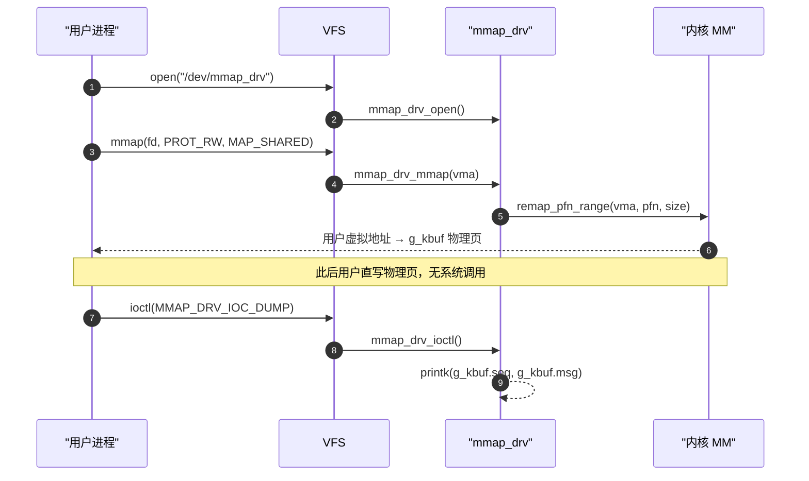

# mmap_drv — 内核 mmap IPC 驱动示例

> [!note]
> **Ref:** [`src/driver_main.c`](src/driver_main.c), [`src/driver_fops.c`](src/driver_fops.c), [`app/main.c`](app/main.c), [`include/mmap_drv_uapi.h`](include/mmap_drv_uapi.h)

## 项目目标

演示 `mmap` file operation 的完整路径：

1. 驱动分配一个物理页（`__get_free_page`），通过 `remap_pfn_range` 将其映射到用户进程的虚拟地址空间
2. 用户态父子进程 **共享同一物理页**，用 `PTHREAD_PROCESS_SHARED` 互斥锁同步
3. 用户写入后，驱动通过 `ioctl DUMP` 直接读取该物理页 —— **零拷贝，无 read/write 系统调用**

---

## 程序结构

```
02_mmap_drv/
├── src/
│   ├── driver_main.c     # 模块 init/exit：分配物理页、注册 cdev、创建 /dev/mmap_drv
│   └── driver_fops.c     # file_operations：open / release / mmap / ioctl
├── include/
│   ├── driver_fops.h     # mmap_fops 及 g_kbuf 声明
│   └── mmap_drv_uapi.h   # 内核/用户共享：MMAP_DRV_BUF_SIZE, MMAP_DRV_IOC_DUMP
├── app/
│   └── main.c            # 用户态测试：fork 父子进程通过共享页通信
├── Kbuild                # obj-m := mmap_drv.o
└── Makefile              # out-of-tree shadow build
```

### 内核侧关键路径



### 用户态共享内存布局

```
SharedRegion（位于 g_kbuf 物理页，偏移 0）
┌─────────┬──────────────────────┬──────────┬───────────────────────────┐
│ [0..3]  │ [4..259]             │ [260..263] │ [264..]               │
│ int seq │ char msg[256]        │ int _pad   │ pthread_mutex_t lock  │
└─────────┴──────────────────────┴──────────┴───────────────────────────┘
```

- `lock` 使用 `PTHREAD_PROCESS_SHARED` 属性，futex 基于**物理地址**仲裁，跨进程有效。

---

## 构建

```bash
# 在 WSL 宿主机执行
cd /home/pi/imx/prj/02_mmap_drv
make          # 产物：output/mmap_drv.ko  output/mmap_drv_test
```

---

## 上板验证

板子通过 NFS 挂载宿主目录到 `/mnt/02_mmap_drv`。

```bash
ssh imx "cd /mnt/02_mmap_drv/output && insmod mmap_drv.ko && ./mmap_drv_test"
```

### 用户态输出

```
[parent pid=8498  ] mmap OK at 0x76f6b000
[parent pid=8498  ] wrote seq=1
[parent pid=8498  ] wrote seq=2
[parent pid=8498  ] wrote seq=3
[parent pid=8498  ] wrote seq=4
[parent pid=8498  ] wrote seq=5
[parent] triggering MMAP_DRV_IOC_DUMP → check dmesg
[child  pid=8502  ] read  seq=1  msg='hello from parent, round 1'
[child  pid=8502  ] read  seq=2  msg='hello from parent, round 2'
[child  pid=8502  ] read  seq=2  msg='hello from parent, round 2'
[child  pid=8502  ] read  seq=3  msg='hello from parent, round 3'
[child  pid=8502  ] read  seq=4  msg='hello from parent, round 4'
```

### dmesg（内核视角）

```
[  882.350497] mmap_drv: open  (pid=8498)
[  882.364621] mmap_drv: pid=8498 mapped phys=0x88ce8000 → virt=0x76f6b000 size=4096
[  884.875177] mmap_drv [kernel view] seq=5 msg='hello from parent, round 5'
[  884.882235] mmap_drv: close (pid=8498)
```

### 现象说明

| 观测点 | 说明 |
|--------|------|
| `phys=0x88ce8000` | 内核 `__get_free_page` 分配的物理页，`insmod` 时确定，模块生命周期内不变 |
| `virt=0x76f6b000` | `remap_pfn_range` 后父进程的用户态虚拟地址，与物理页一一映射 |
| 子进程 `read seq=2` 出现两次 | 父写 500ms 间隔，子读 300ms 间隔，偶发"读到相同轮次"属正常竞态 |
| `ioctl DUMP` 后 dmesg 显示 `seq=5` | 内核直接读取 `g_kbuf` 物理页，**无任何 copy_from_user** —— 零拷贝验证成功 |

---

## 核心 API 速查

| API | 层 | 作用 |
|-----|----|------|
| `__get_free_page(GFP_KERNEL)` | 内核 | 分配一个物理页，返回内核虚地址 |
| `SetPageReserved(page)` | 内核 | 阻止 swap/reclaim，mmap 必须 |
| `remap_pfn_range(vma, pfn, size, prot)` | 内核 | 将物理帧映射到用户 VMA |
| `mmap(fd, PROT_RW, MAP_SHARED)` | 用户 | 触发驱动 `.mmap` fop |
| `PTHREAD_PROCESS_SHARED` | 用户 | mutex 跨进程有效（futex 基于物理地址） |
| `ioctl(MMAP_DRV_IOC_DUMP)` | 用户→内核 | 触发内核打印共享页内容，验证零拷贝 |
