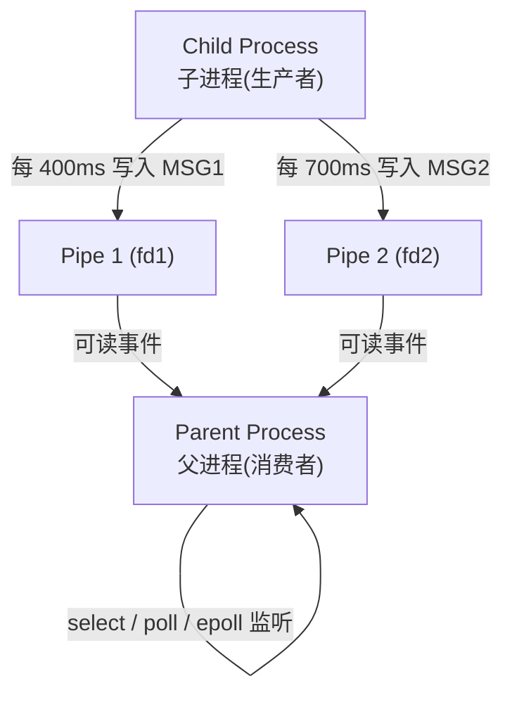
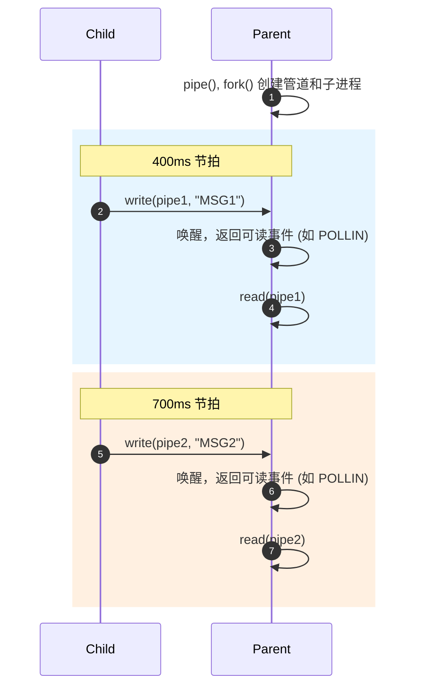

# Design: muxIO Demo

## 架构图 (Architecture)

## 时序图 (Sequence Diagram)

## 核心 API 导读 (Key API Walk-Through)

- **`src/main.c:40` (`run_select`)**: 使用了 `fd_set`, `FD_ZERO`, `FD_SET` 以及 `select()` 系统调用。每次循环都必须重新初始化 `fd_set`，因为内核会修改传入的集合来返回就绪事件。
- **`src/main.c:68` (`run_poll`)**: 使用了 `struct pollfd`，设置 `.events = POLLIN` 并调用 `poll()`。不需要像 `select` 那样重置数组结构，因为内核只会修改独立的 `.revents` 字段。
- **`src/main.c:92` (`run_epoll`)**: 使用 `epoll_create1` 创建句柄，通过 `epoll_ctl` 注册文件描述符，然后使用 `epoll_wait` 阻塞等待事件。这是最具可扩展性的多路复用方案。

## 源码走读 (Source-walk)

程序在 `main` 函数中初始化了两个无名管道（pipe），然后执行 `fork()`。子进程进入 `child_producer`，在一个定时循环中，以不同频率向两个管道写入字符串消息（`MSG1` 和 `MSG2`）。父进程解析命令行参数，决定使用 `select`、`poll` 还是 `epoll` 的多路复用机制来同时监控两个管道的读端。一旦管道有数据可读，多路复用 API 就会返回，父进程读取数据并打印输出。最后，所有机制都能通过读取到 `0`（子进程关闭管道退出）来安全地结束循环。
