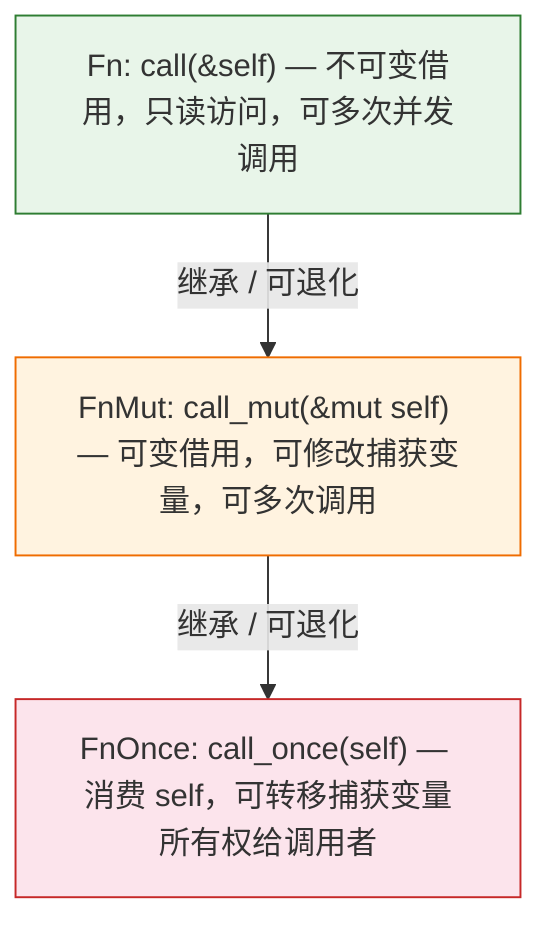
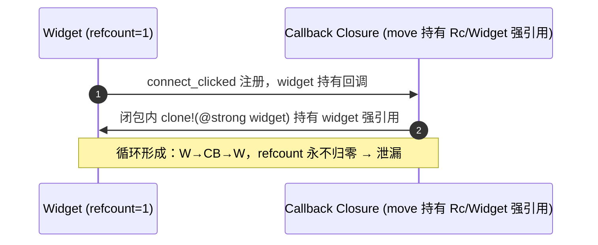

# Rust 闭包深入

> [!note]
> **Ref:** [Rust Reference — Closure Types](https://doc.rust-lang.org/reference/types/closure.html), [The Rust Book — Closures](https://doc.rust-lang.org/book/ch13-01-closures.html), [Rust By Example — Closures](https://doc.rust-lang.org/rust-by-example/fn/closures.html)
>
> **Pre**
>
> ```rust
> //|xxx| 是闭包的参数列表，是闭包被调用时由外界传进来的值，不是捕获的环境变量。
> app.connect_activate(move |app| {
>     build_ui(app, count.clone());
> });
> fn connect_activate (f:Fn){
>     ....
>     ...
>     f(&self);
> }
> ```

## 1. 闭包本质与三种解糖 Trait

Rust 闭包是**匿名类型 + 三个自动实现 trait 的组合**。每个闭包实例都是一个编译器生成的、匿名的 struct，捕获的变量是其字段。根据使用者如何调用闭包，编译器自动为该 struct 实现 `FnOnce`、`FnMut`、`Fn` 中的一个或多个。

```rust
// 闭包语法糖：
let add = |a, b| a + b;

// 编译器实际生成（概念等价物）：
struct __Anon_Closure1__;
impl Fn(i32, i32) -> i32 for __Anon_Closure1__ { ... }
impl FnMut(i32, i32) -> i32 for __Anon_Closure1__ { ... }
impl FnOnce(i32, i32) -> i32 for __Anon_Closure1__ { ... }
```

### 1.1 三 Trait 层级关系

```
FnOnce       — 最宽松的约束，实现者为所有闭包
  ↑
FnMut : FnOnce   — 继承 FnOnce，可用 &mut self 多次调用
  ↑
Fn : FnMut       — 继承 FnMut，可用 &self 多次调用（最严格）
```



### 1.2 实现决策规则

编译器按以下优先级选择自动实现的 trait：

| 捕获方式 | 实现的 trait |
|---|---|
| 仅不可变引用捕获 | `Fn` + `FnMut` + `FnOnce`（三者都有） |
| 至少一个可变引用捕获 | `FnMut` + `FnOnce`（不含 `Fn`） |
| 至少一个值所有权转移 | 仅 `FnOnce` |

```rust
let x = String::from("hello");

// Fn: 仅不可变引用
let f = || println!("{}", x.len());  // 实现 Fn + FnMut + FnOnce

// FnMut: 可变引用
let mut f = || { /* &mut captured */ };

// FnOnce: 所有权转移
let f = || drop(x);  // x 被移动进闭包，仅实现 FnOnce
```

## 2. 捕获方式与 move 语义

### 2.1 默认捕获（按需借用）

编译器按**最小权限原则**自动推导捕获方式：

```rust
let s = String::from("hello");
let n = 42;

// 编译器分析闭包体，只为 s 捕获 &s，为 n 捕获 &n
let print = || println!("s={}, n={}", s, n);
// 闭包不拥有 s 和 n，仅持有引用
```

### 2.2 move 闭包

`move` 关键字强制闭包**获取被使用变量的所有权**，无论闭包体实际如何使用它们：

```rust
let s = String::from("hello");
let n = 42;

let consume = move || {
    println!("s={}, n={}", s, n);
    // s 和 n 的 ownership 被移入闭包
};

// println!("{}", s);  // ❌ s 已被移动，编译错误
println!("{}", n);     // n 是 i32 实现了 Copy，仍然可用（见第 3 节）
```

**move 关键使用场景：**

| 场景 | 说明 |
|---|---|
| **线程 spawn** | `thread::spawn` 要求闭包为 `'static`，必须 `move` |
| **异步任务** | `tokio::spawn` / `glib::spawn_future_local` 需要 `'static` |
| **返回闭包** | 从函数返回闭包时，捕获引用会悬垂，必须 move |
| **回调注册** | GUI 框架（gtk-rs）的信号回调中访问当前栈上的数据 |

```rust
// 典型 gtk-rs 模式 — 必须 move：
let button = Button::builder().label("Click").build();
let counter = Rc::new(RefCell::new(0));
let counter_clone = counter.clone();

button.connect_clicked(move || {
    *counter_clone.borrow_mut() += 1;
    // counter 通过 Rc 共享所有权，move 闭包持有引用计数
});
```

## 3. Copy Trait 与闭包捕获

### 3.1 Copy 类型的行为

当一个变量实现了 `Copy` trait（如 `i32`、`bool`、`&T`），**move 闭包会复制而非移动**：

```rust
let x = 42;       // i32: Copy
let y = "hi";     // &str: Copy

let f = move || {
    println!("x={}, y={}", x, y);
};

// 两者仍然可用——move 闭包做的是 bitwise copy，不是"偷走"
println!("x={}, y={}", x, y);  // ✅ 编译通过
```

### 3.2 非 Copy 类型的行为

```rust
let s = String::from("hello");  // String: !Copy

let f = move || {
    println!("{}", s);
};

// println!("{}", s);  // ❌ s 的所有权已移入闭包
```

### 3.3 闭包自身的 Copy/Clone

闭包是否实现 `Copy`/`Clone`，取决于其捕获的变量：

| 捕获内容 | 闭包的 Copy/Clone 状态 |
|---|---|
| 全部 Copy 变量 | 闭包自动实现 `Copy` + `Clone` |
| 有 !Copy 但全 Clone 变量 | 闭包仅实现 `Clone` |
| 有 !Clone 变量 | 闭包不实现 Copy 或 Clone |

```rust
let n = 0;
let f = move || n;       // 只捕获 i32(Copy)
let g = f;               // f 是 Copy，这里做 copy
println!("{}", f());     // ✅ f 仍然可用

let s = String::from("x");
let f = move || s.len(); // 捕获 String(!Copy 但 Clone)
let g = f.clone();       // ✅ 可 clone
// let h = f;            // ❌ 非 Copy，f 被移动给 h

let v = vec![1, 2, 3];   // Vec 非 Clone
let f = move || v.len();
// let g = f.clone();    // ❌ 无法 clone
```

> [!note]
> 闭包即使捕获了 !Copy 变量，如果没有被 drop 掉，编译器仍然可以让闭包实现 `Fn`（仅实现 `Fn` 需要 `&self`，不消费 `self`），但这不影响闭包**类型本身**不实现 `Copy`。

## 4. 函参签名：接收闭包的多种写法

### 4.1 四种签名对比

| 写法 | 场景 | 代价 |
|---|---|---|
| `fn` 函数指针 | 只接受非捕获闭包 / 普通函数 | 零开销，无堆分配 |
| `impl Fn(...) -> R` | 编译期已知具体闭包类型 | 零开销，单态化，二进制膨胀 |
| `Box<dyn Fn(...) -> R>` | 需要存储不同类型闭包（异构集合） | 堆分配 + 虚表分发 |
| `where F: Fn(...) -> R` | 泛型约束，等价于 `impl` 的写开 | 同 `impl`，更适合复杂约束 |

#### `fn` 函数指针

```rust
fn call_twice(f: fn(i32) -> i32, x: i32) -> i32 {
    f(f(x))
}

fn add_one(x: i32) -> i32 { x + 1 }

// ✅ 传普通函数
call_twice(add_one, 5);

// ✅ 传非捕获闭包（强制转换为 fn 指针）
call_twice(|x| x * 2, 5);

// ❌ 捕获闭包不能转为 fn 指针
let n = 10;
// call_twice(|x| x + n, 5);  // 编译错误！
```

> [!note]
> 非捕获闭包（不捕获任何变量的闭包）可以被自动强制转换为函数指针 `fn`，因为它们不需要存储任何上下文。

#### `impl Fn` 静态分发（首选）

```rust
fn call_twice(f: impl Fn(i32) -> i32, x: i32) -> i32 {
    f(f(x))
}

let n = 10;
call_twice(|x| x + n, 5);  // ✅ 捕获闭包也可以传
```

`impl Fn` 是**静态分发**：编译器为每一类闭包生成独立的函数副本，没有虚函数开销，但会增加二进制体积。

#### `Box<dyn Fn>` 动态分发

```rust
fn make_counter(init: i32) -> Box<dyn FnMut() -> i32> {
    let mut count = init;
    Box::new(move || {
        count += 1;
        count
    })
}

let mut counter = make_counter(0);
assert_eq!(counter(), 1);
assert_eq!(counter(), 2);
```

```rust
// 异构闭包集合——只能用 dyn trait
let ops: Vec<Box<dyn Fn(i32) -> i32>> = vec![
    Box::new(|x| x + 1),
    Box::new(|x| x * 2),
    Box::new(|x| x * x),
];
```

#### 泛型 where 约束

```rust
fn call_twice<F>(f: F, x: i32) -> i32
where
    F: Fn(i32) -> i32,
{
    f(f(x))
}

// 等价于 impl Fn，但更适合多闭包参数共享同一类型的情况
fn zip_apply<F>(f: F, xs: &[i32], ys: &[i32]) -> Vec<i32>
where
    F: Fn(i32, i32) -> i32,
{
    xs.iter().zip(ys).map(|(x, y)| f(*x, *y)).collect()
}
```

### 4.2 返回闭包

函数返回闭包**必须使用 `impl Fn` 或 `Box<dyn Fn>`**，不能返回具体匿名类型（类型名不可书写）：

```rust
// ✅ impl Trait 返回——类型由编译器推导，但必须返回单一具体类型
fn adder(n: i32) -> impl Fn(i32) -> i32 {
    move |x| x + n
}

// ✅ Box<dyn> 返回——可以有条件地返回不同闭包类型
fn make_op(kind: Op) -> Box<dyn Fn(i32) -> i32> {
    match kind {
        Op::Add(n) => Box::new(move |x| x + n),
        Op::Mul(n) => Box::new(move |x| x * n),
    }
}

// ❌ 不能返回具体闭包类型——无法具名
```

## 5. 回调范式

### 5.1 即弃式回调（FnOnce）

当闭包只调用一次时使用 `FnOnce`，函数体调用后闭包即被消费：

```rust
fn execute_once<F: FnOnce() -> String>(f: F) -> String {
    f()  // f 在此被消费，不能再次调用
}

let s = String::from("done");
execute_once(move || s);  // s 的所有权移入闭包再移给返回值
```

### 5.2 可变回调（FnMut）

闭包需要保持内部状态，被多次调用：

```rust
struct Button {
    on_click: Box<dyn FnMut()>,
}

impl Button {
    fn click(&mut self) {
        (self.on_click)();  // 需要 &mut self
    }
}

let mut count = 0;
let mut btn = Button {
    on_click: Box::new(move || {
        count += 1;
        println!("clicked {} times", count);
    }),
};

btn.click();  // "clicked 1 times"
btn.click();  // "clicked 2 times"
```

### 5.3 只读回调（Fn）

可被多次调用，不会修改环境：

```rust
fn for_each(values: &[i32], f: impl Fn(i32)) {
    for &v in values {
        f(v);  // call(&self, ...) — 闭包不会修改任何东西
    }
}

let mut total = 0;
for_each(&[1, 2, 3], |v| println!("{}", v));  // ✅ 闭包只读，满足 Fn

// ❌ 编译错误：|v| total += v 捕获了 &mut total，仅实现 FnMut，不满足 impl Fn
// for_each(&[1, 2, 3], |v| total += v);
```

```rust
// 要接纳修改环境的闭包，把签名改成 FnMut：
fn for_each_mut(values: &[i32], mut f: impl FnMut(i32)) {
    for &v in values {
        f(v);  // call_mut(&mut self, ...)
    }
}

let mut total = 0;
for_each_mut(&[1, 2, 3], |v| total += v);  // ✅ FnMut 接受 FnMut 闭包
assert_eq!(total, 6);
```

> [!note]
> `Fn` 是限制最严格但可退化程度最高的：任何 `Fn` 闭包**自动实现** `FnMut` 和 `FnOnce`（`Fn: FnMut: FnOnce`），因此需要 `FnMut` 或 `FnOnce` 的地方**可以**传 `Fn` 闭包。反过来不行——需要 `Fn` 的地方不能传仅实现 `FnMut`（捕获 `&mut`）的闭包。

### 5.4 gtk4-rs 中的回调模式

gtk4-rs 的信号回调几乎全部使用 `Fn` 约束 + `'static` 生命周期：

```rust
// connect_clicked 签名（简化）：
// fn connect_clicked<F: Fn(&Self) + 'static>(&self, f: F)

button.connect_clicked(move |btn| {
    // 闭包必须 'static → 捕获的变量要么 move（所有权），要么 'static 引用
    // 临时数据的引用不能用，需要用 Rc<RefCell<_>> 共享所有权
});
```

**常见模式：**

```rust
// 1. 共享可变状态 → Rc<RefCell<T>>
let state = Rc::new(RefCell::new(0));
let s = state.clone();
button.connect_clicked(move |_| {
    *s.borrow_mut() += 1;  // move 后 s 仍是 Rc，闭包持有引用计数
});

// 2. Widget 回调中访问自身 → glib::clone!（见 §5.5 详解）
use glib::clone;
button.connect_clicked(clone!(@weak button => move |_| {
    button.set_label("clicked");
}));

// 3. Widget 构造期自引用 → Object::builder() + 闭包不捕获自身
//    典型做法：先构建 widget，再 connect 信号（此时 widget 已存在）
```

### 5.5 glib::clone! 解决引用循环 & 反模式

#### 问题根源

GTK widget 的信号系统用引用计数管理生命周期。当一个 widget 的回调闭包**强引用了该 widget 自身**，就形成循环：



**具体代码——这是反模式：**

```rust
// ❌ 反模式 1：直接 move widget 进闭包 → 循环引用
let button = Button::builder().label("Click").build();
let button_ref = button.clone();  // 强引用 +1
button.connect_clicked(move |_| {
    button_ref.set_label("clicked");  // 闭包持有 button 强引用
    // button (refcount≥2) → 信号回调 → 闭包 → button_ref → button
    // 窗口关闭后 button 的 refcount 永远不会降到 0，内存泄漏
});
```

```rust
// ❌ 反模式 2：闭包捕获父容器 → 整棵子树泄漏
let vbox = Box::new(Orientation::Vertical, 0);
let btn = Button::builder().label("remove me").build();
vbox.append(&btn);
let vbox_ref = vbox.clone();
btn.connect_clicked(move |_| {
    vbox_ref.remove(&btn);  // 闭包持有 vbox 强引用
    // vbox(含 btn) → btn → 闭包 → vbox → 死循环
});
```

#### `glib::clone!` 的解决原理

`glib::clone!` 宏将捕获升级为**弱引用**（`WeakRef`）。回调执行时先尝试升级为强引用：升级成功才执行体，失败（widget 已销毁）则直接跳过：

```rust
// ✅ 正确做法：@weak 创建弱引用
use glib::clone;

button.connect_clicked(clone!(@weak button => move |_| {
    // 宏展开后等价于：
    //   let button = match button.upgrade() { Some(w) => w, None => return };
    button.set_label("clicked");
    // button widget → 信号回调 → 闭包 → weak(button)
    // weak 不增加 refcount，widget 可正常释放
}));
```

#### 三种捕获语义

| 修饰 | 捕获方式 | 使用场景 |
|---|---|---|
| `@weak w` | 弱引用，回调内先 upgrade | **默认首选**——widget 可能先于回调被销毁 |
| `@strong w` | 强引用，+1 refcount | 必须确保 widget 在回调期间存活（如嵌套闭包外层） |
| 默认（无修饰） | 强引用 move | 普通数据（非 widget），如 `i32`、`String`、`Rc<T>` |

```rust
// @weak + @strong 组合：内层回调需保证 widget 存活
button.connect_clicked(clone!(@weak button, @strong model => move |_| {
    // button: 弱引用，升级失败就跳过
    // model:  强引用，闭包内必然可访问
    model.update();
    button.set_sensitive(false);
}));
```

#### 反模式速查

| 反模式 | 后果 | 修正 |
|---|---|---|
| `move` 闭包直接捕获 `widget.clone()` | widget ↔ 回调循环引用，内存泄漏 | `clone!(@weak widget ...)` |
| `Rc<Widget>` 代替 `glib::clone!` | 绕过 GTK 引用计数，widget 销毁后 Rc 悬空 | 用 glib 的弱引用机制，不要用 Rc 包 widget |
| 在整个 `Window` 级回调中强引用子 widget | 整棵 widget 树泄漏 | Window 本身也应用 `@weak` |
| 忘记 `move` 关键字 | 闭包捕获借用，生命周期不足 `'static` | `clone!(... => move \|_\| { ... })` 必须有 `move` |


## 6. 高级：三种 Trait 的精确行为

### 6.1 调用方法的差异

```rust
// 概念解糖：
pub trait FnOnce<Args> { type Output; fn call_once(self, args: Args) -> Self::Output; }
pub trait FnMut<Args>: FnOnce<Args>  { fn call_mut(&mut self, args: Args) -> Self::Output; }
pub trait Fn<Args>: FnMut<Args>       { fn call(&self, args: Args) -> Self::Output; }

// 用户写 f(x) 时，编译器尝试 Fn::call → 失败则 FnMut::call_mut → 再失败则 FnOnce::call_once
```

### 6.2 trait bound 的调用者约束

`Fn: FnMut: FnOnce` 是 **subtrait 继承链**——`Fn` 是子 trait，满足 `Fn` 就一定满足 `FnMut` 和 `FnOnce`；反方向不成立。

```
impl Fn   的参数 ← 只能传 Fn 闭包（捕获方式全部为 & 引用的闭包）
                       ✗ 不能传 FnMut-only、FnOnce-only（捕获了 &mut 或 所有权）
impl FnMut 的参数 ← 可以传 FnMut 或 Fn 闭包
                       ✗ 不能传 FnOnce-only（捕获了所有权转移的闭包）
impl FnOnce 的参数← 可以传任意闭包（对调用者最宽容）
                       ✓ FnOnce 是所有闭包的公共父 trait
```

**记忆法：参数用 `Fn` 是对调用者的约束最严（必须不修改变量），参数用 `FnOnce` 是对调用者最宽容（什么都接受）。**

**设计 API 时的原则**：闭包只调一次 → `FnOnce`（最通用）；多次调用但不修改环境 → `Fn`（语义最明确）；多次调用且需内部可变 → `FnMut`。

### 6.3 闭包作为 trait object 的生命周期标注

```rust
// 带生命周期的 dyn 闭包
fn pick_filter<'a>(thresh: i32) -> Box<dyn Fn(&'a i32) -> bool + 'a> {
    Box::new(move |x| *x > thresh)  // 'a 来自 thresh 的所有权被 move 入闭包
}

// 典型：需要借用外部非 'static 数据
fn make_printer<'env>(prefix: &'env str) -> Box<dyn Fn() + 'env> {
    Box::new(move || println!("{}{}", prefix, "..."))
}
```

## 7. 总结一览

| 特性 | 要点 |
|---|---|
| **FnOnce** | 消费 self，调用一次，可交出捕获数据所有权 |
| **FnMut** | 以 `&mut self` 调用，可修改捕获变量，可多次调用 |
| **Fn** | 以 `&self` 调用，只读，可多次并发调用 |
| **move** | 强制获取捕获变量的所有权（Copy 类型做 bitwise copy） |
| **Copy 捕获** | Copy 类型的变量在 move 闭包中不会失去原来的可用性 |
| **闭包 Copy** | 仅当所有捕获变量都是 Copy 时，闭包自身才是 Copy |
| **`fn` 指针** | 仅接受非捕获闭包 / 普通函数，零开销 |
| **`impl Fn`** | 首选静态分发写法，零开销，二进制膨胀 |
| **`Box<dyn Fn>`** | 异构存储 / 返回不同类型闭包时必须用，有堆分配和虚表开销 |
| **回调 trait 选择** | 只调一次 → `FnOnce`；调多次 + 改状态 → `FnMut`；调多次 + 只读 → `Fn` |
| **gtk-rs 实践** | 生命周期 `'static` + move + `Rc<RefCell<>>` / `glib::clone!` 弱引用 |
