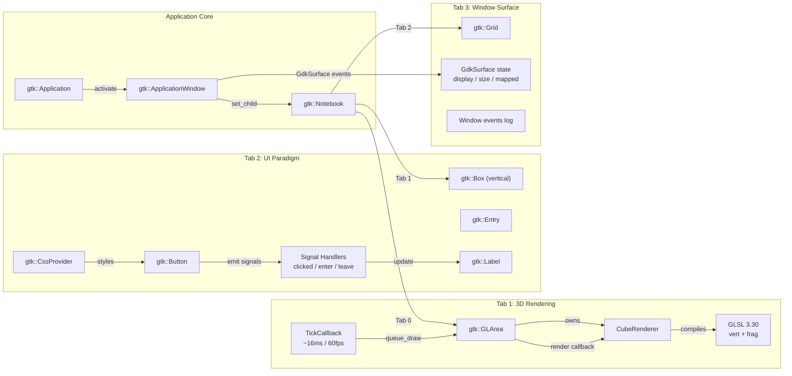
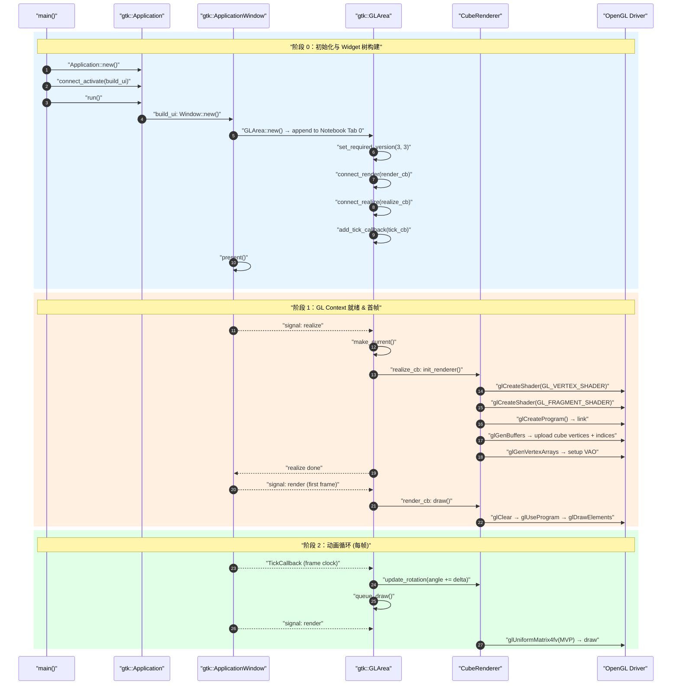
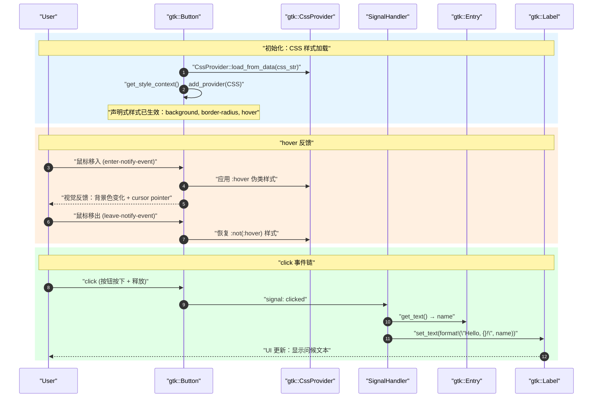
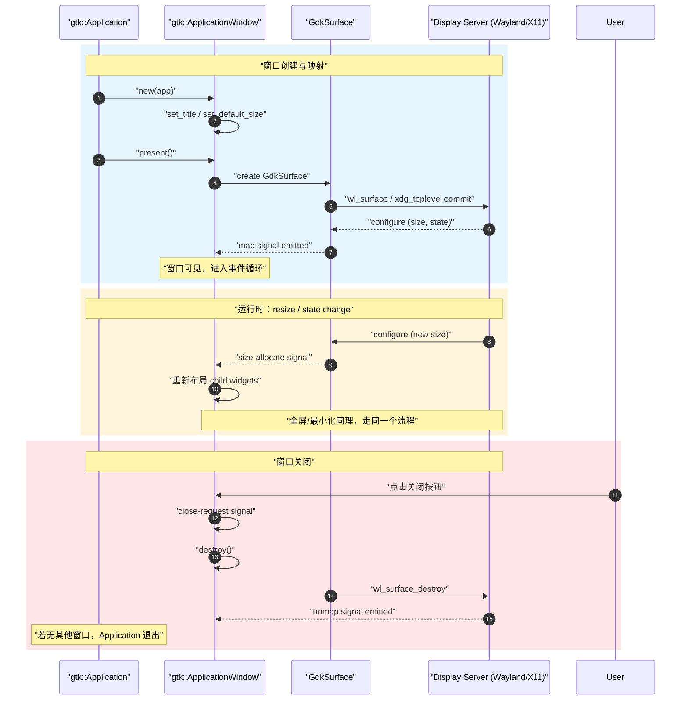

# gtk4-rs GUI 范式演示 — 架构设计

> [!note]
> **Ref:**
> - [GTK4 官方文档](https://docs.gtk.org/gtk4/)
> - [gtk4-rs crate](https://crates.io/crates/gtk4)
> - [GTK4 GLArea API](https://docs.gtk.org/gtk4/class.GLArea.html)
> - [OpenGL 3.3 Core Profile Spec](https://registry.khronos.org/OpenGL/specs/gl/GLSLangSpec.3.30.pdf)

> Aimed: 使用 gtk4-rs 在单个 GTK4 窗口中演示 GUI 框架三大核心范式：3D 渲染管线（GLArea + 旋转正方体）、声明式 UI 与事件系统（Button-Greet 组件）、窗口/GdkSurface 生命周期管理。

## 1. 组件架构

整个 demo 是**单 Application → 单 Window → 三 Tab** 的树形结构。GTK 的 `Application` 管理进程生命周期（唯一实例、DBus 注册），`ApplicationWindow` 持有顶层 `GdkSurface`，`Notebook` 提供 Tab 分页。三个 Tab 各自是独立的子系统，共享同一个 GTK 事件循环和 GL Context。



图中四条关键路径：

1. **`App → Win → NB`**：`Application::activate` 信号触发 `build_ui`，创建 Window 后 `present()` 请求显示。Window 内部 GTK 自动创建 `GdkSurface` 并与 display server 协商尺寸。
2. **`GLArea → Renderer → Shaders`**：GLArea 是 GTK4 的 OpenGL widget 容器。它拥有 `CubeRenderer`，后者在 `realize` 时编译 GLSL 3.30 shader、上传顶点数据到 GPU。TickCallback 每帧驱动旋转角度更新 → `queue_draw()` → `render` 回调。
3. **`Button → SigHandler → GreetLabel`**：Button 的 `clicked` 信号触发闭包，读取 Entry 文本后更新 Label。CSS 样式通过 `CssProvider` 全局注入，`:hover` 伪类由 GTK CSS 引擎自动管理，无需 Rust 代码。
4. **`Win → GdkSurface events → InfoGrid`**：Tab 3 每 500ms 轮询 surface 状态（mapped、size、display name、scale factor），同时通过 `connect_map` / `connect_notify` 信号实时计数窗口事件。

三个 Tab 之间没有直接通信——每个 Tab 的代码是独立模块（`cube_renderer.rs` / `greet_panel.rs` / `surface_monitor.rs`），只在 `main.rs::build_ui` 中被组装。这种隔离意味着任何一个 Tab 的实现可以单独替换而不会影响另外两个。

## 2. 渲染与交互时序

### 2.1 应用启动 → 首帧渲染



三个阶段的职责划分：

- **阶段 0（蓝）**：纯 GTK 层——创建 widget、注册回调、`present()` 请求显示。此时 GLArea 尚未获得 GL Context（`realize` 信号尚未发射），所有 GL 操作无效。这一阶段执行的是 `GreetPanel::new()` 和 `SurfaceMonitor::new()` 的 widget 构建，以及 CSS 的全局注入。
- **阶段 1（橙）**：`present()` 之后，GTK 为 GLArea 创建 GL Context 并发射 `realize`。此时 `make_current()` 后可以安全调用 GL 函数。`CubeRenderer::realize()` 在 ~1ms 内完成：编译两个 shader → 链接 program → 创建 VAO/VBO → 上传 36 个顶点。随后立即触发首帧 `render`，背景清为深蓝灰色，立方体以初始旋转角绘制。
- **阶段 2（绿）**：动画循环。`TickCallback` 与 compositor 帧时钟同步（60fps 约 16ms/帧）。每帧调用 `update()` 累加旋转角（~1.5°/帧），然后 `queue_draw()` 请求重绘。`render` 回调中重新计算 MVP（投影 × 视图 × 模型）并上传至 GPU uniform，调用 `glDrawArrays` 绘制 36 个三角形。

**关键异步点**：`queue_draw()` 不是同步绘制——它只是标记 widget 需要重绘，实际 `render` 在下一个帧时钟周期才触发。这意味着 `tick_cb` 和 `render_cb` 之间存在一个帧的延迟，对旋转动画的平滑度无影响。

### 2.2 Button-Greet 事件流



这段时序展示了 GTK4 事件系统的两条不同路径：

1. **CSS `:hover`（橙）**：完全在 GTK CSS 引擎内部处理。用户鼠标移入 → GTK 事件循环分发 `enter` 事件 → CSS 引擎匹配 `.greet-button:hover` 规则 → 更新 widget 背景色。整个过程**不经过 Rust 代码**——`EventControllerMotion::enter` 回调只用于日志记录，不影响样式。这是 GTK4 声明式 UI 的核心优势：视觉反馈由样式表声明，不靠回调命令式控制。

2. **`clicked` 信号（绿）**：经典的 GObject 信号路径。Button 内部状态机跟踪 press/release → 判定为 click → 发射信号 → 触发 Rust 闭包。闭包中读取 `Entry::text()` → 格式化 → `Label::set_text()`。这是从"输入控件"到"输出控件"的完整数据流，一条路径贯穿三个 widget。

**对比**：hover 是声明式的（CSS 描述"hover 时背景变深"，GTK 自动执行），click 是命令式的（闭包中手动读取写入）。两种范式在同一个 Button 上共存，互不冲突。

### 2.3 窗口生命周期



GTK4 窗口生命周期的核心事实：**`GtkApplicationWindow` 和 `GdkSurface` 不是同一个对象，生命周期不完全重叠**。

- `GtkApplicationWindow` 是应用层对象——title、child widget、信号。它在 `new()` 时即存在，在 `destroy()` 后消亡。
- `GdkSurface` 是 display server 资源的代理——它在 `present()` 时才创建（后端分配 wl_surface / X11 window），在 `unmap` 时可能被销毁（取决于 compositor）。
- Window 的 `map` 信号 ≠ Surface 的 `map` 信号——前者是 GTK 层的"widget 可见"，后者是 GDK 层的"display server 确认映射"。

配置协商（configure）是 Wayland 的核心协议特性：display server 告知客户端"你可以用的尺寸/状态"，客户端据此布局。GTK4 的 `size-allocate` 信号就是这一协商的结果——不是应用单方面设置尺寸，而是与 compositor 双向协商。在 X11 后端，这一流程被 GTK 内部适配为相同的 API 表面，应用代码不需要区分。

Tab 3（Surface Monitor）正是通过 500ms 轮询让这三个阶段**实时可见**——用户 resize 窗口时，尺寸和 configure 计数在 0.5 秒内更新。

## 3. 关键设计决策

| # | 决策 | 选项 A | 选项 B | 选择 | 原因 |
|---|------|--------|--------|------|------|
| 1 | 3D 渲染 Widget | `gtk::GLArea` | 嵌入式 EGL + wayland-egl | **GLArea** | GTK4 原生控件，自动管理 GL Context 生命周期（realize/unrealize）；无需手动绑定 Wayland surface 和 EGL；`add_tick_callback` 与帧时钟同步 |
| 2 | Shader 版本 | OpenGL 3.3 Core (GLSL 330) | OpenGL ES 3.0 (GLSL 300 es) | **GL 3.3 Core** | WSL2 桌面端（Mesa DRI）跑的是 desktop GL，非 ES；GLArea 默认创建 core profile context |
| 3 | UI 构建方式 | 程序化构建（Rust code） | `gtk::Builder` + XML | **程序化构建** | 代码即文档，组件创建、信号连接、CSS 注入全在一个 Rust 文件中可见；Builder XML 对"演示范式"的透明度不利 |
| 4 | 动画驱动 | `add_tick_callback` (帧同步) | `glib::timeout_add(16ms)` (定时器) | **TickCallback** | 与 compositor 帧时钟同步，自动适配显示器刷新率；不额外消耗 CPU 在无效帧上 |
| 5 | 三 Tab 组织 | `gtk::Notebook` 分页 | 三个独立 Window | **Notebook** | 单一窗口自包含，截图/观察更方便；Tab 切换体现"不同范式共享同一个 GTK Application Context" |
| 6 | 窗口信息监控 | 反射 `GdkSurface` API 查询 | 只在文档描述 | **运行时查询** | Tab 3 用代码实时读取 surface 状态（mapped、size、display name），让"窗口管理"不只是文字描述，而是可观测的现象 |

## 4. 渲染管线详解（Cube Renderer）

```
顶点数据 (vertices + indices)
        │
        ▼
[Vertex Shader]  ←── model * view * projection (MVP matrix)
        │              rotation 角度由 tick_callback 驱动
        ▼
[Rasterization]  (OpenGL fixed stage)
        │
        ▼
[Fragment Shader]  ←── 面法线方向 → Lambert 漫反射光照
        │
        ▼
[Framebuffer] → GLArea 默认 framebuffer → compositor → 显示器
```

- **顶点数据**：36 个顶点（6 面 × 2 三角形 × 3 顶点），包含 position(3f) + normal(3f) + color(3f)
- **MVP 矩阵**：在 render_cb 中更新——perspective(45°, aspect, 0.1, 100.0) × lookAt(0,0,5) × rotateY(angle) × rotateX(15°)
- **光照**：片元着色器中计算 `dot(normal, lightDir)` 做简单的方向光漫反射，使立方体的六个面有明暗区分

### 4.1 为什么这条管线"简单但完整"

这条渲染管线虽然只画了一个立方体，但覆盖了 OpenGL 3.3 Core Profile 的全部必要阶段：

| 阶段 | 固定管线（OpenGL 1.x） | 可编程管线（OpenGL 3.3+，本 demo） |
|------|------------------------|-----------------------------------|
| 顶点处理 | `glVertexPointer` + 固定变换 | **Vertex Shader**：手写 MVP 变换 |
| 图元装配 | 自动 | 自动（`GL_TRIANGLES`） |
| 光栅化 | 自动（不可干预） | 自动（不可干预） |
| 片元处理 | `glColor` + 固定光照 | **Fragment Shader**：手写 Lambert 漫反射 |
| 深度测试 | `glEnable(GL_DEPTH_TEST)` | `glEnable(GL_DEPTH_TEST)`（相同） |

本 demo 的 shader 有意保持最小——vertex shader 只做 MVP 变换，fragment shader 只做 dot(N·L) 漫反射。这个最小集就是所有现代 3D 应用的渲染管线骨架：更复杂的渲染只是在此基础上增加更多 uniform（纹理、材质、光源）、更多 shader 阶段（geometry/tessellation）、更多 pass（阴影贴图、后处理）。

### 4.2 数据从 CPU 到屏幕的完整路径

```
CPU 侧 (Rust)                          GPU 侧 (GLSL)
────────────────────────────────────────────────────────
cube_vertices() → [f32; 324]    ─┐
  (6面×2△×3顶点×9分量)           │ glBufferData
                                  ├─→ VRAM (VBO, 1.3KB)
                                  │
rotation += dt*1.57              ─┐
  (每帧累加旋转角)                │ glUniformMatrix4fv
                                  ├─→ uniform uMVP (64B)
                                  │
glDrawArrays(GL_TRIANGLES,0,36)  ─┤ 触发 GPU 管线
                                  │
                                  ├─→ Vertex Shader ×36
                                  │   gl_Position = uMVP * vec4(aPos,1.0)
                                  │
                                  ├─→ 光栅化 (约 2000 片元)
                                  │
                                  ├─→ Fragment Shader ×~2000
                                  │   fragColor = aColor * lighting
                                  │
                                  └─→ Framebuffer → compositor → 屏幕
```

每帧 CPU→GPU 数据流量仅 ~3KB（一个 uniform 矩阵 + 一次 draw call），对于现代 GPU（即使是 llvmpipe 软件渲染）是微不足道的负载。这也解释了为什么 demo 在 WSL2 无 GPU 加速的环境下仍能流畅运行。

## 5. 文件规划

| 文件 | 职责 |
|------|------|
| `src/main.rs` | 入口：Application 初始化、build_ui、CSS 加载、信号连接 |
| `src/cube_renderer.rs` | CubeRenderer 结构体：shader 编译链接、VBO/VAO/EBO、MVP 更新、draw 调用 |
| `src/greet_panel.rs` | GreetPanel：Button + Entry + Label 布局、clicked/hover 信号处理 |
| `src/surface_monitor.rs` | SurfaceMonitor：定时查询 GdkSurface 状态并更新 Info Grid |
| `Cargo.toml` | 依赖：gtk4(0.9) + 可选 gl/glib-sys 用于 OpenGL FFI |
| `test.sh` | clean → cargo build → cargo run -- tee output/log/run.log |
