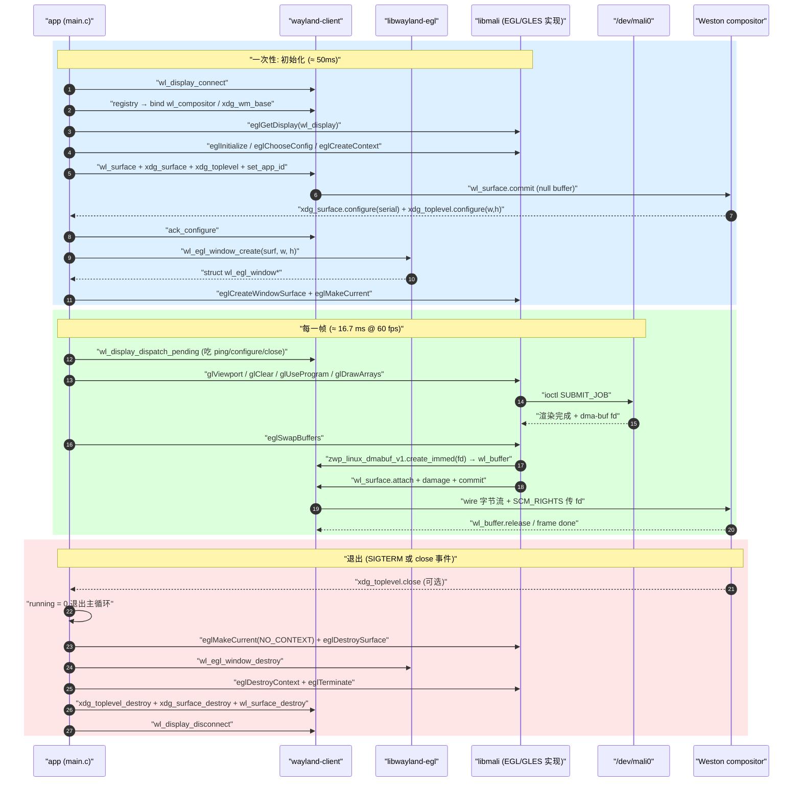

# tspi-greet-egl 应用层设计

> [!note]
> **Ref:**
> - 本工程源码: [`src/main.c`](src/main.c:1) ; [`src/render.c`](src/render.c:1) ; [`src/render.h`](src/render.h:1)
> - 对照 SHM 路径: [`../tspi-greet/src/main.c`](../tspi-greet/src/main.c:1)
> - 链接/运行时轴: [`Design-LinkChain.md`](Design-LinkChain.md)
> - EGL 概念抽象: [[06-EGL]]
> - Wayland 协议层: [[03-wayland]]
> - Khronos 规范: [EGL 1.5](https://registry.khronos.org/EGL/specs/eglspec.1.5.pdf) ; [OpenGL ES 2.0](https://registry.khronos.org/OpenGL/specs/es/2.0/es_full_spec_2.0.pdf)


## 1. 整体架构

```mermaid
graph TD
    subgraph UM["用户态 (本进程)"]
        Main["main 主控<br/>src/main.c:230"]
        App["struct app<br/>(共享状态载体)"]
        L["4 套 listener<br/>(回调写字段)"]
        Render["render.c<br/>(GLES2 shader+VBO)"]
        Wl["libwayland-client"]
        WlEgl["libwayland-egl<br/>(8 KB 桥接)"]
        Egl["libEGL → libmali.so.1<br/>(56 MB 闭源)"]
    end

    subgraph KM["内核态"]
        Mali["/dev/mali0<br/>(Mali kbase)"]
        Sk["AF_UNIX socket<br/>$XDG_RUNTIME_DIR/wayland-0"]
    end

    Weston["Weston 合成器<br/>(独立进程)"]

    Main -- "读/写所有字段" --> App
    L -- "回调写 pending/configured/running" --> App
    Main -- "wl_display_connect / roundtrip / dispatch" --> Wl
    Main -- "glClear/glDrawArrays" --> Render
    Render -.- "经 GL ABI" -.-> Egl
    Main -- "eglSwapBuffers" --> Egl
    Egl -- "内部用 wl_egl_window 引用 wl_surface" --> WlEgl
    Egl -- "内部 private queue 提交 dmabuf" --> Wl
    Egl -- "ioctl SUBMIT_JOB" --> Mali
    Wl -- "wire 字节流 + SCM_RIGHTS" --> Sk
    Sk -- "TCP-like 双向" --> Weston
    Weston -. "协议事件" .-> Sk
    Sk -. "read 事件" .-> Wl
    Wl -. "dispatch 时触发" .-> L
```

三类边界:

- **应用 ↔ 合成器**: 经 `wl_display` 的 unix socket,所有 wayland 协议事件双向走这里。
- **应用 ↔ GPU 内核**: 经 libmali 内部的 `ioctl(/dev/mali0)`,应用代码不直接触达。
- **应用主控 ↔ 状态载体**: `struct app` 是回调与主循环之间唯一的共享数据;两边的同步靠"callback 只写 pending,主循环只读 pending 并写 current"这套约定,详见 §2.4。


## 2. 数据结构: `struct app`

整个程序的状态全部装在 `struct app` 里 ([`src/main.c:33-56`](src/main.c:33))。回调函数签名是固定的,无法接收私有参数,所以每个 listener 通过 `add_listener(obj, listener, &a)` 把这个结构的指针传过去,**回调里写字段、主循环读字段**,这是一切数据流的根。

```c
// src/main.c:33
struct app {
    /* wayland */
    struct wl_display     *dpy;
    struct wl_registry    *reg;
    struct wl_compositor  *compositor;
    struct xdg_wm_base    *wm_base;
    struct wl_surface     *surf;
    struct xdg_surface    *xsurf;
    struct xdg_toplevel   *top;

    /* egl */
    EGLDisplay  egl_dpy;
    EGLContext  egl_ctx;
    EGLConfig   egl_cfg;
    EGLSurface  egl_surf;
    struct wl_egl_window *egl_win;

    /* state */
    int  width, height;        /* 当前 EGL window 尺寸 */
    int  pending_w, pending_h; /* 待应用的 configure 尺寸 */
    int  configured;
    int  running;
    uint64_t frames;
};
```

### 2.1 三段分组的语义

| 段 | 字段 | 写入位置 | 读取位置 |
|---|---|---|---|
| wayland 协议端 | `dpy / reg / compositor / wm_base / surf / xsurf / top` | `main` 一次性创建 | 全程持有,退出时反序销毁 |
| EGL 端 | `egl_dpy / egl_ctx / egl_cfg / egl_surf / egl_win` | `egl_setup` (前 3) + `egl_attach_surface` (后 2) | 主循环 `render_frame` + `eglSwapBuffers` |
| 主循环状态 | `width/height / pending_w/h / configured / running / frames` | callback 写 `pending_*` + `configured` + `running`;main 写 `width/height` + `frames` | main loop 退出条件 + render 尺寸 |

分组**不是为了排版**,而是为了对应三类生命周期:协议端字段对应合成器会话,EGL 端字段对应 GPU 上下文,状态字段是 callback ↔ main 的握手寄存器。

### 2.2 字段精解 (按依赖序)

| 字段 | 类型 | 创建 | 依赖前序字段 | 备注 |
|---|---|---|---|---|
| `dpy` | `wl_display*` | `wl_display_connect(NULL)` ([main.c:238](src/main.c:238)) | $WAYLAND_DISPLAY 环境变量 | 整个程序的协议入口 |
| `reg` | `wl_registry*` | `wl_display_get_registry(dpy)` ([main.c:246](src/main.c:246)) | `dpy` | 用完即可,但要持有到 disconnect |
| `compositor` | `wl_compositor*` | registry global 回调 ([main.c:76](src/main.c:76)) | `reg` + 首次 roundtrip | 用于建 `surf` |
| `wm_base` | `xdg_wm_base*` | registry global 回调 ([main.c:78](src/main.c:78)) | `reg` + 首次 roundtrip | 用于建 `xsurf`;同时挂 ping/pong listener |
| `egl_dpy` | `EGLDisplay` | `eglGetDisplay(dpy)` ([main.c:131](src/main.c:131)) | `dpy` | 与协议 `dpy` **共享底层 fd**,但语义独立 |
| `egl_cfg` | `EGLConfig` | `eglChooseConfig` ([main.c:169](src/main.c:169)) | `egl_dpy` + init 完成 | 决定后续 surface 的像素格式 |
| `egl_ctx` | `EGLContext` | `eglCreateContext` ([main.c:176](src/main.c:176)) | `egl_cfg` + `eglBindAPI` | **不依赖 surface**,可在 surface 建立前创建 |
| `surf` | `wl_surface*` | `wl_compositor_create_surface` ([main.c:258](src/main.c:258)) | `compositor` | 协议层裸 surface,无角色 |
| `xsurf` | `xdg_surface*` | `xdg_wm_base_get_xdg_surface` ([main.c:259](src/main.c:259)) | `wm_base` + `surf` | 给 `surf` 赋予"窗口"角色 |
| `top` | `xdg_toplevel*` | `xdg_surface_get_toplevel` ([main.c:262](src/main.c:262)) | `xsurf` | 具体化为 toplevel 类型;此后才能 `set_app_id`/`set_title` |
| `configured` | `int` | 0→1 在 `xsurf_configure` 回调 ([main.c:95](src/main.c:95)) | 首次 commit + roundtrip | 二阶段初始化的哨兵 |
| `pending_w/h` | `int` | `top_configure` 回调写入 ([main.c:106](src/main.c:106)) | toplevel.configure 事件 | 不可在 callback 里直接 apply,详见 §2.4 |
| `egl_win` | `wl_egl_window*` | `wl_egl_window_create(surf, w, h)` ([main.c:191](src/main.c:191)) | `surf` + 首轮 configure 完成 | 桥接结构,共享给 EGL 实现 |
| `egl_surf` | `EGLSurface` | `eglCreateWindowSurface(.., egl_win, ..)` ([main.c:196](src/main.c:196)) | `egl_dpy` + `egl_cfg` + `egl_win` | 真正的渲染目标 |
| `width/height` | `int` | `egl_apply_resize` 同步自 pending ([main.c:222](src/main.c:222)) | 主循环 + pending_* | 当前正在渲染的尺寸 |
| `running` | `int` | 1→0 由 SIGINT/SIGTERM 或 `top_close` ([main.c:112](src/main.c:112)) | 信号 / 协议事件 | 主循环退出条件 |
| `frames` | `uint64_t` | 每次 SwapBuffers 后 `++` ([main.c:305](src/main.c:305)) | (无,自由计数) | 用于 Conclude.md 的 fps 校验 |

**依赖序**直接决定 main 函数里这些字段的初始化顺序: `wl_display_connect` 必须在 `eglGetDisplay` 之前、`wl_compositor_create_surface` 必须在 `wl_egl_window_create` 之前。

### 2.3 资源生命周期配对

退出清理 ([main.c:307-321](src/main.c:307)) 必须**反序**销毁:

| 创建 | 销毁 | 反向依赖 |
|---|---|---|
| `wl_display_connect` | `wl_display_disconnect` | 所有 wl 对象必须先销毁 |
| `wl_compositor_create_surface` | `wl_surface_destroy` | EGL surface 必须先析构 |
| `xdg_wm_base_get_xdg_surface` | `xdg_surface_destroy` | xdg_toplevel 必须先析构 |
| `xdg_surface_get_toplevel` | `xdg_toplevel_destroy` | (顶层) |
| `eglGetDisplay` + `eglInitialize` | `eglTerminate` | 所有 EGL ctx/surface 必须先 destroy |
| `eglCreateContext` | `eglDestroyContext` | 必须先 MakeCurrent(NO_CONTEXT) 解绑 |
| `wl_egl_window_create` | `wl_egl_window_destroy` | EGL surface 引用了它,必须等 surface 析构后 |
| `eglCreateWindowSurface` | `eglDestroySurface` | 必须先 MakeCurrent(NO_CONTEXT) |
| `eglMakeCurrent(... ctx)` | `eglMakeCurrent(EGL_NO_CONTEXT)` | 解绑当前线程 |

反序错乱的典型后果: 先 `eglDestroyContext` 再 `eglDestroySurface` 会让 surface 引用到已释放的 ctx;先 `wl_egl_window_destroy` 再 `eglDestroySurface` 是 use-after-free,因为 libmali 内部还在通过 `wl_egl_window->driver_private` 访问 EGL surface 的私有数据。

### 2.4 状态机: `pending_w/h` ↔ `width/height`

这对成对字段是回调与主循环之间最重要的握手:

```text
toplevel.configure 事件到达
        │
        ▼
top_configure 回调 (callback 上下文)
        │ 只写: a->pending_w = w; a->pending_h = h
        ▼
回调返回,wl_display_read_events 解锁
        │
        ▼
主循环 egl_apply_resize ([main.c:217](src/main.c:217))
        │ 比较: pending vs current
        │ 不同 → 写 a->width/height + 调 wl_egl_window_resize
        ▼
render_frame(width, height, t)  ← 用新尺寸
        │
        ▼
eglSwapBuffers
        │ EGL 实现下一帧才看到新尺寸,重新分配 dma-buf
```

**为什么不能在 callback 里直接 apply?**

- callback 在 `wl_display_dispatch` / `read_events` 内部触发,此时持有 wayland 内部队列锁;在锁内调 `wl_egl_window_resize` 没问题,但**调 EGL 函数**(如 SwapBuffers)会重入 wayland-client 死锁。
- 协议上 toplevel.configure 之后还会跟一个 xdg_surface.configure(serial),应用必须先 `ack_configure` 再变尺寸,否则 weston 会丢一帧。
- 多次 configure 在一个 dispatch 周期可能合并,只需 apply 最后一次,pending 模式天然合流。

### 2.5 状态机: `configured` 与 `running`

```text
configured:  0 ──[首次 xdg_surface.configure 到达]──> 1  (此后保持)
running:     1 ──[g_stop=1 (SIGINT/SIGTERM) 或 top_close 回调]──> 0
```

`configured` 是**两阶段初始化的哨兵**。main 函数在第二次 roundtrip 之后检查这个标志(实际上代码用 `pending_w > 0` 间接判断,见 [main.c:271](src/main.c:271)),决定是否进入 `egl_attach_surface`。

`running` 由两种事件翻转:

- SIGINT/SIGTERM → `on_signal` 写 `g_stop`,主循环条件 `a.running && !g_stop` 失效
- `top_close` 回调直接 `a->running = 0` (合成器要求关闭窗口)


## 3. Listener 表与回调时序

应用注册了 **4** 套 listener,所有合成器到客户端的协议事件都通过这些回调驱动:

| Listener struct | 注册对象 | `add_listener` 位置 | 触发事件 | 副作用 (写字段) |
|---|---|---|---|---|
| `reg_listener` | `wl_registry` | [main.c:247](src/main.c:247) | `global` / `global_remove` | `compositor`, `wm_base` |
| `wm_listener` | `xdg_wm_base` | [main.c:79](src/main.c:79) (注册在 registry global 里) | `ping(serial)` | (无;直接 `xdg_wm_base_pong`) |
| `xsurf_listener` | `xdg_surface` | [main.c:260](src/main.c:260) | `configure(serial)` | `configured = 1` (同时 `ack_configure`) |
| `top_listener` | `xdg_toplevel` | [main.c:263](src/main.c:263) | `configure(w,h,states)` / `close` / `configure_bounds` / `wm_capabilities` | `pending_w/h` (configure) ; `running = 0` (close) |

### 3.1 callback 的执行上下文

所有 listener 回调统一由 `wl_display_dispatch` / `wl_display_dispatch_pending` / `wl_display_read_events` 调度。**它们不是独立线程**,而是在主循环显式调 dispatch 的那一刻同步执行。

```text
主循环                                        wayland-client 内部
─────────                                    ──────────────────
wl_display_prepare_read(dpy)         ┐
wl_display_flush(dpy)                │
wl_display_read_events(dpy)          ├ 这段时间持有队列锁
wl_display_dispatch_pending(dpy)     │ ← 在这里同步触发所有 listener 回调
                                     ┘ ← 解锁
egl_apply_resize(&a)
render_frame(...)
eglSwapBuffers(...)
```

→ **callback 里只能做两件事**:
1. 写 `struct app` 的标量字段 (无需锁,因为主循环此刻不在读)
2. 直接发送 `wl_*` 请求 (如 `xdg_wm_base_pong`、`xdg_surface_ack_configure`)

→ **callback 里不能做**:
- 调任何阻塞的 EGL 函数 (会重入 wayland-client 死锁)
- 调 `wl_display_dispatch` / `wl_display_roundtrip` (重入)
- 直接 `wl_egl_window_resize` (理论安全但与 ack_configure 协议顺序冲突)

### 3.2 两次 roundtrip 的角色

`wl_display_roundtrip` = flush 所有待发请求 + 阻塞等到一次 `wl_callback.done`,期间到达的事件全部 dispatch。程序里精确用到两次:

1. **[main.c:248](src/main.c:248) 第一次 roundtrip**: 注册 registry listener 之后调,作用是**拿到 globals 列表**。回调里 `reg_global` 被触发若干次 (compositor / wm_base / wl_seat 等),写入 `compositor` 和 `wm_base` 字段。返回后立即 sanity check 这两个非空。

2. **[main.c:268](src/main.c:268) 第二次 roundtrip**: `wl_surface_commit(surf)` (空 buffer) 之后调,作用是**等首次 configure**。kiosk-shell 此时把 toplevel 绑到 DSI-1 输出,并发送:
   - `xdg_toplevel.configure(480, 800, [activated, ...])` → `top_configure` 回调写 `pending_w/h`
   - `xdg_surface.configure(serial)` → `xsurf_configure` 回调写 `configured=1` + `ack_configure`

返回后主循环就能拿到合法尺寸进 `egl_attach_surface`。

### 3.3 ping/pong 不可省略

[main.c:62-66](src/main.c:62):

```c
static void wm_ping(void *d, struct xdg_wm_base *b, uint32_t serial)
{
    (void)d;
    xdg_wm_base_pong(b, serial);
}
```

合成器周期性发 `xdg_wm_base.ping`,应用必须在合理时间内 `pong` 回应。**不响应**会被合成器判定为 unresponsive 并强制关闭窗口。这是 wayland 的存活心跳,与 EGL 完全无关,但缺失会让 demo 在长时间 GPU stall 时被误杀。


## 4. 运行时时序



**与 SHM 路径最大的差异**在第 14-15 步: SHM 客户端自己写 `wl_surface.attach + damage + commit`,EGL 路径里这三句由 libmali 在 `eglSwapBuffers` 内部完成。详见 [[06-EGL]] §4。


## 5. 关键 API 走读

### 5.1 `egl_setup()` —— 平台绑定 + Config + Context

**位置**: [`src/main.c:126-184`](src/main.c:126)
**作用一句话**: 把 EGL 用户态库初始化到能创建 surface 的状态,并打印诊断字符串证明栈身份。

```c
// src/main.c:126
static int egl_setup(struct app *a)
{
    a->egl_dpy = eglGetDisplay((EGLNativeDisplayType)a->dpy);
    if (a->egl_dpy == EGL_NO_DISPLAY) { ... return -1; }

    EGLint major = 0, minor = 0;
    if (!eglInitialize(a->egl_dpy, &major, &minor)) { ... return -1; }

    /* 关键诊断: 板上栈身份 */
    const char *egl_vendor = eglQueryString(a->egl_dpy, EGL_VENDOR);
    const char *egl_ver    = eglQueryString(a->egl_dpy, EGL_VERSION);
    /* ... CLIENT_APIS / EXTENSIONS 同样打 ... */

    if (!eglBindAPI(EGL_OPENGL_ES_API)) { ... return -1; }
```

**为什么这么写**:

- `eglGetDisplay(NativeDisplayType)` 是 EGL 1.4 接口,够 Wayland 平台用;EGL 1.5 起推荐 `eglGetPlatformDisplay(EGL_PLATFORM_WAYLAND_KHR, ...)`,这里为兼容老规范用前者。Mali blob 在两条路径行为一致,实测 init 出来就是 EGL 1.5。
- `eglQueryString` 4 个字段必印: 这是 demo 的核心证据点,让 stdout 直接告诉运维"我现在跑的栈是哪家厂商的"。实测 `EGL_VENDOR=ARM` / `EGL_VERSION=1.5 Bifrost-"g24p0-00eac0"`,这是 ARM Mali 闭源 blob 的特征字符串。
- `eglBindAPI(EGL_OPENGL_ES_API)` 必须在 `eglCreateContext` 之前;Mali blob 不支持 `EGL_OPENVG_API`,只能选 GLES。

紧接着选 config + 建 context:

```c
// src/main.c:159
EGLint cfg_attrs[] = {
    EGL_SURFACE_TYPE,    EGL_WINDOW_BIT,
    EGL_RENDERABLE_TYPE, EGL_OPENGL_ES2_BIT,
    EGL_RED_SIZE,        8,  EGL_GREEN_SIZE, 8,
    EGL_BLUE_SIZE,       8,  EGL_ALPHA_SIZE, 8,
    EGL_NONE,
};
eglChooseConfig(a->egl_dpy, cfg_attrs, &a->egl_cfg, 1, &n_cfg);

EGLint ctx_attrs[] = { EGL_CONTEXT_CLIENT_VERSION, 2, EGL_NONE };
a->egl_ctx = eglCreateContext(a->egl_dpy, a->egl_cfg, EGL_NO_CONTEXT, ctx_attrs);
```

**为什么这么写**:

- 显式 `EGL_RENDERABLE_TYPE = EGL_OPENGL_ES2_BIT` 是必要的;不写的话 Mali blob 可能给 GLES3-only config (实测 `GL_VERSION` 报 3.2),后续 shader 里 `precision mediump float` 等 ES2 写法会被严格化。
- `EGL_SURFACE_TYPE = EGL_WINDOW_BIT` 与稍后的 `eglCreateWindowSurface` 必须配对,否则 `EGL_BAD_MATCH`。
- `EGL_CONTEXT_CLIENT_VERSION=2` 是 EGL 1.5 已废弃但 blob 仍接受的写法,比 `EGL_CONTEXT_MAJOR_VERSION` 更跨实现。

### 5.2 `egl_attach_surface()` —— 把 wl_surface 升格成 EGL 渲染目标

**位置**: [`src/main.c:185-215`](src/main.c:185)
**作用一句话**: 根据首次 configure 给的尺寸建出 `wl_egl_window`,让 EGL 把它认作 native window surface。

```c
// src/main.c:185
static int egl_attach_surface(struct app *a)
{
    int w = a->width  > 0 ? a->width  : 480;
    int h = a->height > 0 ? a->height : 800;
    a->width = w; a->height = h;

    a->egl_win = wl_egl_window_create(a->surf, w, h);
    if (!a->egl_win) { ... return -1; }

    a->egl_surf = eglCreateWindowSurface(a->egl_dpy, a->egl_cfg,
                                         (EGLNativeWindowType)a->egl_win, NULL);
    if (a->egl_surf == EGL_NO_SURFACE) { ... return -1; }

    if (!eglMakeCurrent(a->egl_dpy, a->egl_surf, a->egl_surf, a->egl_ctx)) { ... }
    eglSwapInterval(a->egl_dpy, 1);

    printf("[gl]  GL_VENDOR    = %s\n", glGetString(GL_VENDOR));
    printf("[gl]  GL_RENDERER  = %s\n", glGetString(GL_RENDERER));
}
```

**为什么这么写**:

- `wl_egl_window_create` 必须在 `eglCreateWindowSurface` 之前: 前者构造一个 `struct wl_egl_window` (含 `wl_surface*` + 尺寸 + EGL 实现的私有 hook),后者把它强转成 `EGLNativeWindowType` 喂给 EGL。这就是 wayland-egl 上游做的"接口约定层"。
- `eglMakeCurrent` 之后才能调 GL 函数: `glGetString` 之前若没 MakeCurrent,返回 NULL。
- `eglSwapInterval(dpy, 1)` 开 vsync,否则 Mali blob 可能默认不卡帧、CPU 狂转。实测 4 秒跑 243 帧 ≈ 60.75 fps,正好对得上 DSI 屏刷新率。

### 5.3 `egl_apply_resize()` —— configure 尺寸生效

**位置**: [`src/main.c:217-227`](src/main.c:217)
**作用一句话**: 主循环每次 dispatch 后调本函数,把 `pending_w/h` 真正应用到 `wl_egl_window`。

```c
// src/main.c:217
static void egl_apply_resize(struct app *a)
{
    if (a->pending_w > 0 && a->pending_h > 0 &&
        (a->pending_w != a->width || a->pending_h != a->height)) {
        a->width = a->pending_w;
        a->height = a->pending_h;
        wl_egl_window_resize(a->egl_win, a->width, a->height, 0, 0);
    }
}
```

**为什么这么写**: 见 §2.4 状态机的完整解释。一句话: callback 里只写 pending,主循环里才 apply,既避开 dispatch 锁也保证 ack_configure 在 resize 之前。

### 5.4 `render_init()` —— shader 编译 + program 链接 + VBO

**位置**: [`src/render.c:93-138`](src/render.c:93)
**作用一句话**: 编两段 GLSL,链 program,建一个全屏四边形的 VBO。

```c
// src/render.c:93
int render_init(void)
{
    GLuint vs = compile_shader(GL_VERTEX_SHADER,   VS_SRC);
    GLuint fs = compile_shader(GL_FRAGMENT_SHADER, FS_SRC);
    if (!vs || !fs) return -1;

    g_program = glCreateProgram();
    glAttachShader(g_program, vs);
    glAttachShader(g_program, fs);
    glLinkProgram(g_program);
    /* ... 拿 attrib/uniform locations ... */

    static const GLfloat QUAD[] = {
        -1.f, -1.f,   1.f, -1.f,
        -1.f,  1.f,   1.f,  1.f,
    };
    glGenBuffers(1, &g_vbo);
    glBindBuffer(GL_ARRAY_BUFFER, g_vbo);
    glBufferData(GL_ARRAY_BUFFER, sizeof(QUAD), QUAD, GL_STATIC_DRAW);
```

**为什么这么写**:

- VS 极简 ([render.c:23-29](src/render.c:23)) 只做 NDC 透传 + 把位置传给 fragment 当 uv,所有视觉效果在 fragment shader 里,避免 MVP 矩阵噪音。
- FS 用 `u_time` + `length(p)` 算径向色环 ([render.c:31-65](src/render.c:31)): 三通道相位差 2.094 rad (≈ 120°) 实现旋转色环,外加 `pulse` 亮度脉动 + `vignette` 暗角 + 中心 `core` 亮点。这种构造确保每像素都需要 GPU 真正计算,避免 `glClear` 一刷被误判为 GPU 在干活。
- `GL_TRIANGLE_STRIP` 4 顶点全屏四边形: 最小 draw call,strip 顺序与 NDC 顺序天然对齐 (左下 → 右下 → 左上 → 右上),无需 index buffer。

### 5.5 `render_frame()` —— 一帧

**位置**: [`src/render.c:141-158`](src/render.c:141)

```c
// src/render.c:141
void render_frame(int width, int height, float t)
{
    glViewport(0, 0, width, height);
    glClearColor(0.f, 0.f, 0.f, 1.f);
    glClear(GL_COLOR_BUFFER_BIT);

    glUseProgram(g_program);
    glUniform1f(g_loc_time, t);
    glUniform2f(g_loc_res, (float)width, (float)height);

    glBindBuffer(GL_ARRAY_BUFFER, g_vbo);
    glEnableVertexAttribArray(g_loc_pos);
    glVertexAttribPointer(g_loc_pos, 2, GL_FLOAT, GL_FALSE, 0, NULL);
    glDrawArrays(GL_TRIANGLE_STRIP, 0, 4);
    glDisableVertexAttribArray(g_loc_pos);
}
```

**为什么这么写**:

- `glViewport` 每帧都调: 尺寸可能因 configure 变更,避免镜像/裁剪。
- `glClear` 留着不省: 即便全屏 quad 覆盖每像素,blob 内部 tiler 会用 clear hint 做 fast tile-zero,反而省带宽。
- 不分离 VAO: GLES2 没有 VAO (需 GLES3 / `OES_vertex_array_object`),所以每帧 bind + enable + pointer 一遍。

### 5.6 主循环 —— `prepare_read/read_events` 三段式

**位置**: [`src/main.c:285-306`](src/main.c:285)

```c
// src/main.c:285
while (a.running && !g_stop) {
    /* 派发 wayland 事件 */
    while (wl_display_prepare_read(a.dpy) != 0)
        wl_display_dispatch_pending(a.dpy);
    wl_display_flush(a.dpy);
    wl_display_read_events(a.dpy);
    wl_display_dispatch_pending(a.dpy);

    egl_apply_resize(&a);
    /* ... 取 t ... */
    render_frame(a.width, a.height, t);

    if (!eglSwapBuffers(a.egl_dpy, a.egl_surf)) break;
    a.frames++;
}
```

**为什么这么写**:

- 不用 `wl_display_dispatch`: 那是阻塞调用,会卡到有事件;本主循环渲染驱动,事件读取必须非阻塞。
- `prepare_read/read_events` 三段式: wayland 上游推荐的"事件循环 + 渲染线程"协作范式;`prepare_read` 拿读锁、`flush` 把待发请求写出、`read_events` 从 fd 读、`dispatch_pending` 派发到回调。`while (prepare_read != 0)` 兜底防止队列非空时拿不到锁。
- `eglSwapBuffers` 失败必须 break: 通常意味 surface 被销毁或 dma-buf 协议异常,继续循环只会更糟。


## 6. 源码巡读

把上面所有片段串成一篇文章,按程序从启动到一帧完成的叙事顺序展开。

**进入 main** ([`src/main.c:230`](src/main.c:230))。装 SIGINT/SIGTERM 处理 (让 `timeout 5` 杀进程时也能打印 frames 计数),`struct app` 全零起步 (`running=1`)。设 stdout 行缓冲,这一点对运维 `tee` 抓日志很关键: GPU stall 时 stdout 可能 4KB 攒不齐导致看似无输出。

**连 wayland + 拿 globals** ([`src/main.c:238-254`](src/main.c:238))。`wl_display_connect(NULL)` 读 `$WAYLAND_DISPLAY`,失败立刻打 `getenv("WAYLAND_DISPLAY")` 帮排错。注册 registry listener 之后立即 `wl_display_roundtrip`,这是程序里**第一次 roundtrip**: 它阻塞到所有 globals 都派发完毕。返回后 sanity check `compositor && wm_base`,任何一个空都直接退出。

**EGL 一次性初始化** ([`src/main.c:256`](src/main.c:256), `egl_setup`,详见 §5.1)。注意 `egl_setup` 不依赖任何 `wl_surface`: `eglGetDisplay(wl_dpy)` 只要 `wl_dpy` 在,`eglCreateContext` 只要 config 在。这是为什么 EGL ctx 可以**先于 wl_surface 创建**,把 ctx 准备好等 surface。但 **window surface 必须等 configure 之后才能建**,这是两阶段初始化的根本约束。

**建 wl_surface + 升格为 toplevel** ([`src/main.c:258-265`](src/main.c:258))。`wl_compositor_create_surface` 拿到裸 `wl_surface`,`xdg_wm_base_get_xdg_surface` 给它赋予"窗口"角色,`xdg_surface_get_toplevel` 进一步具体化为 toplevel 类型。`set_app_id("com.tspi.greet")` 让 kiosk-shell 通过 `weston.ini` 的 `[output] app-ids` 把它绑到 DSI-1 输出,这是 demo 能全屏点亮的协议侧根因。

**首次 commit + 第二次 roundtrip** ([`src/main.c:267-268`](src/main.c:267))。`wl_surface_commit(a.surf)` 此时**没有 attach 任何 buffer**,这是 xdg-shell 协议规定的握手起点。立即 `wl_display_roundtrip` 等合成器发回 `xdg_surface.configure` + `xdg_toplevel.configure(w,h)`。回调里 `pending_w/h` 被填,`configured=1`,`ack_configure` 已发。

**把 EGL surface 接上来** ([`src/main.c:271-276`](src/main.c:271), `egl_attach_surface`,见 §5.2)。这一行的位置不能往前挪,因为它需要 `pending_w/h` 已经被 callback 填好。`wl_egl_window_create(surf, w, h)` 是关键的跨边界一步: 它构造的结构同时被应用 (用 `wl_egl_window_resize`) 和 libmali (通过私有 hook) 引用。`eglCreateWindowSurface` 之后 `eglMakeCurrent` 才让当前线程能调 GL 函数。

**render_init** ([`src/main.c:277`](src/main.c:277), 见 §5.4)。这一步必须在 `eglMakeCurrent` 之后,否则 `glCreateShader` 返回 0。把 shader 编译错误捕获到 stderr 很重要,libmali 的 shader 编译链路任何故障都会在这里显形。

**主循环跑帧** ([`src/main.c:285-306`](src/main.c:285), 见 §5.6)。每帧的四步**顺序不可交换**:

1. `wl_display_prepare_read/read_events/dispatch_pending` 派发协议事件: 必须在 render 之前,因为 configure 改尺寸会影响 viewport。
2. `egl_apply_resize` 同步 pending → current: 必须在 dispatch 之后(pending 是 callback 刚写的),必须在 render 之前(下一帧要用新尺寸)。
3. `render_frame(w, h, t)` 出 GL 命令: 必须在 resize 之后,否则一帧用旧尺寸画完才发现要缩放,浪费一帧。
4. `eglSwapBuffers` 提交 + commit + 等 vsync: 必须在 render 之后且是这一帧最后一步,因为它会阻塞约 16.7 ms 直到下次 vsync,期间 wayland 事件会堆积在 socket 里(但不会丢失,下一轮 `read_events` 会拿到)。

**退出清理** ([`src/main.c:310-321`](src/main.c:310))。当 `running=0` 或 `g_stop=1` 跳出主循环。**严格反序**销毁,见 §2.3 的配对表:`render_fini` → `eglMakeCurrent(NO_CONTEXT)` → `eglDestroySurface` → `wl_egl_window_destroy` → `eglDestroyContext` → `eglTerminate` → `xdg_toplevel_destroy` → `xdg_surface_destroy` → `wl_surface_destroy` → `wl_display_disconnect`。任何反序错乱都会引起 use-after-free 或资源泄漏。


## 7. 与 SHM 路径 ([tspi-greet/src/main.c](../tspi-greet/src/main.c:1)) 的逐函数对照

| 步骤 | SHM 版 (`tspi-greet`) | EGL 版 (`tspi-greet-egl`) |
|------|----------------------|--------------------------|
| 全局 bind | `wl_compositor` + `wl_shm` + `xdg_wm_base` | `wl_compositor` + `xdg_wm_base` (无 `wl_shm`) |
| `struct app` 渲染端字段 | `wl_shm * shm`, `wl_buffer * buf`, `void * mmap_ptr` | `EGLDisplay/Context/Surface/Config`, `wl_egl_window *` |
| buffer | `wl_shm_pool_create_buffer` + `mmap` + cairo 画 | `wl_egl_window_create` + `eglCreateWindowSurface`,由 EGL 内部 dma-buf |
| 提交 | `wl_surface.attach + damage + commit` 手工三件套 | `eglSwapBuffers` 一句,commit 由 EGL 实现完成 |
| 节拍 | `wl_surface_frame` 回调驱动 | `eglSwapInterval(1)` + SwapBuffers 内部阻塞到 vsync |
| ELF.NEEDED | `libwayland-client / libcairo / libm / libc` | `libwayland-client / libwayland-egl / libmali / libm / libc` |
| 触达 `/dev/mali0` | 客户端侧不触达 (weston 自身合成会触达) | 直接打开 (`/proc/PID/fd` 验证) |
| 主循环节奏 | 事件驱动;闲时几乎不耗 CPU | 渲染驱动;每帧执行 GLES 命令流 |
| Listener 数量 | 5 (registry + xsurf + top + wm + frame) | 4 (registry + xsurf + top + wm) |

EGL 路径少一个 `wl_surface_frame` listener: 在 SHM 版里它驱动整个主循环节拍,在 EGL 版里这个角色由 `eglSwapBuffers` 内部的 vsync 同步接管。

详见 [`Conclude.md`](Conclude.md:1) 的"逐现象分析"。
