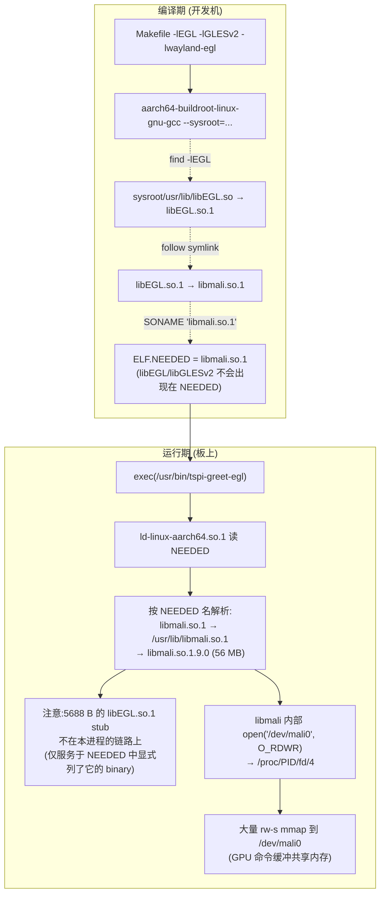
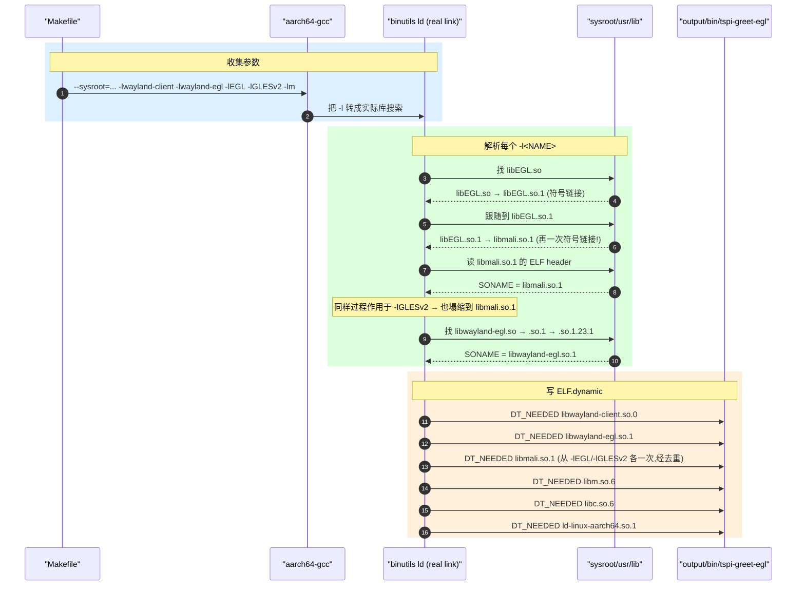
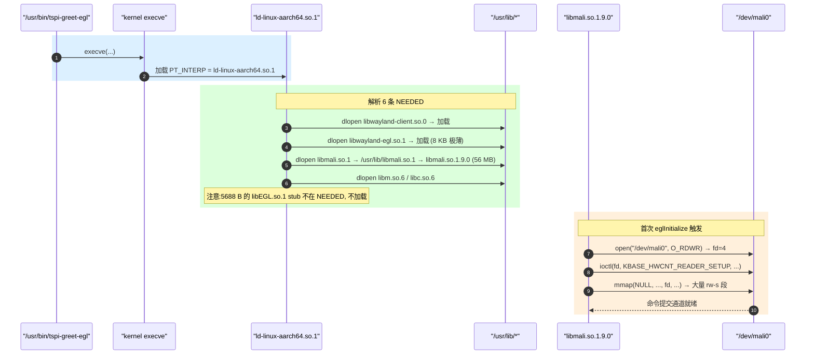

# tspi-greet-egl 链接/运行时轴

> [!note]
> **Ref:**
> - 本工程：[`Makefile`](Makefile:1) ; [`build.sh`](build.sh:1) ; [`output/log/verify.log`](output/log/verify.log) ; [`output/log/run.log`](output/log/run.log)
> - 控制流轴姊妹篇：[`Design-EGL-Path.md`](Design-EGL-Path.md)
> - Buildroot 包：`sdk/tspi-rk3566-sdk/buildroot/package/rockchip/rockchip-mali/rockchip-mali.mk`
> - 上游 wiki：[ELF dynamic section](https://refspecs.linuxfoundation.org/elf/gabi4+/ch5.dynamic.html) ; [`ld.so(8)`](https://man7.org/linux/man-pages/man8/ld.so.8.html)


## 1. 全景架构



**核心反直觉点**：

- 我们以为路径是 `binary → libEGL.so.1 (5688 B stub) → libmali.so`，但 **buildroot sysroot 里 `libEGL.so.1` 本身就是 `libmali.so.1` 的软链**，链接器一路顺着 SONAME 落到 `libmali.so.1`，所以 **ELF 的 `NEEDED` 段里根本不会出现 `libEGL.so.1`**。
- 板上那个 5688 B 的 `libEGL.so.1` 是另一个故事 —— 它是 buildroot 把 `rockchip-mali` 包装成 *"virtual provider for libegl"* 时安装到 target 镜像里的 dispatch stub，**专门服务于那些在 NEEDED 中显式列出 `libEGL.so.1` 的二进制**（比如某些 yocto/Debian 软件包预编译的 GUI 程序）。我们自己 build 的 ELF **完全绕过它**。


## 2. 链接期时序



**关键洞察**（[`output/log/verify.log`](output/log/verify.log:1) 实测）：

```
# sysroot 里 4 个符号链接被一次性追到底
libEGL.so      → libEGL.so.1
libEGL.so.1    → libmali.so.1
libGLESv2.so   → libGLESv2.so.2
libGLESv2.so.2 → libmali.so.1
libmali.so     → libmali.so.1
libmali.so.1   → libmali.so.1.9.0   (56 MB 真身)
```

最终 ELF.NEEDED（[output/log/build.log](output/log/build.log:1) 实测）：

```
NEEDED  libwayland-client.so.0
NEEDED  libwayland-egl.so.1
NEEDED  libmali.so.1          ← -lEGL 与 -lGLESv2 都收口到这一行
NEEDED  libm.so.6
NEEDED  libc.so.6
NEEDED  ld-linux-aarch64.so.1
```

**6 条 NEEDED**，不是预想的 8 条 —— libEGL/libGLESv2 全程没出现。


## 3. 关键决策点走读

### 3.1 `Makefile` 里的 -lEGL / -lGLESv2 / -lwayland-egl

**位置**：[`Makefile:17-21`](Makefile:17)

```makefile
# Makefile:17
CFLAGS  := --sysroot=$(SYSROOT) -O2 -Wall -Wextra -Wno-unused-parameter -Isrc
LDFLAGS := --sysroot=$(SYSROOT) \
           -lwayland-client -lwayland-egl \
           -lEGL -lGLESv2 \
           -lm
```

**为什么这么写**：

- `--sysroot=` 在 CFLAGS 和 LDFLAGS 都加 —— 前者让 `<EGL/egl.h>` / `<GLES2/gl2.h>` 走 `$SYSROOT/usr/include/`，后者让 `-l<NAME>` 走 `$SYSROOT/usr/lib/`。两个 sysroot 一致是 buildroot 工具链的硬约定，否则会出现"头文件版本和库文件版本错位"。
- `-lEGL -lGLESv2` 都写：尽管在 sysroot 里它们都塌缩到 `libmali.so.1`，但 **链接器不知道这件事**，它只是按名字找；为了语义清晰（任何读 Makefile 的人立刻看出这是"EGL + GLES2 路径"）保留两个 `-l`。
- 没写 `-lEGL.so.1` 之类的：只写 base name，让链接器自己加 `lib` 前缀和 `.so` 后缀，跟着软链跑。

### 3.2 `wayland-scanner` 生成 xdg-shell-* —— 与 SHM 版完全同源

**位置**：[`Makefile:33-37`](Makefile:33)

```makefile
$(GEN_H):
	$(SCANNER) client-header $(PROTO) $@
$(GEN_C):
	$(SCANNER) private-code  $(PROTO) $@
```

`PROTO` 指向 `$(SYSROOT)/usr/share/wayland-protocols/stable/xdg-shell/xdg-shell.xml`，与 `tspi-greet/Makefile` 同一份；EGL 版与 SHM 版生成的 `xdg-shell-client.h` 二进制一致 —— **xdg-shell 协议本身与渲染路径无关**。

### 3.3 sysroot 软链的反向证据 —— `libEGL.so.1` 在 NEEDED 中**应缺席**

`test.sh` 有一条**反向断言**（[`test.sh:60-63`](test.sh:60)）：

```bash
NEEDED_BLOCK=$(sed -n '/^## readelf -d/,/^## /p' "$LOG_VERIFY")
if echo "$NEEDED_BLOCK" | grep -qE 'libEGL\.so|libGLESv2\.so'; then
    echo "[WARN] NEEDED 中出现了 libEGL/libGLESv2 —— sysroot 软链未收口,与文档现象不一致"
fi
```

**为什么这么写**：本 demo 的核心现象之一就是"sysroot 把 EGL/GLES 都塌缩到 libmali"——若哪天 buildroot 改成保留独立的 EGL stub（比如换成 libglvnd 路线），这条 warn 会立刻提醒读者"现象变了，文档要更新"。


## 4. 运行期时序 —— ld.so 在板上的解析



**实测证据**（[`output/log/run.log`](output/log/run.log:1)）：

```text
--- /proc/$PID/maps (mali / EGL / GLES / wayland-egl) ---
3ef8c3000-3ef8c4000 rw-s 3ef8c3000 00:05 192    /dev/mali0
...  (约 60 个 rw-s 段, 全部 fd=00:05 inode=192)
3effff000-3f0000000 rw-s 3effff000 00:05 192    /dev/mali0
7f867a0000-7f89bdb000 r-xp 00000000 b3:06 2094  /usr/lib/libmali.so.1.9.0
7f89bdb000-7f89beb000 ---p 0343b000 b3:06 2094  /usr/lib/libmali.so.1.9.0
7f89beb000-7f89ce7000 r--p 0343b000 b3:06 2094  /usr/lib/libmali.so.1.9.0
7f89ce7000-7f89d4a000 rw-p 03537000 b3:06 2094  /usr/lib/libmali.so.1.9.0
7f89da4000-7f89dc9000 rw-p 0359a000 b3:06 2094  /usr/lib/libmali.so.1.9.0
7f89dd4000-7f89dd5000 r-xp 00000000 b3:06 2365  /usr/lib/libwayland-egl.so.1.23.1
7f89dd5000-7f89dd6000 r--p 00000000 b3:06 2365  /usr/lib/libwayland-egl.so.1.23.1
7f89dd6000-7f89dd7000 rw-p 00001000 b3:06 2365  /usr/lib/libwayland-egl.so.1.23.1
```

注意：
- **`libEGL.so.1` 和 `libGLESv2.so.2` 在 `/proc/PID/maps` 里完全没有** —— 与 ELF.NEEDED 一致。
- `libmali.so.1.9.0` 的 5 段是典型 ELF 分页：`r-xp` 代码 + `---p` 保护页 + `r--p` 只读数据 + `rw-p` 可写数据 + `rw-p` BSS。
- **数十段 `rw-s ... /dev/mali0`**：这是 libmali 用 `mmap(fd=/dev/mali0)` 创建的 **GPU 命令缓冲共享内存**，每段对应一个 job slot / 一段 cmd stream。这些区域在 GPU 与 CPU 之间共享 —— GPU 通过 `/dev/mali0` 的内部 MMU 看到它们。

**`/proc/PID/fd` 实测**：

```text
lr-x------ 10 -> anon_inode:malitl_2658_0x5590524ed8
lr-x------ 11 -> anon_inode:malitl_2658_0x55903eae50
lrwx------  4 -> /dev/mali0
lr-x------  9 -> anon_inode:malitl_2658_0x5590522110
```

- `fd=4` 就是 libmali 初始化时打开的 `/dev/mali0` —— 整个进程对 GPU 的唯一命令通道。
- 三个 `anon_inode:malitl_*` 是 Mali 内核驱动通过 `anon_inode_getfd` 为时间线（**mali timeline**）对象创建的匿名 inode —— 用于跨进程同步（fence / sync object）。这是 Mali Bifrost DDK 的特征数据结构。


## 5. 与 SHM 路径 (`tspi-greet`) 的链接/运行时对照

| 阶段 | SHM 版 | EGL 版 |
|------|--------|--------|
| Makefile `-l` | `-lwayland-client -lcairo -lrt -lm` | `-lwayland-client -lwayland-egl -lEGL -lGLESv2 -lm` |
| ELF.NEEDED | `libwayland-client / libcairo / librt / libm / libc` | `libwayland-client / libwayland-egl / **libmali** / libm / libc` |
| 进程映射 `/proc/maps` | `libcairo` + libpixman 等等 | `libmali.so.1.9.0` 一家独大 + 数十 `rw-s /dev/mali0` |
| 打开的设备 fd | （无 GPU 设备） | `/dev/mali0` + 3 个 mali timeline anon_inodes |
| 与 Mali 内核驱动的关系 | **客户端侧零接触** | 直接 ioctl |
| 软渲染 vs 硬件渲染 | CPU 上 cairo 画 → SHM → weston 复制到 GPU 纹理再合成 | GPU 渲染 → dma-buf 零拷贝送给 weston → 直接 KMS plane |


## 6. 反推：板上 `libEGL.so.1` (5688 B) 到底服务谁

既然我们的 ELF 不 NEEDED 它，为什么板上还要装？查 `sdk/tspi-rk3566-sdk/buildroot/package/rockchip/rockchip-mali/rockchip-mali.mk` 的 `ROCKCHIP_MALI_PROVIDES = libegl libgles libgbm` 字段，意思是 **buildroot 包系统中本包"提供"libegl / libgles / libgbm 这几个虚拟包名**。这样：

- 其他依赖 `BR2_PACKAGE_HAS_LIBEGL=y` 的包（比如 weston、qt5base 的 eglfs 后端）能正常 build。
- target 镜像里安装的是 **per-API dispatch 桩** —— 由 `libmali-hook.so` 在运行时选择具体 mali 变体（`gbm-only` / `wayland-gbm`）。
- 任何在 *target 环境* 内（而不是用 buildroot sysroot 交叉编出来）的二进制，如果它的 NEEDED 列了 `libEGL.so.1` —— 比如某些 prebuild 的 yocto/Debian GUI 软件 —— 就靠这层 stub 转发到 libmali。

但 **我们这一条链路是另一条** ：sysroot 软链塌缩 + 直接 NEEDED libmali.so.1 = 跳过 stub 的"直链方式"。这两条方式同时存在于这块板上，不冲突。
