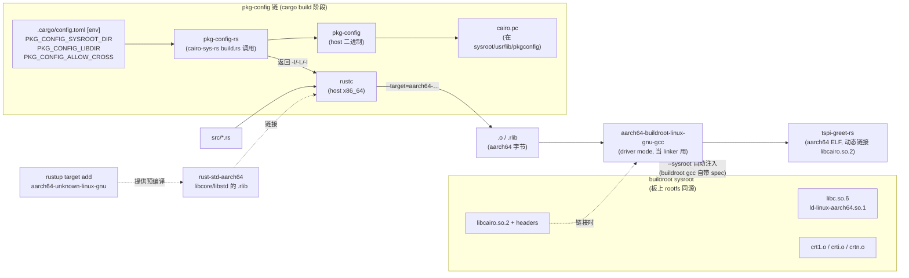
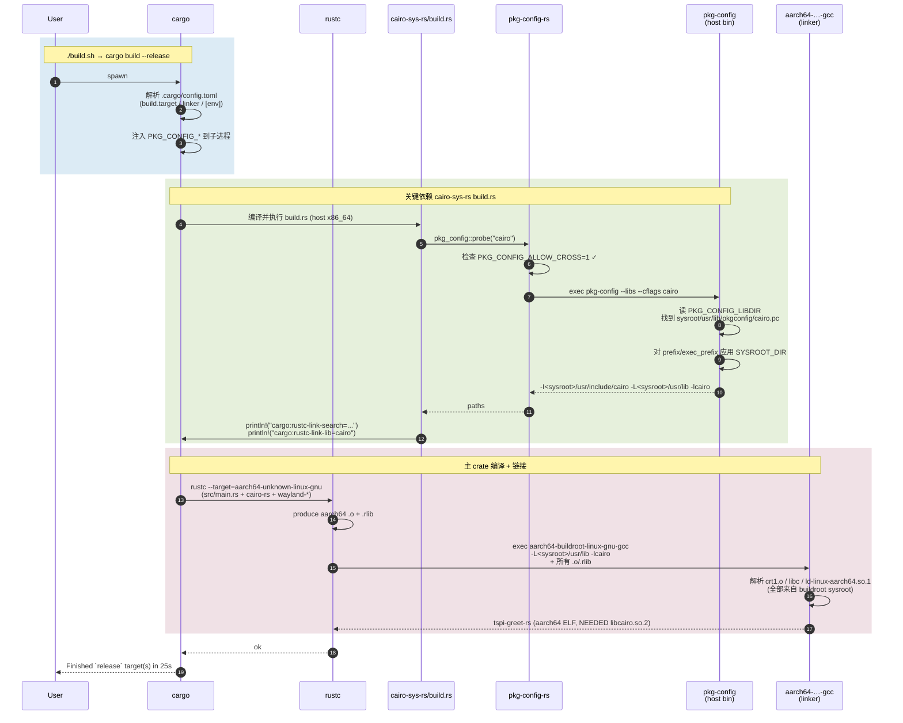

# Rust 交叉编译体系详解 —— SYSROOT / PKG\_CONFIG 三件套与 buildroot 工具链联动

> [!note]
> **Ref:** [`.cargo/config.toml`](.cargo/config.toml) ; [`build.sh`](build.sh) ;
> [`note/sdk/tspi/05-rust-crosscompile.md`](../../../note/sdk/tspi/05-rust-crosscompile.md) ;
> [`note/sdk/tspi/06-rust-gui-on-embedded.md`](../../../note/sdk/tspi/06-rust-gui-on-embedded.md) ;
> [`prj/05-GraphStack/tspi-greet/Makefile`](../tspi-greet/Makefile) — C 版的同源对照参考 ;
> [Cargo Book §3.16 Configuration](https://doc.rust-lang.org/cargo/reference/config.html) ;
> [pkg-config-rs cross-compilation rules](https://docs.rs/pkg-config/latest/pkg_config/#cross-compilation)


## 1. 为什么 Rust 交叉编译需要"四件套"

Rust 与 C 在交叉编译"形似而神不同"。C 工程一句 `make CC=aarch64-…-gcc CFLAGS=--sysroot=…` 就能 ship；
Rust 的链条则被显式拆成 **四件套**，每一件都对应一个具体的工具进程：



四件套对照：

| # | 角色 | 谁提供 | 工程里在哪里配 |
|---|------|-------|---------------|
| 1 | **rustc 前端** | rustup 默认装 | 无需配 |
| 2 | **目标标准库** | `rustup target add aarch64-unknown-linux-gnu` | 一次性命令，装到 `~/.rustup/toolchains/<channel>/lib/rustlib/aarch64-unknown-linux-gnu/` |
| 3 | **目标 linker（兼 driver）** | buildroot 编出的 host toolchain | `.cargo/config.toml` → `target.<triple>.linker` |
| 4 | **目标 C 库的 .pc 入口** | buildroot 顺带产出的 sysroot | `.cargo/config.toml` → `[env]` 三件套 |

每一件都有"漏掉的代价"，§3 起逐个拆解。


## 2. `.cargo/config.toml` 总览（带逐行注解）

> 位置：[`.cargo/config.toml`](.cargo/config.toml)
> 关键性：Cargo 会**自动加载**这份文件，**不需要**任何 `export` 或 `--target` 参数 ——
> 因此 `cargo build --release` 一行就完成 cross。

```toml
# src: .cargo/config.toml:13-18
[build]
target     = "aarch64-unknown-linux-gnu"   # 默认 target（替代每次写 --target）
target-dir = "output/target"               # 把 target/ 整个挪到 output/ 下（符合 demo 布局规约）

[target.aarch64-unknown-linux-gnu]
# rustc 自身不做 final link —— 它 fork 一个 linker driver 进程，把 .o + .rlib 串起来。
# 此处显式指 buildroot 的 aarch64-gcc，原因详见 §3。
linker = "/.../host/bin/aarch64-buildroot-linux-gnu-gcc"
ar     = "/.../host/bin/aarch64-buildroot-linux-gnu-ar"
```

```toml
# src: .cargo/config.toml:44-52
[env]
PKG_CONFIG_ALLOW_CROSS = "1"
PKG_CONFIG_SYSROOT_DIR = "/.../host/aarch64-buildroot-linux-gnu/sysroot"
PKG_CONFIG_LIBDIR      = "/.../host/aarch64-buildroot-linux-gnu/sysroot/usr/lib/pkgconfig"

CC_aarch64_unknown_linux_gnu  = "/.../host/bin/aarch64-buildroot-linux-gnu-gcc"
CXX_aarch64_unknown_linux_gnu = "/.../host/bin/aarch64-buildroot-linux-gnu-g++"
AR_aarch64_unknown_linux_gnu  = "/.../host/bin/aarch64-buildroot-linux-gnu-ar"
```

后面六节按"第一次出现"的顺序，把每一项的作用、它解决的具体问题、漏掉后的具体报错、与 C 版 Makefile 的对应都讲清楚。


## 3. `target.<triple>.linker` —— 为什么必须是 **buildroot 的 gcc**

> 即使用 musl/lld，也得选**与目标 rootfs 同源**的 linker driver。

### 3.1 链接器到底做了什么

`rustc` 自己只产 PIC 重定位的 `.o`，最终链接由它 `Command::spawn` 一个外部 linker driver：

```
rustc → aarch64-…-gcc -nostdlib? no:
                          crt1.o crti.o     ← 来自 sysroot
                          target/.../*.o   ← rustc 产物
                          libstd.rlib       ← rustup 装的 rust-std
                          -lc -lgcc_s       ← 找 sysroot 里的 .so
                          crtn.o            ← 来自 sysroot
                          ld-linux-aarch64.so.1 解释器
                       → tspi-greet-rs ELF
```

只有 **buildroot 编出来的那只 gcc** 同时满足：

1. 默认 `--sysroot` 指向同一份 sysroot（spec 文件烧死了）—— 无需手动 `--sysroot=`
2. 烧的 crt 文件与板上 glibc 同版本（同次 buildroot 构建产物）
3. `ld` script 里的 SONAME / RUNPATH 与板上 `ld.so.cache` 对齐

### 3.2 漏掉这一项会怎样

不写 `linker = …`，Cargo 默认用 `cc` —— 通常解析到 host **x86_64 gcc**。报错形如：

```text
error: linking with `cc` failed: exit status: 1
  /usr/bin/ld: skipping incompatible /lib/x86_64-linux-gnu/libc.so.6 when searching for -lc
  /usr/bin/ld: cannot find -lc
```

即使侥幸链上（用了 musl 静态 target），运行时也会因 glibc 版本错位炸：

```text
./tspi-greet-rs: /lib/aarch64-linux-gnu/libc.so.6: version 'GLIBC_2.38' not found
```

### 3.3 与 C 版的对照

C 版本 `tspi-greet/Makefile:10-12` 把 sysroot 显式塞进 `CFLAGS`：

```make
CC      := $(TC)gcc
CFLAGS  := --sysroot=$(SYSROOT) -O2 ...
LDFLAGS := --sysroot=$(SYSROOT) -lwayland-client -lcairo ...
```

Rust 这边**因为 linker 本身就是 buildroot gcc，`--sysroot` 已经隐藏在 gcc spec 里**，所以 `.cargo/config.toml` 里**完全看不到 `--sysroot=`**。这是最容易让人困惑的一点：**Rust 工程通常不显式写 `--sysroot`，但它一直存在**，只是被 wrap 进了 linker 程序自身。


## 4. `[env] CC_<triple>` —— 给 `cc` crate 兜底

### 4.1 谁会用 `cc` crate

任何 `*-sys` crate 若需要"现场编 C 源码"（典型：`ring`, `openssl-sys`, `zstd-sys`），
build.rs 里就会 `cc::Build::new()...compile("foo")`。`cc` crate 自己**不读 cargo target**，
它独立判断"我现在该用哪只编译器"，规则是：

```text
1. 看环境变量 CC_<target_triple_with_underscores>  ← 我们设的
2. 看环境变量 CC_<target_triple_with_dashes>
3. 看通用 CC=
4. fallback "cc" / "gcc" / "clang"   ← 落到 host
```

**漏掉 `CC_aarch64_unknown_linux_gnu` 的代价**：
表面上 cargo build 仍然过，因为 `rustc → buildroot-gcc` 正确链接；
但 `*-sys` 编出来的那个 `.a` 是 **x86_64**，与 aarch64 主体混链。
报错往往不是清晰的 ABI 错，而是：

```text
ld: error: .../foo.a: incompatible target
```

或更隐蔽的 —— 链接过、运行炸 SIGILL（指令集错配）。

### 4.2 本 demo 里有用到 `cc` crate 吗

没有：`cairo-rs` 是**纯绑定**（只把 cairo 函数声明翻译到 Rust extern），
完全靠 pkg-config 拿 `-I/-L/-l`，**不现场编 C**。
`wayland-client` / `wayland-protocols` 也是纯 Rust（自己讲 wayland 线协议）。

那为什么仍然写 `CC_<triple>`？—— **兜底**。下一次往 Cargo.toml 里加 `webp-sys` / `bzip2-sys` 这种自带 C 源码的 crate 时，已经免疫。这种"先布好，到时不被坑"的预防式配置正是经验工程的常态。

### 4.3 三元组带短横还是下划线

Cargo 文档里 `target.aarch64-unknown-linux-gnu.linker` 用**短横**；
`cc` crate 用**下划线** `CC_aarch64_unknown_linux_gnu` —— 历史原因，shell 不允许变量名带 `-`。
两边互不兼容；**记住"长名带下划线"这条规律**避免抓瞎。


## 5. PKG\_CONFIG 三件套 —— `cairo-sys-rs` 的关键演示靶点

这一节是整篇 Design-CrossCompile.md 的核心。本 demo 之所以选 cairo-rs，就是因为
**它通过 pkg-config-rs 把这三件套全部走一遍**，是观察 Rust 跨编译 C 库链条最干净的样本。

### 5.1 路径：从 build.rs 到链接

cairo-sys-rs 的 build.rs 用 `pkg-config` crate：

```rust
// cairo-sys-rs/build.rs 大意（简化版）
fn main() {
    pkg_config::Config::new()
        .atleast_version("1.16")
        .probe("cairo")   // ← 跑 `pkg-config --libs --cflags cairo`
        .unwrap();
}
```

`pkg_config::probe` 干两件事：
1. 校验 host ≠ target 时是否允许 cross（看 `PKG_CONFIG_ALLOW_CROSS`）；
2. 启动一个 `pkg-config` host 二进制子进程，把得到的 `-I` / `-L` / `-l` 转成 cargo 指令：

```text
cargo:rustc-link-search=native=<sysroot>/usr/lib
cargo:rustc-link-lib=dylib=cairo
cargo:include=<sysroot>/usr/include/cairo
```

最终 linker 拿到 `-L<sysroot>/usr/lib -lcairo` —— **关键就是这些 `-L/-l` 必须指向 sysroot 而非宿主 `/usr`**。
三件套全部为这一个目标服务：

### 5.2 三件套各司其职

| 变量 | 作用 | 漏掉的代价 |
|------|------|----------|
| **`PKG_CONFIG_ALLOW_CROSS=1`** | 解除 pkg-config-rs 在 host≠target 时的拒绝运行保护 | build.rs panic: `"pkg-config has not been configured to support cross-compilation"` |
| **`PKG_CONFIG_LIBDIR=<sysroot>/usr/lib/pkgconfig`** | **替换** pkg-config 默认搜索路径 —— 让它**只**看 sysroot 里的 `.pc` | 命中宿主 `/usr/lib/pkgconfig/cairo.pc` → x86_64 路径 → 链上 host 的 libcairo（ABI 错） |
| **`PKG_CONFIG_SYSROOT_DIR=<sysroot>`** | 给 `.pc` 里所有 `-I/-L` 路径**自动加前缀** —— 因为 `.pc` 里写的是 `prefix=/usr`，需被 rewriting 成 `<sysroot>/usr` | `.pc` 找到了，但 `-I/usr/include/cairo` 解析的是宿主头 → 编译期类型 ABI 错配 |

### 5.3 `LIBDIR` vs `PATH` —— 容易踩坑的一字之差

pkg-config 文档里两个相似的变量，**交叉编译只能用 LIBDIR**：

| 变量 | 语义 | 适用场景 |
|------|-----|---------|
| `PKG_CONFIG_PATH`   | **追加** 到默认搜索路径之后 | 在 host 里加一个额外路径；**绝不**用于 cross |
| `PKG_CONFIG_LIBDIR` | **完全替换** 默认搜索路径 | **cross 必须用此项**，杜绝宿主 `.pc` 漏入 |

若用了 PATH 而非 LIBDIR，行为是"看心情"：哪个 `.pc` 先匹配版本约束就用哪个。常见后果是 sysroot 里 cairo 是 1.17，宿主是 1.16 —— pkg-config 满足 `atleast_version("1.16")` 的两者都符合，**返回宿主版本**。链接器看到 host x86_64 cairo.so，干净利落地炸 ABI 错。

### 5.4 实测捕获（来自 `output/log/verify.log`）

跑 `./test.sh` 后捕到的 pkg-config 输出（**实测**，与 sysroot 路径 1:1 对应）：

```text
$ PKG_CONFIG_ALLOW_CROSS=1 \
  PKG_CONFIG_SYSROOT_DIR=<sysroot> \
  PKG_CONFIG_LIBDIR=<sysroot>/usr/lib/pkgconfig \
  pkg-config --cflags --libs cairo

-pthread
-I<sysroot>/usr/include/cairo
-I<sysroot>/usr/include/glib-2.0
-I<sysroot>/usr/lib/glib-2.0/include
-I<sysroot>/usr/include/pixman-1
-I<sysroot>/usr/include/rga
-I<sysroot>/usr/include/freetype2
-I<sysroot>/usr/include/libdrm
-I<sysroot>/usr/include/libpng16
-lcairo
```

**全部 `-I` 都被 SYSROOT_DIR 注入了前缀**。每一条都解析到 aarch64 头文件 ——
这是 PKG_CONFIG_SYSROOT_DIR 唯一也是最关键的可观测产物。


## 6. `build.target-dir` —— 把 target/ 收进 output/

design-demo skill 硬规则：**所有产物必须落在 `output/` 下**。
Cargo 的 `target/` 默认放在工程根，与规约冲突。一行解决：

```toml
# src: .cargo/config.toml:14
[build]
target-dir = "output/target"
```

效果：

```text
output/
├── target/                              # cargo 增量目录
│   └── aarch64-unknown-linux-gnu/
│       └── release/tspi-greet-rs        # rustc 直接产物
├── bin/
│   └── tspi-greet-rs                    # build.sh 复制过来的 strip 版本
└── log/
    ├── build.log
    ├── verify.log
    └── run.log
```


## 7. 与 C 版 `tspi-greet/Makefile` 的逐项对照

| 关注点 | C 版 (Makefile) | Rust 版 (`.cargo/config.toml`) |
|-------|-----------------|-------------------------------|
| 编译器调用 | `CC := $(TC)gcc` 显式写 | `rustc` 自动选；linker 通过配置 |
| `--sysroot` | `CFLAGS := --sysroot=$(SYSROOT)` 显式 | **隐式** —— linker 是 buildroot gcc，spec 内置 |
| `-I cairo` | `-I$(SYSROOT)/usr/include/cairo` 手写 | `pkg-config` 自动产，`PKG_CONFIG_SYSROOT_DIR` 加前缀 |
| `-lcairo` | `LDFLAGS := -lcairo ...` 手写 | `pkg-config` 自动产 |
| `xdg-shell.xml` 生成 | `wayland-scanner` 命令产 `.h/.c` | `wayland-protocols` crate **内置**，无需 scanner |
| 体积 | ≈ 29 KB（C）+ 链接 cairo/wayland | 456 KB（Rust）+ 链接 cairo（wayland 静态进了 Rust .text） |

注意最后一行：Rust 二进制看似大，但**只动态链 cairo 一个外部库**。wayland 的协议状态机 / dispatch 路由全部静态进了 `.text` 段 —— 板上 rootfs 不再需要 `libwayland-client.so.0` 即可跑 wayland app。这是 wayland-rs 与 C 路线的本质差异。


## 8. 全链路时序（cargo build 一次的内部进程图）




## 9. 常见踩坑总表（FAQ）

| 现象 | 根因 | 解 |
|------|-----|----|
| `linker 'cc' not found` 或链出 x86_64 | 未配 `target.<triple>.linker` | `.cargo/config.toml` 写 buildroot gcc |
| `pkg-config has not been configured to support cross-compilation` | 缺 `PKG_CONFIG_ALLOW_CROSS=1` | 加到 `[env]` |
| build.rs 用了**宿主**版本头文件 | 用了 `PKG_CONFIG_PATH` 而非 `_LIBDIR` | 改成 `PKG_CONFIG_LIBDIR=` |
| `.pc` 找到了但 `-I/usr/include/...` 没前缀 | 缺 `PKG_CONFIG_SYSROOT_DIR` | 加到 `[env]` |
| `*-sys` crate 链出 x86_64 .a 与 aarch64 主体混链 | 未配 `CC_<triple>` 让 cc crate 走 host gcc | 加 `CC_aarch64_unknown_linux_gnu` |
| 板上跑 `version 'GLIBC_X.Y' not found` | linker 用了宿主 gcc，glibc 比板上新 | 把 linker 切到 buildroot gcc |
| 板上跑 `No such file or directory` 但 `ls` 看得到 | 动态 loader `/lib/ld-linux-aarch64.so.1` 缺；或 NFS 未挂 | 检查 rootfs；或换 musl 静态 target |


## 10. 走读：从 `cargo build` 到 `output/bin/tspi-greet-rs`

按"源码 → 配置 → 工具链 → 产物"四段读完即懂：

1. **源码** [`src/main.rs`](src/main.rs:1) / [`src/draw.rs`](src/draw.rs:1) —— 调 cairo-rs / wayland-client API
2. **依赖声明** [`Cargo.toml`](Cargo.toml:21-26) —— `cairo-rs = "0.18"` 直接拉 cairo-sys-rs（build.rs 跑 pkg-config）
3. **交叉配置** [`.cargo/config.toml`](.cargo/config.toml) —— 四件套（target / linker / pkg-config / cc）
4. **入口脚本** [`build.sh`](build.sh) —— 一行 `cargo build --release`，**不需要任何 env export**
5. **产物落点** `output/target/aarch64-unknown-linux-gnu/release/tspi-greet-rs` → 复制到 `output/bin/`
6. **静态验证** `aarch64-buildroot-linux-gnu-readelf -d` 查 NEEDED → 应见 `libcairo.so.2 / libgcc_s.so.1 / libc.so.6` —— 与板上 rootfs 同源
7. **实跑验证** `ssh tspi … timeout 3 /mnt/nfs/tspi-greet-rs/tspi-greet-rs` —— 见 [Conclude.md](Conclude.md)


> [!TIP]
> 想换其他 sys crate（如 `libsoup-sys`, `gtk4-sys`, `webkit2gtk-sys`），**不需要改 `.cargo/config.toml`** ——
> 只要 buildroot rootfs 勾选了对应包，sysroot 里的 `.pc` 就齐了，本工程的三件套照原样可工作。
> 这就是"配置一次，复用到所有 *-sys"的好处。
