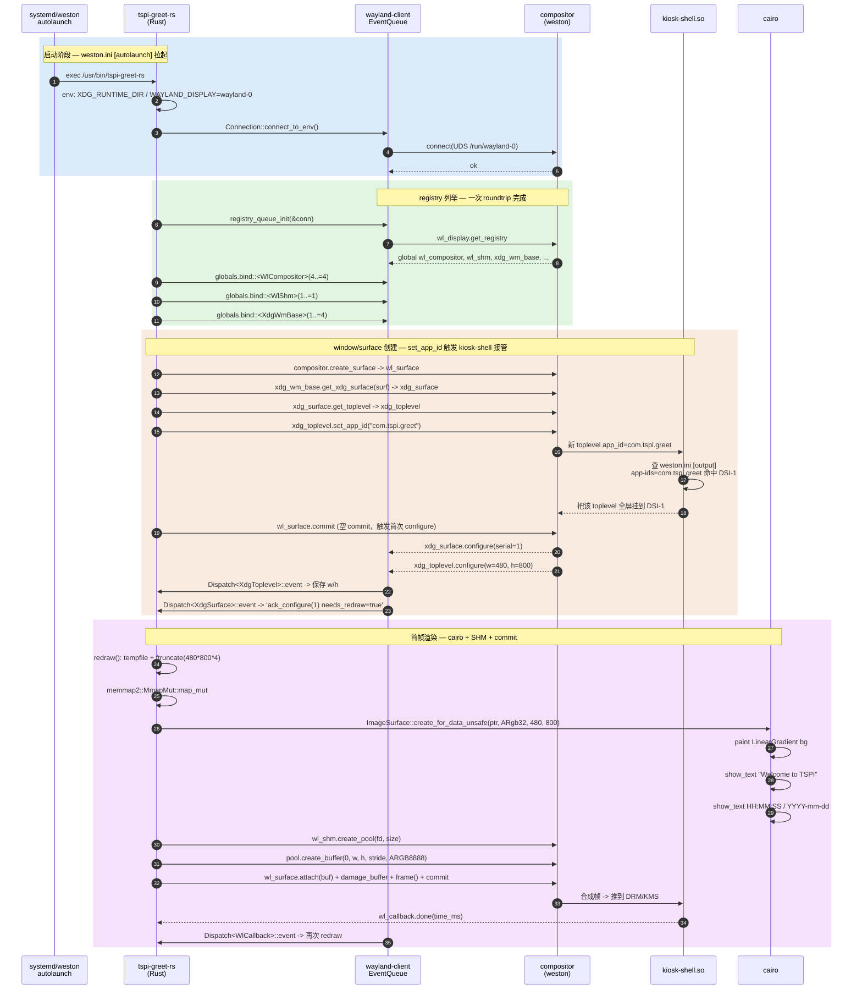
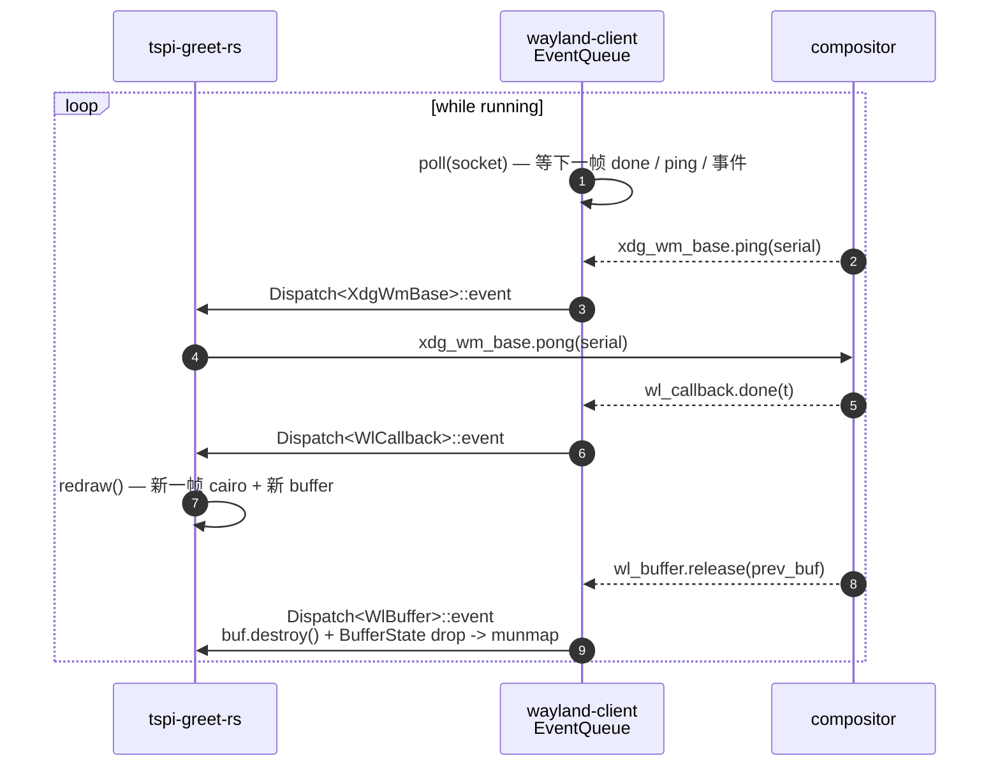
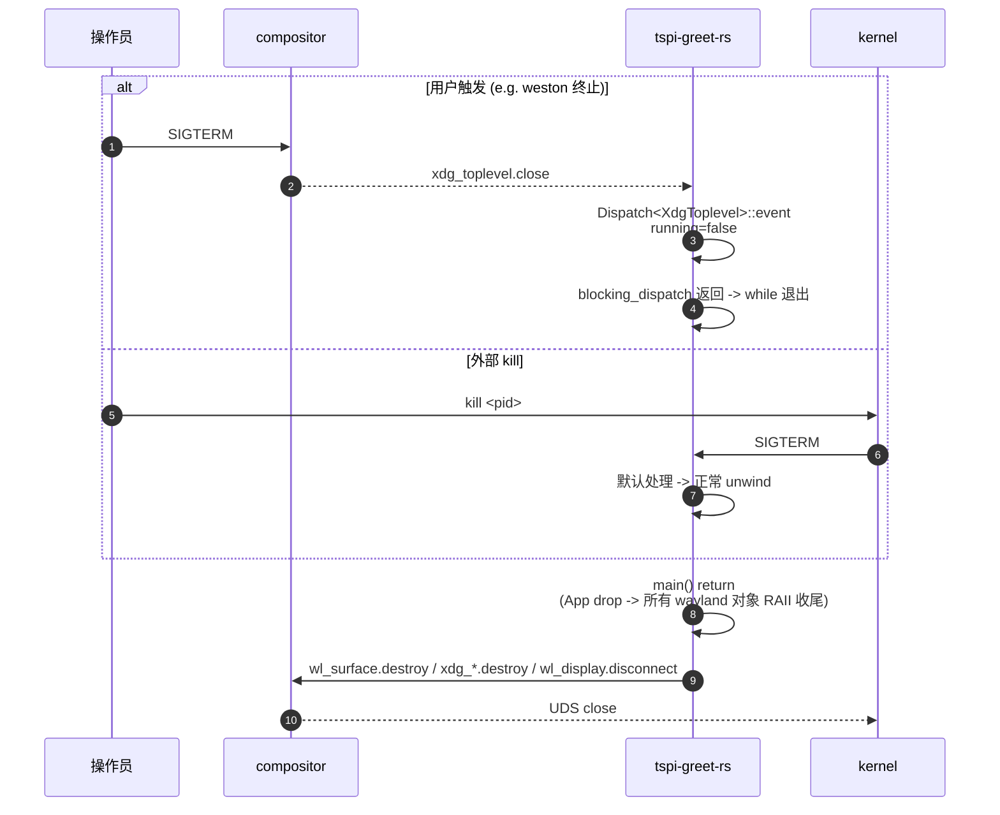

# tspi-greet-rs 运行时时序

> [!note]
> **Ref:** [`Design-Wayland-Rs.md`](Design-Wayland-Rs.md) ; [`src/main.rs`](src/main.rs:1) ;
> [`note/Subsystem/Graph-Stack/03-wayland-weston.md`](../../../note/Subsystem/Graph-Stack/03-wayland-weston.md)

## 1. 启动 + 握手 + 首帧

## 2. 主循环 + ping/pong + 持续重绘

## 3. 退出路径

## 4. 与 C 版时序的差异

| 节点 | C 版 | Rust 版 |
|------|------|---------|
| 列举 globals | `add_listener + roundtrip` 两步 | `registry_queue_init` 一步 |
| 事件分发 | C struct of fn pointers (`*_listener`) | trait `Dispatch::event(&mut self, …)` |
| 资源回收 | 每个回调里手写 `wl_*_destroy + munmap + close + free` | `BufferState` UserData RAII，drop 链路自动 |
| 主循环 | `while wl_display_dispatch(dpy) != -1` | `while event_queue.blocking_dispatch(&mut app).is_ok()` |
| 退出清理 | main 末尾手写 4 行 destroy / disconnect | App drop 自动 |
