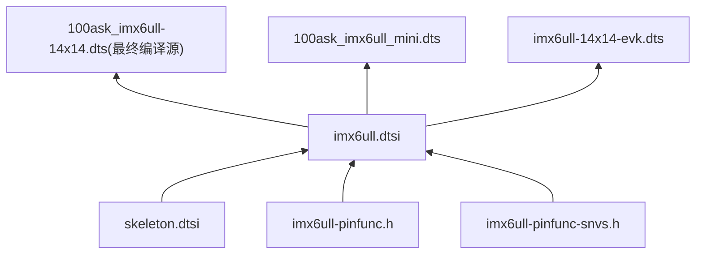

# prj/dts 硬链接映射说明

> [!note]
> **Ref:** `sdk/100ask_imx6ull-sdk/Linux-4.9.88/arch/arm/boot/dts/`

本目录下所有文件均为 **硬链接（hard link）**，指向 SDK 内核树中的同一 inode。
对于我们使用的 **100ask i.MX6ULL Pro** 开发板，**内核最终读取的 FDT (Flattened Device Tree) 是 `100ask_imx6ull-14x14.dtb`**。所有的底层 `.dtsi` 配置最终都会在编译期汇聚到此二进制文件中。

在此处编辑等同于直接修改内核源码树，`make` 即可编译出对应 dtb。

## 文件映射

```text
prj/dts/                          →  sdk/.../Linux-4.9.88/arch/arm/boot/dts/
─────────────────────────────────────────────────────────────────────────────
【板级 DTS — 可编辑，自定义硬件配置】
100ask_imx6ull-14x14.dts          →  100ask_imx6ull-14x14.dts       ← Pro 板 (🌟 核心目标/最终 FDT)
100ask_imx6ull_mini.dts           →  100ask_imx6ull_mini.dts        ← Mini 板
100ask_myir_imx6ull_mini.dts      →  100ask_myir_imx6ull_mini.dts   ← MYIR Mini
imx6ull-14x14-evk.dts             →  imx6ull-14x14-evk.dts          ← NXP 官方 EVK

【SoC 级 DTSI / 头文件 — 只读参考】
imx6ull.dtsi                      →  imx6ull.dtsi                   ← SoC 节点定义
imx6ull-pinfunc.h                 →  imx6ull-pinfunc.h              ← PAD MUX 宏
imx6ull-pinfunc-snvs.h            →  imx6ull-pinfunc-snvs.h         ← SNVS PAD 宏
skeleton.dtsi                     →  skeleton.dtsi                  ← DT 骨架模板
```

## 包含关系



## 使用方式

本目录提供 `Makefile`，支持快速编译与同步 Pro 板的 FDT。

```bash
source ~/imx/imx-env.sh
cd ~/imx/prj/dts

# 编辑 Pro 板核心 DTS
vim 100ask_imx6ull-14x14.dts

# 编译指定 dtb
make 100ask_imx6ull-14x14.dtb
# 默认编译所有dtbs (kbuild register , see /kubild/dts-makefile)
#default target dtbs
make
make dtbs

# 同步 Pro 板编译产物到本地 dtbs/ 目录
make sync
# 部署到 NFS 目录 (prj/nfs/dtbs/)
make deploy

# 编译全部已注册的 dtb
make dtbs

# 清理
make clean
```

## 开发板部署 (Deployment on EVB)

在驱动开发过程中，编译生成 DTB 后，可以通过以下步骤在开发板上进行更新：

1.  **挂载 NFS**: 确保开发板已挂载主机的 NFS 目录（通常挂载到 `/mnt`）。
2.  **替换 DTB**: 将编译好的 `.dtb` 文件拷贝到开发板的 `/boot` 目录下。

```bash
# 在开发板终端执行
cp /mnt/dtbs/100ask_imx6ull-14x14.dtb /boot
sync
reboot
```

> [!tip]
> 替换完成后执行 `reboot` 重启开发板，使新的设备树配置生效。

`Makefile` 通过 `make -C $KERN_DIR` 代理到内核构建系统，硬链接保证源文件同步。

## 注意事项

- **硬链接特性**：删除 `prj/dts/` 中的文件不影响 SDK 原文件，反之亦然。
- **不要用 `cp` 覆盖**：`cp new.dts prj/dts/100ask_imx6ull-14x14.dts` 会断开硬链接，应直接修改。
- **最终 FDT 确认**：在开发板上运行 `cat /proc/device-tree/model` 即可确认当前使用的设备树模型。
